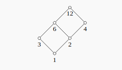
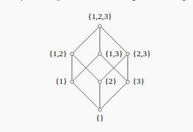
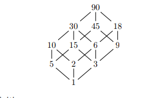

# Prologue {-}

## References

\todo[inline]{Todo}

## Notation

\todo[inline]{Todo}

\newpage

# Formulae

Note that the theory is important for Combinatorics -- knowing what definitions are and what various expressions count -- but it is a very problem-driven subject. It is worth delineating exactly what kinds of problems are tractable, and which are more difficult and require more subtle methods. However, the ultimate skill in this course is to know *when* to apply which tool to a given problem, how to translate problems into things you know how to count, and how to seamlessly move back and forth between various combinatorial interpretations. 

Problems are the best practice!

## Overview

- $\theset{a, b, c, \cdots} = \theset{b, c, a, \cdots} = \theset{c, b, a, \cdots} = \cdots$ is a **set**, a structure which contains some finite number of unique elements, and there is a-priori notion of "order" or an indexing operation (i.e. there is no distinguished "first" element, etc).

- If $S$ is a set, then $\# S$ denotes the **size** of the set, i.e. a count of the number of elements contained in $S$.

- $[a, b, c] \neq [b, c, a]$ is an **ordered list** (also called a $k\dash$tuple), a structure of not-necessarily unique elements from some set in which there is a well-defined order/indexing operation.
  - For example, the second element of $[b,c,a]$ is $c$, and the first element of $[3,1,2]$ is 3.
  - Equivalently, this can be thought of as a **word** from some **alphabet** of symbols. In this case, we may write $[a,b,c]$ as $abc$ instead.
  - Rigorously, if $A$ is the set of elements we're interested in, an ordered list is an element of the $k\dash$fold product set $A \cross A \cross \cdots A = A^k$.


## Sets
For any given $n$, there is essentially **one** set of size $n$, the set $[n] = \theset{1,2,\cdots n}$. It is a theorem that every set admits a *well-ordering*, and a consequence of this is that any set $S$ of countable size $n$ admits a bijective map $S \to [n]$. So $S \cong [n]$ in the category of Sets, "up to relabeling" of elements.

But be careful! $[n]$ comes with its own labeling **and ** its own ordering $1 \leq 2 \leq \cdots$, and so should perhaps be regarded as an ordered list with unique elements instead. As a set, we can order the elements any way and obtain the same set.

## The Symmetric Group
$S_n$ denotes the **symmetric group** on $n$ elements; each element of this group is a bijective function $[n]\to[n]$. 
Combinatorialists really love this group, and it secretly shows up in most counting problems.

A **permutation** $\sigma$ is an element of $S_n$, We can specify a bijection by describing where it sends every element, so for example, define
$$\begin{aligned}
\sigma: [5] &\to [5] &\\ \\
\sigma(1) &= 3 \implies &1 \mapsto 3 \\
\sigma(2) &= 4 \implies &2 \mapsto 4 \\
\sigma(3) &= 5 \implies &3 \mapsto 5 \\
\sigma(4) &= 2 \implies &4 \mapsto 2 \\
\sigma(5) &= 1 \implies &5 \mapsto 1 \\
\end{aligned}$$
There are several more concise notations equivalent to the above specification:

### Two line notation
Write $1\cdots n$, and under each number, write where it is sent to under $\sigma$:
$$
\left( \begin{array}{ccccc}
1 & 2 & 3 & 4 & 5 \\
3 & 4 & 5 & 2 & 1
\end{array}\right)
$$
In general, we write
$$
\left( \begin{array}{cccc}
1 & 2 & \cdots & n  \\
\sigma(1) & \sigma(2) & \cdots & \sigma(n)
\end{array}\right)
$$

### One line notation
Noting that in the above notation, we'll always write $1\cdots n$ in the top row, we can just omit it and implicitly agree that the $k\dash$th position denotes where the integer $k$ is mapped to:
$$
[3,4,5,2,1] = 34521
$$

In general, we write a concatenated list of numbers
$$
\sigma(1)\sigma(2) \cdots \sigma(n)
$$

### Cycle Notation
Since $S_n$ is a finite group, we know that every element will have finite order. So for some given number $i$, we can look at the iterates $\sigma(i), \sigma^2(i) = \sigma(\sigma(i)), \sigma^3(i), \cdots$ and there will be some $k$ for which $\sigma^k(i) = i$. This sequence of images is called a **cycle**, and it turns out that we can recover our permutation entirely from exhaustively recording the cycles.

The algorithm: start with $1$, then compute all $\sigma^i(1)$. Write the resulting numbers in parentheses, then take the smallest number you haven't seen yet, open a new parenthesis, and repeat until all numbers $1 \cdots n$ appear somewhere. Finally, if any set of parentheses contains only a single number (so $\sigma(i) = i$ after only 1 iteration), omit it.


Our example:
$$
(1,3,5)(2,4)
$$
which reads as "1 maps to 3, 3 maps to 5, 5 maps to 1" and "2 maps to 4, 4 maps to 2".

In general, we write
$$
(1, \sigma(1), \sigma^2(1), \cdots, \sigma^{k}(1))~(a_1, \sigma(a_1), \sigma^2(a_1), \cdots, \sigma^{k_1}(a_1)) ~ \cdots
$$

Observations/notes:

- While $(abc) \neq (bac)$ as cycles, we do have $(abc) = (cab) = (bca) = (abc)$. So order matters *somewhat*, but not every reordering yields a new distinct cycle. Instead, for a cycle $\sigma$ of length $k$, there are exactly $k-1$ representatives that are equivalent to $\sigma$ and only differ by these "shifts".
- By writing things out this way, we've represented $\sigma$ as a **product of disjoint cycles**, i.e. no number occurs in more than one set of parentheses. Moreover, we can do this for every element $\sigma$, so we say that $S_n$.
- It is sometimes useful to write these in a "canonical" way -- shift every cycle so the largest elements are first, then sort the cycles in increasing order based on those first elements.

### Useful facts about the Symmetric group
- Every element can be written as a product of disjoint cycles
- Disjoint cycles commute
- The group-theoretic order of a cycle is its length
- The group-theoretic order of a product of cycles is the least common multiple of the lengths.

## Permutations:
We can count the number of bijections from an $n$ element set to itself:
$$ \#\theset{\text{Permutations of } [n]} = \abs{S_n}  = n! $$

- Also the number of a ways to form an **ordered list** of $n$ unique elements ($n$ choices for 1st element, $n-1$ choices for 2nd, etc).

## Ordered Lists
If $\#\Sigma = k$ is some set (which we'll regard as "formal symbols"), we can count the number of ordered lists:
$$
\# \theset{\text{Length $k$ lists over $\Sigma$}} = n^k
$$

- Logic: Suppose $L = l_1 l_2, \cdots l_k$, then there are $n$ choices of symbol for $l_1$, $n$ choices for $l_2$, etc.
- Also counts the number of words over an alphabet of size $k$.

## Falling Factorial
Let
$$\begin{aligned}
n^{\underline k} &\definedas \prod_{i=0}^{k-1}(n - i) \\
&= n(n-1)\cdots (n-k+1) \\
&= \frac{n!}{(n-k)!}
\end{aligned}$$
be the *falling factorial*, which is a product with exactly $n$ terms.

- Counts the number of ways to form an **ordered list** of $k$ items from an $n$ element set (i.e. there is a distinguished "first" pick, "second" pick, etc)
- Also counts the number of injections $[k] \injects [n]$

## Rising Factorial
Let
$$\begin{aligned}
n^{\overline k} &\definedas \prod_{i=0}^{k-1}(n+i) \\ &=n(n+1) \cdots (n+k-1)
\\&= \frac{(n+k-1)!}{(n-1)!} \\ \\&= (n+k-1)^{\underline k}
\end{aligned}$$
be the *rising factorial*, which is a product with exactly $n$ terms.

- Counts the number of ways to form an **ordered list** of $k$ items from an $n+k-1$ element set.

## Combinations/Binomial Coefficients
Counts the number of ways to form a $k\dash$element **subset** of a set of $n$ items:
$$
\begin{aligned}
\#\theset{k\dash\text{element subsets of } [n]} = {n \choose k} &\definedas \frac{n!}{k!(n-k!)} \\
&= {n \choose n-k} \\ \\
&= \frac{n^{\underline k}}{k!}
\end{aligned}
$$

- Note that order does **not** matter here; we identify any two sets that differ by a permutation
  - In other words, first form an ordered list of $k$ unique elements from $[n]$ in $n^{\underline k}$ ways, then quotient out by the $k!$ ways to reorder the list that yield the same set.
- Alternatively, ways to pick $k$ items from $[n]$ **without replacement**, then remove the labels.
- Alternatively, the coefficient of $x^k$ in the expansion of $(1+x)^n$, i.e.
$$
(1+x)^n = \sum_{k\geq 0} {n\choose k} x^k
$$
  which can be generalized to
$$
(x+y)^n = \sum_{k\geq 0} {n\choose k} x^ky^{n-k}
$$


### Generalized Binomial Coefficients
We can extend the "choose" notation and thus the binomial formula to rational powers by defining
$$
{r \choose k} = \frac{1}{k!} \prod_{i=0}^{k-1} (r - i) = \frac{r(r-1)(r-2)\cdots(r-k+1)}{k!}\\
(x+y)^r = \sum_{k\geq 0} {r\choose k} x^ky^{n-k}
$$

Note that this allows us to expand things such as $\sqrt{x+y} = (x+y)^\frac{1}{2}$ in an infinite sum:
$$
\sqrt { 1 + x } = 1 + \frac { 1 } { 2 } x - \frac { 1 } { 8 } x ^ { 2 } + \frac { 1 } { 16 } x ^ { 3 } - \frac { 5 } { 128 } x ^ { 4 } + \frac { 7 } { 256 } x ^ { 5 } - \cdots
$$

## Multisets
  - What is a multiset? If $S$ is a set, you can think of a multiset $M$ as a word in the symbols $s_i \in S$ where order doesn't matter.
    - Example: $S = \theset{a,b,c}$ and $M = \theset{a,a,a,b,b} = \theset{a,b,a,a,b} = \cdots$
  - Alternatively, it is a collection of elements of $S$, each with a multiplicity, so a subset of $S \cross \NN$, where we define the size to be the sum of the multiplicities instead of (the usual) number of elements.
    - Example: As above, $M = \theset{(a, 3), (b,2)}$. Note that although $M$ has size 2 as a set, it has size $3+2 = 5$ as a multiset.

:::{.proposition title="Counting Multiset"}
We can thus count the number of $k\dash$element multisets of an $n\dash$element set:
$$\begin{aligned}
\#\theset{\text{Multisets of $[n]$ of size $k$} } &= \multinomial{n\choose k} \\ &\definedas {{n+k-1}\choose k} \\ &= {{n+k-1}\choose n-1} \\ \\ &= \frac{n^{\overline k}}{k!}
\end{aligned}$$
:::

:::{.proof}
Multisets can be put in bijection with unrestricted stars and bars arrangements, see next section. 
:::

- The number $\multinomial{n\choose k}$ is denoted a **multinomial coefficient**.
- Also counts the number of ways to select $k$ items **with replacement** from a set of size $n$.

## Catalan Numbers
Consider the problem of counting the number of $n\times n$ lattice paths that don't go above the diagonal. Since every such path has to have a "first hitting time" for the diagonal, we can enumerate these using a recurrence relation. Let $C_n$ be the number of such paths. If the first hit occurs on the $k$th diagonal, then there were $C_k$ paths leading there and $C_{n-k}$ paths to the top-right corner. This yields
$$
C_{n+1} = \sum_{i=0}^n C_i C_{n-i}
$$
and using generating functions, it can be shown that
$$
C_n = \frac{1}{n+1}{2n \choose n}
$$

## Stars and Bars
A useful conceptual counting problem, as many other problems can be encoded as some version of this. The idea is we have an alphabet $\Sigma = \theset{\star, \mid}$ ("star" and "bar"), and we'd like to form certain words containing exactly $n$ copies of $\star$ and $k$ copies of $\mid$.

There are two variants: we'll say a configuration of stars and bars is *strict* if a bar does not occur as the first or last symbol, and there are no two adjacent bars.

### Variant 1: Strict

:::{.proposition title="?"}
This can be counted as
$$
\#\theset{\text{strict configurations of $n$ stars and $k-1$ bars}} = {n-1 \choose k-1}
$$
:::

:::{.proof}
Lay out $n$ stars, which have $n-1$ gaps between them. 
From these gaps, choose any $k-1$ of them (without replacement) to contain bars.
:::

- Note that this partitions the $n$ stars into $k$ nonempty groups, so this counts the number of ways to separate $n$ indistinguishable objects into $k$ nonempty groups,
- Alternatively, counts the number of compositions of $n$ into $k$ parts.

### Variant 2: Unrestricted

:::{.proposition title="?"}
With no restrictions of the configuration, we can count
$$
\#\theset{\text{unrestricted configurations of $n$ stars and $k-1$ bars}} = {n+k-1 \choose k-1}
$$

:::

:::{.proof}
Since we just need to form an arbitrary word from $n$ stars and $k-1$ bars, simply place $n + (k-1)$ blanks, choose $k-1$ of them (without replacement) to be bars, and place stars everywhere else.
:::

We can give an alternative proof:

:::{.proof}
Lay out $n$ stars, then from the $n-1$ gaps, choose $k-1$ gaps with replacement to contain bars. 
This can be done in $\multinomial{n-1 \choose k-1} = {n+k-1 \choose k-1}$ ways. 
:::

:::{.remark}
Some remarks:

- Note that this partitions $n$ stars into $k$ groups, some of which may be empty.
- Alternatively, counts the number of weak compositions of $n$ into $k$ parts.
:::


## Stirling Numbers of the First Kind

For a given $n$, consider permutations $\sigma \in S_n$. It can be written as a product of disjoint cycles in cycle notation, so one can ask how many permutations have exactly $k$ disjoint cycles. In other words, we have
$$
\sigma = \overbrace{(a_1b_1\cdots)(a_2b_2\cdots)\cdots(a_kb_k\cdots)}^{k \text{ cycles}} \in S_n
$$
in cycle notation, where we include cycles of length 1 (i.e. fixed points). We can thus count
$$
\#\theset{\text{permutations of $[n]$ with exactly $k$ disjoint cycles}} \definedas c(n, k) = \stirlingfirst{n}{k}
$$
the **unsigned Stirling number of the first kind**.

> In other applications, there is a **signed Stirling number of the first kind** which are related by
$$
s(n, k) \definedas (-1)^{n-k}c(n, k), \quad \abs{s(n,k)} = c(n, k)
$$
> These yield the coefficients of $x^n$ in the falling factorial $x^{\underline n} = x(x-1)\cdots(x-n+1)$.

There isn't a particularly nice closed form expression for $c(n, k)$, so the main computational tool is the following recurrence relation they satisfy:
$$
\stirlingfirst n k = (n-1){\stirlingfirst {n-1} k} + \stirlingfirst{n-1}{k-1}
$$

:::{.proof}
Either $n$ is a fixed point (i.e. in a cycle by itself) or it is not.

- If $n$ is a fixed point, we can delete the cycle $(n)$ from $\sigma$ to obtain a permutation of $[n-1]$ with $k-1$ cycles. 
  Conversely, we can lift any permutation of $[n-1]$ with $k-1$ cycles to a permutation of $[n]$ by just adding the cycle $(n)$, which can only be done in one way, yielding the second term

- Otherwise, $n$ appears in a cycle with other elements. 
  We can delete it to obtain a permutation of $[n-1]$ which still has $k$ cycles; conversely, given such a permutation, consider the operation of multiplying $\sigma$ by the transposition $(n~i)$ where $1\leq i\leq n-1$. 
  This has the effect of inserting $n$ into the cycle containing $i$, and in fact puts it right before $i$, i.e.
$$
(a_1 a_2 \cdots a_{k}~ i ~ a_{k+1} \cdots a_m)(n~i) =  (a_1 a_2 \cdots a_{k}~ n ~ i ~ a_{k+1} \cdots a_m).
$$
There are exactly $n-1$ choices for $i$, and each one yields a way to insert $n$ into an existing cycle, yielding the first term.
:::


## Stirling Numbers of the Second Kind
A **set partition of $[n]$ into $k$ parts** is a collection $S_1, S_2, \cdots S_k$ where

- $S_i \subseteq [n]$ for each $i$
- $S_i \neq \emptyset$ for any $i$,
- $S_i \intersect S_j = \emptyset$ for all pairs $1 \leq i,j \leq k$ (so all of the $S_i$ are disjoint), and
- $[n] = S_1 \disjoint S_2 \disjoint \cdots \disjoint S_k$

We can then count
$$
\#\theset{\text{Set partitions of $[n]$ into $k$ parts}} \definedas S(n, k) = \stirling n k,
$$
which is referred to as **the Stirling number of the second kind**. 
Although there is a closed-form formula for it, it is not particularly nice -- the primary method of computing it comes from a recurrence relation it satisfies:
$$
\stirling n k = k\stirling {n-1} {k} + \stirling{n-1}{k-1}
$$

The following proof illustrates a valuable technique:
:::{.proof}
When forming a set partition of $[n]$ into $k$ parts, there are two disjoint cases: either $n$ is in a singleton set, or it is not.

- If $n$ a singleton, throw that part away. What remains is a partition of $n-1$ into $k-1$ parts.  Conversely, given any partition of $n-1$ into $k-1$ parts, we can add the part $\theset{n}$ to obtain a partition of $n$ into $k$ parts where $n$ is a singleton. This yields the second term.

- If it is not, $n$ is some $S_i$ with at least 1 other element. 
  Letting $S'_i = S_i - \theset{n} \neq \emptyset$ we get a partition of $n-1$ into $k$ parts. 
  Conversely, given any partition of $n-1$ into $k$ parts, we can form a partition of $n$ into $k$ parts where $n$ is not a singleton by adding $n$ to any part. 
  Note that there are $k$ choices for which part to add $n$ to, yielding the first term. 
:::

## Compositions
In general, a composition is a way of writing $n$ as a sum of positive integers, i.e. $n = a_1 + a_2 + \cdots$ where $a_i \in \ZZ$. There are infinitely many of these, so to count anything, we need to place various restrictions:

### Strong Compositions

A **composition of $n$ into $k$ parts** is an **ordered list** $[a_1, a_2, \cdots a_k]$ such that $\sum_{i=1}^k a_i = n$ and for each $i$ we have $0 < a_i \leq n$. 
Note that we **do not** allow any $a_i$ to be zero now.

These can be counted as
$$
\mathrm{comp}(n, k) = \#\theset{\text{compositions of $n$ into $k$ parts}}
= \multinomial{n+1 \choose k-1}  = {n+k-1 \choose k}
$$
where $\multinomial{a \choose b}$ is the multinomial coefficient. This follows from by a bijection with strict stars and bars configurations. Note that distinct lists yields distinct compositions.

### Weak Compositions
A **weak composition of $n$ into $k$ parts** is an **ordered list** $[a_1, a_2, \cdots a_k]$ such that $\sum_{i=1}^k a_i = n$ and for each $i$ we have $0 \leq a_i \leq n$. (Note that we allow some $a_i$ to be zero.)

These can be counted as
$$
\mathrm{comp}_W(n, k)  = \#\theset{\text{weak compositions of $n$ into $k$ parts}}
= {n-1 \choose n-k},
$$
which follows from a bijection with unrestricted stars and bars configurations. Note that distinct lists yields distinct compositions.

### Integer Partitions
An **integer partition of $n$ into $k$ parts** is a strong composition of $n$ into $k$ parts where we identify any compositions that differ by a permutation of of parts. In other words, it is a **set** of integers $[a_1, a_2, \cdots a_k]$ such that $\sum_{i=1}^k a_i = n$ and for each $i$, we have $1 \leq a_i \leq n$.

*Example*: The strong compositions of 4 are

```python 
from sage.all import *
print(sorted(list(Compositions(4)), key=len))
```

\[  
\left[\text{\texttt{[4]}}, \text{\texttt{[1,{ }3]}}, \text{\texttt{[2,{ }2]}}, \text{\texttt{[3,{ }1]}}, \text{\texttt{[1,{ }1,{ }2]}}, \text{\texttt{[1,{ }2,{ }1]}}, \text{\texttt{[2,{ }1,{ }1]}}, \text{\texttt{[1,{ }1,{ }1,{ }1]}}\right]
.\]

while the integer partitions are

```python
from sage.all import *
print(sorted(list(Partitions(4)), key=len))
```

\[  
\left[{\def\lr#1{\multicolumn{1}{|@{\hspace{.6ex}}c@{\hspace{.6ex}}|}{\raisebox{-.3ex}{$#1$}}}
\raisebox{-.6ex}{$\begin{array}[b]{*{4}c}\cline{1-4}
\lr{\phantom{x}}&\lr{\phantom{x}}&\lr{\phantom{x}}&\lr{\phantom{x}}\\\cline{1-4}
\end{array}$}
}, {\def\lr#1{\multicolumn{1}{|@{\hspace{.6ex}}c@{\hspace{.6ex}}|}{\raisebox{-.3ex}{$#1$}}}
\raisebox{-.6ex}{$\begin{array}[b]{*{3}c}\cline{1-3}
\lr{\phantom{x}}&\lr{\phantom{x}}&\lr{\phantom{x}}\\\cline{1-3}
\lr{\phantom{x}}\\\cline{1-1}
\end{array}$}
}, {\def\lr#1{\multicolumn{1}{|@{\hspace{.6ex}}c@{\hspace{.6ex}}|}{\raisebox{-.3ex}{$#1$}}}
\raisebox{-.6ex}{$\begin{array}[b]{*{2}c}\cline{1-2}
\lr{\phantom{x}}&\lr{\phantom{x}}\\\cline{1-2}
\lr{\phantom{x}}&\lr{\phantom{x}}\\\cline{1-2}
\end{array}$}
}, {\def\lr#1{\multicolumn{1}{|@{\hspace{.6ex}}c@{\hspace{.6ex}}|}{\raisebox{-.3ex}{$#1$}}}
\raisebox{-.6ex}{$\begin{array}[b]{*{2}c}\cline{1-2}
\lr{\phantom{x}}&\lr{\phantom{x}}\\\cline{1-2}
\lr{\phantom{x}}\\\cline{1-1}
\lr{\phantom{x}}\\\cline{1-1}
\end{array}$}
}, {\def\lr#1{\multicolumn{1}{|@{\hspace{.6ex}}c@{\hspace{.6ex}}|}{\raisebox{-.3ex}{$#1$}}}
\raisebox{-.6ex}{$\begin{array}[b]{*{1}c}\cline{1-1}
\lr{\phantom{x}}\\\cline{1-1}
\lr{\phantom{x}}\\\cline{1-1}
\lr{\phantom{x}}\\\cline{1-1}
\lr{\phantom{x}}\\\cline{1-1}
\end{array}$}
}\right]
.\]

Note that $[3,1]$ and $[1,3]$ are distinct as *compositions* of 4 into 2 parts, but are identified as *partitions* of 4 into 2 parts.

These are generally difficult to count, but we can define
$$\begin{aligned}
\# \theset{\text{Integer partitions of $n$ into $k$ parts}} &\definedas p(n, k) \\
\# \theset{\text{Integer partitions of $n$ into any number of parts}} &\definedas p(n).
\end{aligned}$$

Integer partitions are in bijective correspondence with **Ferrer's diagrams**, which provide many useful ways of extracting information via diagram operations. The most important operation is **conjugation**, which is flipping a diagram about its main diagonal. This operation can be used to prove the following bijections between types of integer partitions:

$$\begin{aligned}
\#\theset{\text{Exactly $k$ parts}} &= \#\theset{\text{Largest part $= k$}}\\
\#\theset{\text{Any number of parts, where every part is $\leq k$}} &= \#\theset{\text{At most $k$ parts}} \\
\#\theset{\text{Any number of distinct, odd parts}} &= \#\theset{\text{Self-conjugate partitions}}
\end{aligned}$$


# Generating Functions

## Solving Recurrences
Usually given or put in the form of $a_n = f(a_{n-1}, a_{n-2}, \cdots)$

The secret sauce:

1. Declare your generating function $A(x) = \displaystyle\sum_{n\geq 0} a_n x^n$
2. Multiply the recurrence through by $x^n$.
3. "Integrate out" by summing over all values of $n$ for which the recurrence is valid.
4. Write everything you see in terms of $A(x), A'(x)$, or other polynomials in $x$. 
5. Solve for $A(x)$ to get some analytic function.
6. (Optional) Produce a closed-form formula for $a_n$ by expanding the analytic function as a power series, or using **coefficient extraction**:
$$
a_n = \frac{1}{n!} \restrictionof{\dd{^n A(x)}{x^n}}{x=0}
$$

## Sequences, Sums, and Closed Forms

- A right shift is the operation $[a_0, a_1, a_2, \cdots] \mapsto [0, a_0, a_1, \cdots]$, so $R(A(n)) = A(n-1)$
- A left shift is the operation $[a_0, a_1, a_2, \cdots] \mapsto [a_1, a_2, a_3 \cdots]$, so $L(A(n)) = A(n+1)$
  - Note that this loses information! $a_0$ disappears.
  - Generally done by derivatives.

\newpage

### Table of Ordinary Generating Functions

| Sequence  | OGF  | Sum
|---|---| --- |
| $[1, 1,   1,    \cdots]$    | $\frac 1 {1-x}$   | $\displaystyle\sum_{n\geq 0}1x^n$
| $[1, -1,   1,    \cdots]$    | $\frac 1 {1+x}$   | $\displaystyle\sum_{n\geq 0}(-1)^nx^n$
| $[r, r^2, r^3,  \cdots]$    | $\frac 1 {1-rx}$  | $\displaystyle\sum_{n\geq 0}r^nx^n$
| $[1, 0,   1,    \cdots]$    | $\frac 1 {1-x^2}$  | $\displaystyle\sum_{n\geq 0}1x^{2n}$
| $[1, 0,   0,  1,  \cdots]$    | $\frac 1 {1-x^3}$  | $\displaystyle\sum_{n\geq 0}1x^{3n}$
| $[1, 2,   3,  4,  \cdots]$    | $\dd{}{x}\frac 1 {1-x} = \left(\frac{1}{1-x}\right)^2$  | $\displaystyle\sum_{n\geq 0}(n+1)x^{n}$
| $[0, 1, 2,   3,   \cdots]$    | $x\dd{}{x}\frac 1 {1-x} = x\left(\frac{1}{1-x}\right)^2$  | $\displaystyle\sum_{n\geq 0}nx^{n}$
| $[1,{c \choose 1}, {c \choose 2}, \cdots]$ | $(1+x)^c$ | $\displaystyle\sum_{n\geq 0}{c \choose n}x^n$
|$[1, {c+1 \choose 1}, {c+2 \choose 2}, \cdots]$ | $\left( \frac 1 {1-x} \right)^c$ | $\displaystyle\sum_{n \geq 0}{n+c \choose n} x^n$
| $[0,\cdots 0, {c \choose c}, {c+1 \choose c}, \cdots]$ | $x^c \left(\frac{1}{1-x}\right)^{c+1}$| $\displaystyle\sum_{n\geq c}{n \choose c}x^n$
| $[1, A(x), A(x)^2, \cdots ]$ | $\frac {1}{1-A(x)}$ | $\displaystyle\sum_{n\geq 0} A(x)^n {x^n}$
| $[\sum_{i=0}^0 a_i, \sum_{i=0}^1 a_i, \sum_{i=0}^2 a_i, \cdots ]$ | $\frac{A(x)}{1-x}$ | $\displaystyle\sum_{n\geq 0} \left(\sum_{i=0}^n a_n\right) \frac{x^n}{n!}$


\newpage 

### Table of Exponential Generating Functions

| Sequence  | EGF  | Sum
|---|---| --- |
| $[1, 1,   1,    \cdots]$    | $e^x$   | $\displaystyle\sum_{n\geq 0}1 \frac {x^n} {n!}$
| $[r, r^2, r^3,  \cdots]$    | $e^{rx}$  | $\displaystyle\sum_{n\geq 0}r^n\frac {x^n} {n!}$
| $[1, 0,   1,    \cdots]$    | $\cosh(x)$  | $\displaystyle\sum_{n\geq 0}1 \frac {x^{2n}} {n!}$
| $[1, 0,   0,  1,  \cdots]$    | $?$  | $\displaystyle\sum_{n \geq 0} 1\frac{x^{2n}}{(2n)!}$
| $[0, 1, 2,   3,  \cdots]$    | $xe^x$  | $\displaystyle\sum_{n\geq 1}n \frac {x^n} {n!}$
| $[1,{c \choose 1}, {c \choose 2}, \cdots]$ | $(1+x)^c$ | $\displaystyle\sum_{n\geq 0}{c \choose n}\frac {x^n} {n!}$
| $[0,\cdots 0, {c \choose c}, {c+1 \choose c}, \cdots]$ | $x^c \left(\frac{1}{1-x}\right)^{c+1}$| $\displaystyle\sum_{n\geq c}{n \choose c}\frac {x^n} {n!}$
|$[1, {c+1 \choose 1}, {c+2 \choose 2}, \cdots]$ | $\left( \frac 1 {1-x} \right)^c$ | $\displaystyle\sum_{n \geq 0}{n+c \choose n} \frac {x^n} {n!}$
|$[0, 0!, 1!, 2!, \cdots ]$ |$\ln \frac{1}{1-x}$ | $\displaystyle\sum_{n \geq 0}(n-1)! \frac{x^n}{n!}$
| $[1, A(x), A(x)^2, \cdots ]$ | $e^{A(x)}$ | $\displaystyle\sum_{n\geq 0} A(x)^n \frac{x^n}{n!}$


\newpage 

### Table of Sequences

| Sequence $a_n = \cdots$  | OGF  | EGF
|---|---| ---|
| $\indic{n=k}$  | $x^k$  | $\frac{x^k}{k!}$
| $\indic{n \geq 0} (\NN)$  | $\frac 1 {1-x}$  | $e^x$
| $\indic{n \geq 1} (\NN_{\geq 1})$  | $\frac x {1-x}$  | $e^x - 1$
| $\indic{n \geq 2} (\NN_{\geq 2})$  | $\frac {x^2} {1-x}$  | $e^x - 1 - x$
| $\indic{n \geq k}$  | $\frac {x^k} {1-x}$  | $e^x - \displaystyle\sum_{n=0}^k \frac{x^n}{n!} =\displaystyle\sum_{n=k+1}^\infty \frac{x^n}{n!}$
| $\indic{n \leq k}$ | $1+x+x^2+\cdots +x^k$ |$1 + x + \frac{x^2}{2} + \cdots +\frac{x^k}{k!}$
| $\indic{n\text{ even}}$  | $\frac{1}{1-x^2}$  | $\cosh(x)$
| $\indic{n\text{ odd}}$  | $\frac{x}{1-x^2}$  | $\sinh(x)$
| $\indic{n = k, k^2, \cdots}$  | $\frac 1 {1-x^k}$  | $e^{kx}$
| ${n \choose c}$  | $x^c \left(\frac{1}{1-x}\right)^{c+1}$  | $\frac{1}{c!}x^ce^x$
| ${n+c \choose n}$  | $??$  | $\left( \frac 1 {1-x} \right)^c$
| ${c \choose n}$  | $?$  | $(1+x)^c$
| $n!$  | $\emptyset$  | $\frac{1}{1-x}$

## Operations on Generating Functions

A *linear ordered partition* of $[n]$ (say, into 2 blocks) is a set partition $$[n] = S_1 \disjoint S_2$$ where $$x\in S_1 \implies \forall y\in S_2, x \leq y.$$ 
In other words, $S_1 = [1, 2, \cdots, m]$ and $S_2 = [m+1, m+2, \cdots, n]$. The *linear* part denotes the inequality, while the *ordered* part denotes the fact that we are labeling the $S_i$ with ordered numbers, choosing which $S_i$ to call "1", "2", and so on.

An *arbitrary ordered partition* of $[n]$ (again into 2 parts) is a set partition as above, where we no longer require the inequality. The *ordered* portion again denotes the labels on the $S_i$, so we have $[S_1, S_2] \neq [S_2, S_1]$  and distinguish these as ordered partitions.

\newpage

### Ordinary Generating Functions


|  OGF Operation | Effect  | Sum
|---|---| --- |
|$xA(x)$   | Right shift  | $\displaystyle\sum_{n\geq 0}a_{n} x^{n+1} = \displaystyle\sum_{n\geq 1}a_{n-1} x^{n}$
|$x\inv (A(x) - a_0)$   | Left shift  | $\displaystyle\sum_{n\geq 0}a_{n+1} x^{n}$
|$\dd{}{x}A(x)$ | Multiply by index, then left shift | $\displaystyle\sum_{n\geq 1}n a_n x^{n-1} = \displaystyle\sum_{n\geq 0}(n+1) a_{n+1}x^n$
|$x\dd{}{x}A(x)$| Multiply by index | $\displaystyle\sum_{n\geq 0}n a_n x^n$ 
|$\displaystyle\int A(x)$ | Divide by index, then right shift | $\displaystyle\sum_{n\geq 0}\frac 1 {n+1} a^{n}x^{n+1} = \displaystyle\sum_{n\geq 1}\frac 1 n a_{n-1} x^{n}$
|$\displaystyle\int x\inv(A(x) - a_0)$| Divide by index | $\displaystyle\sum_{n\geq 1} \frac{1}{n} a_n x^n$
|$C(x) = A(x)B(x)$| Convolution / Sum over ways to split into 2 **linear** parts| $\displaystyle\sum_{n\geq 0} \left( \displaystyle\sum_{i+j=n} a_i b_j\right)x^n$
|$D(x) = A(x)B(x)C(x)$| Convolution / Sum over ways to split into 3 **linear** parts | $\displaystyle\sum_{n\geq 0} \left( \displaystyle\sum_{i+j+k=n} a_i b_j c_k\right) {x^n}$
|$F(x) = A(B(x))$ | Partition into **any number of linearly ordered blocks**, put a $B$ structure within each block, and an $A$ structure on the collection of blocks | $\displaystyle\sum_{n\geq 0} a_n {\left( \displaystyle\sum_{m\geq 0} b_m \frac{x^m}{m!}\right)^n}$ 

\newpage

### Exponential Generating Functions

|  EGF Operation | Effect  | Sum
|---|---| --- |
|$xA(x)$   | Index multiply, then right shift  | $\displaystyle\sum_{n\geq 0}a_{n} \frac{x^{n+1}}{n!} = \displaystyle\sum_{n\geq 1}n a_{n-1} \frac{x^n}{n!}$
|$x\inv (A(x) - a_0)$   | Index divide, then left shift  | $\displaystyle\sum_{n\geq 0}a_{n+1} \frac{x^n}{n!}$
|$\dd{}{x}A(x)$ | Left shift | $\displaystyle\sum_{n\geq 1}n a_n \frac{x^{n-1}}{n!} = \displaystyle\sum_{n\geq 0}a_{n+1} \frac{x^n}{n!}$
|$\displaystyle\int A(x)$ | Right shift | $\displaystyle\sum_{n\geq 0}\frac {a^{n}} {n+1} \frac{x^{n+1}}{n!} = \displaystyle\sum_{n\geq 1} a_{n-1} \frac{x^n}{n!}$
|$x\dd{}{x}A(x)$ | Index multiply | $\displaystyle\sum_{n\geq 0}n a_{n} \frac{x^n}{n!}$
|$\displaystyle\int x\inv (A(x) - a_0)?$ | Index divide | $\displaystyle\sum_{n\geq 1} \frac{a_n}{n} \frac{x^n}{n!}$
|$C(x) = A(x)B(x)$| Convolution / Sum over ways to split into 2 **arbitrary** blocks| $\displaystyle\sum_{n\geq 0} \left( \displaystyle\sum_{i+j=n} a_i b_j\right) \frac{x^n}{n!}$
|$D(x) = A(x)B(x)C(x)$| Convolution / Sum over ways to split into 3 **arbitrary** blocks| $\displaystyle\sum_{n\geq 0} \left( \displaystyle\sum_{i+j+k=n} a_i b_j c_k\right) \frac{x^n}{n!}$
|$F(x) = A(B(x))$ | Partition into **any number of ordered blocks**, put a $B$ structure within each block, and an $A$ structure on the collection of blocks | $\displaystyle\sum_{n\geq 0} a_n {\left( \displaystyle\sum_{m\geq 0} b_m \frac{x^m}{m!}\right)^n}\frac{1}{n!}$ 

\newpage

### Comparisons

| Operation | OGF | EGF
| --- | --- | --- | 
| Right Shift | $xA(x)$ | $\displaystyle\int_0^x A(x)$
| Left Shift | $x\inv (A(x) - a_0)$| $\dd{}{x} A(x)$
| Index Multiply | $x\dd{}{x}A(x)$ | $A(x)$
| Index Divide | $\displaystyle\int_0^x x\inv (A(x) - a_0)$ |
| $A(x)B(x)$ | 2 **linearly** ordered blocks, $A\dash$structure on block 1, $B\dash$structure on block 2 | 2 **arbitrary** ordered blocks, $A\dash$structure on block 1, $B\dash$structure on block 2 
| $A(x)B(x)C(x)$ | 3 **linearly** ordered blocks, $A\dash$structure on block 1, $B\dash$structure on block 2, $C\dash$structure on block 3 | 3 **arbitrary** ordered blocks, $A\dash$structure on block 1, $B\dash$structure on block 2, $C\dash$structure on block 3
|$\displaystyle \prod_{i=1}^k A_i(x)$ | $k$ **linearly** ordered blocks, an $A_i$ structure on block $i$ | $k$ **arbitrary** ordered blocks, an $A_i$ structure on block $i$
|$A(x)^k$ | $k$ **linearly** ordered blocks, an $A$ structure on every block | $k$ **arbitrary** ordered blocks, an $A$ structure on every block
|$\displaystyle\sum_{i=1}^\infty A(x)^i = A(x) + A(x)^2 + \cdots$ | **Any # of linearly ordered blocks**, an $A$ structure on every block | **Any # of ordered blocks**, an $A$ structure on every block
| $B(A(x))$ | **Any # of linearly ordered blocks**, $A\dash$structure on each block, $B\dash$structure on **collection** of blocks | **Any # of arbitrary ordered blocks**, an $A\dash$structure on each block, $B\dash$structure on **collection** of blocks

Note that 

- For OGFs, $A(x) + A(x)^2 + \cdots = \frac{1}{1-A(x)}$, which is $B(A(x))$ for $B(x) = \frac{1}{1-x}$ 
- For EGFs, $A(x) + \frac{A(x)^2}{2} + \frac{A(x)^3}{3!} + \cdots = e^{A(x)}$, which is $B(A(x))$ for $B(x) = e^x$.
- The combinatorial interpretation here is splitting $[n]$ into **any** number of blocks with $A$ structures, by doing one of these disjoint possibilities:
  - Split $[n]$ into 1 block, and put an $A$ structure on it, **or**
  - Split $[n]$ into 2 blocks, and put an $A$ structure on each, **or** $\cdots$
  


## Structures

| Structure | Sequence | OGF | EGF
| --- | --- | --- | --- |
| Be exactly $n$ | $[0, 0, \cdots 0, 1, 0, \cdots]$ | $x^n$ |$\frac {x^n} {n!}$
| Be a natural number $\geq 0$ | $[1,1,1,\cdots]$ |  $\frac 1 {1-x}$ | $e^x$
| Be a natural number $\geq 1$ | $[0,1,1,\cdots]$ |  $\frac x {1-x}$ | $e^x - 1$
| Be an even number | $[1,0,1,0\cdots]$ |  $\frac 1 {1-x^2}$ | $\cosh(x)$
| Be an odd positive number | $[0,1,0,1,\cdots]$ |  $\frac x {1-x^2}$ | $\sinh(x)$
| Be an odd number or zero | $[1,1,0,1,\cdots]$ |  $\frac x {1-x^2} + 1$ | $\sinh(x)+1$
| Be an even positive number | $[0,0,1,0\cdots]$ |  $\frac 1 {1-x^2} - 1$ | $\cosh(x) - 1$
| Be a multiple of $k$ | $[1,0,\cdots 0,1,0,\cdots]$ |  $\frac 1 {1-x^k}$ | $1 + \frac{x^k}{k!} + \frac{x^{2k}}{(2k)!} + \cdots$

Note

- Zero is included as an even number.
- $\frac{1}{2}(e^x + e^{-x}) = \cosh(x)$
- $\frac{1}{2}(e^x - e^{-x}) = \sinh(x)$
- $\dd{}{x} \sinh(x) = \cosh(x)$
- $\dd{}{x} \cosh(x) = \sinh(x)$

### Interpretations
- *Be an empty set*
  - Only possible if you have zero elements, so take $[1,0,0,\cdots]$
- *Be a non-empty set*
  - Possible unless you have zero elements, so $[0, 1, 1, \cdots]$
- *Be a set / trivial structure*
  - 1 way for any collection of $n$ elements, so take the sequence $[1,1,1,\cdots]$
  - Alternatively, disjoint cases of "be an empty set" or "be a non-empty set", so just add the previous two sequences.
- *Be a set containing $n$ elements*
  - 0 ways, unless you have exactly $n$ elements, so take the sequence $[0, 0, \cdots 0, 1, 0, \cdots]$
- $x^k:$ 
  - Include the integer $k$ exactly once.
- $(1 + x^k):$ 
  - Either exclude $k$, or include it exactly once.
- $1 + x^k + x^{2k} + \cdots = \frac 1 {1-x^k}:$ 
  - Disjoint choices: include $k$ 0 times, or once, or twice, or $\cdots$
- $x^k(1 + x^k + x^{2k} + \cdots) = \frac{x^k}{1-x^k}:$ 
  - Include $k$ at least once.


## Some Known Generating Functions
$$\begin{aligned}
\sum_{n\geq 0} \stirling n k x^n &= \frac{x^k}{(1-x)(1-2x)\cdots(1-kx)} =& x^k\prod_{i=1}^k \frac 1 {1-ix} \\
\sum_{n\geq 0} k! \stirling n k \frac{x^n}{n!} &= (e^x-1)(e^x-1)\cdots(e^x-1) =& (e^x-1)^k \\
\sum_{n\geq 0} \#\theset{\text{$\NN$ Partitions}} x^n &= \frac{1}{(1-x)(1-x^2)(1-x^3)\cdots} =& \prod_{i=1}^\infty \frac 1 {1-x^i} \\
\sum_{n\geq 0} \#\theset{\text{$\NN$ Partitions, only odd parts}} x^n &= \frac{1}{(1-x)(1-x^3)(1-x^5)\cdots} =& \prod_{i=1}^\infty \frac{1}{1-x^{2i-1}} \\
\sum_{n\geq 0} \#\theset{\text{$\NN$ Partitions, only even parts}} x^n &= \frac{1}{(1-x^2)(1-x^4)(1-x^6)\cdots} =& \prod_{i=1}^\infty \frac{1}{1-x^{2i}} \\
\sum_{n\geq 0} \#\theset{\text{$\NN$ Partitions, distinct parts}} x^n &= {(1+x)(1+x^2)(1+x^3)\cdots} =& \prod_{i=1}^{\infty} {1+x^i} \\
\sum_{n\geq 0} \#\theset{\text{$\NN$ Partitions, \# parts $\leq k$}} x^n &= \frac{1}{(1-x)(1-x^2)\cdots(1-x^k)} =& \prod_{i=1}^{k} \frac 1 {1-x^i}  &\\
\sum_{n\geq 0} \#\theset{\text{$\NN$ Partitions, largest part $= k$}} x^n &= \frac{x^k}{(1-x)(1-x^2)\cdots(1-x^k)} =& \frac{x^k}{1-x^k}\prod_{i=1}^{k-1} \frac 1 {1-x^i} \\
\
\end{aligned} 
$$

> Note that conjugation is useful for obtaining equivalent formulas involve $p(n, k)$.

## Worked Examples

- OGF for $a_n = \#\theset{\text{Set partitions of $[n]$ into $k$ blocks}}$
  - Combinatorial "be a structure" interpretation: involved. Something like, break into a linear order of $k$ pieces, perform a 1-coloring on piece 1, a 2-coloring on piece 2, etc.
  - Easier to use recurrence and integrate $n$ out to get $S(k, x) = xS(k-1, x) + kxS(k, x)$, the unravel this to $S(0, x)$.

- EGF for $a_n = \#\theset{\text{Length $n$ words over $\Sigma = [5]$}}$
  - Use the **product rule**.
  - Partition an $n\dash$ element set into 5 arbitrary ordered blocks -- partition $S_1$ will be where the letters "1" are placed, $S_2$ will denote where the "2"s go, etc. 
  - Put a "be a set" structure on each block, which has EGF $A(x) = e^x$.
  - Use the product rule to obtain
  $$
  A(x) = (e^x)^5 = e^{5x} \implies a_n = 5^n.
  $$

- EGF for $a_n = \#\theset{\text{Length $n$ words over $\Sigma =[3] \suchthat \cdots$ restrictions}}$
  - Example: suppose that
    - "1" should occur 0,1,2, or 3 times
    - "2" should occur 1 or 3 times
    - "3" should occur an even number of times
  - Use the product rule.
  - Partition $[n]$ into 3 arbitrary ordered blocks. Put the above structures on them, yielding the EGFs:
    - $A_1(x) = 1 + 1x + 1\frac{1}{2!}x^2 + 1\frac{1}{3!}x^3$
    - $A_2(x) = 0 + 1x + 0\frac{1}{2!}x^2 + 1\frac{1}{3!}x^3$
    - $A_1(x) = 1 + 0x + 1\frac{1}{2!}x^2 + 0\frac{1}{3!}x^3 + \cdots = \cosh(x)$
  - Using the product rule, we obtain
  $$
  A(x) = (1 +x + \frac{1}{2!}x^2 + \frac{1}{3!}x^3)(x + \frac{1}{2!}x^3)\cosh(x) = ?
  $$

- EGF for $$a_n = \#\theset{\text{Length $n$ words over $\Sigma =[5] \suchthat$}}$$
  - Example: suppose that
    - "1", "2" should both occur an even number of times
    - "3" should occur a multiple of 5 times
    - "4" occurs at least once
  - Use the product rule
  - Partition $[n]$ into 5 subsets $S_i$, assign letter $i$ to $S_i$.
  - Put a "be an even set" structure on $S_ 1, S_2$ which has EGF $A_1(x) A_2(x) = \cosh(x)$
  - Put a "be a set with a multiple of 3 elements" structure on $S_3$, which has EGF $A_3(x) = (1 + 0x + 0x^2 + 0x^3 + 0x^4 + \frac{1}{5!}x^5 + 0x^6 + \cdots$
  - Put a "be a nonempty set" structure on $S_4, S_5$ which has EGF $A_4(x) = A_5(x) = e^x - 1$
  - Use the prodcut rule to obtain
  $$
  A(x) = \cosh^2(x)\left(\frac{1}{5!}x^5 + \frac{1}{10!}x^{10} + \cdots \right)(e^x-1) = ?
  $$
  
- EGF for $a_n = \#\theset{\text{Subsets of $[n]$}}$:
  - For any given $n$, take an arbitrary set partition of $[n]$ into blocks $S_1 = A, S_2 = A^c$. Then put a "be a set" structure on $A_1$, and a "be a set" structure on $A_2$. This yields 
  $$A(x) = (e^x)e^x \implies a_n = 2^n.$$

- EGF for $a_n = \#\theset{\text{Nonempty Subsets of $[n]$}}$:
  - For any given $n$, take an ordered set partition $[n]$ into blocks $S_1 = A, S_2 = A^c$. Then put a "be a non-empty set" structure on $A_1$, and a "be a set" structure on $A_2$. This yields 
  $$A(x) = (e^x - 1)e^x \implies a_n = 2^n - 1.$$
- EGF for $a_n = \#\theset{\text{Ways to choose $k$ subsets of $[n]$}}$
  - Partition $[n]$ into exactly $k$ blocks  $S_1, \cdots S_k$, and put the "be a set" structure on all of them. This yields 
  $$A(x) = (e^x)^k \implies a_n = k^n.$$

- EGF for $a_n = \#\theset{\text{Partitions of $[n]$ into $k$ parts}}$
  - Notice that $a_n = S(n, k) = \stirling n k$
  - Partition $[n]$ into exactly $k$ blocks $S_1, \cdots S_k$, and put the "be a non-empty set" structure on all of them. This yields 
  $$A(x) = (e^x-1)^k \implies a_n = k! \stirling{n}{k}.$$
  - Note -- solving for $a_n$ here takes some non-trivial identifications, namely that a ordered arbitrary choice of $k$ nonempty subsets is a set partition into $k$ nonempty blocks, while in this product we are introducing an ordering of the $k$ blocks.

- EGF for $a_n = \#\theset{\text{Partions of $[n]$ into any \# of parts}}$
  - Notice that $a_n = \displaystyle\sum_k S(n, k) = \displaystyle\sum_k  \stirling n k$. We'll use the **composition rule**.
  - Partition $[n]$ into *any* number of blocks $\theset{B_i}$.
  - Put a "be a non-empty set" structure on each block, which has EGF $B(x) = e^x - 1$.
  - Put a "be a set" structure on *the collection* of blocks, which has EGF $C(x) = e^x$. 
  $$
  A(x) = C(B(x)) = e^{e^x - 1}
  $$

- EGF for $a_n = \#\theset{\text{Partitions of $[n]$ into only even parts}}$
  - We'll use the **composition rule**.
  - Partition $[n]$ into any number of blocks.
  - Put a "be a nonempty set with an even number of elements" structure on each block, which has EGF $B(x) = \cosh(x) -1$ 
  - Put a "be a set" structure on the collection of blocks, which has EGF $C(x) = e^x$ to obtain
  $$
  A(x) = C(B(x)) = e^{\cosh x}.
  $$
  
- EGF for $a_n = \#\theset{\text{Permutations $\sigma \in S_n$ with no fixed points}}$ (Derangements)
  - Let the unknown EGF be $D(x)$. We can enumerate the number of permutations by how many points they fix. For a given $n$, partition $[n]$ into two arbitrary blocks $A_1, A_2$ where we will put a fixed-point structure on $A_1$ and a derangement structure on $A_2$. 
  - There is only one way to write down a permutation that fixes every element, so the EGF for $A_1$ is $e^x$ 
  - The EGF for $A_2$ is $D(x)$, which is the unknown.
  - The total number of permutations is $n!$, which has EGF $\frac 1 {1-x}$
  - So we can conclude that 
    $$e^x D(x) = \frac{1}{1-x} \implies D(x) = \frac{1}{e^x(1-x)}.$$

- EGF for $a_n = \#\theset{\text{Words over $\Sigma = \theset{\alpha, \beta, \gamma} \suchthat \# \alpha, \#\beta$ are even }}$
  - Split $[n]$ into 3 arbitrary ordered parts $A_1, A_2, A_3$ where $\alpha$ will go in $A_1$, $\beta$ in $A_2$, and $\gamma \in A_3$. Put a "be a set of even size" structure on $A_1, A_2$ and a "be a set" structure on $A_3$ to obtain
  $$
  A(x) = \cosh(x)^2 e^x = \frac{1}{4}(e^{3x} + 2e^x + e^{-x}) \implies a_n = \frac{1}{4}(3^n + 2 + (-1)^n)
  $$
  *(Using coefficient extraction via derivatives)* 

- EGF for $a_n = \#\theset{\text{Permutations that are products of disjoint transpositions}}$
  - Split $[n]$ into *any number of parts*, and on each part put the structure of "be a fixed point or be a 2-cycle". This has generating function $S_i(x) = x + \frac{x^2}{2}$, so we obtain
  $$
  A(x) = e^{x + \frac{x^2}{2}} \implies a_n = \text{ complicated}
  $$

# Posets 

:::{.definition title="Poset"}
A *poset*  (partially-ordered set) is a pair $(S, \preceq)$ where $\preceq$ is a relation on $S$ that is

- Transitive:
$$
\forall a,b,c \in S,\quad a \preceq b \text{ and } b \preceq c \implies a \preceq c
$$
- Reflexive:
$$
\forall a\in S,\quad a \preceq a
$$
- Anti-symmetric
$$
\forall a,b\in S,\quad a \preceq b \text{ and } b \preceq a \implies a = b
$$
:::

Notice that this behaves very much like $(\ZZ, \leq)$, so we'll often used $\leq$ to denote the relation. 
However, there is an important distinction -- there may be incomparable elements, i.e. pairs $a,b \in S$ such that neither $a\leq b$ or $b\leq a$ holds. 
This is why the order is "partial". 
Also note that it makes sense in this setting to write things like $a< b$, which just means $a\leq b$ and $a\neq b$.

:::{.definition title="Total Order and Chains"}
If every two elements are comparable, $\preceq$ is called *total order* and $(S, \preceq)$ is called a *chain*. 
:::

:::{.definition title="Directed Posets"}
Weakening this condition slightly, if for every two elements $x,y\in S$ there exists some $s\in S$ such that $s\leq x$ and $s \leq y$, we say $S$ is a *directed* poset.
:::

:::{.example}
\hfill
- $(\ZZ, \leq)$ is a chain.
- $(\NN, \mid)$ where $a\mid b \iff a\text{ divides } b$ is a poset.
- $(\mathcal{P}([n]), \subseteq)$ (denoting the powerset) is a poset.
- $(\theset{\text{Set partitions of $[n]$}}, \preceq)$ where $a \preceq b \iff$ every block of $a$ is contained in some block of $b$ is a poset.
  - Note that this says that $b$ can be obtained by merging some blocks of $a$.
:::


:::{.definition title="Sections of Posets"}
An *open section* of a poset is defined as $$S_\alpha = \theset{s \in S \suchthat s < \alpha}.$$ A *closed section* is defined as $$\overline{S_\alpha} = \theset{s \in S \suchthat s \leq \alpha}.$$ The *complement* of a section is given by 
$$
S_x^c = \theset{s\in S \suchthat s \geq a} \\
\overline{S_x}^c = \theset{s\in S \suchthat s > a}
$$
:::

:::{.definition title="Intervals"}
We can define the notions of an *open interval from $\alpha$ to $\beta$*, *closed interval*, and *half-open intervals* respectively:
\[
(\alpha, \beta) &\definedas \theset{s\in S \suchthat \alpha < s < \beta}\\
[\alpha, \beta] &\definedas \theset{s\in S \suchthat \alpha \leq s \leq \beta}\\
(\alpha, \beta] &\definedas \theset{s\in S \suchthat \alpha < s \leq \beta}\\
[\alpha, \beta) &\definedas \theset{s\in S \suchthat \alpha \leq s < \beta}.
\]
:::

:::{.definition title="Covering"}
We say that $y$ *covers* $x$ if
$$
x \in S_y \text{ (so $x < y$) and } (x,y) = \emptyset.
$$
In other words, this says that $y$ is a *least upper bound* for $x$.
:::

:::{.definition title="Minimal and Maximal Elements"}
If $S_x = \emptyset$, $x$ is said to be a *minimal* element. Similarly, if $\overline{S_y} = S$, $y$ is said to be a *maximal* element.
:::

:::{.remark}
In a subtle distinction, if $x \in S_s$ for every $s\in S$, then $x$ is unique and is said to be the *minimum element* and denoted $\mathbf 0$. Similarly, if $S_y = S-\theset{y}$, then $y$ is said to be a (not necessarily unique) *maximal* element and is denoted $\mathbf 1$. 
:::

:::{.definition title="Hasse Diagrams"}
A *Hasse diagram* for a poset $(S, \leq)$ is an graph obtained by letting the verticies of $G$ be the elements of $S$, connecting a directed edge from $x\to y$ iff $y$ covers $x$, arranging this graph so all arrows point upwards and incomparable elements are lined up horizontally.
:::

:::{.remark}
These are generally written without vertex labels or edge directions, yielding an undirected graph on $\# S$ vertices.
:::

:::{.example}
\hfill

- $(D(12), \mid)$: the divisors of 12 ordered by divisibility

  

- $(\mathcal{P}([n]), \subseteq)$: Subsets of $[3]$ ordered by inclusion.

  
:::


:::{.definition title="Upper and Lower Sets"}
A subset of a poset $U \subseteq S$ is called an *upper set* if it "absorbs" everything above it with respect to the partial order, i.e.
$$
u\in U \implies \forall s\in S, \quad s \geq u \implies s \in U,
$$

or in other words, $\overline{S_u^c} \subseteq U$

and similarly, $L$ is called a *lower set* if it absorbs everything below it:
$$
l \in L \implies \forall s\in S, \quad s \leq u \implies s \in U
$$
so $\overline{S_u} \subseteq L$ 
:::

:::{.definition title="Order Ideals"}
A subset $L \subseteq S$ is an *order ideal* if it is a non-empty directed lower set.
:::

:::{.definition title="Incidence Algebra"}
Given any poset, we can define the *incidence algebra*
$$
\Af(P) = \theset{f: P \cross P \to \RR \suchthat f(x,y) = 0 \iff x \not\leq y },
$$
which are all of the functions on pairs of elements in the poset that take some values on comparable elements and are just zero otherwise. 
:::

:::{.example}
\hfill

- The indicator/"dirac delta" function: $\delta(x,y) = \indic{x=y}$
- The zeta function: $\zeta(x,y) = \indic{x \leq y}$

This is an *algebra* because it is a vector space over $\RR$, and has a bilinear product:
$$
(f \ast g)(x, y) = \sum_{t\in[x,y]}f(x,t) g(t, y)
$$

Under this product, 

- $f\ast 0 = 0$
- $f\ast\delta = f$
- $f\ast \zeta = \displaystyle\sum_{t\in[x,y]}f(x,t)$

Moreover, if $f(x,x) \neq 0$, then $f^{-1}$ exists such that $f\ast f^{-1} = \delta$, so we can define $\mu = \zeta\inv$, which can be shown has the formula
$$
\mu(x,y) = (-1)\sum_{ t \in [x,y)}\zeta(x, t)
$$
One thus computes this function inductively up a Hasse diagram.
:::


## An Example Calculation

:::{.exercise title="Mobius Functions"}
Compute the Mobius function for each element of the divisibility poset of $n=90$.
:::



:::{.solution}
\hfill

- Level 1
  - $\mu(1,1) = 1$ (by definition)
- Level 2
  - $[1, 5) = \theset{1} \implies \mu(1,5) = -(\mu(1,1)) = -1$
  - $[1, 2) = \theset{1} \implies \mu(1,2) = -(\mu(1,1)) = -1$
  - $[1, 3) = \theset{1} \implies \mu(1,3) = -(\mu(1,1)) = -1$
- Level 3
  - $[1, 10)  = \theset{1,5,2} \implies \mu(1,10) = -(\mu(1,1)+\mu(1,5)+\mu(1,2))= -(1-1-1) = 1$
  - $[1, 15)  = \theset{1,5,3} \implies \mu(1,15) = -(\mu(1,1)+\mu(1,5)+\mu(1,3))= -(1-1-1) = 1$
  - $[1, 6)   = \theset{1,2,3} \implies \mu(1,16) = -(\mu(1,1)+\mu(1,2)+\mu(1,3))= -(1-1-1) = 1$
  - $[1, 9)   = \theset{1,3}   \implies \mu(1,19) = -(\mu(1,1)+\mu(1,3)) = -(1-1) = 0$
- Level 4
  - $[1,30) = \theset{10,15,6,5,2,3,1} \implies \mu(1,30) = -(1+1+1-1-1-1+1) = -1$
  - $[1,45) = \theset{15,9,5,3,1}      \implies \mu(1,45) = -(1+0-1-1+1) = 0$
  - $[1,18) = \theset{6,9,2,3,1}       \implies \mu(1,18) = -(1+0-1-1+1) = 0$
- Level 5
  - $[1, 90) = S - \theset{90} \implies \mu(1,90) = -(0+0-1+0+1+1+1-1-1-1+1) = 0$
:::

### Mobius Inversion

Note that from the above calculation, we find that for the divisibility poset,
$$
\mu(a, b) = \begin{cases}
  (-1)^k & \frac b a \text{ is a product of k distinct primes} \\
  0 & \text{otherwise}
\end{cases}
$$

In general, there is a Mobius inversion formula:
$$
g ( x ) = \sum _ { x y \leq \pi } f ( y ) \quad \forall x \in P \quad \Longleftrightarrow \quad f ( x ) = \sum _ { x y \leq \pi } \mu ( y , x ) g ( y ) \quad \forall x \in P
$$

which says that if we know that $g$ on every element and we also know that it's some linear combination of values of $f$ (where we don't necessarily know what any single $f(x)$ is), we can actually solve for a single $f(x)$ and write it as a (weighted) linear combination of values of $g$. 

If we write the incidence matrix of the poset as $A$, this equivalently says 
$$
g(\vector x) = A f(\vector x) \implies f(\vector x) = A^{-1}g(\vector x) = Mg(\vector x)
$$

where $M = [\mu(x_i, x_j)]$ is the "Gram matrix" of values of the Mobius function.

\newpage

# Appendix

Some notes on lists:

- Note that every $n\dash$element list admits an action of $S_n$ where you let any $\sigma\in S_n$ act on the indices (i.e. reordering the list).
- Note that there is a map from lists to sets, which just forms a set out of the element of the list. For example, $[a,b,c,b] \mapsto \theset{a,b,c}$. Note that it is not injective in general, since for example $[c,b,b,a] \mapsto \theset{a,b,c}$ as well. If the $n$ elements of list are *unique*, however, then the action of $S_n$ is nice enough that you can quotient out by it, i.e. dividing counts by $n!$.
- So one method of counting is to first form an ordered list of unique elements, then identify any two ordered lists if they differ by a permutation (i.e. take the underlying set).

Bonus: It can be shown using ordinary generating functions that
$$
\stirlingfirst{n}{k} = \frac { 1 } { k ! } \ln ^ { k } \left( \frac { 1 } { 1 - z } \right).
$$

Bonus: a closed formula  for the Stirling numbers of the second kind is given by
$$
\stirling n k = \sum _ { i = 0 } ^ { k } \frac { ( - 1 ) ^ { k - i } } { k ! } \left( \begin{array} { l } { k } \\ { i } \end{array} \right) i ^ { n },
$$
which can be found by using the recurrence to solve for an ordinary generating function, then using partial fraction decomposition and some gnarly algebraic manipulations. With a bit more work, you can show
$$
\sum_k \stirling n k = \frac 1 e \sum_{i=0}^\infty \frac{i^n}{i!}.
$$


## The 12-fold Way


| $[n]$ labeled?   | $[k]$  labeled?  | $[n] \to [k]$ | $[n] \injects [k]$ | $[n] \surjects [k]$
|---|---|---|---|---|
| Yes | Yes | $k^n$  | $\begin{cases}n^{\underline k} & n \leq k \\ 0 & n > k \end{cases}$  |  $\begin{cases}k!~S(n,k) & k \leq n \\ 0 & k > n \end{cases}$  |
| No | Yes |  $\multinomial{k\choose n} = \frac {k^{\overline n}} {k!}$ | $\begin{cases}{k\choose n} & n \leq k\\ ~0 & n > k\end{cases}$ | $\begin{cases} \mathrm{comp}_W(n, k) & k \leq n \\ 0 & k > n \end{cases}$ |
| Yes | No | $\sum_{i=1}^k S(n, i)$  | $\begin{cases}1 & n \leq k \\ 0 & n > k \end{cases}$  | $\begin{cases}S(n,k) & k \leq n \\ 0 & k > n \end{cases}$  |
| No | No | $\sum_{i=1}^k p_i(n)$ | $\begin{cases}1 & n \leq k \\ 0 & n > k \end{cases}$   | $\begin{cases}p_k(n) & k \leq n \\ 0 & k > n \end{cases}$  |

- Injective:
  - Choose without replacement
  - At most one ball per bin
- Surjective: 
  - Choose with replacement, but must use every ball at least once.
  - At least one ball per bin / no bin is empty

Some Interpretations:

1. Unrestricted, labeled $[n]$, labeled $[k]$
   1. Words of length $n$ from an alphabet of size $[k]$, with repetition allowed.
      1. $k$ choices for first letter, $k$ for second, etc
   2. For each of $n$ balls, choose **with replacement** one of $k$ bins as its target.
2. Injective, labeled $[n]$, labeled $[k]$
   1. Words of length $n$ from an alphabet of size $[k]$ with no repetition (all letters unique).
   2. For each of $n$ balls, choose **without replacement** one of $k$ bins as its target
3. Surjective, labeled $[n]$, labeled $[k]$
   1. Words of length $n$ from an alphabet of size $[k]$, where every letter appears at least once.
      1. Partition $n$ slots into $k$ groups, then assign letter $a$ to one of the $k$ group, letter $b$ to one of the remaining $k-1$ groups, etc
   2. Distribute $n$ balls into $k$ bins where each bin has at least one ball.


4. Unrestricted, unlabeled $[n]$, labeled $[k]$
   1. Number of ways to choose with replacement $k$ symbols to appear in a word of length $n$. Alternatively, all words of length $n$ with letters choisen from $[k]$ with replacement, where we identify together all words that are anagrams of each other.
   2. Lay $n$ indstinguishable balls out in a line, then place $k-1$ dividers to form $k$ compartments. Put all balls falling in the first compartment into bin 1, all in the second compartment to bin 2, etc.
      1. Use stars and bars
5. Injective, unlabeled $[n]$, labeled $[k]$

# Definitions

- Binomial Coefficients
- Binomial Theorem
- Catalan Numbers
  - $C(n) = \frac 1 {n+1} {{2n}\choose{n}}$
- Choose
- Combination
- Composition, Weak
  - A *weak composition of $n$ into $k$ parts* is n ordered sequence of integers $(a_1, \cdots a_k)$ such that $\sum_i a_i = n$ and $0 \leq a_i \leq n$.
  - The number of weak compositions of $n$ into $k$ parts is 
- Composition
  - A *(strong) composition of $n$ into $k$ parts* is n ordered sequence of integers $(a_1, \cdots a_k)$ such that $\sum_i a_i = n$ and $1 \leq a_i \leq n$ 
- Cycle Notation, One Line
- Cycle Notation, Two Line
- Cycles (in Permutations)
- Generating Functions, Ordinary
- Inclusion-Exclusion
- Induction, Stong
- Induction, Weak
- Multinomial
- Multinomial Coefficients
- Multinomial Theorem
- Multiset
- Multiset Coefficients
- Multiset Permutations
- Partition, Integer
- Partitions, Set
- Permutation
- Pigeon-Hole Principle
- Stirling Number of the First Kind
  $$
  s(n, k) = \#\theset{\text{$\sigma \in S^n \suchthat \sigma$ has exactly $k$ cycles}}
  $$
  - No easy closed formula.
  - Satisfies 
  $$
  s(n, k) = s(n-1, k-1) + (n-1)s(n-1, k)
  $$
- Stirling Number of the Second Kind
  $$
  S(n, k) = \#\theset{\text{Set partitions of $[n]$ into $k$ parts}}
  $$
    - No easy closed formula.
    - Such a partition is a collection of subsets $S_1, \cdots , S_k$ such that $S_i \intersect S_j = \emptyset$ and $\coprod_i S_i = [n]$
- Symmetric Group

# Dictionary of Interpretations

When doing combinatorial problems, it's often useful to have a "dictionary" in mind: some go-to interpretations of what any given combinatorial quantity might signify.
These are particularly useful when you'd like to prove identities by counting both sides in different ways.

\begin{align*}
n! &\qquad \text{Strings of length $n$ over an alphabet of size $n$ with no duplicates,}\\
&\qquad \text{Ways to arrange $n$ distinct objects in a line, or}\\
&\qquad \text{Number of functions $[n] \to [n]$ that are injective and surjective}\\
&\qquad \text{Ways to place $n$ labeled balls into $n$ labeled bins, each bin has $\leq 1$ ball}\\
n^{\underline k} = n(n-1)\cdots(n-k+1) &\qquad \text{Strings of length $k$ over an alphabet of size $n$ with no duplicates, or} \\
&\qquad \text{}\\
\end{align*}
