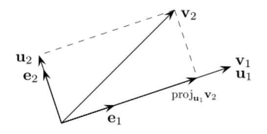
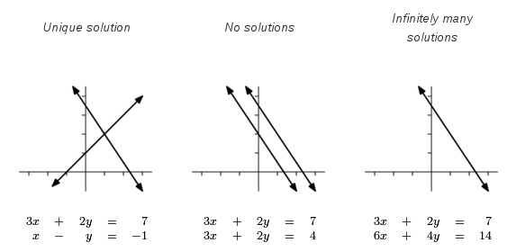

# Linear Algebra

:::{.remark}
The underlying field will be assumed to be $\RR$ for this section.
:::

## Notation
\[  
\mat(m, n) && \text{the space of all } m\times n\text{ matrices} \\
T && \text{a linear map } \RR^n \to \RR^m \\
A\in \mat(m, n)&& \text{an } m\times n \text{ matrix representing }T \\
A^t\in \mat(n, m) && \text{an } n\times m \text{ transposed matrix} \\
\vector{a} && \text{a } 1\times n \text{ column vector} \\
\vector{a}^t && \text{an } n\times 1 \text{ row vector} \\
A = \tv{\vector a_1, \cdots, \vector a_n} && \text{a matrix formed with } \vector a_i \text{ as the columns} \\
V, W && \text{vector spaces} \\
|V|, \dim(W) && \text{dimensions of vector spaces} \\
\det(A) && \text{the determinant of }A \\
\begin{bmatrix}
A &\aug& \vector b
\end{bmatrix}
\da \thevector{\vector a_1, \vector a_2, \cdots \vector a_n, \vector b} && \text{augmented matrices} \\
\begin{bmatrix}
A &\aug& B
\end{bmatrix}
\da \thevector{\vector a_1, \cdots \vector a_n, \vector b_1, \cdots, \vector b_m} && \text{block matrices}\\
\spec(A) && \text{the multiset of eigenvalues of } A \\
A\vector x = \vector b && \text{a system of linear equations} \\
r\da \rank(A) && \text{the rank of }A\\
r_b = \rank\qty{ 
\begin{bmatrix}
A &\aug& \vector b \\
\end{bmatrix}
} && \text{the rank of }A\text{ augmented by }\vector b
.\]

## Big Theorems

:::{.theorem title="Rank-Nullity"}
\[  
\abs{\ker(A)} + \abs{\im(A)} = \abs{\dom(A)}
,\]
where $\nullity(A) = \abs{\im{A}}, \rank(A) = \abs{\im(A)},$ and $n$ is the number of columns in the corresponding matrix. 

Generalization: the following sequence is always exact:
\[
0 \to \ker(A) \injectsvia{\id} \dom(A) \surjectsvia{A} \im(A) \to 0
.\]
Moreover, it always splits, so $\dom A = \ker A \oplus \im A$ and thus $\abs{\dom(A)} = \abs{\ker(A)} + \abs{\im(A)}$.

:::

:::{.remark}
We also have
\[  
\dim(\rowspace(A)) = \dim(\colspace(A)) = \rank(A)
.\]
:::

## Big List of Equivalent Properties

Let $A$ be an $m\times n$ matrix. TFAE:
- $A$ is invertible and has a unique inverse $A^{-1}$
- $A^T$ is invertible
- $\det(A) \neq 0$
- The linear system $A\vector{x} = \vector{b}$ has a unique solution for every $b\ \in \RR^m$
- The homogeneous system $A\vector{x} = 0$ has only the trivial solution $\vector{x} = 0$
- $\rank(A) = n$ 
  - i.e. $A$ is full rank
- $\mathrm{nullity}(A) \definedas \dim\mathrm{nullspace}(A) = 0$
- $A = \prod_{i=1}^k E_i$ for some finite $k$, where each $E_i$ is an elementary matrix.
- $A$ is row-equivalent to the identity matrix $I_n$
- $A$ has exactly $n$ pivots
- The columns of $A$ are a basis for $\RR^n$
	- i.e. $\colspace(A) = \RR^n$
- The rows of $A$ are a basis for $\RR^m$
	- i.e. $\mathrm{rowspace}(A) = \RR^m$
- $\left(\colspace(A)\right)\perp = \left(\mathrm{rowspace}A\right)\perp = \theset{\vector 0}$
- Zero is not an eigenvalue of $A$.
- $A$ has $n$ linearly independent eigenvectors
- The rows of $A$ are coplanar.

Similarly, by taking negations, TFAE:

- $A$ is not invertible
- $A$ is singular
- $A^T$ is not invertible
- $\det A = 0$
- The linear system $A \vector x = \vector b$ has either no solution or infinitely many solutions.
- The homogeneous system $A \vector x = \vector 0$ has nontrivial solutions
- $\rank A < n$
- $\dim \mathrm{nullspace}~ A > 0$
- At least one row of $A$ is a linear combination of the others
- The $RREF$ of $A$ has a row of all zeros.

Reformulated in terms of linear maps $T$, TFAE:
- $T^{-1}: \RR^m \to \RR^n$ exists
- $\im(T) = \RR^n$
- $\ker(T) = 0$
- $T$ is injective
- $T$ is surjective
- $T$ is an isomorphism
- The system $A\vector{x} = 0$ has infinitely many solutions

## Vector Spaces

### Linear Transformations

:::{.definition title="Linear Transformation"}
\todo[inline]{todo}
:::

:::{.remark}
It is common to want to know the range and kernel of a specific linear transformation $T$. $T$ can be given in many ways, but a general strategy for deducing these properties involves:
	
- Express an arbitrary vector in $V$ as a linear combination of its basis vectors, and set it equal to an arbitrary vector in $W$.

- Use the linear properties of $T$ to make a substitution from known transformations

- Find a restriction or relation given by the constants of the initial linear combination.
:::

:::{.remark}
Useful fact: if $V\leq W$ is a subspace and $\dim(V) \geq \dim(W)$, then $V=W$.
:::

:::{.definition title="Kernel"}
\todo[inline]{todo}
:::

:::{.proposition title="Two-step vector subspace test"}
If $V\subseteq W$, then $V$ is a subspace of $W$ if the following hold:

\[  
(1) && \vector 0\in V \\
(2) && \vector a, \vector b\in V\implies t\vector a + \vector b\in V
.\]

:::

### Linear Independence

:::{.proposition title="?"}
Any set of two vectors $\theset{\vector v, \vector w}$ is linearly **dependent** $\iff \exists \lambda :~\vector v = \lambda \vector w$, i.e. one is not a scalar multiple of the other.

:::

### Bases

:::{.definition title="Basis and dimension"}
A set $S$ forms a **basis** for a vector space $V$ iff

1. $S$ is a set of linearly independent vectors, so $\sum \alpha_i \vec{s_i} = 0 \implies \alpha_i = 0$ for all $i$.
2. $S$ spans $V$, so $\vec{v} \in V$ implies there exist $\alpha_i$ such that $\sum \alpha_i \vec{s_i} = \vec{v}$

In this case, we define the **dimension** of $V$ to be $\abs{S}$.
:::

\todo[inline]{Show how to compute basis of kernel.}

\todo[inline]{Show how to compute basis of row space (nonzero rows in $\ref(A)$?)}

\todo[inline]{Show how to compute basis of column space: leading ones.}

### The Inner Product

The point of this section is to show how an inner product can induce a notion of "angle", which agrees with our intuition in Euclidean spaces such as $\RR^n$, but can be extended to much less intuitive things, like spaces of functions.

:::{.definition title="The standard inner product"}
The **Euclidean inner product** is defined as
\[
\inner{\vector a}{\vector b} = \sum_{i=1}^n a_i b_i = a_1b_1 + a_2b_2 + \cdots + a_nb_n
.\]

Also sometimes written as $\vector a^T\vector b$ or $\vector a \cdot \vector b$. 
:::

:::{.proposition title="Inner products induce norms and angles"}
Yields a norm 
\[
\norm{\vector x} \da \sqrt{\inner{\vector x}{\vector x}}
\]

which has a useful alternative formulation
\[
\inner{\vector x}{\vector x} = \norm{\vector x}^2
.\]

This leads to a notion of angle:
\[
\inner{\vector x}{\vector y} = \norm{\vector x} \norm{\vector y} \cos\theta_{x,y}
\implies \cos \theta_{x,y} \definedas \frac{\inner{\vector x}{\vector y}}{\norm{\vector x} \norm{\vector y}} = \inner{\hat{\vector x}}{\hat{\vector y}}
\]
where $\theta_{x,y}$ denotes the angle between the vectors $\vector x$ and $\vector y$.
:::

:::{.remark}
Since $\cos \theta=0$ exactly when $\theta = \pm \frac \pi 2$, we can can declare two vectors to be **orthogonal** exactly in this case:
\[  
\vector x \in \vector y\perp \iff \inner{\vector x}{\vector y} = 0
.\]

Note that this makes the zero vector orthogonal to everything.
:::

:::{.definition title="Orthogonal Complement/Perp"}
Given a subspace $S \subseteq V$, we define its **orthogonal complement**
\[
S\perp = \theset{\vector v\in V \suchthat \forall \vector s\in S,~ \inner{\vector v}{\vector s} = 0}.
\]
:::

:::{.remark}
Any choice of subspace $S\subseteq V$ yields a decomposition $V = S \oplus S\perp$. 
:::

:::{.proposition title="Formula expanding a norm and 'Pythagorean theorem'"}
A useful formula is
\[  
\norm{\vector x + \vector y}^2 = \norm{\vector x}^2 + 2\inner{\vector x}{\vector y} + \norm{\vector y}^2,
.\]

When $\vector x\in \vector y\perp$, this reduces to
\[  
\norm{\vector x + \vector y}^2 = \norm{\vector x}^2 + \norm{\vector y}^2
.\]
:::

:::{.proposition title="Properties of the inner product"}
\envlist
1. **Bilinearity:** 
\[
\inner{\sum_j \alpha_j \vector a_j}{\sum_k \beta_k \vector b_k} = \sum_j \sum_i \alpha_j \beta_i \inner{\vector a_j}{\vector b_i}.
\]

2. **Symmetry**: 
\[
\inner{\vector a}{\vector b} = \inner{\vector b}{\vector a}
\]

3. **Positivity**: 
\[
\vector a \neq \vector 0 \implies \inner{\vector a}{\vector a} > 0
\]

4. **Nondegeneracy**:
\[
\vector a = \vector 0 \iff \inner{\vector a}{\vector a} = 0
\]
:::

\todo[inline]{Proof of Cauchy-Schwarz: See Goode page 346.}

### Gram-Schmidt Process

Extending a basis $\theset{\mathbf{x}_i}$ to an orthonormal basis $\theset{\vector u_i}$

\[
\vector u_1 &= N(\vector{x_1}) \\
\vector u_2 &= N(\vector x_2 - \inner{\vector x_2}{\vector u_1}\vector u_1)\\
\vector u_3 &= N(\vector x_3 - \inner{\vector x_3}{\vector u_1}\vector u_1 - \inner{\vector x_3}{\vector u_2}\vector u_2 ) \\
\vdots & \qquad \vdots \\
\vector u_k &= N(\vector x_k - \sum_{i=1}^{k-1} \inner{\vector x_k}{\vector u_i}\vector u_i)
\]

where $N$ denotes normalizing the result.

#### In more detail

The general setup here is that we are given an orthogonal basis $\theset{\vector x_i}_{i=1}^n$ and we want to produce an **orthonormal** basis from them.

Why would we want such a thing? Recall that we often wanted to change from the standard basis $\mathcal{E}$ to some different basis $\mathcal{B} = \theset{\vector b_1, \vector b_2, \cdots}$. We could form the change of basis matrix $B = [\vector b_1, \vector b_2, \cdots]$ acts on vectors in the $\mathcal{B}$ basis according to
\[  
B[\vector x]_\mathcal{B} = [\vector x]_{\mathcal{E}}
.\]

But to change from $\mathcal{E}$ to $\mathcal{B}$ requires computing $B^{-1}$, which acts on vectors in the standard basis according to
\[  
B^{-1}[\vector x]_\mathcal{E} = [\vector x]_{\mathcal{B}}
.\]

If, on the other hand, the $\vector b_i$ are orthonormal, then $B^{-1} = B^T$, which is much easier to compute. We also obtain a rather simple formula for the coordinates of $\vector x$ with respect to $\mathcal B$. This follows because we can write
\[  
\vector x = \sum_{i=1}^n \inner{\vector x}{\vector b_i} \vector b_i \definedas \sum_{i=1}^n c_i \vector b_i,
.\]

and we find that 
\[  
[\vector x]_\mathcal{B} = \vector c \definedas [c_1, c_2, \cdots, c_n]^T.
.\]

This also allows us to simplify projection matrices. Supposing that $A$ has orthonormal columns and letting $S$ be the column space of $A$, recall that the projection onto $S$ is defined by
\[  
P_S = Q(Q^TQ)^{-1}Q^T
.\]

Since $Q$ has orthogonal columns and satisfies $Q^TQ = I$, this simplifies to
\[  
P_S = QQ^T.
.\]

#### The Algorithm

Given the orthogonal basis $\theset{\vector x_i}$, we form an orthonormal basis $\theset{\vector u_i}$ iteratively as follows. 

First define 
\[
N: \RR^n &\to S^{n-1} \\
\vector x &\mapsto \hat{\vector x} \definedas \frac {\vector x} {\norm{\vector  x}}
\]

which projects a vector onto the unit sphere in $\RR^n$ by normalizing. Then,

\[
\vector u_1 &= N(\vector{x_1}) \\
\vector u_2 &= N(\vector x_2 - \inner{\vector x_2}{\vector u_1}\vector u_1)\\
\vector u_3 &= N(\vector x_3 - \inner{\vector x_3}{\vector u_1}\vector u_1 - \inner{\vector x_3}{\vector u_2}\vector u_2 ) \\
\vdots & \qquad \vdots \\
\vector u_k &= N(\vector x_k - \sum_{i=1}^{k-1} \inner{\vector x_k}{\vector u_i}\vector u_i)
\]

In words, at each stage, we take one of the original vectors $\vector x_i$, then subtract off its projections onto all of the $\vector u_i$ we've created up until that point. This leaves us with only the component of $\vector x_i$ that is orthogonal to the span of the previous $\vector u_i$ we already have, and we then normalize each $\vector u_i$ we obtain this way.

**Alternative Explanation**:

Given a basis
\[
  S = \left\{\mathbf{v_1, v_2, \cdots v_n}\right\},
\]

the Gram-Schmidt process produces a corresponding orthogonal basis
\[
  S' = \left\{\mathbf{u_1, u_2, \cdots u_n}\right\}
\]
that spans the same vector space as $S$.

$S'$ is found using the following pattern:
\[
\mathbf{u_1} &= \mathbf{v_1} \\
\mathbf{u_2} &= \mathbf{v_2} - \text{proj}_{\mathbf{u_1}} \mathbf{v_2}\\
\mathbf{u_3} &= \mathbf{v_3} - \text{proj}_{\mathbf{u_1}} \mathbf{v_3} - \text{proj}_{\mathbf{u_2}} \mathbf{v_3}\\
\]

where
\[
\text{proj}_{\mathbf{u}} \mathbf{v} = (\text{scal}_{\mathbf{u}} \mathbf{v})\frac{\mathbf{u}}{\mathbf{\norm{u}}}
= \frac{\langle \mathbf{v,u} \rangle}{\norm{\mathbf{u}}}\frac{\mathbf{u}}{\mathbf{\norm{u}}}
= \frac{\ip{\vector{v}}{\vector{u}}}{\norm{\vector{u}}^2}\vector{u}
\]
is a vector defined as the \textit{orthogonal projection of $\vector{v}$ onto $\vector{u}$.}

The orthogonal set $S'$ can then be transformed into an orthonormal set $S''$ by simply dividing the vectors $s\in S'$ by their magnitudes. The usual definition of a vector's magnitude is
\[
\norm{\vector{a}} = \sqrt{\ip{\vector{a}}{\vector{a}}} \text{ and } \norm{\vector{a}}^2 = \ip{\vector{a}}{\vector{a}}
\]

As a final check, all vectors in $S'$ should be orthogonal to each other, such that
\[
\ip{\vector{v_i}}{\vector{v_j}} = 0 \text{ when } i \neq j
\]

and all vectors in $S''$ should be orthonormal, such that
\[
\ip{\vector{v_i}}{\vector{v_j}} = \delta_{ij}
\]

### The Fundamental Subspaces Theorem

Given a matrix $A \in \mathrm{Mat}(m, n)$, and noting that
\[
A &: \RR^n \to \RR^m,\\
A^T &:  \RR^m \to \RR^n
\]

We have the following decompositions:
\[
&\RR^n &\cong  \ker A &\oplus \im A^T &\cong \mathrm{nullspace}(A) &\oplus~ \mathrm{colspace}(A^T) \\
&\RR^m &\cong  \im A &\oplus \ker A^T &\cong \mathrm{colspace}(A) &\oplus~ \mathrm{nullspace}(A^T)
\]

### Computing change of basis matrices

\todo[inline]{todo}

## Matrices

:::{.remark}
An $m\times n$ matrix is a map from $n$-dimensional space to $m$-dimensional space. 
The number of _rows_ tells you the dimension of the codomain, the number of _columns_ tells you the dimension of the _domain_.
:::

:::{.warning}
The space of matrices is not an integral domain!
Counterexample: if $A$ is singular and nonzero, there is some nonzero $\vector v$ such that $A \vector v = \vector 0$.
Then setting $B = \tv{\vector v, \vector v, \cdots}$ yields $AB = 0$ with $A\neq 0, B\neq 0$.
:::

:::{.definition title="Rank of a matrix"}
The **rank** of a matrix $A$ representing a linear transformation $T$ is $\dim \colspace(A)$, or equivalently $\dim \im T$.
:::

:::{.proposition title="?"}
$\rank(A)$ is equal to the number of nonzero rows in $\rref(A)$.
:::

:::{.definition title="Trace of a Matrix"}
\[
\mathrm{Trace}(A) = \sum_{i=1}^m A_{ii}
\]
:::

:::{.definition title="Elementary Row Operations"}
The following are **elementary row operations** on a matrix:

- Permute rows
- Multiple a row by a scalar
- Add any row to another
:::

:::{.proposition title="Formula for matrix multiplication"}
If $A = \thevector{\vector a_1, \vector a_2, \cdots} \in \mathrm{Mat}(m, n)$ and $B = \thevector{\vector b_1, \vector b_2, \cdots} \in\mathrm{Mat}(n, p)$, then
\[
C \definedas AB \implies c_{ij} = \sum_{k=1}^n a_{ik}b_{kj} = \inner{\mathbf{a_i}}{\mathbf{b_j}}
\]
where $1\leq i \leq m$ and $1\leq j \leq p$.
In words, each entry $c_{ij}$ is obtained by dotting *row* $i$ of $A$ against *column* $j$ of $B$.
:::

### Systems of Linear Equations

:::{.definition title="Consistent and inconsistent"}
A system of linear equations is **consistent** when it has at least one solution.
The system is **inconsistent** when it has no solutions.
:::

:::{.definition title="Homogeneous Systems"}
?
:::

:::{.remark}
Homogeneous systems are always consistent, i.e. there is always at least one solution.
:::

:::{.remark}
\envlist
- Tall matrices: more equations than unknowns, *overdetermined*
- Wide matrices: more unknowns than equations, *underdetermined*
:::

:::{.proposition title="Characterizing solutions to a system of linear equations"}

There are three possibilities for a system of linear equations:

1. No solutions (inconsistent)
2. One unique solution (consistent, square or tall matrices)
3. Infinitely many solutions (consistent, underdetermined, square or wide matrices)

These possibilities can be check by considering $r\da \rank(A)$:

- $r < r_b$: case 1, no solutions.
- $r = r_b$: case 1 or 2, at least one solution. 
  - $r_b = n$: case 2, a unique solution.
  - $r_b < n:$ case 3, infinitely many solutions.
:::

### Determinants

:::{.proposition title="?"}
\[
\det{(A \mod p}) \mod p \equiv (\det{A}) \mod p
\]
:::

:::{.proposition title="Inverse of a $2\times 2$ matrix"}
For $2\times 2$ matrices,
$$
A^{-1} = \left( \begin{array}{cc} a & b \\ c & d \end{array}\right)^{-1} = \frac{1}{\det{A}}\left( \begin{array}{cc} d & -b \\ -c & a \end{array}\right)
$$
In words, swap the main diagonal entries, and flip the signs on the off-diagonal.
:::

:::{.proposition title="Properties of the determinant"}
Let $A \in \mathrm{Mat}(m, n)$, then there is a function
\[
\det: \mat(m, m) &\to \RR \\
A &\mapsto \det(A)
\]
satisfying the following properties:

- $\det$ is a group homomorphism onto $(\RR, \cdot)$: 
\[
\det(AB) = \det(A) \det(B)
\]
  - Some corollaries:
  \[  
  \det{A^k} &= k\det{A} \\
  \det(A^{-1}) &= (\det A)^{-1}
  \det(A^t) &= \det(A)
  .\]

- Invariance under adding scalar multiples of any row to another:
\[
\det 
\begin{bmatrix}
& \vdots & \\
\horzbar & \vecc{Aquamarine}a_i & \horzbar \\
& \vdots & \\
\end{bmatrix}
=
\det
\begin{bmatrix}
& \vdots & \\
\horzbar & \vecc{Aquamarine}a_i + t\vector{a_j} & \horzbar \\
& \vdots & \\
\end{bmatrix}
\]

- Sign change under row permutation:
\[
\det 
\begin{bmatrix}
& \vdots & \\
\horzbar & \vecc{Aquamarine}a_i & \horzbar \\
& \vdots & \\
\horzbar & \vector a_j & \horzbar \\
& \vdots & \\
\end{bmatrix}
=
(-1) \det
\begin{bmatrix}
& \vdots & \\
\horzbar & \vector a_j & \horzbar \\
& \vdots & \\
\horzbar & \vecc{Aquamarine}a_i & \horzbar \\
& \vdots & 
\end{bmatrix}
\]

  - More generally, for a permutation $\sigma\in S_n$,
\[
\det 
\begin{bmatrix}
& \vdots & \\
\horzbar & \vector a_i & \horzbar \\
& \vdots & \\
\horzbar & \vector a_j & \horzbar \\
& \vdots & \\
\end{bmatrix}
=
(-1)^{\sgn(\sigma)} \det
\begin{bmatrix}
& \vdots & \\
\horzbar & \vector a_{\sigma(j)} & \horzbar \\
& \vdots & \\
\horzbar & \vector a_{\sigma(i)} & \horzbar \\
& \vdots & 
\end{bmatrix}
\]

- Multilinearity in rows:
\[  
\det 
\begin{bmatrix}
& \vdots & \\
\horzbar & t \vecc{Aquamarine}a_i & \horzbar \\
& \vdots & \\
\end{bmatrix}
&= t \det
\begin{bmatrix}
& \vdots & \\
\horzbar & \vecc{Aquamarine}a_i & \horzbar \\
& \vdots & \\
\end{bmatrix} \\
\det 
\begin{bmatrix}
\horzbar & t \vector a_1 & \horzbar \\
\horzbar & t \vector a_2 & \horzbar \\
& \vdots & \\
\horzbar & t \vector a_m & \horzbar \\
\end{bmatrix}
&= t^m \det
\begin{bmatrix}
\horzbar & \vector a_1 & \horzbar \\
\horzbar & \vector a_2 & \horzbar \\
& \vdots & \\
\horzbar & \vector a_m & \horzbar \\
\end{bmatrix} \\
\det 
\begin{bmatrix}
\horzbar & t_1 \vector a_1 & \horzbar \\
\horzbar & t_2 \vector a_2 & \horzbar \\
& \vdots & \\
\horzbar & t_m \vector a_m & \horzbar \\
\end{bmatrix}
&= \prod_{i=1}^m t_i \det
\begin{bmatrix}
\horzbar & \vector a_1 & \horzbar \\
\horzbar & \vector a_2 & \horzbar \\
& \vdots & \\
\horzbar & \vector a_m & \horzbar \\
\end{bmatrix}
.\]

- Linearity in each row:
\[  
\det
\begin{bmatrix}
& \vdots & \\
\horzbar & \vecc{Aquamarine}a_i + \vecc{red} a_j & \horzbar \\
& \vdots & \\
\end{bmatrix}
=\det
\begin{bmatrix}
& \vdots & \\
\horzbar & \vecc{Aquamarine}a_i & \horzbar \\
& \vdots & \\
\end{bmatrix} +
\det
\begin{bmatrix}
& \vdots & \\
\horzbar & \vecc{red}a_j & \horzbar \\
& \vdots & \\
\end{bmatrix} 
.\]

- $\det(A)$ is the volume of the parallelepiped spanned by the columns of $A$.
- If any row of $A$ is all zeros, $\det(A) = 0$.
:::

:::{.proposition title="Characterizing singular matrices"}
TFAE:

- $\det(A) = 0$
- $A$ is singular.
:::

### Computing Determinants

Useful shortcuts:

- If $A$ is upper or lower triangular, $\det(A) = \prod_i a_{ii}$.

:::{.definition title="Minors"}
The **minor** $M_{ij}$ of $A\in \mat(n, n)$ is the *determinant* of the $(n-1) \times (n-1)$ matrix obtained by deleting the $i$th row and $j$th column from $A$.
:::

:::{.definition title="Cofactors"}
\label{def:cofactor}
The **cofactor** $C_{ij}$ is the scalar defined by
\[  
C_{ij} \da (-1)^{i+j} M_{ij}
.\]
:::

:::{.proposition title="Laplace/Cofactor Expansion"}
For any fixed $i$, there is a formula
\[  
\det(A) = \sum_{j=1}^n a_{ij} C_{ij}
.\]
:::

:::{.example title="?"}
Let
\[  
A = 
\left[\begin{array}{lll}
1 & 2 & 3 \\
4 & 5 & 6 \\
7 & 8 & 9
\end{array}\right]
.\]

Then
\[  
\det A =
1 \cdot\left|\begin{array}{ll}
5 & 6 \\
8 & 9
\end{array}\right|-2 \cdot\left|\begin{array}{ll}
4 & 6 \\
7 & 9
\end{array}\right|+3 \cdot\left|\begin{array}{ll}
4 & 5 \\
7 & 8
\end{array}\right|
= 1 \cdot(-3)-2 \cdot(-6)+3 \cdot(-3)
= 0
.\]

:::

:::{.proposition title="Computing determinant from RREF"}
$\det(A)$ can be computed by reducing $A$ to $\rref(A)$ 
(which is upper triangular) and keeping track of the following effects:

- $R_i \mapsfrom R_i \pm t R_j$: no effect.
- $R_i \iff R_j$: multiply by $(-1)$. 
- $R_i \mapsfrom tR_i$: multiply by $t$.
:::

### Inverting a Matrix

:::{.proposition title="Cramer's Rule"}
Given a linear system $A\vector x = \vector b$, writing $\vector x = \tv{x_1, \cdots, x_n}$, there is a formula
\[
x_i = \frac{\det(B_i)}{\det(A)}
\]
where $B_i$ is $A$ with the $i$th column deleted and replaced by $\vector{b}$.
:::

:::{.proposition title="Gauss-Jordan Method for inverting a matrix"}
Under the equivalence relation of elementary row operations, there is an equivalence of augmented matrices:
\[
\begin{bmatrix}
A &\aug& I
\end{bmatrix}
\sim
\begin{bmatrix}
I &\aug& A^{-1}
\end{bmatrix}
\]
where $I$ is the $n\times n$ identity matrix.
:::

:::{.proposition title="Cofactor formula for inverse"}
\[  
A^{-1} = {1\over \det(A)} \tv{C_{ij}}^t
.\]
where $C_{ij}$ is the *cofactor*(\cref{def:cofactor}) at position $i,j$.[^adjugate_note]

[^adjugate_note]: Note that the matrix appearing here is sometimes called the *adjugate*.

:::

:::{.example title="Inverting a $2\times 2$ matrix"}
\[
\left(\begin{array}{cc} 
a& b \\ 
c& d 
\end{array}\right)^{-1} 
= 
{1 \over a d - b c} 
\left(\begin{array}{rr} 
d  & -b \\ 
-c & a 
\end{array}\right)
\quad 
\text{ where } ad-bc \ne 0
\]

What's the pattern?

1. Always divide by determinant
2. Swap the diagonals
3. Hadamard product with checkerboard 

:::

:::{.example title="Inverting a $3\times 3$ matrix"}
\[
\begin{bmatrix}
+ & - \\
- & +
\end{bmatrix}
\]

\[
A^{-1} \da
\begin{bmatrix}
a & b & c \\
d & e & f \\
g & h & i
\end{bmatrix}
^{-1} 
= 
{1 \over {\det A}} 
\begin{bmatrix}
e i - f h & -(b i - c h) & b f - c e \\ 
-(d i - f g) &a i - c g &-(a f -c d) \\ 
d h - e g & -(a h - b g)& a e - b d 
\end{bmatrix}
.\]

The pattern:

1. Divide by determinant
2. Each entry is determinant of submatrix of $A$ with corresponding col/row deleted
3. Hadamard product with checkerboard

\[
\begin{bmatrix}
+ & - & + \\ 
- & + & - \\  \
+ & - & + 
\end{bmatrix}
\]

4. Transpose at the end!!

:::

### Bases for Spaces of a Matrix

Let $A\in \mat(m, n)$ represent a map $T:\RR^n\to \RR^m$.

\todo[inline]{Add examples.}

:::{.definition title="Pivot"}
?
:::
\todo[inline]{todo}

:::{.proposition}
\[  
\dim \rowspace(A) = \dim \colspace(A)
.\]
:::

#### The row space

\[
\im(T)\dual = \rowspace(A) \subset \RR^n
.\]

Reduce to RREF, and take nonzero rows of $\mathrm{RREF}(A)$.

#### The column space

\[
\im(T) = \colspace(A) \subseteq \RR^m
\]

Reduce to RREF, and take columns with pivots from original $A$.

:::{.remark}
Not enough pivots implies columns don't span the entire target domain
:::

#### The nullspace

\[
\ker(T) = \nullspace(A) \subseteq \RR^n
\]

Reduce to RREF, zero rows are free variables, convert back to equations and pull free variables out as scalar multipliers.

#### Eigenspaces

For each $\lambda \in \spec(A)$, compute a basis for $\ker(A - \lambda I)$.

### Eigenvalues and Eigenvectors

:::{.definition title="Eigenvalues, eigenvectors, eigenspaces"}
A vector $\vector v$ is said to be an **eigenvector** of $A$ with **eigenvalue** $\lambda\in \spec(A)$ iff
\[
A\vector v = \lambda \vector v
\]
For a fixed $\lambda$, the corresponding **eigenspace** $E_\lambda$ is the span of all such vectors.
:::

:::{.remark}
\envlist
- Similar matrices have identical eigenvalues and multiplicities.

- Eigenvectors corresponding to distinct eigenvalues are **always** linearly independent

- $A$ has $n$ distinct eigenvalues $\implies A$ has $n$ linearly independent eigenvectors.

- A matrix $A$ is diagonalizable $\iff A$ has $n$ linearly independent eigenvectors.
:::

:::{.proposition title="How to find eigenvectors"}
For $\lambda\in \spec(A)$,
\[  
\vector v\in E_\lambda \iff \vector v \in \ker(A-I\lambda)
.\]

:::

:::{.remark}
Some miscellaneous useful facts:

- $\lambda \in \spec(A) \implies \lambda^2 \in \spec(A^2)$ with the same eigenvector.

- $\prod \lambda_i = \det A$

- $\sum \lambda_i = \mathrm{Tr}~A$

:::

#### Finding generalized eigenvectors

\todo[inline]{todo}

#### Diagonalizability

:::{.remark}
An $n\times n$ matrix $P$ is diagonalizable iff its eigenspace is all of $\mathbb{R}^n$ (i.e. there are $n$ linearly independent eigenvectors, so they span the space.) 
:::

:::{.remark}
$A$ is diagonalizable if there is a basis of eigenvectors for the range of $P$.
:::

### Useful Counterexamples

$$
A \da \left[ \begin{array} { c c } { 1 } & { 1 } \\ { 0 } & { 1 } \end{array} \right] 
&\implies A^n = 
\left[ \begin{array} { c c } { 1 } & { n } \\ { 0 } & { 1 } \end{array} \right], 
&& \spec(A) = [1,1] \\
A \da \left[ \begin{array} { c c } { 1 } & { 1 } \\ { 0 } & { - 1 } \end{array} \right] 
&\implies A^2 = I_2,
&& \spec(A) = [1, -1]
$$

