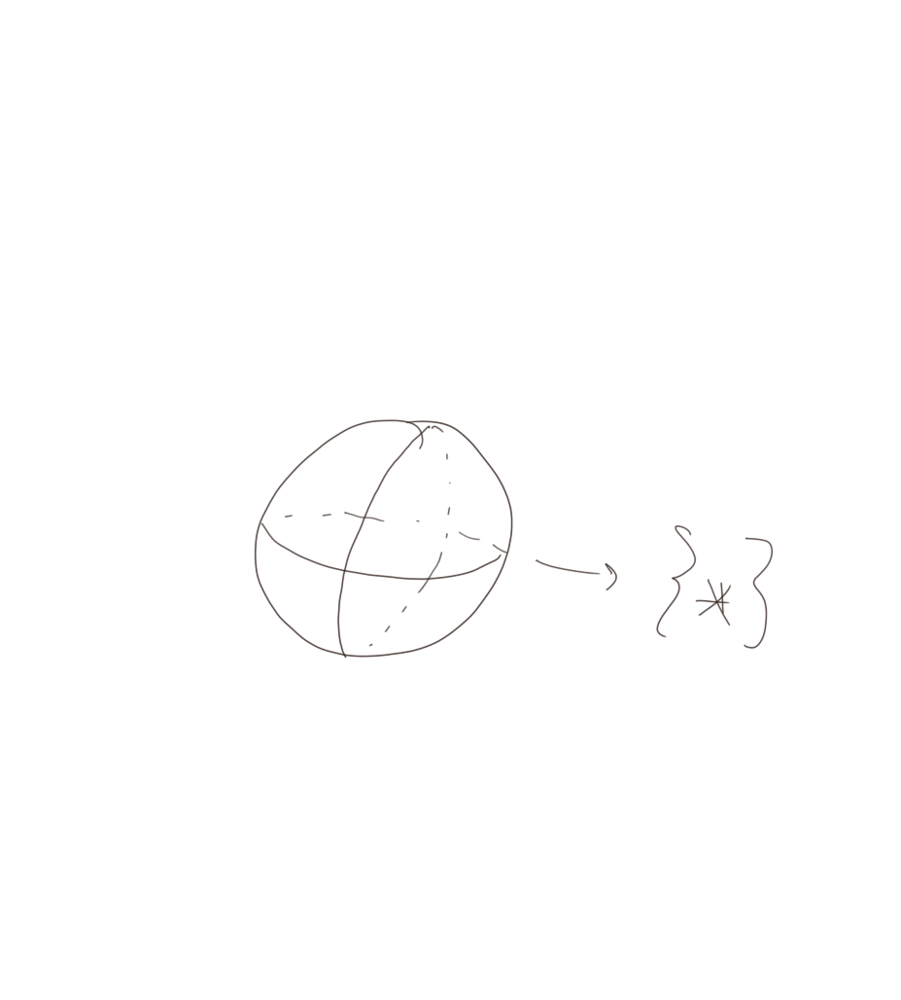

# The Bar Resolution and Group Homology

Last time: the Koszul complex and free resolutions.
Today: group homology

## Bar Resolutions

Let $A$ be an associative, unital, generally not commutative algebra over a field $k$ (or just a ring over $\ZZ$). 
Consider the category of $A\dash A\dash$ bimodules, which has the fundamental structure of two multiplication maps of the form
$$
A\tensor M \tensor A &\to M\\
a_1\tensor m \tensor a_2 &\mapsto a_1 m a_2
$$

There is a particularly interesting module ${}_A A_A$, the "diagonal" or "trivial" module. 
It's trivial because as functors, we have 
\[
(\wait)\tensor_A {}_A A_A = \id
.\]

Note that this module is not free. 
However, compare this to ${}_A(A\tensor_k A)_A$.
This is a free module, since it is a vector space over $k$, of rank 1 with generator $1\tensor 1$. 
So we can write a free resolution of ${}_A A_A$ as a bimodule:

\[
(A^{\tensor 4}) 
&\mapsvia{a\tensor b\tensor c \tensor d \mapsto ab\tensor c\tensor d - a\tensor bc \tensor d + a\tensor b \tensor cd} 
{}_A(A^{\tensor 3})_A 
&\mapsvia{f_1:~a\tensor b \tensor c ~\mapsto~ ab\tensor c - a\tensor bc} {}_A(A\tensor_k A)_A 
&\mapsvia{f_0: ~a\tensor b~ \mapsto~ a1b} {}_A A_A \to 0
\]

Then $f_1$ surjects onto $\ker f_0$, yielding the second term.

Continue to yield 
\[
B^{-n}(A) = {}_A A\tensor_k A^{\tensor_k^{n}}\tensor_k A_A
,\] 
which is free as an $A\dash A\dash$ bimodule since it decomposes as a direct sum indexed by the middle term.

Then there is a differential
\[
B^{-n} &\to B^{-n+1} \tag*{($n \geq -1$)} \\
a_0 \tensor (a_1 \tensor \cdots \tensor a_k) \tensor a_{n+1} 
&\mapsto \sum (-1)^i a_0 \tensor \cdots \tensor a_i a_{i+1} \tensor \cdots \tensor a_{n+1}
\]

You can check that $d^2 = 0 \iff A$ is associative. This is something that works in general -- for example, with lie algebras, the associative multiplication is replaced by the lie bracket, and the equivalence is to the Jacobi identity.

:::{.claim}
This is a resolution. 
Just write down a map $A\tensor A \to A\tensor A \tensor A$ that is chain homotopic to the zero map. 
Something obvious works: let 
\[
h(a_0 \tensor \cdots \tensor a_{n+1}) = 1\tensor a_0 \tensor \cdots \tensor a_{n+1}
,\] 
then just check that $dh + hd = \id - 0$.
:::

:::{.remark}
This is not actually a bunch of maps of bimodules, only of right $A$ modules -- but this is enough to show that this complex is acyclic, i.e. kernels = images.
:::

We can define homologies associated to this. 
One example is the Hochschild Cohomology with coefficients in a bimodule, denoted 
\[
HH^*(A;M) \definedas \ext_{A\dash A\dash\text{mod}}^*({}_A A_A, {}_A M_A)
.\]
In other words, take the bar resolution of $A$, hom it into $M$ ($\hom_{A\dash A}(B^*(A), M))$, and take kernels modulo images.

Whenever you have a derived functor, the original functor should come up in the zeroth homology. 
In this case, it extends to $HH^0(A, M)$ is analogous to the "center" of $M$, i.e. 
\[
HH^0(A, M) = \theset{m\in M: am = ma, ~\forall a\in A}
.\]

Also, $HH_*(A; M) = \tor(A, M)$, and 
\[
HH_0 = \frac{M}{\gens{am=ma}}
,\] is the "cocenter" of $M$. 
This forcibly quotients out all of the commuting elements!

This resolution is easiest seen over bimodules, but the same basic complex can be formed in the category of plain left/right modules. So given ${}_A M \in \mathbf{A\dash mod}$, regard it as ${}_A A_A \tensor_A M \cong M$ where $a\tensor m \mapsto am$. Then ${}_A B(A)_A \tensor_A M$ is still a complex of free *left* modules that only depends on the module $A$, so this is a universal type of resolution.

We can use this to compute things like

\[
\ext_{A\dash mod}({}_A M, {}_A A) 
&= h(\shom^*_{A\dash mod}~ ({}_AB^{\leq 0}(A) \tensor_A M, {}_A N)) \\
\tor_{A\dash mod}(N_A, {}_A A) 
&= h(N\tensor_A B^{\leq 0}(A) \tensor_A M)
.\]

## Homology of a Discrete Group

Let $G$ be a discrete group -- note that we could always think of these of topological spaces, just not in this instance. 
Let $A = \ZZ[G]$ be the group ring: formal finite integer linear sums of elements in $G$ with the obvious multiplication.

:::{.remark}
Note that a general $k\dash$algebra is not always augmented, so there is not always a way to make $k$ into an $A$ module.
:::

This algebra is in fact augmented, i.e. it has an algebra homomorphism $\ZZ[G] \mapsvia{\varepsilon} \ZZ$, so we can make $\ZZ$ into a left $A$ module for $A = \ZZ[G]$ where $a\in A$ acts on $n\in \ZZ$ by $a.n \mapsto \varepsilon(a)n$.

This allows us to define 
\[  
H_*(G; M) \definedas \tor_{\ZZ[G]}(\ZZ_{\ZZ[G]}, {}_{\ZZ[G]} M)
.\]
In particular, we could just define 
\[
H^*(G; \ZZ) \definedas \tor_{\ZZ[G]}(\ZZ_{\ZZ[G]}, {}_{\ZZ[G]} \ZZ)
.\]

These extend the natural functors, the "coinvariants", and
\[
H^0(G;M) &= \theset{m\st gm = m} \\
H_0(G; M) &= \frac{M}{\gens{ g.m=m} }
\]

**Next Time**

- Explicit chain complex using bar resolutions
- Explicit complexes using the resolution in the case $G=\ZZ_n$
- Relation to simplicial classifying spaces.

{ width=250px }
