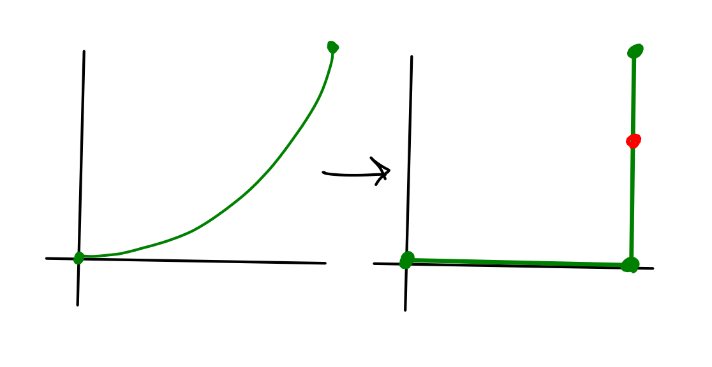
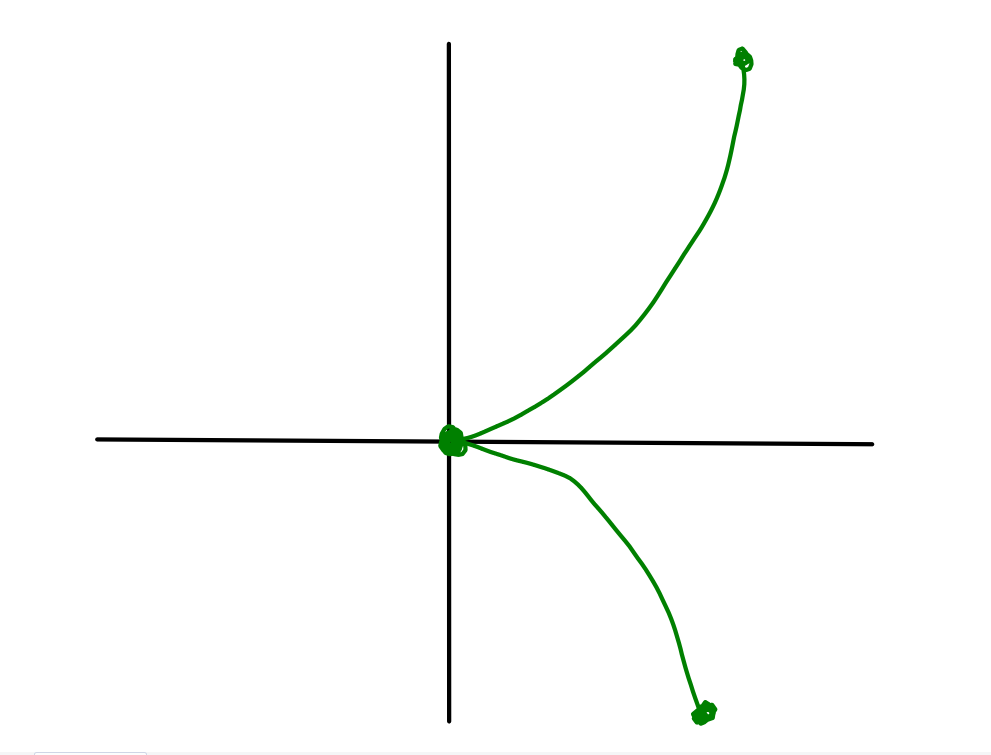
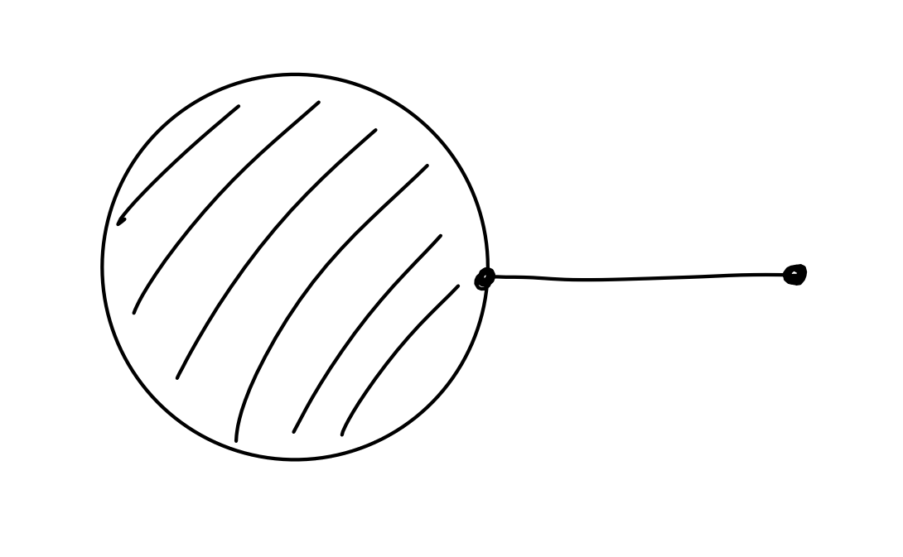
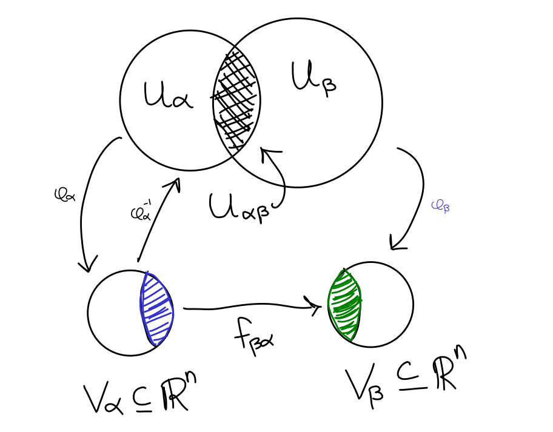
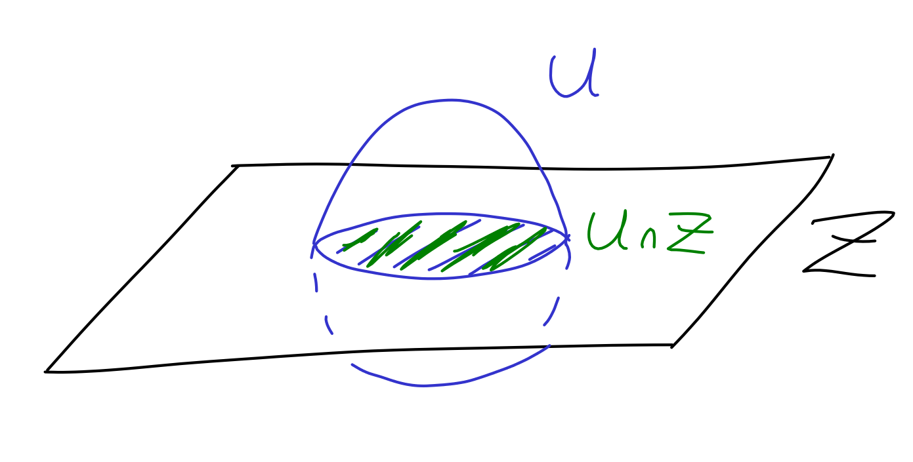
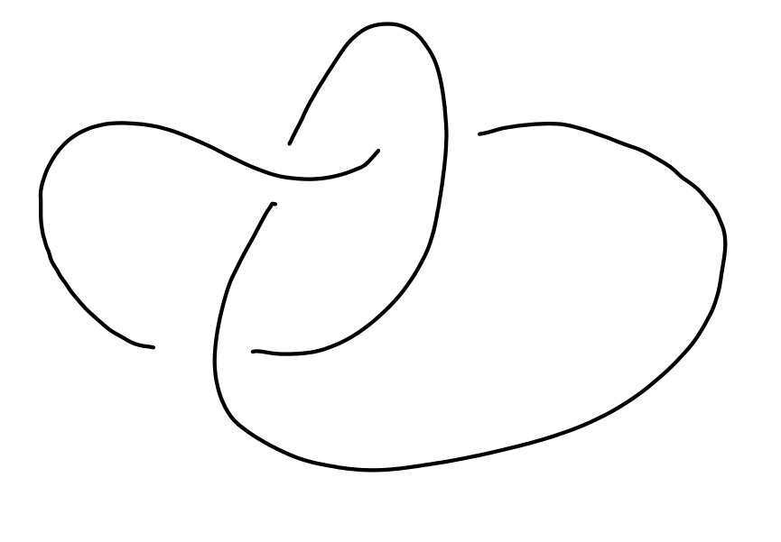
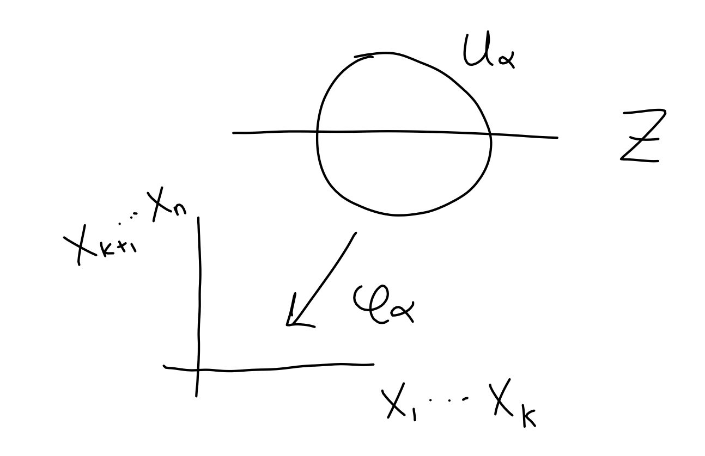

# Lecture 1

> This course will use Geometry of differential forms by Shigeyuki Morita, another good reference is Lee's Topological Manifolds.

## Overview
The key point of this class will be a discussion of *smooth structures*. As you may recall, a sensational result of Milnor's exhibited exotic spheres with smooth structures -- i.e., a differentiable manifold $M$ which is homeomorphic but *not* diffeomorphic to a sphere.

Summary of this result: Look at bundles $S^3 \to X \to S^4$, then one can construct some $X \cong S^7 \in \mathbf{Top}$ but $X \not \cong S^7 \in \mathbf{Diff}^{\,\infty}$. There are in fact 7 distinct choices for $X$.

> It is not known if there are exotic smooth structures on $S^4$. The Smooth Poincare' conjecture is that these do not exist; this is believed to be false.

The other key point of this course is to show that $X \in \mathbf{Diff}^{\,\infty} \implies X \injects \RR^n$ for some $n$, and is in fact a topological subspace.

A short list of words/topics we hope to describe:

- Differentiable manifolds
- Local charts
- Submanifolds
- Projective spaces
- Lie groups
- Tangent spaces
- Vector fields
- Cotangent spaces
- Differentials of smooth maps $G$
- Differential forms
- de Rham's theorem

## Motivation

We'd like a notion of "convergence" for, say, curves in $\RR^2$. Consider the following examples.

\
Note the problematic point on the bottom right, as well as the fact that neither of the usual notions of pointwise or uniform convergence will yield a point on the LHS that converges to the red point on the RHS.

\
Note the problematic point at the origin.

\
Note the problematic point in the middle, for which all neighborhoods of it are not homeomorphic to either a 2-dimensional nor a 1-dimensional space.

## Defining smooth manifolds
\wrapenv{\Begin{definition}}
A topological space $M$ is said to be a **topological manifold**  when

- $M$ is Hausdorff, so $p\neq q \in M \implies \exists N(p), N(q)$ such that $N(p) \intersect N(q) = \emptyset$.
- $x\in M \implies$ there exists some $U_x \subseteq M$ and a $\varphi: U_x \to \RR^n$ for some $n$ which is a homeomorphism.
- $M$ is 2nd countable

\wrapenv{\End{definition}}

> There are somewhat technical conditions -- most of the theory goes through without $M$ being Hausdorff or 2nd countable, but these are needed to construction *partitions of unity* later.

> Also note that these conditions exclude spaces such as the copy of $D_2 \vee I$ from above.

The intuition here is that we'd like spaces that "locally look like $\RR^n$", and we introduce the additional structure of smoothness in the following way:

\wrapenv{\Begin{definition}}
A family of coordinate systems $\theset{U_\alpha, \varphi_\alpha)}$ is a **smooth atlas** on $M$ exactly when the change-of-coordinate maps $f_{\alpha, \beta}$ are $C^\infty$.
\wrapenv{\End{definition}}

\wrapenv{\Begin{exercise}}
Show that $S^n$ is a smooth manifold for every $n$.
\wrapenv{\End{exercise}}

Supposing that $f: M^n \to M^n$ is a map, then locally there is a map $\tilde f: \RR^n \to \RR_n$. Moreover, we can write
$$
f(x_1, x_2, \cdots x_n) = \thevector{f_1(x_1, x_2, \cdots x_n), f_2(x_1, x_2, \cdots x_n), \cdots f_n(x_1, x_2, \cdots x_n)}
$$
\wrapenv{\Begin{proposition}}
If $M$ and $N$ are smooth manifolds, then the product $M\times N$ is also a smooth manifolds.
\wrapenv{\End{proposition}}

Being Hausdorff and 2nd countable can be checked on the basis elements, and it is indeed true that $\mathcal B_1 \cross \mathcal B_2$ furnishes a basis that satisfies these conditions.

\wrapenv{\Begin{example}}
The $n\dash$fold copy of 1-dimensional sphere is given by
$$(S^1)^n = \prod_n S^1 \coloneqq \mathbb{T}^n,
$$and is denoted the $n\dash$torus.
\wrapenv{\End{example}}

# Lecture 2

Recall that last time we gave the definition of a smooth manifolds, discussed examples such as spheres, and saw that this category is closed under products.

Theorem: In $\RR^n$, given smooth functions $f_i(x_1, \cdots x_n)$ where $q\leq i\leq n$, the set $Z \coloneqq \theset{\vector x \in \RR^n \suchthat f_i(\vector x) = \vector 0 \quad \forall i}$, then $Z$ is a smooth manifold if there exist $\theset{i_1, \cdots, i_m} \subseteq \theset{q, \cdots, n}$ such that the Jacobian $\left( \frac{\partial f_i}{\partial x_{i_j}} \right) \neq 0$.

Without loss of generality, assume $i_j = j$, we can then write this matrix as
$$
\left[ \nabla f_1, \nabla f_2, \cdots \nabla f_m \right ]^t,
$$

where the submatrix formed by first $m$ columns has a nonzero determinant.

The implicit function theorem: In this situation, there exist a sequence of functions $\theset{g_k}_{k=m+1}^n$ such that $g_k (x_1, \cdots x_m) = x_k$ which are smooth.

Compare this to $F(x, y) = 0$ (the two variable case) and $\dd{F}{x} \mid_{x = x_0} \neq 0$, then there exists and $f$ neared near $x_0$ such that $F(x, f(x)) = 0 \iff y = f(x)$, and now just replace $x$ with $\vector x$ (add bars everywhere) to get the above theorem.

Say we have $\vector x^0 = \thevector{x_1^0, \cdots, x_n^0}$. such that $\left( \dd{f_i}{x_j^0}\right) \Bigm|_{\vector x = \vector x^0} \neq 0$, then there exists a $U \subset \RR^n$ where inside $U \intersect Z$, all points have the form $(x_1, x_2, \cdots, x_m, g_{m+1}(x_1, \cdots x_m), \cdots g_n(x_1, \cdots x_m))$.

So only the first $m$ variables are free, and the remaining are determined by some functions $g_k$.

\\
Here $U$ gives a defining region in $\RR^m$ for $x_1, \cdots x_m$, and $\varphi_\alpha$ of this neighborhood satisfies $\varphi_\alpha\inv (x_1, \cdots x_m) = (x_1, \cdots, x_m, g_{m+1}, \cdots g_n)$. Now we can look at the transition function $f_{\alpha\beta} = \varphi_\beta \circ \varphi_\alpha\inv$.

For example,
\begin{align*}
\varphi_\alpha(x_1, \cdots x_n) &= (x_1, \cdots x_{m-1}, x_m) \\
\varphi_\beta(x_1, \cdots x_n) &= (x_1, \cdots x_{m-1}, x_{m+1})\\
\varphi_\alpha\inv (x_1, \cdots x_m) &= (x_1, \cdots x_m, g_{m+1}, \cdots g_n) \\
\varphi_\beta\inv(x_1, \cdots x_{m-1}, x_{m+1}) &= (x_1, x_{m-1}, h_m, x_{m+1}, h_{m+2}, \cdots h_n)
\end{align*}

For $x \in U_\alpha\intersect U_\beta$, we have $\varphi_\beta \circ \varphi_\alpha\inv(x_1, \cdots x_m) = (x_1, \cdots x_{m-1}, g_{m+1})$.

Example: the sphere revisited. Take $F(x_1, \cdots x_n) = 0$, where $F(x_1, \cdots x_m) = -1 + \sum x_i^2$. For any $(x_1, \cdots x_m) \in S^{m-1}$, at least one $x_i \neq 0$, wlog let this be $x_1$. Then $\left( \dd{F}{x_1} \right ) \Bigm|_{\vector x} = \partial x_1 \neq 0$.

Example: the torus. We have $\TT^n \subset \RR^{2n}$, where $\TT^n = \prod_{i=1}^n S^1$. Write a point in $\RR^{2n}$ as $(x_1, y_1, \cdots x_n, y_n)$, then $\TT^n = \theset{(\vector x, \vector y) \in (\RR^2)^n \suchthat x_i^2 + y_i^2 = 1}$.

Remark (Choice of atlas): If $\theset{(U_\alpha, \varphi_\alpha)}$ is an atlas for $M$, then

- Changing $\varphi_\alpha \to \varepsilon_\alpha \circ \varphi_\alpha$ where $\varepsilon_\alpha: \varphi_\alpha(U_\alpha)\selfmap$ is a diffeomorphism, then the atlas $\theset{(U_\alpha, \varepsilon_\alpha \circ \varphi_\alpha )}$ does not a priori yield the same smooth manifold; we will declare them to be the same though.
- If $\theset{(U_\beta, \varphi_\beta)}$ is another atlas of $M$ such that the refinement $\theset{(U_\alpha, \varphi_\alpha)} \union \theset{(U_\beta, \varphi_\beta)}$ is again an atlas of $M$, then they define the same smooth manifold $M$.

## Submanifolds

If $U\subseteq M$ and $M$ is a smooth manifold, then $U$ also has the structure of a smooth manifold. This is obtained by taking an atlas of $M$ and intersecting each $U_\alpha$ with $U$, and then restricting $\varphi_\alpha$ to $\restrictionof{\varphi_\alpha}{U}$.

Examples:

- $\GL(n, \RR) \subseteq \mathrm{Mat}(n, \RR) = \theset{X \suchthat \det X \neq 0}$. Note that the $\det X = 0$ is a closed subset, so its complement is open.

- Knot complements

Definition: $N^k \subseteq M^n$ is a submanifold if $\forall p\in N, \exists U_\alpha \subseteq M$ with $p\in U_\alpha$ such that $N \intersect U_\alpha = \theset{\vector q \in U \suchthat x_{k+1}(\vector q) = \cdots = x_{n}(\vector q) = 0}$ where $x_i$ are the coordinate functions. (Note that we abuse notation here, and we are applying $\varphi_\alpha$ to everything.)

# Lecture 3
