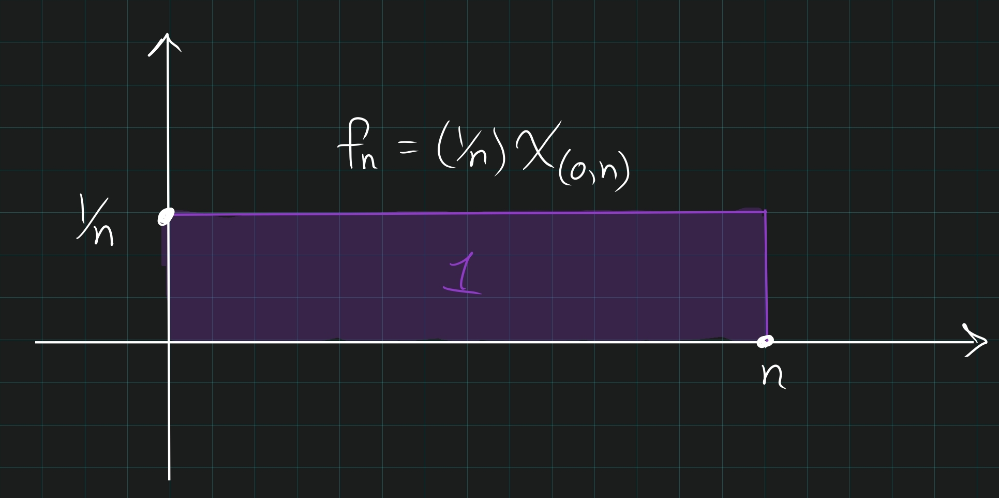
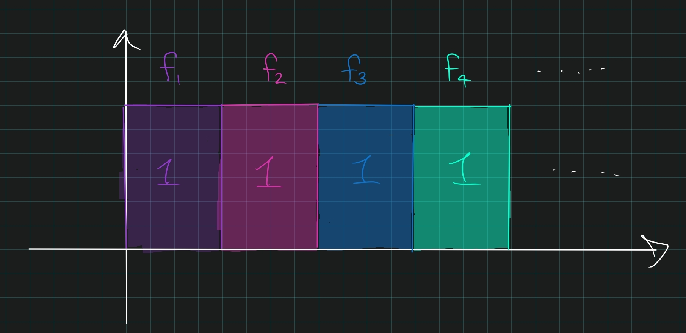
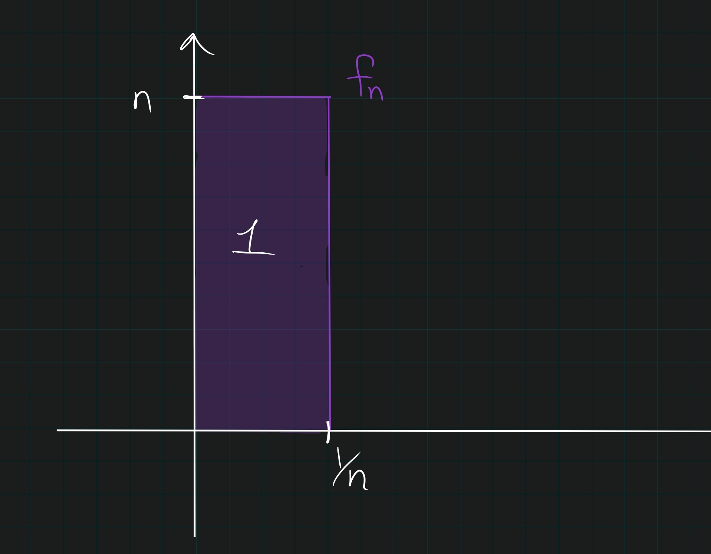
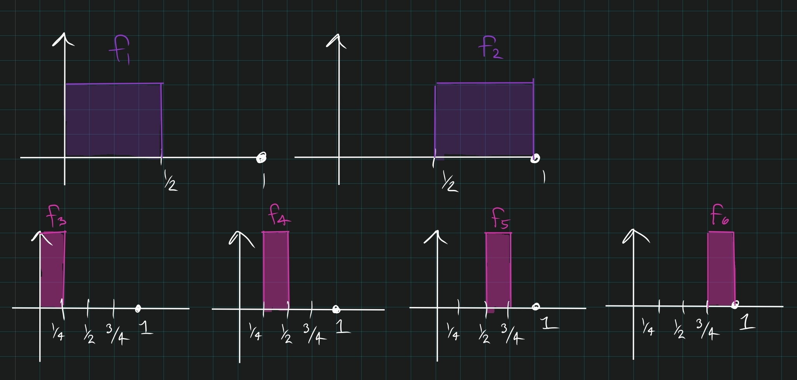

# Thursday September 26th

## $L^1$ and its Convergence Theorems

For any measurable $X \subseteq \RR^n$, we defined 
$$
L^1(X) = \theset{f: X \to \CC \text{ measurable } \suchthat \int_X \abs f < \infty}/ \sim
$$ 
where $f\sim g \iff f = g$ a.e.

> Note that we could talk about $\overline \RR$ valued functions, *but* (theorem) integrable functions can only be finite on a null set. So we can stop considering these altogether if we're just considering $L^1$ functions.

The space $L^1$ is in fact a *normed vector space* with 
$$
\norm{f}_{L^1(X)} \definedas \int_X \abs f
.$$

> Recall that we needed to identify functions because this was only a *seminorm* otherwise, and we only want the zero function to have norm zero.

We say 
$$
f_n \mapsvia{L^1} f \iff \norm{f_n - f}_1 \to 0
.$$

**Convergence Theorems:**

> Mantra: Everything positive and some positivity: MCT. 
More often: DCT.

- **MCT**: 
$$
f_n \in L^+, \quad f_n \nearrow f \text{ a.e. } \implies \lim \int f_n = \int f
.$$
   - Note that it's very important that $f_n \in L^+$

    - **Corollary**: 
  $$
  \sum \int f_n = \int \sum f_n
  .$$ 

- **DCT:**
$$
f_n \in L^1,\quad f_n \to f \text{ a.e. },\quad \abs f_n \leq g \in L^1 \implies \lim \int f_n = \int f
.$$
  
  - **A Stronger statement**: 
  $$
  f_n \mapsvia{L^1} f \quad \text{ i.e. } \int \abs{f_n - f} \to 0
  .$$ 
  The previous statement only gives $\abs{\int f_n - f} \to 0$.
  This follows because 
  $$
  \lim \int \abs{f_n - f} =_{DCT} \int \lim \abs{f_n - f} \to 0
  ,$$
  since $\abs{f_n - f} \leq 2g$.

## Commuting Sums with Integrals

:::{.theorem title="?"}
If

- $f_n \in L^1$, and
- $\sum_n \int \abs f_n < \infty$, 
 
Then $\sum_n f_n$ converges to an $L^1$ function and 
$$
\sum_n \int f_n = \int \sum f_n
.$$
:::

:::{.remark}
Uniform convergences $\implies$ pointwise $\implies$ a.e. convergence, and so think of convergence in norm as *weaker* than all of these (although they are not actually comparable).
:::

:::{.proof title="of theorem"}
By the MCT, we know 
$$
\int \sum \abs f_n =_{MCT} = \sum \int \abs f_n
,$$ which is integrable, and so the first term is integrable as well.

By the homework problem, 
$$
\sum \abs f_n \in L^1 \implies \sum \abs{f_n(x)} < \infty \text{ for almost every } x
.$$
So consider just these $x$ values.

> Note that "$\RR$ is complete" is equivalent to "absolutely convergent implies convergent" for sums.

So for each $x$, $\sum f_n(x)$ converges.
What are the partial sums?
$$
\abs{\sum^N f_j(x)} \leq \sum^\infty \abs{f_j(x)} \quad \forall j,~~a.e.~x.
$$

So let $g_N = \sum^N f_j$, so $g_N$ is dominated by $g \definedas g_\infty$.
Then

\begin{align*}
\int \sum_j^\infty f_j 
&= \int \lim_{n\to\infty} \sum_{j=1}^n f_j \\
&=_{DCT} \lim_{n\to\infty} \sum_{j=1}^n \int f_j \\
&= \sum_{j=1}^\infty \int f_j
.\end{align*}

:::

:::{.remark}
These partial sums are converging a.e., **and in $L^1$**. 
We didn't use this here, but it is important when showing that $L^1$ is complete.
:::

## Different Notions of Convergence

Note that $f_n \to f$ can mean many things:

1. Uniform: $f_n \uniformlyconverges f: \forall \varepsilon ~\exists N \suchthat ~n\geq N \implies \abs{f_N(x) - f(x)} < \varepsilon \quad \forall x.$
2. Pointwise: $f_n(x) \to f(x)$ for all $x$. (This is just a sequence of numbers)
3. Almost Everywhere: $f_n(x) \to f(x)$ for almost all $x$.
4. Norm: $\norm{f_n - f}_1 = \int \abs{f_n(x) - f(x)} \to 0$.

We have $1 \implies 2 \implies 3$, and in general no implication can be reversed, but (**warning**) none of $1,2,3$ imply $4$ or vice versa.

**Examples**:

- $f_n = (1/n) \chi_{(0, n)}$. This converges uniformly to 0, but the integral is identically 1. So this satisfies 1,2,3 and not 4.

  

- $f_n = \chi_{(n, n+1)}$ (skateboard to infinity). This satisfies 2,3 but not 1, 4.

  

- $f_n = n\chi_{(0, \frac 1 n)}$. This satisfies 3 but not 1,2,4.

  

- $f_n:$ one can construct a sequence where $f_n \to 0$ in $L^1$ but is not 1,2, or 3.
  The construction:

  - Break $I$ into $2$ intervals, let $f_1$ be the indicator on the first half, $f_2$ the indicator on the second.
  - Break $I$ into $2^2=4$ intervals, like $f_3$ be the indicator on the first quarter, $f_4$ on the second, etc.
  - Break $I$ into $2^k$ intervals and cyclic through $k$ indicator functions.

  

  - Then $\int f_n = 1/2^n \to 0$, but $f_n\not\to 0$ pointwise since for every $x$, there are infinitely many $n$ for which $f_n(x) = 0$ and infinitely many for which $f_n(x) = 1$.
  - Note that this also converges to 0 in measure.
  

## Comparing $L^1$ Convergence to a.e. Convergence

**Theorem:**
If $f_n \to f \in L^1$, then there is a subsequence $f_{n_k}$ such that $f_{n_k} \to f$ almost everywhere.

> Note: convergence always implies Cauchy, so we'll assume this right away.

Since $f_n$ converges in $L^1$, it is Cauchy in $L^1$, so $\norm{f_n - f_m}_1 \to 0$.

> Note: we want to pick a sequence that is converging *faster* when we construct our subsequence, since that's the obstruction to a.e. convergence.

So there is a subsequence $n_1, n_2, \cdots$ such that $\norm{f_n - f_m} \leq 2^{-k}$ if $n, m \geq n_k$.
Let $g_1 = f_{n_2}, g_k = f_{n_{k+1}} - f_{n_k}$ be the consecutive differences.
Then 

- $\norm{g_{k+1}} \leq 2^{-k}$ for all $k$,
- $f_{n_k} = \sum_{j=1}^{k} g_j$

Thus we want to show that this sum converges almost everywhere to an $L^1$ function. 
So if $\sum_{j=1}^\infty \norm{g_j}_1 < \infty$, we're done.

We have 
$$
\sum \norm{g_j} = \norm{g_1} + \sum_j 2^{-j}
.$$
By the previous theorem, this means $f_{n_k} = \sum^k g_j \mapsvia{a.e.} f$.

We know it converges to *some* $L^1$ function, **but limits are unique**, so this is actually the original $f$. $\qed$

## Completeness of $L^1$

**Theorem:**
$L^1$ is a complete normed space, i.e. **a Banach space**, so every Cauchy sequence in $L^1$ converges to a function in $L^1$.

*Proof:*

> Proofs of completeness tend to go the same way:

> 1. Take a Cauchy sequence $\theset{f_n}$.
2. Find a candidate limit $f$
3. Show that the $f_n$ actually converge to this candidate $f$
4. Show that $f$ is in $L^1$.
  
So suppose $f_n$ is Cauchy.

From the previous theorem, we know a subsequence (all in $L^1$) converges to some limit $f$ in $L^1$.
So let this $f$ be the candidate limit, we just need to show that $\norm{f_n - f}_1 \to 0$.

Let $\varepsilon > 0$ and choose $k$ large enough such that

- $2^{-k} \leq \frac 1 2 \varepsilon$.
- $\norm{f_{n_k} - f}_1 \leq \varepsilon$.

Then
\begin{align*}
\norm{f_n - f}_1 
&\leq \norm{f_n - f_{n_k}}_1 + \norm{f_{n_k} - f}_1 \\
&\leq 2^{-k} + \varepsilon/2 \\
&\leq \varepsilon/2 + \varepsilon/2 = \varepsilon
.\end{align*}

$\qed$
