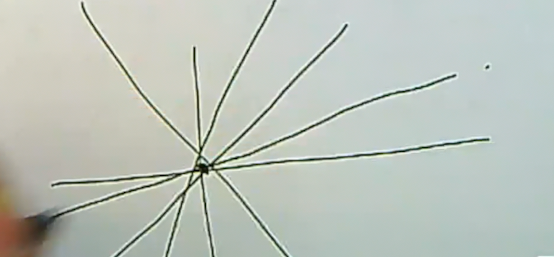

# Lecture 5: Places

:::{.definition title="Affine Domain"}
An **affine domain** $R$ over a field $k$ is a domain that is finitely generated as a $k\dash$algebra.
:::

## Investigating the Set of Places

We saw an interesting example of a function field in more than one variable which showed that valuations of rank larger than 1 can arise, but this does not happen for one variable function fields.
That is, for $K/k$ of transcendence degree 1, all valuations on $K$ which are trivial on $k$ are discrete.
We'll now want to go farther and describe the places $\Sigma(K/k)$, which will be the set of points on an algebraic curve.
Scheme-theoretically, this will literally be the set of closed points on a certain projective curve whose function field is $K$.
Note that a priori, finding closed points on a curve over an arbitrary field is hard!

Recall that if $A$ is a Dedekind domain such that $\ff(A) = K$, then for all $\mathfrak{p}\in \mspec(A)$ there exists a discrete valuation $v_p$ on $K$.
I.e., every maximal ideal induces a discrete valuation that is $A\dash$regular, so the valuation ring will contain $A$.
How is this obtained?
Take a nonzero $x\in K\units$, and take the corresponding principal fractional ideal $\gens{x} \da Ax$, which we can factor in a Dedekind domain as $Ax = \prod_{\mathfrak{p} \in \mspec(A)} \mathfrak{p}^{\alpha_{\mathfrak{p}}}$ with $\alpha_{\mathfrak{p}} \in \ZZ$.
This looks like an infinite product, but for any fixed $x$, only finitely many $\alpha$ are nonzero.
Note that these $\alpha$ are exactly what we're looking for: the $\mathfrak{p}\dash$adic evaluation of $x$ is given precisely by $v_{\mathfrak{p}}(x) \da \alpha_{\mathfrak{p}}$, where we are using unique factorization of ideals in Dedekind domains.
Thus we have a map
\[  
v_{\wait}: \mspec(A) &\to \Sigma(K/A) \\
\mathfrak{p} &\mapsto v_{\mathfrak{p}}
.\]

So this sends a maximal ideal to a place that is $A\dash$regular, and it turns out to be a bijection.

:::{.proposition title="?"}
The map $v$ is a bijection, and thus we may write
\[  
\Sigma(K/A) \cong \mspec(A)
.\]
:::

:::{.proof title="?"}
:::{.claim}
$v$ is injective.
:::
If $\mathfrak{p}_1, \mathfrak{p}_2 \in \mspec(A)$ are two different maximal ideals.
Then there exists an element $x\in \mathfrak{p}_1 \sm \mathfrak{p}_2$, and so $x^{-1} \in A_{\mathfrak{p}_2} \sm A_{\mathfrak{p}_1}$.
This follows since if $x$ is not in $\mathfrak{p}_2$, its $\mathfrak{p}_2\dash$adic valuation is zero, and thus the $\mathfrak{p}_2\dash$adic valuation of $x^{-1}$ is $-0 = 0$ as well.
On the other hand, since $x\in \mathfrak{p}_1$, its $\mathfrak{p}_1\dash$adic valuation is positive and therefore $v_{\mathfrak{p}_1}(x^{-1}) < 0$ and $x^{-1}$ is not in $A_{\mathfrak{p}_1}$.

:::{.claim}
$v$ is surjective.
:::
Let $v\in \Sigma(K/A)$, so $A \subset R_v$, i.e. take a valuation whose valuation ring contains $A$.
Note that we're not assuming the valuation is discrete, this can be a general Krull valuation, but we're trying to show it's equal to a certain $p\dash$adic valuation.
As always with a subring of a valuation ring, we can pull back the maximal ideal and consider $\mathfrak{m}_v \intersect A \in \spec(A)$.
We're hoping that this is a maximal ideal, since maximals correspond to valuations.
Since we're in a Dedekind domain, the only prime ideal we *don't* want this to be is the zero ideal of $A$, so suppose it were.
Then $A\nonzero \subset R_v\units$, and so $K\units \subset R_v\units$.
This is because the only element of the maximal ideal that lies in $A$ is zero, so every nonzero element of $A$ is not in this maximal ideal and is thus a unit.
But for any unit, its inverse is also a unit, yielding the inclusion $K\units \subset R_v\units$.
The only way this could possibly happen is if $R_v = K$, which yields the trivial valuation ring.
However, by definition, in $\Sigma(K/A)$ we've excluded the trivial valuation, so this ideal can not be zero.
\

So we can conclude that the pullback $\mathfrak{m}_v \intersect A \in \mspec(A)$, and so $A_{\mathfrak{p}} \subset R_v$.
This is from viewing elements in $A_{\mathfrak{p}}$ as quotients of elements in $A$ whose denominator have $\mathfrak{p}\dash$adic valuation zero.
Recall that we want to show that $R_v = A_{\mathfrak{p}}$.
We know $R_v \subset K$ is a proper containment, and we can use the fact that a *discrete* valuation ring is maximal among all proper subrings of its fraction field.
In other words, for $R$ a DVR, there is no ring $R'$ such that $R \subset R' \subset \ff(R)$.
How do you prove this?
This is similar to an early exercise in commutative algebra, where we looked at all rings between $\ZZ$ and $\QQ$, which generalized to looking at all rings between a PID and its fraction field, and a DVR is a local PID.
So proving this statement is actually easier.
\

This is enough to show that $A_{\mathfrak{p}} = R_v$, and this $v\sim v_{\mathfrak{p}}$.
:::

:::{.remark}
What the idea?
For a general one variable function field $K/k$, we'll produce affine Dedekind domains $R$ with $k \subset R \subset K$ and $\ff(R) = K$.
This will give is subrings of this full ring of places that are $\mspec$ of Dedekind domains.
How many such domains will we need for their union to be the entire set of places?
Just one won't work, since $\Sigma(K/k)$ is like a complete or projective object, and a projective variety of dimension 1 can't be covered by a single affine variety.
However, it turns out that you can always cover it with 2.
In fact, if you take any Dedekind domain between $k$ and $\ff(K)$, the set of missing places (the ones that aren't regular for any of these domains) will be a nonempty finite set of places.
So you can always cover it by finitely many, and two suffices: as a consequence of the Riemann-Roch theorem, after removing any nonempty finite set of places, you'll have the $\mspec$ of a canonically associated Dedekind domain.
We'll prove this by starting with the case of $K = k(t)$.
:::

:::{.claim}
\[  
\abs{ \Sigma(k(t)/k) \sm \mspec k[t] } = 1
.\]
:::

:::{.question}
Note that $k \subset k[t] \subset k(t)$ and $k[t]$ is a Dedekind domain, so this fits into the above framework, and moreover we know the maximal ideals of polynomial rings: irreducible monic polynomials.
Taking all of these misses exactly one place.

How do we describe this missing place?
:::

## Describing the Missing Place

Suppose $v \in \Sigma(k(t) / k) \sm  \Sigma(k(t) / k[t])$, so the valuation ring of $v$ contains $k$ but does not contain $k[t]$.
Then the valuation ring can not contain $t$, and thus $v(t) < 0$ and $v(1/t) = -v(t) > 0$.
Since $k[1/t]$ is a PID, so if the valuation wasn't $t
dash$regular, it's $1/t\dash$regular by definition.
So $v\in \Sigma(k(t) / k[1/t])$.
Note that $k[1/t] \cong k[t]$ as rings.
How many valuations on this polynomial ring give positive valuation to $1/t$? 
Exactly one, since this corresponds to a prime ideal, namely $\gens{1/t}$, so this unique valuation is $v = v_{1 \over t}$, the $1/t\dash$adic valuation.

That is, if we write $f\in k(t)$ as $(1/t)^n a(1/t)/b(1/t)$ with $a, b\in k[t]$ polynomials with nonzero constant terms, then $v_{1\over t}(f) = n$.
Note that this process is the same as the one used to compute the $t\dash$adic valuation $v_t$.

Recall that a valuation on a domain can be uniquely extended to its fraction field by setting $v(x/y) = v(x) - v(y)$.

:::{.exercise title="?"}
Define $v_\infty: k(t)\units \to \ZZ$ by $p(t)/q(t) \mapsto \deg q - \deg p$.

a. Show $v_ \infty \in \Sigma(k(t) / k[1/t])$.

b. Show $v_ \infty \sim v_{1\over t}$ by showing they have the same valuation ring.

c. Show that $v_ \infty = v_{1\over t}$.

::: 

Note that $1/t$ is a uniformizer for $v_ \infty$

:::{.theorem title="Complete description of places"}
\[  
\Sigma(k(t) / k) = \mspec k[t] \disjoint \ts{v_ \infty}
.\]
:::

Note that we know the maximal ideals -- the irreducible monic polynomials -- but it takes some effort to write them down.
If $k$ is algebraically closed, however, every such polynomial is linear of the form $t-\alpha$ for $\alpha\in k$.
In this case, $\mspec k(t) \cong k$, and so $\sigma( \bar k (t) / \bar k) = \bar k \disjoint \ts{\infty} = \PP^1(\bar k)$.
More generally, the set of places on a rational function field will yield the scheme-theoretic set of closed points on the projective line over $k$, which is more complicated if $k\neq \bar k$ since not all closed points are $k\dash$rational.
Another way to say this is that if you have a valuation, there is a residue field, and for any place on a one variable function field the residue field will be a finite degree extension of $k$.
The degree 1 points will be the $k\dash$rational points, and so $\Sigma(k(t) / k)$ will always contain a copy of $k$ but may have closed points of larger degree, making things slightly more complicated.
This complication is handled well in both the scheme-theoretic and this valuation-theoretic approach.

## Finite Generation in Towers

The next theorem is a fact from commutative algebra:

:::{.theorem title="?"}
Let $A$ be a domain with $\ff(A) = K$.
Suppose $A$ is a finitely generated $k\dash$algebra, let $L/K$ be a finite degree field extension, and let $B$ be the integral closure of $A$ in $L$.
Then

a. $B$ is finitely generated as an $A\dash$module.[^second_normalization_theorem_ref]

[^second_normalization_theorem_ref]: See CA notes, "Second Normalization Theorem", where normalization is a more geometric synonym for integral closure.

b. $B$ is an integrally closed domain with $\ff(B) = L$ which is finitely generated as a $k\dash$algebra.

c. $\dim A = \dim B$[^Krull_dim_note]

[^Krull_dim_note]: Krull dimension, i.e. the supremum of lengths of chains of prime ideals.

d. If $A$ is Dedekind, so is $B$.

:::

:::{.proof title="?"}
See Pete's CA notes sections 18 and 14.
:::

:::{.remark}
On why these should be true: we have a NTI square

\begin{tikzcd}
	{B} && {L} \\
	\\
	{A} && {K} \\
  \\
  {k} && {} 
	\arrow[from=3-1, to=1-1, hook]
	\arrow[from=3-3, to=1-3, hook]
	\arrow[from=1-1, to=1-3, hook, "\subset"]
	\arrow[from=3-1, to=3-3, hook, "\subset"]
  \arrow[from=5-1, to=3-1, hook]
\end{tikzcd}

We have a domain $A$ with a fraction field $K$, we take a finite degree extension $L/K$, and to complete the square we let $B$ be the integral closure of $A$ in $L$: the collection of elements in $L$ satisfying monic  polynomials with coefficients in $A$.
\

In our case, we're additionally assuming that $A/k$ is finitely generated as a $k\dash$algebra.
:::

:::{.remark}
\envlist
On (b): $B$ being finitely generated as a $k\dash$algebra follows from assuming $A$ is, and additionally that $B$ is finitely generated as an $A\dash$module, and finite generation as a module provides finite generation as an algebra.
The result follows from transitivity of finite generation of algebras.

On (c): This is just a property of integral extensions.

On (d): Use the characterization of being Noetherian, integrally closed, and Krull dimension 1.
The only thing to check is that $B$ is Noetherian, which follows from $B$ being finitely generated as a $k\dash$algebra and applying the Hilbert basis theorem.
:::

:::{.remark}
Note that we are not assuming that $L/K$ is separable, which is an assumption that would simplify things.
By the Krull-Akuzuki theorem, $B$ will always be a Dedekind domain, but it need not be finitely generated over $A$.
So the "stem" to $k$ is grounding the situation: it's not just a Dedekind domain, but rather an *affine* domain: a domain that is finitely generated over a field.
Note that this is much better than an arbitrary Dedekind domain!
:::

## Regularity Lemma

:::{.proposition title="Regularity Lemma" ref="lemma:regularity"}
Suppose that instead of $K = \ff(A)$, we instead have $A \subset K$ an arbitrary subring, and $L/K$ a finite extension.
Taking the integral closure $B$ yields another NTI square:

\begin{tikzcd}
B\ar[r, "\subset", hook] & L \\
A\ar[r, "\text{subring}", hook]\ar[u, hook] & K \ar[u, hook]  
\end{tikzcd}

Suppose we have an upstairs valuation $v$ on $L$.
Then it makes sense to restrict valuations to subfields, so
\[  
v\in \Sigma(L/B) \iff \ro{v}{K} \in \Sigma(K/A)
.\]
So the original valuation is $B\dash$regular iff the restricted valuation is $A\dash$regular.
::: 

:::{.proof title="?"}
$\impliedby$:
Since $A \subseteq B$, being $B\dash$regular implies being $A\dash$regular.
\

$\implies$:
Suppose $A \subset R_v$ and $x\in B$, and choose $a_0, \cdots, a_{n-1} \in A$ such that
\[  
p(x) \da x^n + a_{n-1}x^{n-1} + \cdots + a_1 x + a_0 = 0
.\]
We can do this precisely because $B$ is integral over $A$.
So we have an integral relation for $x$, and we want to show $v(x) < 0$ and derive some contradiction from the fact that $v(a_i) \geq 0$.
Note that we aren't grounded to the base field here, so this valuation may not be discrete and is rather some arbitrary Krull valuation.
\

If $x\not \in R_v$, then $v(x) < 0$, and we can thus write
\[  
v(x^n) < \min \ts{ v(a_j x^j) \st 0\leq j \leq n-1 } \leq v(p(x))
.\]
This follows because the first term is $nv(x)$, and so the next term can only be *less* negative since $v(a_j) > 0$.
But this is a contradiction, since we know $v(x^n) = v(- \sum_{j=0}^{n-1} a_j x^j)$, and we've exhibited two elements that differ by a unit ($u=-1$) which have different valuations.
:::

Next, let $K/k$ be a one variable function, we want to give a nice description of its places.
We already described the places of a *rational* function field, and we know we can write the former function fields as finite degree extensions of the latter.
Choosing a transcendental $t\in K$, to $K/k(t)$ is a finite extension, restricting evaluations gives a map
\[  
r: \Sigma(K/k) \to \Sigma(k(t)/ k)
.\]

:::{.claim}
This is surjective with finite fibers, so it acts like a branched covering map.
:::

This follows from NTI or NTII.
The NTI method is taking an extension of Dedekind domains, taking a prime ideal downstairs, and pushing it forward to see how it factors upstairs.
The NTII method is a field with a valuation and an extension of the field and you try to figure out how many ways the downstairs valuation can be extended.
If the valuations are discrete, these are the same problem.

## An Inequality on Degrees

:::{.theorem title="Degree Inequality (NTII, 1.3)"}
Let $K$ be a field with $v$ a rank one valuation with valuation ring $R$.
Let $L/K$ be a finite extension of degree $n$.
Then the set of valuations on $L$ extending $v$ is finite and nonempty, say $\ts{w_1, \cdots, w_g}$.

For $1\leq i \leq g$, define
\[  
e_i(L/K) &\da \abs{ w_j (L\units) \over v(K\units) }  && \text{ramification index} \\
f_i(L/K) &\da [R_{w_i}/\mathfrak{m}_{w_i} : R_v/ \mathfrak{m}_v] && \text{residual degree}
,\]
so $e_i, f_i \in \ZZ{>0}$.
Then

a. We have a useful inequality:
\[  
\sum_{i=1}^g e_i(L/K) f_i(L/K) \leq [L: K] = n
.\]

b. If $v$ is discrete[^it_will_be] and the integral closure $S$ of $R$ in $L$ is finitely generated as an $R\dash$module, then this is an equality.

[^it_will_be]: It will be discrete in our case.
Note that this finiteness condition always holds if $L/K$ is separable.

:::

:::{.remark}
Note that a valuation can be extended in at least one way over *any* field extension, finite or not.
For finite extensions, there's a more precise statement involving completing and taking a tensor product, then identifying number of valuations with the size of some $\mspec$ over a finite-dimensional algebra over the field.

NTII shows that $e_i$ is a finite number by looking at the exponent of the pushforward.
Also note that we view $\mathfrak{m}_{w_i}$ as an ideal lying over $\mathfrak{m}_v$, and there is an inclusion of residue fields $R_v/\mathfrak{m}_v \injects R_{w_i} / \mathfrak{m}_{w_i}$ which is in fact a finite degree field extension.
:::

:::{.remark}
Part (a) already shows that $r$ is surjective with fibers of cardinality at most $[L: K]$, but we want equality.
We claim is always holds when $K/k$ is a one variable function field and $v\in \Sigma(K/k)$.
There are examples where the inequality is strict, however.
In our situation, it's not just an arbitrary extension, we have the aforementioned affine "grounding" phenomenon, and all of these DVRs are going to be localizations of affine Dedekind domains.
This is the key fact: arbitrary extensions of Dedekind domains are nowhere near as nice as those where the bottom one is finitely generated over a field.

:::

:::{.proof title="First step"}
We have a discrete valuation $v$ on $K$, so let $t$ be a uniformizing element[^uniformizer] for $v$.
Then the argument is that any such uniformizer $t$ is transcendental over $k$.
We'll do this by arguing $t\not\in k$ and then that $t$ is not algebraic over $k$ either.

Since we're assuming $v$ is $k\dash$regular, $t\in k \implies 1/t\in k$ and so $v(1/t) \geq 0$, since every element in $k$ should have nonnegative valuation.
But we're supposed to have $v(t) = 1$ by definition of being a uniformizer, so $t$ can not be in $k$.

Suppose that $t$ is algebraic over $k$, then $k(t)/k$ is an integral extension, since we're adjoining one algebraic element. 
By the previous proposition we have that $v$ is $k(t)\dash$regular, since being regular is preserved by integral extensions.
But now rerunning the argument in the previous paragraph shows that this is a contradiction: being $k(t)\dash$regular would force $v(1/t) \geq 0$, but we'd still need $v(1/t) = -1$.

So $t$ is transcendental over $k$, and $k[t]$ is a polynomial ring.

[^uniformizer]: An element of valuation one.

:::

:::{.proof title="Second step"}
Let 

- $A$ be the integral closure of $k[t]$ in $K$, and
- $B$ be the integral closure of $k[t]$ in $L$.

Instead of a NTI square, we'll have the following 3-step diagram:
\begin{tikzcd}
k[t] \ar[d, hook, "\subset"] \ar[r, hook, "\subset"] & A\ar[d, hook, "\subset"] \ar[r, hook, "\subset"] & B\ar[d, hook, "\subset"] \\
k(t) \ar[r, hook, "\subset"] & K\ar[r, hook, "\subset"] & L \\
\end{tikzcd}

So $A$ is a Dedekind domain with $\ff(A) = K$, as is $B$ with $\ff(B) = L$, making both $A$ and $B$ finitely generated $k[t]\dash$modules.
Why?
This comes from the theorem of finiteness of integral closure when the downstairs domain is grounded to a field.
Since $k[t]$ is finitely generated as a $k\dash$algebra, this finiteness applies, which tells us that $A$ finitely generated as a $k[t]\dash$module, as is $B$.
But if $B$ is finitely generated as a $k[t]\dash$module and $A\supseteq k[t]$ is an even larger ring, then $B$ is finitely generated as an $A\dash$module (potentially with fewer generators).

Thus $B$ is a finitely generated $A\dash$module, and $v$ is $k[t]\dash$regular since $t$ was a uniformizing element, making $v$ regular on both $k$ and $t$ and thus $k[t]$.
Then $v$ is also $A\dash$regular by the proposition, and thus $v = v_{\mathfrak{p}}$ for some $\mathfrak{p}\in \mspec(A)$ coming from our classification of $A\dash$regular valuations on a Dedekind domain.

So the valuation on $K$ is just the $\mathfrak{p}\dash$adic valuation on this Dedekind domain.
This means there is an equality of valuation rings $R = A_{\mathfrak{p}}$[^localization_at_p], the valuation ring of the Dedekind domain.
So we now consider $S$, the integral closure of $R$ in $L$.
This is a NTI situation, but the downstairs Dedekind domain is a DVR, so it's local downstairs.
We thus have compatibility between integral closure and localization in the form of $S = B_{\mathfrak{p}} = B \tensor_A A_{\mathfrak{p}}$.
This comes from taking the whole integral closure $B$, and only looking at the primes lying over $\mathfrak{p}$.
Base change preserves finite generation, and we know that $B$ was finitely generated as an $A\dash$module, so $S$ is finitely generated as an $A_{\mathfrak{p}}\dash$module and equality holds.

[^localization_at_p]: This is the localization at $\mathfrak{p}$.

:::

:::{.remark}
If $A_{\mathfrak{p}}$ was a *complete* DVR, as opposed to just some localization of an affine domain, $B$ will be a semilocal Dedekind domain and thus a PID, and again the number of primes it has will be the number of primes in the original Dedekind domain lying over the fixed prime $\mathfrak{p}$.
:::

:::{.remark}
We're not really using valuation theory here, and this could have been phrased purely in NTI language.
But even then, the degree inequality for extensions of Dedekind domains needs finite generated of the Dedekind domain as a module over the bottom Dedekind domain to ensure equality.
You'd need a suitably algebraic text that considers not necessarily separable $L/K$, and you really do want finite generation of $B$ over $A$ to make this work.
See Dino Lorenzini's textbook!
:::

:::{.exercise title="?"}
Let $K/k$ be a one variable function field, and show that the cardinality of the set of points is given by
\[  
\abs{\Sigma (K/k)} = \abs{\ts{ \text{monic irreducible polynomials } p \in k[t] }}  = \max( \abs{k}, \aleph_0 )
.\]
:::

:::{.remark}
If you know that $r$ is surjective with finite fibers, where the image is infinite (which it is here), the domain should be infinite of the same cardinality by an easy set-theoretic exercise.
Note that using Möbius inversion, over a finite field there is at least one irreducible polynomial of every degree, and finitely many of a fixed degree.
So the cardinality is $\aleph_0$ when $k$ is a finite field.
If we took a one variable function field over $\CC$, we would get the cardinality of the continuum.
In this case, $\Sigma(K/k)$ really is the set of points on some compact Riemann surface, although the Zariski topology will be too coarse to coincide with the induced Euclidean topology.
:::

:::{.remark}
Note that affine Dedekind domains are important for us because every finitely generated field extension of $k$ are precisely the fraction fields of affine domains over $k$, where the transcendence degree of the function field equals the Krull dimension of the affine domain.
We're especially interested in affine domains of dimension 1 over $k$.
We established something particularly important in this proof:
:::

## Affine Grounding and Residue Fields

:::{.lemma title="Affine Grounding"}
Let $K/k$ be a one variable function field and $v\in \Sigma(K/k)$ be a place on that function field.
Then there exists an affine Dedekind domain $A$ with $\ff(A) = K$ and a maximal ideal $\mathfrak{p}\in \mspec(A)$ such that $R_v = A_{\mathfrak{p}}$.
:::

Thus we should think of the set of places as the $\mspec$ of finitely many affine Dedekind domains glued together.
For each point (place), the basic open set around that point is the affine Dedekind domain.

:::{.corollary title="?"}
For $v \in \Sigma(K/k)$, define the **residue field** of the local ring $R_v$ as $k(v) \da R_v / \mathfrak{m}_v$.
Then $k(v)/ k$ is a finite degree extension.
:::

:::{.proof title="of corollary"}
If $R$ is a domain with maximal ideal $\mathfrak{p}$, then the quotient map factors through the localization, giving $R/\mathfrak{p} = R_{\mathfrak{p}} / \mathfrak{p} R_{\mathfrak{p}}$:[^comm_algebra_std_fact]

\begin{tikzcd}
R \ar[r]\ar[dr] & R_{\mathfrak{p}}\ar[d] \\
 & R/\mathfrak{p}
\end{tikzcd}

So by affine grounding, $k(v)$ is also $A/\mathfrak{p}$ where $A$ is an affine Dedekind domain and $\mathfrak{p}\in \mspec(A)$.
This is Zariski's lemma[^Zariskis_lemma] : we showed that $k(v) \cong A/\mathfrak{p}$, where $A$ is a finitely generated algebra and thus so are its quotients.
Thus $k(v)$ is not just finitely generated as a field extension, but also as a $k\dash$algebra, making $k(v)/k$ a finite extension.

[^comm_algebra_std_fact]: This is a truly standard fact from commutative algebra.

[^Zariskis_lemma]: A field extension that is finitely generated as an algebra is necessarily a finite degree extension.

:::

:::{.definition title="Degree of a Place"}
The **degree** of $v\in \Sigma(K/k)$ is $[k(v) : k] \in \ZZ^{\geq 0}$.
:::

We are especially interested in degree 1 places, i.e. those for which the residue field is equal to $k$ itself, so we denote these by $\Sigma_1(K/k)$.
In any other course, we'd call this $C(k)$, the rational points on the associated curve.

:::{.exercise title="Some motivation"}
Let $f\in k[x, y]$ be irreducible, so that $A \da k[x, y] / \gens{f}$ is a 1-dimensional affine domain[^not_nec_dedekind].
As above, the resude fields of maximal ideals are finite extensions of $k$.
Show that there is a correspondence
\[  
\correspond{\text{ Maximal ideals } \\ \mathfrak{p} \in \mspec(A)}
&\iff
\correspond{(x, y) \in k\cross k \st f(x, y) = 0}
.\]

[^not_nec_dedekind]: This may not necessarily be a Dedekind domain, since it need not be integrally closed.

:::

:::{.remark}
Note that the polynomial above may not define a smooth geometry, there may instead be singular points:

These singular points are what stops $A$ from being integrally closed, which is literally true when $k$ is a perfect field.

:::

Whereas $\Sigma(K/k)$ is always infinite, $\Sigma_1(K/k)$ may be finite or even empty.
When $k = \QQ$, it may in fact be empty "most of the time"
When $k = \QQ$, it may in fact be empty "most of the time".

:::{.exercise title="?"}
For all $v\in \Sigma(K/k)$, the degree of the point $\deg(v)$ will be divisible by $[\kappa(K) : k]$.
Thus if $\kappa(L) \supsetneq k$, then $\Sigma_1(K/k) = \emptyset$.[^degree_big]

[^degree_big]: Use the fact that the degree will be bigger than 1 when the constant field is bigger than $k$.

:::

Note that before we were writing the residue field as an extension of $k$, and it's worth checking that the constant subfield embeds as a subfield of the residue field as well.

:::{.remark}
There is a tie to CM points on modular curves: if you have a function field over $\QQ$ which is not regular due to some proper algebraic subextension, the residue fields of all of the points on the curve will contain the algebraic closure of the field of definition.
Pete had some $\QQ(X_n)$ function field, whose constant subfield was $\QQ(\zeta_n)$ (adjoining the $n$th roots of unity), and none of these modular curves over $\QQ$ have closed points except when the residue fields contain $\QQ(\zeta_n)$.
:::

:::{.remark}
This is a way for there to not be points on the curve, so $\Sigma_1(K/k)$ is empty, but it's not the deepest reason -- this is a cheap trick to produce "pointless" function fields.
It can fail to have degree 1 places in many different ways!
:::

:::{.exercise title="?"}
Show that for for a one variable function field $K/k$ TFAE:

1. Every $v\in \Sigma(K/k)$ has degree 1,

2. $k$ is algebraically closed.

:::

:::{.remark}
One half is easy, since by definition the degree of the residue field is the degree of some finite extension of the base field, but if $k$ is algebraically closed, the degree of any finite extension is one.
:::

:::{.exercise title="?"}
For a field $k$, set $\PP^1(k) \da \PP(k^2)$, the projectivization of $k\cross k$, i.e. the lines through the origin in $\AA^2/k$.
By taking slopes of lines, $\PP^1(k) = k \disjoint \ts{\infty}$.

{width=350px}

Show that $\Sigma_1(k(t)/k) = \PP^1(k)$, and deduce that
\[  
\Sigma(k(t)/k) = \PP^1(k) \iff k = \bar k
.\]
:::

Next up we'll talk about how the set of places is built from affine Dedekind domains.
After this, we'll be ready for chapter 2: divisors and Riemann-Roch.
