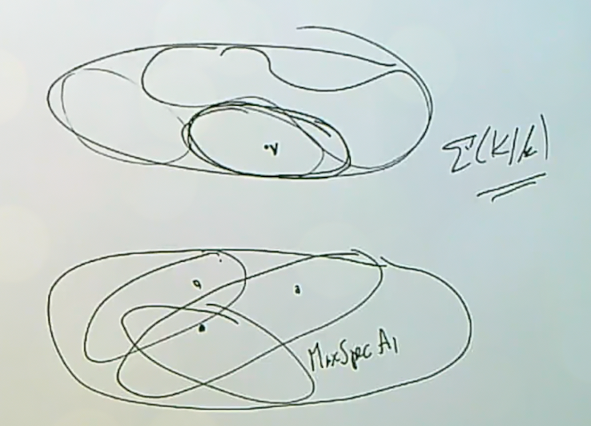
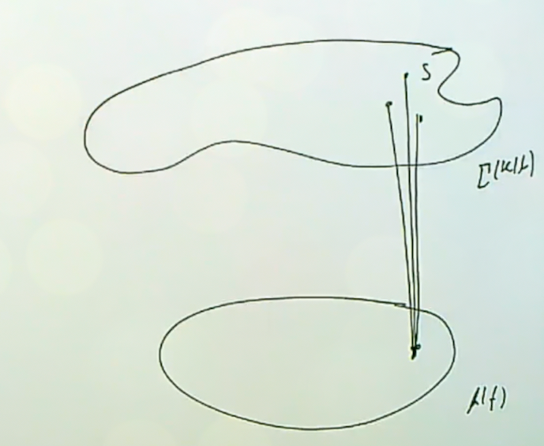

# Lecture 6: Affine Domains and Places $\Sigma(K/k)$

The aim of this lecture is to explain the difference (including some technicalities) between $\Sigma(K/k)$ and affine Dedekind domains $R$ such that $K = \ff(R)$.

Recall that

- An **affine domain** over a field $k$ is a domain that is finitely generated as a $k\dash$algebra,[^rich_but_easy]

- An **affine Dedekind domain** is an affine domain that is also a Dedekind domain, so it is integrally closed and of Krull dimension 1,

- An **affine $k\dash$order** is a one-dimensional affine domain. [^order_is_noetherian]

[^order_is_noetherian]: These will be Noetherian by the Hilbert basis theorem, but may not be integrally closed.

[^rich_but_easy]: These are very rich but easier to understand: take a polynomial ring in finitely many variables and mod out by a prime ideal.

:::{.example title="?"}
If $f \in k[x, y]$ is irreducible, then $k[x, y]/\gens{f}$ is an affine $k\dash$order. 
It is an affine Dedekind domain if $f$ is *nonsingular* over $k$, i.e. for all $a, b\in \bar k$ such that $f(a, b) = 0$, the usual partial derivatives in the sense of Calculus $\dd{f}{x}$ and $\dd{f}{y}$ do not simultaneously vanish at $(a, b)$.
This is a sufficient condition, although it's not far from being necessary as well.
:::

:::{.remark}
Let $A/k$ be an affine Dedekind domain such that $\ff(A) = K$.
Then $\mspec(A) = \Sigma(K/A) \injects \Sigma(K/k)$.
This follows because $\Sigma(K/A)$ are the valuations that are not just regular on $k$, but also on $A$, (i.e. $A\dash$regular valuations) so the valuation ring contains the entirety of $A$.
It's thus natural to ask what its complement is, i.e. those valuations which are not regular on $A$ and give its elements negative valuation.
So define
\[  
\Sigma(A, \infty) \da \Sigma(K/k) \sm \Sigma(K/A)
,\]
the set of places at infinity with respect to $A$.

:::

:::{.example title="?"}
$\Sigma(k[t], \infty) = \ts{v_ \infty}$, which is the infinite place, so the terminology at least matches up!
:::

:::{.proposition title="Key"}
For any affine Dedekind domain $A$, $\Sigma(A, \infty)$ is finite and nonempty.
:::

:::{.remark}
This is striking!
This says that one affine Dedekind domain is giving almost all of this infinite set of places, but never all of it.
:::

:::{.proof title="?"}
By Noether Normalization [^noether_note]

there exists a $t\in A$ that that $A$ is a finitely generated (and thus integral) $k[t]\dash$module, and $A$ is the integral closure of $k[t]$ in $K$.
Why must this be the integral closure?
Any ring finitely generated over a subring will be an integral extension, and $A$ is a Dedekind domain and thus integrally closed.
So let
\[  
r: \Sigma(K/k) \to \Sigma(k(t)/k)
\]
denote the restriction map; then by the regularity property we established in \cref{lemma:regularity}, we have
\[  
\Sigma(K/A) = r^{-1}\qty{\Sigma(k(t)/k[t])}
.\]
Why?
A valuation upstairs in the NTI square is regular with respect to the integral extension upstairs iff it's regular with respect to the ring it is the integral extension *of*.
So regularity is preserved both ways by integral extensions.
This means you can check regularity either upstairs or downstairs, allowing us to identify the above preimage.

This means that the places where are *not* $A\dash$regular upstairs are precisely those which are not $k[t]\dash$regular downstairs, and so we have
\[  
\Sigma(A, \infty) = r^{-1}\qty{\Sigma(k[t], \infty)} = r^{-1}(v_ \infty)
,\]
since we now there is exactly one such non-regular valuation.
But we showed that $r$ was surjective with finite nonempty fibers, so we're done since our set is one of the fibers.

[^noether_note]: This says that if you have an affine domain $R$ of a certain Krull dimension, then it is finitely generated as a module over a subring which is a polynomial ring in $\trdeg(R)$ variables.
This is like a stronger integral version of taking a finitely generated field extension and writing it as a finite degree field extension of a purely transcendental extension.

:::

:::{.remark}
Thus is $K/k$ is a one variable function field and $A$ is an affine Dedekind domain with fraction field $K$, then $\Sigma(K/k) = \mspec(A) \disjoint S$ where $S$ is finite and nonempty.
Earlier we saw by affine grounding that for each $v\in \Sigma(K/k)$ there exists an affine Dedekind domain $A$ with $v\in \Sigma(K/A)$, and thus $\Sigma(K/k)$ admits a *finite* covering by $\mspec$ of affine Dedekind domains.
The picture of what's happening is that we have $\Sigma(K/k)$ which is quasicompact with respect to the Zariski topology, which contains many $\mspec$, at least one of which contains $v$.
Note that these $\mspec(A_j)$ for affine Dedekind domains $A_j$ is literally an open cover in this topology.
But the open sets are so large that they all have finite complement.
However, this means that instead of just an arbitrary open covering, one can choose a finite open covering: one $\mspec(A_j)$ will cover all but finitely many, and we can always find at least one $\mspec(A_{j'})$ covering all of the remaining points.

It will in fact turn out that we only need **two** domains to cover everything.
:::

:::{.definition title="Holomorphy Rings"}
For a set $S \subseteq \Sigma(K/k)$, define the **holomorphy** ring as
\[  
R^s \da \Intersect_{v\in \Sigma(K/k)\sm S} R_v
.\]
::: 

:::{.remark}
This is the intersection of a bunch of valuation rings, so this contains elements that are simultaneously regular for this subset of valuations.
If $S \subseteq S'$, then $R^S \subseteq R^{S'}$, due to the fact that we're taking complements and $\Sigma(K/k) \sm S \supset \Sigma(K/k)\sm S'$, so we're removing bigger sets and thus intersecting over fewer things.
This can be thought of as relaxing some regularity conditions.
:::

:::{.remark}
How to think about holomorphy rings: if you take $S = \emptyset$, you intersect over all $R_v$ and obtain $R^\emptyset = \kappa(k)$.
You get a field that is algebraic over $k$, so it's very small compared to the other types of field extensions that arise.
We'll see that this is "unrepresentably" small.
:::

:::{.exercise title="Every affine Dedekind domain is a unique holomorphy ring"}
If $A$ is an affine Dedekind domain with fraction field $k$, then
\[  
A = R^S 
= \Intersect_{v\in \mspec(A)} R_v
&& S = \Sigma(K/k) \sm \mspec(A)
.\]

:::

:::{.remark}
This is a fact for any Dedekind domain, which is the intersection over all of its DVRs.
You obtain the integral closure for a Dedekind domain by intersecting all of the valuation rings, but here it is already integrally closed.
Its tautological that $A \subset R^S$ here, so $R^S$ is an *overring* of a Dedekind domain:  for $R$ a domain, an **overring** is any ring $T$ such that $R \subseteq T \subseteq \ff(R)$.
When $R$ is a PID, the overrings are in bijective correspondence with subsets of prime ideals (prime elements mod associates), so you get all overrings by inverting such subsets.
For Dedekind domains it's more complicated.
Can we classify all overrings of $R$ when it is a Dedekind domain?
The answer will eventually be yes.
Under what condition is every overring a localization?
When the class group is torsion.
What are the relationships between the class groups of the ring $R$ and its overrings $\hat R$?
It turns out that $\cl(\hat R)$ is a quotient of $\cl(R)$.
We will show that all such overrings are of the form $R^W$ for some $W$, i.e. they're obtained by intersecting some subset of the localizations of $R$ at its maximal ideals.

Note that the holomorphy ring in the exercise is obtained from a finite set of places.
Conversely, given any finite nonempty set of places, then the holomorphy of ring of all of the elements of $K$ that are regular with respect to all but this finite number of valuations will always be an affine Dedekind domain with fraction field $K$.

:::

## Holomorphy Rings are Affine Dedekind Domains with Fraction Field $K$

Next up is the main theorem of this lecture.

:::{.theorem title="Holomorphy rings on subsets are synonymous with affine Dedekind domains with fraction field $K$" ref="thm:main_lec_6"}
Let $K/k$ be a one variable function field and $S \subset \Sigma(K/k)$ finite and nonempty.
Then $R^S$ is an affine Dedekind domain with $\ff(R^S) = K$ and $\mspec(R^S) = \Sigma(K/k)\sm S$.
::: 

:::{.exercise title="?"}
If $S \subset \Sigma(K/k)$ is infinite, then $R^S$ is Dedekind with fraction field $K$ but is *not* finitely generated as a $k\dash$algebra.
:::

:::{.remark}
So what happens when you allow elements to fail regularity at an infinite set of places instead of just a finite set?
From the theory of Dedekind domains, this will again be a Dedekind domain, but will be more exotic than an affine Dedekind domain.
What if it were finitely generated as a $k\dash$algebra?
Then it would be an affine Dedekind domain, and we have a good understanding of $\mspec$ of these types of rings, and it would have to be a holomorphy ring with respect to some finite set.
Note that holomorphy rings for different subsets are distinct.
:::

:::{.remark}
We have an interesting class of rings: Dedekind domain which are holomorphy rings with respect to an infinite set of places.
What are they good for?
They're used in Pete's paper "Elliptic Dedekind domains revisited" to give a new proof of a theorem of Clayborne (60s, at least the third proof) that every commutative group is the ideal class group of some $R^S$.
\todo[inline]{Get citation.}
The Dedekind domain used was a holomorphy ring $R^S$ with respect to some infinite set $S$.
He starts out with an elliptic function field $K$ (so of genus 1 with a degree 1 place), and taking the standard affine coordinate ring of the curve is $R^S$ for $S$ the single degree 1 place.
This is particularly nice, since its class group is canonically isomorphic to $C(k)$, the $k\dash$rational points of the elliptic curve.
When you pass from a Dedekind domain to an overring you get some quotient of the class group.
Note that there are three degrees of freedom here: you get to pick $k$ to be any field, then $K/k$ some function field, and then $S$.
For this paper, $k$ was already some weird transfinitely iterated field.
The upshot here is that not only is every commutative group isomorphic to $\cl(T)$ for $T$ *some* Dedekind domain, $T$ is in particular a holomorphy ring of the form $R^S$.
This is pretty useful, but not nearly as much as $R^S$ for $S$ a finite set of places.
:::

:::{.definition title="Poles and Zeros"}
Let $f\in K\units$, then a place $v\in \Sigma(K/k)$ is a **pole** of $f$ iff $f\not\in R_v$, and $v$ is a **zero** of $f$ iff $f\in \mathfrak{m}_v$.
:::

:::{.lemma title="The divisor of a rational function is well-defined." ref="lem:poles_and_zeros"}
Let $f\in K\units$ be nonzero, then
\[  
\abs{\ts{v\in \Sigma(K/k) \st f\not\in R_vS}} &< \infty  && \text{(finite poles)}\\
\abs{\ts{v\in \Sigma(K/k) \st f\in \mathfrak{m}_v S}} &< \infty && \text{(finite zeros)}
.\]

So $f$ is not regular at only a finite set of places, as as the set of points such that "$f(p) = 0$", i.e. $f$ is in the maximal ideal which makes it zero in the residue field.
:::

:::{.remark}
Thinking of $f$ as a rational function, this says that the sets of points which are poles or zeros are both finite.
:::

:::{.proof title="of first statement"}
If $f \in \kappa(K)$, then both sets are empty, so assume otherwise that $f$ is transcendental.
This is because if $f$ is a nonzero constant function, i.e. it is algebraic over $k$, and both $f, f^{-1}$ lie in all of the valuation rings and none of the maximal ideals.
Then the integral closure $A$ of $k[f]$ in $K$ is an affine Dedekind domain containing $f$.[^ca_thm_18.14]
But we're done: for all $v\in \Sigma(K/A)$, we have $f\in R_v$ and thus
\[  
\Sigma(A, \infty) = \Sigma(K/k) \sm \Sigma(K/A)
,\]
which is finite by affine grounding.
This is because $\Sigma(K/A)$ already has finite complement, so all but finitely many valuations are $A\dash$regular, and $f\in A$.
Conversely, if $f$ is nonconstant it can not be regular at all places since it would then lie $\kappa(K)$.

[^ca_thm_18.14]: Pete's Commutative Algebra, Theorem 18.4 (a normalization theorem).

:::

:::{.proof title="of second statement"}
Note that $f\in \mathfrak{m}_v \iff v_p(f) > 0 \iff v_p(1/f) < 0 \iff 1/f\not\in R_v$, so we can just apply the first statement to $1/f$.
:::

:::{.exercise title="Function fields are always covered by $\mspec$ of two affine Dedekind domains (too easy!)"}
Show that there exist $A_1, A_2$ affine Dedekind domain such that 
\[  
\Sigma(K/k) = \Sigma(K/A_1) \union \Sigma(K/A_2)
.\]
:::

:::{.remark}
This will follow from a theorem we haven't proved yet.
If we think of $\Sigma(K/k)$ as a compact Riemann surface, the theorem is saying that pulling out a single point (or any finite number) then what's left is $\mspec(A)$ for $A$ an affine Dedekind domain.
So just pull out two different points.
:::

:::{.remark}
The lemma is allowing us to define the divisor of a rational function.
We'll define $\Div K$ as the free $\ZZ\dash$module with bases $\Sigma(K/k)$.
Any divisor will be of the form
\[  
D = \sum_{p\in \Sigma(K/k)} n_p [p]
,\]
where all but finitely many of the $n_p$ are zero.
If we have a rational function $f\in K\units$, we'll define
\[  
\Div f = \sum_{p\in \Sigma(K/k)} v_p(f) [p]
.\]
How do we know this is well-defined?
We need $v_p(f) = 0$ for all but finitely many places $p$.
But $v_p(f) > 0 \implies f \not \in \mathfrak{m}_p$, and one part of the lemma said $f$ can only lie in finitely many $\mathfrak{m}_p$.
On the other hand, $v_p(f)$ can't be negative, since this would imply $f\not\in R_v$.

This is extremely important: the map that sends a rational function to its divisor is multiplicative and additive, so this yields a subgroup of $\Div K$ called the **principal divisors**.
The quotient is the **class group** of $K$, and now we are cooking with gas (as Pete's undergraduate instructor used to say).
:::

:::{.theorem title="Strong Approximation"}
Let $X \subsetneq \Sigma(K/k)$ be proper and let $p_1, \cdots, p_r\in X$.
Let $\ts{x_j}_{j=1}^r \subset K$ and $\ts{n_j}_{j=1}^r \subset \ZZ$.
Then there exists a single $x\in K$ such that
\[  
\forall 1\leq j \leq r,\, v_{p_j} (x-x_j) &= n_j \\
\forall p\in X\sm\ts{p_j}_{j=1}^r,\, v_p(x) &\geq 0
.\]
:::

:::{.remark}
Note that $X$ is allowed to be infinite, so the statement only gets stronger if we allow a maximal proper subset where its complement is just a point.
If we only had the first statement, this would be *weak approximation*.
The conclusion is weaker, but it applies much more generally.
One first learns this in NTII, and it applies to any finite set of inequivalent norms on a field.
The second statement is a requirement that $x$ is regular.
If $X$ were *not* all but one place, we should replace it by that since it'd still satisfy the hypotheses.
Enlarging $X$ only makes the conclusion of the second statement stronger, since this is enforcing more integrality conditions.
:::

:::{.proof title="?"}
Without loss of generality, assume that the complement $\Sigma(K/k) \sm X = \ts{p_0} \da S$ is a single place.
We know that $R^S$ is an affine Dedekind domain (by a theorem stated but not proved yet), so apply the *Dedekind Approximation Theorem*[^ntii_prop117].

[^ntii_prop117]: Pete's NTII, Proposition 1.17

:::

:::{.remark}
Note that Stichtenoth uses Weil's proof of Riemann-Roch to prove this.
Too bad he doesn't have several hundred pages of lecture notes to draw on!
The difference between weak and strong approximation: weak applies to a finite set of places, and strong applies to all but one place.
Later in NTII there's an adelic statement of strong approximation, which works in the more general setting of a linear algebraic group over a global field.
You can take the adelic points of that group, remove one place, and ask if strong approximation holds.
It turns out to depend on what kind of algebraic group you have.
::: 

## Proof of Main Theorem

We return now to the proof of \cref{thm:main_lec_6}.

We're trying to show that $R^S$ for $S$ a finite and nonempty set of places is an affine Dedekind domain.
So we need to show that it's Dedekind, and that it's finitely generated over a field.

If $\emptyset \subsetneq S_1 \subsetneq S_2$ are finite subsets of $\Sigma(K/k)$, then $R^{S_1} \subseteq R^{S_2} \subset K$.
By the structure theory of Dedekind domains,
[^ca_232]
every overring of a Dedekind domain is again a Dedekind domain.
This allows us to restrict to the case where $\abs S = 1$.

[^ca_232]: Pete's CA, Section 23.2.

### Case 1

We start with the case where $K$ is a one variable function field, since it should certainly be true there.
So assume $K = k(t)$.
If $S = \ts{v_\infty}$ is just the infinite place, then $R^S = k[t]$ from a previous discussion.
This is definitely a Dedekind domain, since it's an affine PID.

### Case 2

The next case is one place of degree 1, so $S= \ts{v_{t-a}}$ corresponds to a monic irreducible polynomial, where we use the fact that the degree of the residue field is the degree of the polynomial.
Then $R^S = k\left[{1\over t-a}\right]$.
This is holomorphic at $\infty$, since the degree in the denominator is bigger than that of the numerator.
So it lies in $R_{v_\infty}$ as well as $R_{v_q}$ for every monic irreducible polynomial $q$ except for $t-a$.
This is a PID since it's isomorphic to a polynomial ring, and has fraction field $K$. (?)
We certainly have a containment $\supseteq$, but the RHS is already an affine Dedekind domain whose $\mspec$ is everything but this single place.
By the theory of overrings, the only other possibility is that the RHS is bigger, but going from a Dedekind domain to a larger Dedekind domain removes elements from $\mspec$.

### Case 3

Now consider the case $S = \ts{v_p}$ with $\deg p \da d > 1$.
This corresponds to a monic irreducible polynomial of degree bigger than 1.
Note that $k[t] \cong k[\alpha]$ for any transcendental $\alpha$, so we can take $k[1/p] \subset R^S$.
This is an affine PID, and the containment follows from the fact that $1/p$ is holomorphic at $\infty$ (for the same reason as above). 
The only way it could *not* be regular with respect to some polynomial $q$ would be that after cancelling the numerator and denominator, $q$ appears in the denominator, and that happens precisely at $p$. 
Now taking fraction fields, we have $\ff{k[t]} = k(t)$ and $[k(t) : k(1/p)] = d$, the degree of the denominator, which follows from this exercise:

:::{.exercise title="Basic but important"}
If $p(t)/q(t) \in k(t)$ is a nonconstant rational function, then what is the degree $d \da [k(t) : k(p/q)]$?
Show that $d = \max\ts{\deg p, \deg q}$.
:::

So $k[1/p] \subset R^S$ must be proper, since $\ff(R^S) = K$ but $\ff(k[1/p])$ is a proper extension.
We can't have equality, so instead let $A$ be the integral closure of $k[1/p]$ in $k(t)$.
Then $A$ is a Dedekind domain with $\ff(A) = k(t)$ and $\mspec(A) = \Sigma(k(t)/k) \sm\ts{v_p}$ from the following NTI square:

\begin{tikzcd}
	{A} && {k(t)} \\
	\\
	{k[1/p]} && {k(1/p)} \\
	\\
	{k}
	\arrow[from=5-1, to=3-1, no head]
	\arrow[from=3-1, to=1-1, hook]
	\arrow[from=3-3, to=1-3, hook]
	\arrow["{\subseteq}" description, from=1-1, to=1-3, hook]
	\arrow["{\subseteq}" description, from=3-1, to=3-3, hook]
\end{tikzcd}
[Link to diagram](https://q.uiver.app/?q=WzAsNSxbMCwyLCJrWzEvcF0iXSxbMiwyLCJrKDEvcCkiXSxbMCwwLCJBIl0sWzIsMCwiayh0KSJdLFswLDQsImsiXSxbNCwwLCIiLDAseyJzdHlsZSI6eyJoZWFkIjp7Im5hbWUiOiJub25lIn19fV0sWzAsMiwiIiwwLHsic3R5bGUiOnsidGFpbCI6eyJuYW1lIjoiaG9vayIsInNpZGUiOiJ0b3AifX19XSxbMSwzLCIiLDAseyJzdHlsZSI6eyJ0YWlsIjp7Im5hbWUiOiJob29rIiwic2lkZSI6InRvcCJ9fX1dLFsyLDMsIlxcc3Vic2V0ZXEiLDEseyJzdHlsZSI6eyJ0YWlsIjp7Im5hbWUiOiJob29rIiwic2lkZSI6InRvcCJ9fX1dLFswLDEsIlxcc3Vic2V0ZXEiLDEseyJzdHlsZSI6eyJ0YWlsIjp7Im5hbWUiOiJob29rIiwic2lkZSI6InRvcCJ9fX1dXQ==)

By affine grounding, we know $k[1/p]$ is an affine Dedekind domain, and by the second normalization theorem we know that $A$ is finitely generated as a module over $k[1/p]$, which is in turn finitely generated as an algebra over $k$, making $A$ a finitely generated $k\dash$algebra.
The key ingredient in identifying $\mspec(A)$ is that $1/p\in A$.
By a previous exercise, we can conclude that $A$ is a holomorphy ring, and since we know the exact excluded set is $S$, we can conclude $A = R^S$.
This makes $A$ an affine Dedekind domain.
\

For the final case, suppose $S$ is finite and nonempty.
Choose $v\in S$ and define $S_1 \da \ts{v}$.
Then $R^{S_1} \subseteq R^S \subset K$, so $R^S$ is a Dedekind domain since it's an overring of a Dedekind domain.
A surprising fact is that $A \da R^S$ is not a PID when the degree is greater than 1, and instead $\cl(A) \cong \ZZ/d\ZZ$ and is thus torsion.
It'll be enough to show that $R^S$ is finitely generated as an algebra (but not a module?) over $R^{S_1}$, which will make it a finitely generated $k\dash$algebra, and we'd really like it to be a localization.
We examined this before: is every overring of a Dedekind domain a localization?
A theorem of Clayborne shows that this is true when the class group is torsion.

Let $v_2 \in S\sm S_1$, so that every such $v_2$ yields an ideal $\mathfrak{p}_{v_2} \in \mspec R^{S_1}$.
Since $\cl(R^S) = \ZZ/d\ZZ$, we don't know that $\mathfrak{p}_{v_2}$ is principal, but we do know that $\mathfrak{p}_{v_2}^\alpha$ is for some power $\alpha$
Note that localization is forgiving in the sense that inverting an element $x$ is equivalent to inverting any power $x^k$ (e.g. using that $1/x = x^{k}/x^{k+1})$.
So we can write $\mathfrak{p}_{v_2}^\alpha = \gens{f}$, and it follows that $R^{\ts{v, v_2}} = R_v[1/f]$ is an affine domain which is obtained by localizing $f$.
Note that we can think of this overring as puncturing or removing one place (a certain maximal ideal) at a time, i.e. intersecting over all of the maximal ideals except one in order to go from $R^{S_1} = R^{\ts{v_1}}$ to $R^{\ts{v_1, v_2}}$.
You can continue this inductively using the fact that $R_v[1/f]$ is a different Dedekind domain -- since it's an overring, the corresponding class group is a quotient and thus still torsion.
You could also continue this inductively by just puncturing one point at a time.
You can also do it all at once: for each element in $S$ not equal to $v_1$, obtain an $f_j$, and invert the product $\prod_j f_j$.[^alt_ca_236]

**Key fact**:
We're in a lucky situation where we don't have a PID, but we have a torsion class group.
Anytime you pass to an overring by puncturing finitely many maximal ideals, it will always be a localization and thus monogenic as an algebra over the smaller Dedekind domain.

[^alt_ca_236]: Alternatively, see Pete's Commutative Algebra, Corollary 23.6.

## Case 3: Fixed Proof

The remainder of the proof will go toward reducing to the first step of a function field and exactly one place.
We'll apply the Riemann-Roch theorem, however this does not rely on results on holomorphy rings, so there's no logical circularity.
As usual, we lose no generality by replacing $k$ with $\kappa(K)$ and just assuming that $\kappa(k) = k$.
\

Let $S \subset \Sigma(K/k)$ be finite and nonempty.
Then by Riemann-Roch there exists an $f\in K\units$ having poles precisely at the elements of $S$, i.e. $f$ is regular away from $S$.

> Recall that poles were defined as elements not in $R_v$.
This is motivated by considering meromorphic functions $f$ on $\CC$, then the order of vanishing of $f$ at $p$ is a discrete valuation, and if that valuation is negative then $p$ is a pole.

Note that we're specifying the poles but not their orders, and allowing poles of arbitrary orders would still allow us such a rational function by a result like the Riemann inequalities, which is easier to prove than the Riemann-Roch theorem.
You can also obtain such a function from the Strong Approximation theorem.
\

Since $f$ has poles, it's nonconstant, so we have a nontrivial map $r: \Sigma(K/k)  \to \Sigma(k(f)/k)$ to a rational function field and thus $r^{-1}(\infty) = S$ since the poles all like above the place at $\infty$.
The analogy here is a holomorphic function $f$ from a compact Riemann surface to $\PP^1_{/\CC}$, in which case $f^{-1}(\infty)$ is the set of poles.
Since $k[f]$ is a polynomial ring, we can take the integral closure of $k[f]$ in $K$, say $B$, in which case $B$ is an affine Dedekind domain and $\mspec(B) = \Sigma(K/k)\sm S$.

The picture is as follows: think of $k(f)$ as the Riemann sphere with the point $\infty$ and $\Sigma(K/k)$ as a Riemann surface above it, then $S$ is the preimage of $\infty$.

If you have an upstairs valuation $v \in \Sigma(K/k)$ in an integral extension, then it is regular upstairs iff its restriction downstairs is regular.
Completing the NTI square yields

\begin{tikzcd}
	{B} && {K} \\
	\\
	{k[f]} && {k(f)}
	\arrow["{\subseteq}" description, from=3-1, to=1-1, hook]
	\arrow["{\subseteq}" description, from=3-3, to=1-3, hook]
	\arrow["{\subseteq}" description, from=1-1, to=1-3, hook]
	\arrow["{\subseteq}" description, from=3-1, to=3-3, hook]
\end{tikzcd}
[Link to diagram](https://q.uiver.app/?q=WzAsNCxbMCwyLCJrW2ZdIl0sWzAsMCwiQiJdLFsyLDAsIksiXSxbMiwyLCJrKGYpIl0sWzAsMSwiXFxzdWJzZXRlcSIsMSx7InN0eWxlIjp7InRhaWwiOnsibmFtZSI6Imhvb2siLCJzaWRlIjoidG9wIn19fV0sWzMsMiwiXFxzdWJzZXRlcSIsMSx7InN0eWxlIjp7InRhaWwiOnsibmFtZSI6Imhvb2siLCJzaWRlIjoidG9wIn19fV0sWzEsMiwiXFxzdWJzZXRlcSIsMSx7InN0eWxlIjp7InRhaWwiOnsibmFtZSI6Imhvb2siLCJzaWRlIjoidG9wIn19fV0sWzAsMywiXFxzdWJzZXRlcSIsMSx7InN0eWxlIjp7InRhaWwiOnsibmFtZSI6Imhvb2siLCJzaWRlIjoidG9wIn19fV1d)

Here $B$ is the integral closure.
So if we take a valuation in $K$, it is $B\dash$regular iff its restriction to $k(f)$ is $A\dash$regular.
But $R_v$ contains $k[f]$ iff it contains $f$, since it's already a $k\dash$valuation, so the non-regular valuations are those that restrict to $\infty$.

Now if you have an extension of Dedekind domains, then the maximal ideals upstairs are everything which restricts to a finite place downstairs.
So those that don't restrict to a finite place restrict to $\infty$, which is precisely the preimage of $\infty$.
With the identification of $\mspec(B) = \Sigma(K/k) \sm S$,we have $B \subset R^S$ since every valuation in the complement of $S$ is regular at $B$ by this argument.
Since $B \subset R^S \subset K$, we can use the classification of overrings of Dedekind domains, and the $\mspec$ corresponds to precisely the maximal ideals that are being intersected.
The only way this could be a *proper* extension would be if the $\mspec$ shrank, but then $R^S$ would be the holomorphy ring attached to a larger set than $S$.
So we obtain an equality.

$\qed$
