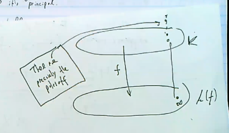

# Lecture 9

Last time: we proved the Riemann Inequality (\cref{thm:riemann_inequality}), the content of which is that there is a non-negative quantity called the *genus* for which the stated inequality holds.
The next step will be to try to improve this inequality to an equality, for which we introduce the following definition:

:::{.definition title="Index of Speciality"}
\[  
\iota(A) \da \ell(A) - \deg A = g - 1 \geq 0
.\]
:::

Tautologically, this yields
\[  
\ell(A) - \iota(A) = \deg A - g + 1
.\]

## Riemann-Roch Theorem and Applications

:::{.theorem title="Riemann-Roch Theorem"}
If $K/k$ is a function field of genus $g$, there exists a divisor $\mathfrak{k} \in \Div K$ such that for all $D\in \Div K$, $\iota(D) = \ell(\mathfrak{k} - D)$, and thus
\[  
\ell(D) - \ell(\mathfrak{k} - D) = \deg D - g + 1
.\]
:::

:::{.remark}
As a result, $\deg(D) > \deg(\mathfrak{k})$, so $\mathfrak{k} - D$ has negative degree.
We know that $\ell(D) > 0$ iff there is a $D' \sim D$ linearly equivalent to $D$, and there's no effective divisor equivalent to a divisor of negative degree.
Thus $\iota(A) = 0$ as soon as $\deg(D) > \deg(\mathfrak{k})$.
:::

:::{.exercise title="?"}
\envlist

1. $\ell(\mathfrak{k}) = g$ and $\deg \mathfrak{k} = 2g-2$.
2. $g\geq 0$
3. If $g\geq 1$, then the least $\alpha\in \ZZ$ such that whenever $\deg(D) > \alpha$ we have $\iota(D) = 0$ is given by $\alpha \da 2g-2$.
:::

:::{.remark}
Try taking $D=0$ and $\mathfrak{k} = D$ respectively, and compute $\iota(\mathfrak{k}) = 1$.
:::

:::{.exercise title="?"}
\envlist

a. Show that the Riemann-Roch theorem uniquely characterizes $g$, i.e. there is at most one quantity $g$ for which it holds.

b. Show that if Riemann-Roch holds for $\mathfrak{k}$, then it holds for any $\mathfrak{k}' \sim \mathfrak{k}$.

c. Show that if Riemann-Roch holds for $\mathfrak{k}_1, \mathfrak{k}_2$ then $\mathfrak{k}_1 \sim \mathfrak{k}_2$.

:::

:::{.definition title="Canonical Class"}
Thus the Riemann-Roch theorem singles out a distinguished *class* of divisors $[\mathfrak{k}]$ of degree $2g-2$, which is called the **canonical class**.
Any divisor $D\in [\mathfrak{k}]$ is called a **canonical divisor**.
:::

:::{.exercise title="?"}
Let $K/k$ be a genus zero function field.

a. Show that $\Cl^0(K) = 0$, so degree zero divisors are principal.

b. Show that $D\in \Div K$ is canonical iff $\deg D = -2$.

c. Show that the index $I(K)$ can only be 1 or 2.

d. Show that $K \cong k(t)$ iff $\Sigma _1 (K/k) \neq \emptyset$ iff $I(K) = 1$.
:::

:::{.exercise title="?"}
If $K/k$ is genus 1, show that a divisor $D \in \Div K$ is canonical iff $D$ is principal.
:::

## Applications of Riemann-Roch

### Genus Zero Function Fields

Let $K/k$ be a genus zero function field with $\mathfrak{k}$ a canonical divisor, so $\deg \mathfrak{k} = -2$.
Then $\deg(-\mathfrak{k}) = 2$ and by Riemann-Roch every effective divisor is not principal and
\[  
\ell(-\mathfrak{k}) = \deg(-\mathfrak{k}) -g + 1 = 3
.\]
One can choose $-\mathfrak{k}$ to be effective, so $1 \in \mathcal{L}(-\mathfrak{k})$.
So $\mathcal{L}(\mathfrak{k})$ has a basis of the form $\ts{1,x,y}$ for some elements $x, y$.

:::{.claim}
\[  
K = k(x, y)
.\]
:::

:::{.proof title="?"}
**Case 1**: 
If either $x$ or $y$ has degree 1, this is also the degree of the function field $K / k(x)$, and then $\mathfrak{k} = k(x)$ or $k(y)$ and the function field is rational.

**Case 2**:
Since $(x) \geq -\qty{ -\mathfrak{k}}$, we have $(x)_- \leq - \mathfrak{k} + (x)_+$, so $\deg(x) \leq \deg(-\mathfrak{k}) = 2$.
So $\deg(x) = 2$.
Similarly, $deg(y) = 2$ and so $[K: k(x)] = 2$.
Thus it's enough to show that $y\not\in k(x)$.
Toward a contradiction, if $y\in k(x)$, since $[K: k(y)] = 2$, we get $k(x) = k(y)$.
In this case $y$ is a degree 1 rational function in $x$, and so is of the form $y = {ax+ b \over cx + d}$ with $a,b,c,d \in k$.
This forces $(x)_- = (y)_- = -\mathfrak{k}$, since the only possibilities for these divisors are having degrees zero or one,
and we've ruled out the degree zero possibility.

So $y$ only has poles where $x$ has poles.
This follows because for a map $f: k \to k(t)$, the places over the point at infinity are places over infinity:

Since $(x), (y)$ has the same divisor of poles in $K$, all of their poles like over $\infty\in k(t)$.
Moreover, since $y$ is regular away from $\infty \in k(x)$, this forces $c= 0$ and $y=ax+b$.
But this exhibits a $k\dash$linear dependence between $x, y$.
:::

Now consider $1,x,y,x^2, xy, y^2 \in \mathcal{L}(-2 \mathfrak{k})$.
Since $\ell(-2 \mathfrak{k}) = 5$, these is necessarily a linear dependence in this set, so there is a tupoe $(a,b,c,d,e,f) \subset k^6$ such that 
\[  
f(x, y) \da ax^2 + bxy + xy^2 + dx + ey + f = 0
.\]

Not all of $a,b,c$ can be zero, since this yields the linear dependence $dx + ey + 1 = 0$.
Moreover $f$ must  be irreducible: if not, it would have a linear factor, which would again yield a linear dependence between $x$ and $y$.

:::{.theorem title="Genus Zero Function Fields are Quadratic Extensions"}
For $K/k$ a genus zero function field, there exists $a,b,c,d,e,f\in k$ with $a,b,c$ not all zero such that
\[  
f(x, y) \da ax^2 + bxy + xy^2 + dx + ey + f = 0 \qtext{and} K = K_f
.\]
:::

:::{.exercise title="?"}
Suppose $\ch(k) \neq 2$, and show that every genus zero function field is regular and there exist $a,b,c\in k\units$ such that $K = K_f$ where $f(x, y) = ax^2 + by^2 + c$.
:::

