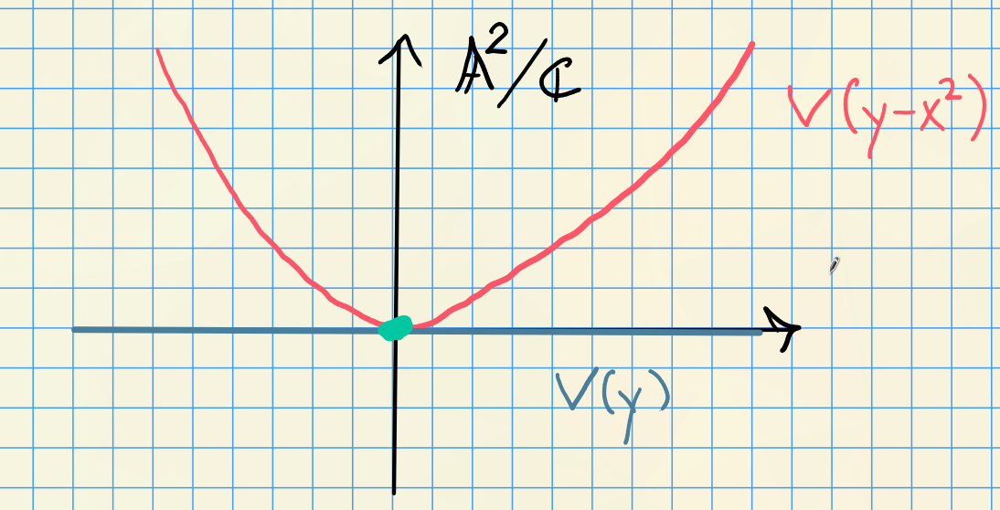

# More Nullstellensatz (Thursday, August 27)

## Consequence of the Nullstellensatz

Recall Hilbert's Nullstellensatz:

a. For any affine variety, $V(I(X)) = X$.

b. For any ideal $J\normal k[x_1, \cdots, x_n]$, $I(V(J)) = \sqrt{J}$.

So there's an order-reversing bijection
\[  
\correspond{\text{Radical ideals } k[x_1, \cdots, x_n]} 
\mapscorrespond{V(\wait)}{I(\wait)}
\correspond{\text{Affine varieties in } \AA^n}
.\]

In proving $I(V(J)) \subseteq \sqrt{J}$, we needed Noether Normalization and an important theorem (\cref{thm:nullstellensatz_one}): the maximal ideals of $k[x_1, \cdots, x_n]$ are of the form $\gens{x-a_1, \cdots, x-a_n}$.

:::{.corollary title="?"}
If $V(I)$ is empty, then $I = \gens{1}$.
:::

:::{.slogan}
The only ideals that vanish nowhere are trivial.
:::

:::{.proof}
This is because no common vanishing locus $\implies$ trivial ideal, so there's a linear combination that equals 1.
By contrapositive, suppose $I\neq \gens{1}$.
By Zorn's Lemma, these exists a maximal ideals $\mfm$ such that $I \subset \mfm$.
By the order-reversing property of $V(\wait)$, $V(\mfm) \subseteq V(I)$.
By the classification of maximal ideals, $\mfm = \gens{x-a_1, \cdots, x-a_n}$, so $V(\mfm) = \theset{a_1, \cdots, a_n}$ is nonempty.
:::

## Proof of Remaining Part of Nullstellensatz
We now return to the remaining hard part of the proof of the Nullstellensatz:

\[
I(V(J)) \subseteq \sqrt{J}
\]

:::{.proof title="?"}
Let $f\in V(I(J))$, we want to show $f\in \sqrt{J}$.
Consider the ideal 
\[
\tilde J \da J + \gens{ft - 1} \subseteq k[x_1, \cdots, x_n, t]
\]

:::{.observation}
$f = 0$ on all of $V(J)$ by the definition of $I(V(J))$.
:::

However, if $f=0$, then $ft-1 \neq 0$, so 
\[
V(\tilde J) = V(G) \intersect V(ft-1) = \emptyset
\]

{width=350px}

Applying the corollary $\tilde J = (1)$, so 
\[
1 = \gens{ft-1} g_0(x_1, \cdots, x_n, t) + \sum f_i g_i(x_1, \cdots, x_n, t)
\]
with $f_i \in J$.
Let $t^N$ be the largest power of $t$ in any $g_i$.
Thus for some polynomials $G_i$, we have
\[  
f^N \da (ft-1) G_0(x_1, \cdots, x_n, ft) + \sum f_i G_i(x_1, \cdots, x_n, ft)
\]
noting that $f$ does not depend on $t$.
Now take $k[x_1, \cdots, x_n, t]/\gens{ft-1}$, so $ft=1$ in this ring.
This kills the first term above, yielding
\[  
f^N = \sum f_i G_i(x_1, \cdots, x_n, 1) \in k[x_1, \cdots, x_n, t]/\gens{ft-1}
.\]

:::{.claim}
There is an inclusion
\[  
k[x_1, \cdots, x_n] \injects
k[x_1, \cdots, x_n, t]/\gens{ft-1}
.\]

:::

Since this is injective, this identity also holds in $k[x_1, \cdots, x_n]$.
But $f_i\in J$, so $f\in \sqrt{J}$.
:::

:::{.exercise title="?"}
Why is the claim above true? 
:::

:::{.example}
Consider $k[x]$.
If $J\subset k[x]$ is an ideal, it is principal, so $J = \gens{f}$.
We can factor $f(x) = \prod_{i=1}^k (x-a_i)^{n_i}$ and $V(f) = \ts{a_1, \cdots, a_k}$.
Then 
\[
I(V(f)) = \gens{(x-a_1)(x-a_2)\cdots(x-a_k)} = \sqrt{J} \subsetneq J
,\]
so this loses information.
:::

:::{.example}
Let $J = \gens{x-a_1, \cdots, x-a_n}$, then $I(V(J)) = \sqrt{J} = J$ with $J$ maximal.
Thus there is a correspondence
\[  
\correspond{\text{Points of } \AA^n} \iff 
\correspond{\text{Maximal ideals of }k[x_1, \cdots, x_n]}
.\]
:::

:::{.theorem title="Properties of $I$"}
\envlist

\[  
I(X_1 \union X_2)       &= I(X_1) \intersect I(X_2) \tag{a} \\
I(X_1) \intersect I(X_2) &= \sqrt{I(X_1) + I(X_2)} \tag{b}
.\]

:::

:::{.proof}
We proved (a) on the variety side.
For (b), by the Nullstellensatz we have $X_i = V(I(X_i))$, so
\[  
I(X_1\intersect X_2) 
&=
I\qty{ VI(X_1) \intersect VI(X_2)} \\
&=
IV\qty{I(X_1) + I(X_2)} \\
&= \sqrt{I(X_1) + I(X_2)}
.\]
:::

:::{.example}
Example of property (b):

Take $X_1 = V(y-x^2)$ and $X_2 = V(y)$, a parabola and the $x\dash$axis.

{width=350px}

Then $X_1 \intersect X_2 = \ts{(0, 0)}$, and $I(X_1) + I(X_2) = \gens{y-x^2, y} = \gens{x^2, y}$, but 
\[
I(X_1 \intersect X_2) = \gens{x, y} = \sqrt{\gens{x^2, y}}
\]
:::

:::{.proposition title="?"}
If $f, g\in k[x_1, \cdots, x_n]$, and suppose $f(x) = g(x)$ for all $x\in \AA^n$. 
Then $f = g$.
:::

:::{.proof}
Since $f-g$ vanishes everywhere, 
\[
f-g \in I(\AA^n) = I(V(0)) = \sqrt{0} = 0
\]
:::

More generally suppose $f(x) = g(x)$ for all $x\in X$, where $X$ is some affine variety.
Then by definition, $f-g \in I(X)$, so a "natural" space of functions on $X$ is $k[x_1,\cdots, x_n]/I(X)$.

:::{.definition title="Coordinate Ring"}
For an affine variety $X$, the **coordinate ring of $X$** is 
\[  
A(X) \da k[x_1, \cdots, x_n]/ I(X)
.\]

Elements $f\in A(X)$ are called *polynomial* or **regular** functions on $X$.
:::

:::{.observation}
The constructions $V(\wait), I(\wait)$ work just as well with $A(X)$ instead of $\kx{n}$ and $X$ instead of $\AA^n$.

Given any $S\subset A(Y)$ for $Y$ an affine variety,
\[  
V(S) = V_Y(S) \da\ts{x\in Y \st f(x) = 0\,\,\forall f\in S}
.\]

Given $X\subset Y$ a subset,
\[  
I(X) = I_Y(X) \da\ts{f\in A(Y) \st f(x) = 0\,\,\forall x\in X} \subseteq A(Y)
.\]
:::

:::{.example}
For $X\subset Y \subset \AA^n$, we have $I(X) \supset I(Y) \supset I(\AA^n)$, so we have maps
\begin{tikzcd}
A(\AA^n) \ar[rrrr, twoheadrightarrow, "\wait/I(X)", bend left] \ar[rr, "\wait/I(Y)"', twoheadrightarrow] 
&& A(Y)\ar[rr, twoheadrightarrow, "\wait/I(X)"'] 
&& A(X) \\
\end{tikzcd}

:::

:::{.theorem title="Relative Nullstellensatz"}
Let $X\subset Y$ be an affine subvariety, then

a. $A(X) = A(Y) / I_Y(X)$

b. There is a correspondence
\[  
\correspond{\text{Affine subvarieties of }Y} 
&\iff \correspond{\text{Radical ideals in }A(Y)} \\
X &\mapsto I_Y(X) \\
V_Y(J) &\mapsfrom J
.\]

:::

:::{.proof}
Properties are inherited from the case of $\AA^n$, see exercise in Gathmann.
:::

:::{.example}
Let $Y = V(y-x^2) \subset \AA^2/\CC$ and $X = \ts{(1, 1)} = V(x-1, y-1)\subset \AA^2/\CC$.

Then there is an inclusion $\gens{y-x^2} \subset \gens{x-1, y-1}$, e.g. by Taylor expanding about the point $(1, 1)$. and thus there is a map

\begin{tikzcd}
A(\AA^n)\ar[r]\ar[d, equal] & A(Y) \ar[r]\ar[d, equal]   & A(X)\ar[d, equal] \\
k[x, y]\ar[r]               & k[x, y]/\gens{y-x^2}\ar[r, dotted, "\exists"] & k[x, y]/\gens{x-1, y-1}
\end{tikzcd}
:::

