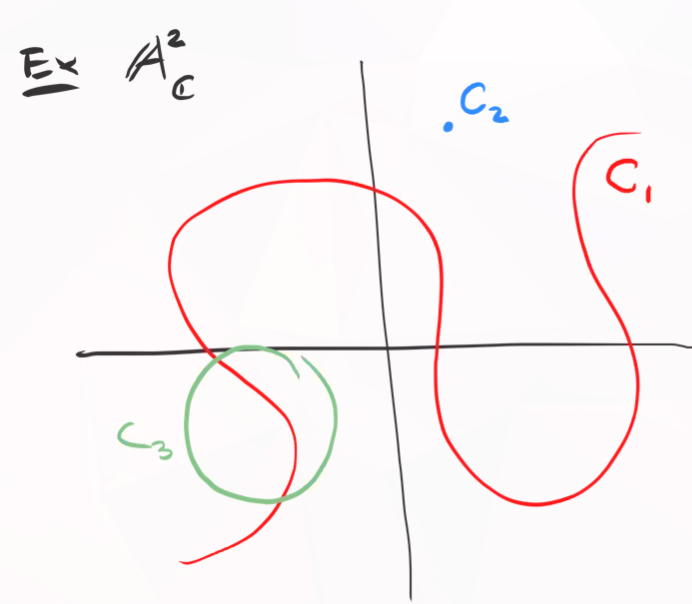
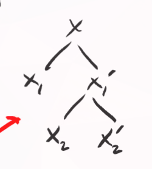

# Irreducibility (Thursday, September 03)

## Irreducibility and Prime Ideals

Recall that the Zariski topology is defined on an affine variety $X = V(J)$ with $J \normal k[x_1, \cdots, x_n]$ by describing the closed sets.

:::{.proposition title="?"}
$X$ is irreducible if its coordinate ring $A(X)$ is a domain.
:::

:::{.proposition title="?"}
There is a 1-to-1 correspondence
\[  
\correspond{\text{Irreducible subvarieties} \\ \text{of }X}
\iff
\correspond{\text{Prime ideals} \\ \text{in }A(X)}
.\]
:::

:::{.proof}
Suppose $Y\subset X$ is an affine subvariety.
Then 
\[  
A(X) / I_X(Y) = A(Y)
.\]

By the Nullstellensatz, there is a bijection between subvarieties of $X$ and radical ideals of $A(X)$ where $Y\mapsto I_X(Y)$.
A quotient is a domain iff quotienting by a prime ideal, so $A(Y)$ is a domain iff $I_X(Y)$ is prime.
:::

Recall that $\mfp \normal R$ is prime when $fg\in \mfp \iff f\in \mfp$ or $g\in \mfp$.
Thus $\bar f \bar g = 0$ in $R/\mfp$ implies $\bar f = 0$ or $\bar g = 0$ in $R/\mfp$, i.e. $R/\mfp$ is a domain.
Finally, note that prime ideals are radical (easy proof).

:::{.example}
Consider $\AA^2/\CC$ and some subvarieties $C_i$:

{width=350px}

Then irreducible subvarieties correspond to prime ideals in $\CC[x, y]$.
Here $C_1, C_3$ correspond to $V(f), V(g)$ for $f,g$ irreducible polynomials, whereas $C_2$ corresponds to a maximal ideal, i.e. $V(x_1 - a_1, x_2 - a_2)$.
Note that $I(C_1 \union C_2 \union C_3)$ is not a prime ideal, since the variety is reducible as the union of 3 closed subsets.
:::

:::{.example}
A finite set is irreducible iff it contains only one point.
:::

:::{.example}
Any irreducible topological space is connected, since irreducible requires a union but connectedness requires a *disjoint* union.
:::

:::{.example}
$\AA^n/k$ is irreducible: by prop 2.8, its irreducible iff the coordinate ring is a domain.
However $A(\AA^n)  = k[x_1, \cdots, x_n]$, which is a domain.
:::

:::{.example}
$V(x_1 x_2)$ is not irreducible, since it's equal to $V(x_1) \union V(x_2)$.
:::

:::{.definition title="Noetherian Space"}
A *Noetherian* topological space $X$ is a space with no infinite strictly decreasing sequence of closed subsets.
:::

:::{.proposition title="?"}
An affine variety $X$ with the Zariski topology is a Noetherian space.
:::

:::{.proof}
Let $X_0 \supsetneq X_1 \supsetneq \cdots$ be a decreasing sequence of closed subspaces.
Then $I(X_0) \subsetneq I(X_1) \subsetneq$.
Note that these containments are strict, otherwise we could use $V(I(X_1)) = X_1$ to get an equality in the original chain.

Recall that a ring $R$ is Noetherian iff every ascending chain of ideals terminates.
Thus it suffices to show that $A(X)$ is Noetherian.

We have $A(X) = \kx{n} / I(X)$, and if this had an infinite chain $I_1 \subsetneq I_2 \subsetneq \cdots$ lifts to a chain in $\kx{n}$, which is Noetherian.
A useful fact: $R$ Noetherian implies that $R[x]$ is Noetherian, and fields are always Noetherian.
:::

:::{.remark}
Any subspace $A\subset X$ of a Noetherian space is Noetherian.
To see why, suppose we have a chain of closed sets in the subspace topology,
\[  
A\intersect X_0 \supsetneq A\intersect X_1 \supsetneq \cdots
.\]

Then $X_0 \supsetneq X_1 \supsetneq \cdots$ is a strictly decreasing chain of closed sets in $X$.
Why strictly decreasing: 
\[
\intersect^n X_i = \intersect^{n+1} X_i \implies A\intersect^n X_i = A\intersect^{n+1} X_i
,\]
yielding a contradiction.
:::

:::{.proposition title="Important: Noetherian spaces are finite unions of closed irreducibles"}
Every Noetherian space $X$ is a finite union of irreducible closed subsets, i.e. $X = \Union_{i=1}^k X_i$.
If we further assume $X_i \not\subset X_j$ for all $i, j$, then the $X_i$ are unique up to permutation.

:::

:::{.remark}
The $X_i$ are the **components** of $X$.
In the previous example $C_1 \union C_2 \union C_3$ has three components.
:::

:::{.proof}

:::{.claim}
Such a finite decomposition exists.
:::
If $X$ is irreducible, then $X=X$ and this holds.
Otherwise, write $X = X_1 \union X_2$ with $X_i$ proper closed subsets.
If $X_1$ and $X_1'$ are irreducible, we're done, so otherwise suppose wlog $X_1'$ is not irreducible.
Then we can express $X = X_1 \union \qty{X_2 \union X_2'}$ with $X_2, X_2' \subset X_1'$ closed and proper.
Thus we can obtain a tree whose leaves are proper closed subsets:

{width=350px}

This tree terminates because $X$ is Noetherian: if it did not, this would generate an infinite decreasing chain of subspaces.

:::{.claim}
This decomposition is unique if no two components are contained in the other. 
:::

Suppose 
\[  
X= \Union_{i=1}^k X_i = \Union_{j=1}^\ell X_j'
.\]

Note that $X_i \subset X$ implies that $X_i = \Union_{j=1}^\ell X_i \intersect X_j'$.
But $X_i$ is irreducible and this would express $X_i$ as a union of proper closed subsets, so some $X_i \intersect X_j'$ is *not* a proper closed subset.
Thus $X_i = X_i \intersect X_j'$ for some $j$, which forces $X_i \subset X_j'$.
Applying the same argument to $X_j'$ to obtain $X_j' \subset X_k$ for some $k$.
Then $X_i \subset X_j' \subset X_k$, but $X_ i \not\subset X_j$ when $j\neq i$.
So $X_i = X_j' = X_k$, forcing the $X_i$ to be unique up to permutation.
:::

Recall from ring theory: for $I\subset R$ and $R$ Noetherian, $I$ has a *primary decomposition* $I = \Intersect_{i=1}^k Q_i$ with $\sqrt{Q_i}$ prime.
Assuming the $Q_i$ are minimal in the sense that $\sqrt{Q_i} \not\subset \sqrt{Q_j}$ for any $i, j$, this decomposition is unique.

Applying this to $I(X) \normal \kx{n} = R$ yields 
\[  
I(X) = \Intersect_{i=1}^k Q_i 
\implies
X  = V(I(X)) = \Union_{i=1}^k V(Q_i)
.\]

Letting $P_i = \sqrt{Q_i}$, noting that the $P_i$ are prime and thus radical, we have $V(Q_i) = V(P_i)$.
Writing $X = \Union V(P_i)$, we have $I(V(P_i)) = P_i$ and thus $A(V(P_i)) = R/P_i$ is a domain, meaning $V(P_i)$ are irreducible affine varieties.
Conversely, if we express $X = \Union X_i$, we have $I = I\qty{\Union X_i} = \Intersect I(X_i) = \Intersect P_i$ which are irreducible since they are prime.

:::{.remark}
There is a correspondence
\[  
\correspond{\text{Irreducible components} \\ \text{of } X} 
\iff
\correspond{\text{Minimal prime ideals} \\ \text{in } A(X)}
,\]
where here *minimal* is the condition that no pair of ideals satisfies a subset containment.
:::

In what follows, let $X$ be an irreducible topological space.

:::{.proposition title="1"}
The intersection of nonempty two open sets is *never* empty.
:::

:::{.proof}
Let $U, U'$ be open and $X\setminus U, X\sm U'$ closed.
Then $U\intersect U' = \emptyset \iff (X\sm U) \union (X\sm U') = X$, but this is not possible since $X$ is irreducible.[^irr_iff_nonempty_intersect]

[^irr_iff_nonempty_intersect]: 
Irreducible iff any two nonempty open sets intersect.

:::

:::{.proposition title="?"}
Any nonempty open set is dense, i.e. if $U\subset X$ is open then its closure $\cl_X(U)$ is dense in $X$.
:::

:::{.proof}
Write $X = \cl_X(U) \union (X\sm U)$.
Since $X\sm U \neq X$ and $X$ is irreducible, we have $\cl_X(U) = X$.
:::

