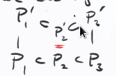

# Dimension (Thursday, September 10)

Recall that the dimension of a ring $R$ is the length of the longest chain of prime ideals.
Similarly, for an affine variety $X$, we defined $\dim X$ to be the length of the longest chain of irreducible closed subsets.

These notions of dimension of the same when taking $R = A(X)$, i.e. $\dim \AA^n/k = n$.

:::{.proposition title="Dimensions"}
Let $k = \bar k$.

a. The dimension of $k[x_1, \cdots, x_n]$ is $n$.
b. All maximal chains of prime ideals have length $n$.
:::

## Proof of Dimension Proposition

The case for $n=0$ is trivial, just take $P_0 = \gens{0}$.
For $n=1$, easy to see since the only prime ideals in $k[x]$ are $\gens{0}$ and $\gens{x-a}$, since any polynomial factors into linear factors.
\

Let $P_0 \subsetneq \cdots \subsetneq P_m$ be a maximal chain of prime ideals in $\kx{n}$; we then want to show that $m=n$.
Assume $P_0 = \gens{0}$, since we can always extend our chain to make this true (using maximality).
Then $P_1$ is a minimal prime and $P_m$ is a maximal ideal (and maximals are prime).

:::{.claim}
$P_1$ is principle, i.e. $P_1 = \gens{f}$ for some irreducible $f$.
:::

### Proof That $P_1$ is Principle

:::{.claim}

$\kx{n}$ is a unique factorization domain.
This follows since $k$ is a UFD since it's a field, and $R$ a UFD $\implies R[x]$ is a UFD for any $R$.

> See Gauss' lemma.

:::

:::{.claim}
In a UFD, minimal primes are principal.
Let $r \in P$, and write $r = u \prod p_i^{n_i}$ with $p_i$ irreducible and $u$ a unit.
So some $p_i\in P$, and $p_i$ irreducible implies $\gens{p_i}$ is prime.
Since $0 \subsetneq \gens{p_i} \subset P$, but $P$ was prime and assumed minimal, so $\gens{p_i} = P$.
:::

The idea is to now transfer the chain $P_0 \subsetneq \cdots \subsetneq P_m$ to a maximal chain in $k[x_1, \cdots, x_{n-1}]$.
The first step is to make a linear change of coordinates so that $f$ is monic in the variable $x_n$.

:::{.example}
Take $f=x_1x_2 + x_3^2 x_4$ and map $x_3 \mapsto x_3 + x_4$.
:::

So write
\[  
f(x_1, \cdots, x_n) = x_n^d + f_1(x_1, \cdots, x_{n-1}) x_n^{d-1} + \cdots + f_d(x_1, \cdots, x_{n-1})
.\]

We can then descend to $\kx{n}$ to $\kx{n}/\gens{f}$:
\begin{tikzcd}
P_0 \ar[r] & P_1 \ar[r]\ar[d]                   & \cdots \ar[r]\ar[d] & P_m\ar[d] \\
           & P_1/P_1 \ar[r]\ar[d]               & \cdots \ar[r]\ar[d] & P_m/P_1\ar[d] \\
           & P_1/P_1 \intersect \kx{n-1} \ar[r] & \cdots \ar[r]       & (P_m / P_1) \intersect \kx{n-1}
\end{tikzcd}

The first set of downward arrows denote taking the quotient, and the upward is taking inverse images, and this preserves strict inequalities.

:::{.definition title="Integral Extension"}
An *integral* ring extension $R\injects R'$ of $R$ is one such that all $r' \in R'$ satisfying a monic polynomial with coefficients in $R$, where $R'$ is finitely generated.

> In this case, also implies that $R'$ is a finitely-generated $R$ module.

:::

In this case, $\kx{n-1} \injects \kx{n} /\gens{f}$ is an integral extension.
We want to show that the intersection step above also preserves strictness of inclusions, since it preserves primality.

:::{.lemma}
Suppose $P', Q' \subset R'$ are distinct prime ideals with $R\injects R'$ an integral extension. 
Then if $P'\intersect R = Q'\intersect R$, neither contains the other, i.e. $P'\not\subset Q'$ and $Q'\not\subset P'$.
:::

:::{.proof}
Toward a contradiction, suppose $P' \subset Q'$, we then want to show that $Q'\supset P'$.
Let $a\in Q'\sm P'$ (again toward a contradiction), then
\[  
R/\qty{P'\intersect R} \injects R'/P'
\]
is integral.

Then $\bar a \neq 0$ in $R'/P'$, and there exists a monic polynomial of minimal degree that $\bar a$ satisfies, $p(x) = x^n + \sum_{i=2}^n \bar c_i x^{n-i}$.
This implies $\bar c_n \in Q'/P'$ (which will contradict $c_n \in P'$), since if $\bar c_n = 0$ then factoring out $x$ yields a lower degree polynomial that $\bar a$ satisfies.

But then $\bar a_n \in Q'\intersect R$, so ???
:::

Question: 
Given $R\injects R'$ is an integral extension, can we lift chains of prime ideals?

Answer: 
Yes, by the "Going Up" Theorem: given $P\subset R$ prime, there exists $P'\subset R'$ prime such that $P'\intersect R = P$.
Furthermore, we can lift $P_1 \subset P_2$ to $P_1' \subset P_2'$, as well as "lifting sandwiches":

{width=350px}

In this process, the length of the chain decreased since $\gens{0}$ was deleted, but otherwise the chains are in bijective correspondence.
So the inductive hypothesis applies.
$\qed$

## Using Dimension Theory

Key fact used: the dimension doesn't change under integral extensions, i.e. if $R\injects R'$ is integral then $\dim R = \dim R'$.

:::{.proposition}
Any affine variety has finite dimension.
:::

:::{.proof}
We have $\dim X = \dim A(X)$, where $A(X) \da \kx{n} I$ for some $I(X)=\sqrt{I(X)}$.

The noether normalization lemma (used in proof of nullstellensatz) shows that a finitely generated $k\dash$algebra is an integral extension of some polynomial ring $k[y_1, \cdots, y_d]$.
I.e., the following extension is integral:
\[  
k[y_1, \cdots, y_d] \injects k[x_1, \cdots, x_n]/I
.\]

We can conclude that $\dim A(X) = d < \infty$.
:::

:::{.proposition title="?"}
Let $X, Y$ be irreducible affine varieties.
Then

a. $\dim X\cross Y = \dim X + \dim Y$.
b. $Y\subset X \implies \dim X = \dim Y + \codim_X Y$.
c. If $f\in A(X)$ is nonzero, then any component of $V(f)$ has codimension 1.
:::

:::{.proof}
:::{.remark}
Why is $X\cross Y$ again an affine variety?
If $X\subset \AA^n/k$, $Y\subset \AA^m/k$ with $X = V(I), Y = V(J)$, then $X\cross Y \subset \AA^n/k \cross \AA^m/k = \AA^{n+m}/k$ can be given by taking $I+J \normal k[x_1, \cdots, x_n, y_1, \cdots, y_m]$ using the natural inclusions of $\kx{\ell}$.

Note that we can write
\[  
k[x_1, \cdots, x_n, y_1, \cdots, y_m] = \kx{n} \tensor_k k[y_1, \cdots, y_n]
\]
where we think of $x_i = x_i \tensor 1, y_j = 1 \tensor y_j$.
We thus map $I, J$ to $I\tensor 1 + 1\tensor J$ and obtain $V(I\tensor 1 + 1\tensor J) = X\cross Y$ and $A(X\cross Y) = A(X)\tensor_k A(Y)$.

In general, for $k\dash$algebras $R,S$,
\[  
R/I \tensor_k S/J \cong R\tensor_k S / \gens{I\tensor 1 + 1\tensor J}
.\]
:::

:::{.remark}
For $R,S$ finitely generated $k\dash$algebras, $\dim R\tensor_k S = \dim R + \dim S$.
:::
Part (a) is proved by the above remarks.

For part (b), the statement is equivalent to $P\subset A(X)$ with $I(Y) \subset P$ is a member of some maximal chain, along with the statement that all maximal chains are the same length.

:::

