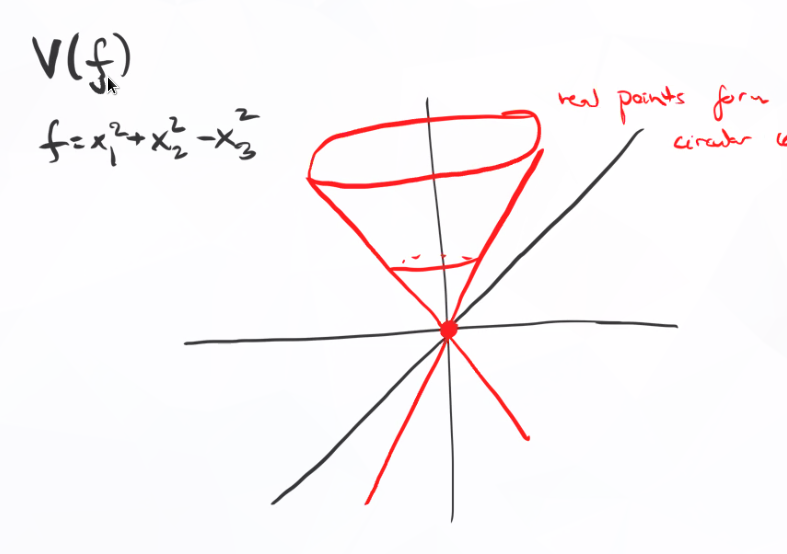

# Codimension and Hypersurfaces (Tuesday, September 15)

Recall the dictionary in \cref{the-algebra-geometry-dictionary}, and the fact that $A(X) \da \kx{n}$ contains no nilpotent elements.
We also had some results about dimension

1. $\dim X<\infty$ and $\dim \AA^n = n$.
2. $\dim Y + \codim_X Y = \dim X$ when $Y\subset X$ is irreducible.
3. Only over $\bar k = k$, $\codim_X V(f) = 1$.

:::{.example}
Take $V(x^2+y^2) \subset \AA^2_{/\RR}$.
:::

:::{.definition title="Curves, Surfaces, and Hypersurfaces"}
An affine variety $Y$ of

- $\dim Y = 1$ is a **curve**,
- $\dim Y = 2$ is a **surface**,
- $\codim_X Y = 1$ is a **hypersurface in $X$**
:::

Question:
Is every hypersurface the vanishing locus of a *single* polynomials $f\in A(X)$?

Answer:
This is true iff $A(X)$ is a UFD.

## Codimension

:::{.definition title="Codimension in a Ring"}
$\codim_R \mfp$ is the length of the longest chain 
$$P_0 \subsetneq P_1 \subsetneq \cdots \subsetneq P_n = \mfp.$$
:::

Recall that $f$ is irreducible if $f = f_1 f_2 \implies f_i \in R\units$ for one $i$, and $f$ is prime iff $\gens{f}$ is a prime ideal, or equivalently $f\divides ab \implies f\divides a$ or $f\divides b$.

Note that prime implies irreducible, since $f$ divides itself.

:::{.proposition title="?"}
Let $R$ be a Noetherian domain, then TFAE

a. All prime ideals of codimension 1 are principal.

b. $R$ is a UFD. 
:::

:::{.proof}
$a\implies b$:

Let $f$ be a nonzero non-unit, we'll show it admits a prime factorization.
If $f$ is not irreducible, then $f = f_1 f_1'$, both non-units.
If $f_1'$ is not irreducible, we can repeat this, to get a chain
\[  
\gens{f} \subsetneq \gens{f_1'} \subsetneq \gens{f_2'} \subsetneq \cdots
,\]
which must terminate.

This yields a factorization $f = \prod f_i$ with $f_i$ irreducible.
To show that $R$ is a UFD, it thus suffices to show that the $f_i$ are prime.
Choose a minimal prime ideal containing $f$.
We'll use Krull's Principal Ideal Theorem: if you have a minimal prime ideal $\mfp$ containing $f$, its codimension $\codim_R \mfp$ is one.
By assumption, this implies that $\mfp = \gens{g}$ is principal.
But $g\divides f$ with $f$ irreducible, so $f,g$ differ by a unit, forcing $\mfp = \gens{f}$.
So $\gens{f}$ is a prime ideal.
\

$b\implies a$: 

Let $\mfp$ be a prime ideal of codimension 1.
If $\mfp = \gens{0}$, it is principal, so assume not.
Then there exists some nonzero non-unit $f\in \mfp$, which by assumption has a prime factorization since $R$ is assumed a UFD.
So $f=\prod f_i$.

Since $\mfp$ is a prime ideal and $f\in\mfp$, some $f_i\in \mfp$.
Then $\gens{f_i} \subset \mfp$ and $\mfp$ minimal implies $\gens{f_i} = \mfp$, so $\mfp$ is principal.
:::

:::{.corollary title="?"}
Every hypersurface $Y\subset X$ is cut out by a single polynomial, so $Y=V(f)$, iff $A(X)$ is a UFD.
:::

## Hypersurfaces and Prime Ideals

:::{.example}
Apply this to $R=A(X)$, we find that there is a bijection
\[  
\codim 1 \text{ prime ideals}
\iff 
\codim 1 \text{ closed irreducible subsets }Y\subset X,\text{ i.e. hypersurfaces}
.\]

Taking $A(X) = \CC[x,y,z]/\gens{x^2+y^2-z^2}$, whose real points form a cone:

{width=350px}

Note that $x^2 + y^2 = (x-iy)(x+iy) = z^2$ in this quotient, so this is not a UFD.

Then taking a line through its surface is a codimension 1 subvariety not cut out by a single polynomial.
Such a line might be given by $V(x + iy, z)$, which is 2 polynomials, so why not codimension 2?

Note that $V(z)$ is the union of the lines

- $z = 0, x + iy= 0$,
- $z=0, x - iy = 0$.

Note that it suffices to show that this ring has an irreducible that is not prime.
Supposing $z = f_1 f_2$, some $f_i$ is a unit, then $z$ is not prime because $z\divides xy$ but divides neither of $x,y$.
:::

:::{.example}
Note that $\kx{n}$ is a UFD since $k$ is a UFD.
Applying the corollary, every hypersurface in $\AA^n$ is cut out by a single irreducible polynomial.
:::

:::{.definition title="Pure Dimension of Affine Varieties"}
An affine variety $X$ is of **pure dimension $d$** iff every irreducible component $X_i$ is of dimension $d$.
:::

:::{.remark}
Note that $X$ is a Noetherian space, so has a unique decomposition $X = \union X_i$.
Given $X\subset \AA^n/k$ of pure dimension $n-1$, $X = \union X_i$ with $X_i$ hypersurfaces with $I(X_j) = \gens{f_j}$, $I(X) = \gens{f}$ where $f = \prod f_i$.
:::

:::{.definition title="Degree of a Hypersurface"}
Given such an $X$, define the **degree of a hypersurface** as the degree of $f$ where $I(X) = \gens{f}$.
:::
