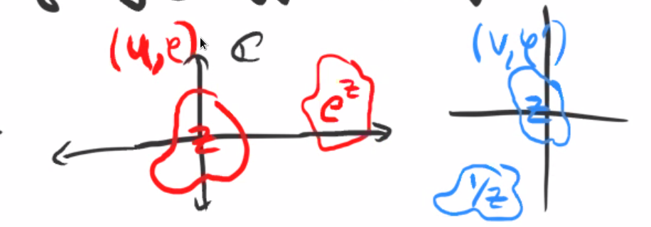

# Sheafifying (Tuesday, September 29)

## Presheaves That Are Not Sheaves

Recall the definition of a presheaf: a sheaf of rings on a space is a contravariant functor from its category of open sets to ring, such that

1. $F(\emptyset) = 0$
2. The restriction from $U$ to itself is the identity,
3. Restrictions compose.

:::{.example title="?"}
\envlist

- Smooth functions on $\RR^n$
- Holomorphic functions on $\CC$
:::

Recall the definition of sheaf: a presheaf satisfying *unique* gluing: given $f_i \in \mathcal{F}(U_i)$, such that $\restrictionof{f_i}{U_i \intersect U_j} = \restrictionof{f_j}{U_i\intersect U_j}$ implies that there exists a unique $f\in \mathcal{F}(\union U_i)$ such that $\restrictionof{f}{U_i} = f_i$.

:::{.question}
Are the constant functions on $\RR$ a presheaf and/or a sheaf?
:::

:::{.answer}
This is a presheaf but not a sheaf.
Set $\mathcal{F}(U) = \ts{f: U\to \RR \st f(x) = c} \cong \RR$ with $\mathcal{F}(\emptyset) = 0$.
Can check that restrictions of constant functions are constant, the composition of restrictions is the overall restriction, and restriction from $U$ to itself gives the function back.

Given constant functions $f_i \in \mathcal{F}(U_i)$, does there exist a unique constant function $\mathcal{F}(\union U_i)$ restricting to them?
No: take $f_1 = 1$ on $(0, 1)$ and $f_2 = 2$ on $(2, 3)$.
Can check that they both restrict to the zero function on the intersection, since these sets are disjoint.
:::

## Locally Constant Sheaves

How can we make this into a sheaf?
One way: weaken the topology.
Another way: define another presheaf $\mathcal{G}$ on $\RR$ given by *locally* constant function, i.e. $\ts{f: U\to \RR \st \forall p\in U, \exists U_p\ni p,\, \ro{f}{U_p} \text{ is constant}}$.
Reminiscent of definition of regular functions in terms of local properties.

:::{.example}
Let $X = \ts{p, q}$ be a two-point space with the discrete topology, i.e. every subset is open.
Then define a sheaf by
\[  
\emptyset &\mapsto 0 \\
\ts{p} &\mapsto R \\
\ts{q} &\mapsto S \\
\implies \ts{p, q} &\mapsto R\cross S
,\]
where the sheaf condition forces the assignment of the whole space to be the product.
Note that the first 3 assignments are automatically compatible, which means that we need a unique $f\in \mathcal{F}(X)$ restricting to $R$ and $S$.
In other words, $\mathcal{F}(X)$ needs to be unique and have maps to $R, S$, but this is exactly the universal property of the product.
:::

:::{.example}
Consider the presheaf on $X$ given by $\mathcal{F}(X) = R\cross S \cross T$.
Taking $T = \ZZ/2\ZZ$, we can force uniqueness to fail: by projecting to $R, S$, there are two elements in the fiber, namely $(r,s,0)\mapsto r,s$ and $(r,s,1)\mapsto r,s$.
:::

:::{.example}
Let $X = \ts{a, b, c}$ and $\tau = \ts{\emptyset, \ts{a}, \ts{a, b}, \ts{a, c}}$.
Can check that it's closed under finite intersections and arbitrary unions, so this forms a topology.
Now make the assignments
\[
\ts{a}    & \mapsto A \\
\ts{b}    & \mapsto B \\
\ts{a, b} & \mapsto C \\
X         & \mapsto ?
.\]

We have a situation like the following:

\begin{tikzcd}
               & \mathcal{F}(X)\ar[ld]\ar[rd] & \\
B\ar[rd]       &                              & C\ar[ld] \\
               & A\ar[d]                      & \\
               & \emptyset                    &
\end{tikzcd}

Unique gluing says that given $r\in B, s\in C$ such that $\phi_B(r) = \phi_C(s)$, there should exist a unique $t\in \mathcal{F}(X)$ such that $\ro{t}{\ts{a, b}} = r$ and $\ro{t}{\ts{a, c}} = s$.
This recovers exactly the fiber product.
\[  
B \cross_A C \da \ts{(r, s) \in B\cross C \st \phi_B(r) = \phi_C(s) \in A}
.\]
:::

## The Structure Sheaf is a Sheaf

:::{.example}
Let $X$ be an affine variety with the Zariski topology and let $\mathcal{F} \da \OO_X$ be the sheaf of regular functions:
\[  
\OO_X(U) \da \ts{f: U\to k \st \forall p\in U,\, \exists U_p \ni p,\,\, \ro{f}{U_p} ={g_p \over h_p} }
.\]

Is this a presheaf?
We can check that there are restriction maps:
\[  
\OO_X(U) &\to \OO_X(V) \\
\ts{f: U\to K} &\mapsto \ts{\ro{f}{V}(x) \da f(x) \text{ for } x \in V }
.\]
This makes sense because if $V\subset U$, any $x\in V$ is in the domain of $f$.
Given that $f$ is locally a fraction, say $\rho = g_p / h_p$ on $U_p \ni p$, is $\ro{\phi}{V}$ locally a fraction?
Yes: for all $p\in V\subset U$, $\phi = g_p / f_p$ on $U_p$ and this remains true on $U_p \intersect V$.

To check that $\OO_X$ is a sheaf, given a set of regular functions $\ts{\phi_i: U_i \to k}$ agreeing on intersections, define
\[  
\phi: \union U_i &\to k\\
\phi(x) &\da \phi_i(x) \text{ if }x\in U_i
.\]

This is well-defined, since if $x\in U_i \intersect U_j$, $\phi_i(x) = \phi_j(x)$ since both restrict to the same function on $U_i \intersect U_j$ by assumption.

Why is $\phi$ locally a fraction?
We need to check that for all $p\in U \da \union U_i$ there exists a $U_p \ni p$ with $\ro{\phi}{U_p} = g_p/h_p$.
But any $p\in \union U_i$ implies $p\in U_i$ for some $i$.
Then there exists an open set $U_{i, p} \ni p$ in $U_i$ such that $\ro{\phi}{U_{i, p}} = g_p / h_p$ by definition of a regular function.
So take $U_p = U_{i, p}$ and use the fact that $\ro{\phi}{U_i} = \phi_i$ along with compatibility of restriction.
:::

:::{.remark}
General observation: any presheaf of functions is a sheaf when the functions are defined by a local property, i..e any property that can be checked at $p$ by considering an open set $U_p \ni p$.

As in the examples of smooth or holomorphic functions, these were local properties.
E.g. checking that a function is smooth involves checking on an open set around each point.
On the other hand, being a constant function is not a local property.
:::

## Restriction, Stalks, Sections

:::{.definition title="Restriction of a (Pre)sheaf"}
Given a sheaf $\mathcal{F}$ on $X$ and an open set $U\subset X$, we can define a sheaf $\ro{\mathcal{F}}{U}$ on $U$ (with the subspace topology) by defining $\ro{\mathcal{F}}{U}(V) \da \mathcal{F}(V)$ for $U\subseteq V$.
:::

:::{.definition title="Stalks"}
Let $\mathcal{F}$ be a sheaf on $X$ and $p\in X$ a point.
The *stalk* of $\mathcal{F}$ at $p$, denoted $\mathcal{F}_p$ for $p\in U$, is defined by
\[  
\mathcal{F}_p \da \ts{(U, \phi) \st \phi \in \mathcal{F}(U) } / \sim
\]
where $(U, \phi) \sim (V, \phi')$ iff there exists a $W\subset U\intersect V$ and $p\in W$ such that $\ro{\phi}{W} = \ro{\phi}{W}'$.
:::

:::{.example}
What is the stalk of $\Hol(\CC)$ at $p=0$?

Examples of equivalent elements in this stalk:

In this case
\[  
\Hol(\CC)_0 = \ts{\phi = \sum_{i>0}c_i z^i \st \phi \text{ has a positive radius of convergence}}
.\]
:::

:::{.definition title="Sections and Germs"}
An element $f\in \mathcal{F}(U)$ is called a *section* over $U$, and elements of the stalk $f\in \mathcal{F}_p$ are called *germs* at $p$.
:::

