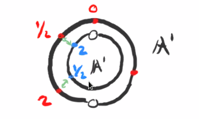
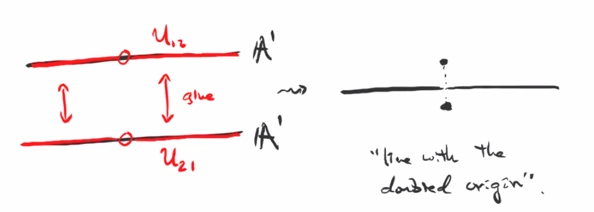
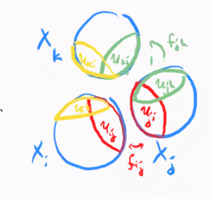
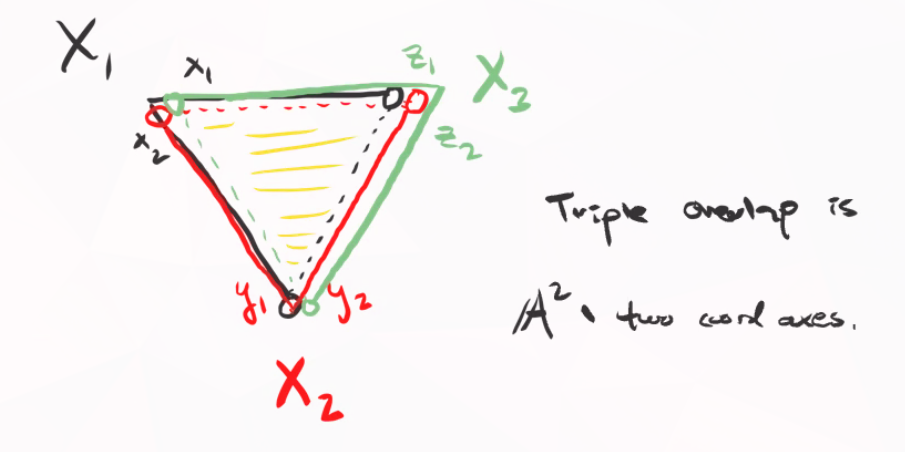
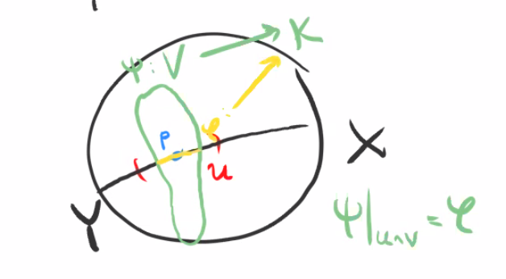

# Prevarieties (Tuesday, October 20)

## Gluing Two Opens in a Prevariety

Recall that a *prevariety* is a ringed space that is locally isomorphic to an affine variety, where we recall that $(X, \OO_X)$ is *locally isomorphic* to an affine variety iff there exists an open cover $U_i \covers X$ such that $(U_i, \OO_{U_i})$.
We found one way of producing these: the gluing construction. 
Given two ringed spaces $(X_1, \OO_{X_1})$ and $(X_2, \OO_{X_2})$ and open sets $U_{12} \in X_1$ and $U_{21} \in X_2$ and an isomorphism $(U_{12}, \OO_{U_{12}}) \mapsvia{f} (U_{21}, \OO_{U_{21}})$,
we defined 

- The topological space as $X_1 \disjoint_f X_2$
- The sheaf of rings as $\OO_X = \ts{\phi:U\to k \st\ro{\phi}{U\intersect X_i} \text{ is regular for } i=1,2 }$.

:::{.example}
$\PP^1_{/k} = X_1 \union X_2$ where $X_1 \cong X_2 \cong \AA^1_{/k}$.
Take $U_{12} \da D(x)$ and $U_{21} \da D(y)$ with
\[  
f: U_{12} &\to U_{21} \\
x &\mapsto y \da {1\over x}
.\]

:::

:::{.example}
Let $X_i = \AA^1$ and $U_{12} = D(x), U_{21} = D(y)$ with
\[  
f: U_{12} &\to U_{21} \\
x &\mapsto y\da x
.\]

Define $X\da X_1 \disjoint_f X_2$,
then $\OO_X = \ts{\phi: X\to k \st \ro{\phi}{X_i} \text{ is regular}} \cong k[x]$.

:::

## More General Gluing

Now we want to glue more than two open sets.
Let $I$ be an indexing set for prevarieties $X_i$. 
Suppose that for an ordered pair $(i, j)$ we have open sets $U_{ij} \subset X_i$ and isomorphisms $f_{ij}: U_{ij} \mapsvia{\sim} U_{ji}$ such that

a. $f_{ji} = f_{ij}^{-1}$

b. $f_{jk} \circ f_{ij} = f_{ik}$  (cocycle condition)

Then the gluing construction is given by

1. $X\da \disjoint X_i/\sim$ where $x\sim f_{ij}(x)$ for all $i,j$ and all $x\in U_{ij}$.

2. $\OO_x(U) \da \ts{\phi:U\to k \st \ro{\phi}{U\intersect X_i} \in \OO_{X_i} }$.

Every prevariety arises from the gluing construction applied to affine varieties $X_i$, since a prevariety $(X, \OO_X)$ by definition has an open affine cover $\ts{X_i} \covers X$ and $X$ is the result of gluing the $X_i$ by the identity.

:::{.example}
Let $X_1 = X_2 = X_3 \da \AA^2/k$.
Glue by the following instructions:

\begin{tikzcd}
\tv{x_1, x_2} \in X_1 
\ar[rdd, "{\tv{y_1, y_2} = \tv{ {1\over x_1}, {x_2\over x_1} }}"']
\ar[rr, "{\tv{z_1, z_2} = \tv{ {1\over x_2}, {x_1\over x_2} } }"]
& & 
\tv{z_1, z_2} \in X_3 \ar[ldd, "f"] \\ \\
& 
\tv{y_1, y_2} \in X_2 \\ 
& 
\end{tikzcd}

where $f$ is a map with whatever formula is required to make the diagram commute.
Here 

- $D(x_1 x_2) \subseteq X_1$
- $U_{12} = D(x_1)$
- $U_{21} = D(x_2)$.

{width=350px}

Here $X_1 = [1: y/x: z/x]$, $X_2 = [x/y: 1: z/y]$.

:::

:::{.example}
From Gathmann 5.10,  open and closed subprevarieties.
Let $X$ be a prevariety and suppose $U\subset X$ is open.
Then $(U, \OO_U)$ is a prevariety where $\OO_U = \ro{\OO_X}{U}$.
How can we write $U$ as (locally) an affine variety?
Since the $U_i$ are covered by distinguished opens $D_{ij}$ in $X_i$ where $X = \union X_i$ with $X_i$ affine varieties, we can write $U = \Union_i U_i = \Union_{i, j} D_{ij}$.
:::

:::{.example}
Let $Y\subset X$ be a closed subset of a prevariety $X$.
We need to define $\OO_Y(U)$ for all $U\subset Y$ open, so we set
\[  
\OO_Y(U) = \ts{\phi: U\to k \st \forall p\in U, \, \exists V_p \text{ with } p\in V_p \stacksymbol{}{\text{open}}{\subseteq} X \text{ and } \psi\in \OO_X(V_p) \text{ s.t. } \ro{\psi}{U\intersect V} = \phi  }
.\]

What's the picture?

{width=350px}

:::

:::{.exercise title="?"}
Show that this is a prevariety.
:::

:::{.remark}
If $U\subset X$ is an open subprevariety or $Y\subset X$ is a closed subprevariety, then the inclusions are morphisms.
We'd need to show that a pullback of a function is regular, but this is set up by definition.
:::

:::{.remark}
Define $\tilde \OO_X(U)$ as the set of *all* functions $U\to k$.
Then the inclusion $(X, \OO_X) \injects (X, \tilde \OO_X)$ given by the identity on $X$ is a morphism, but the identity in the reverse direction is not.
:::

