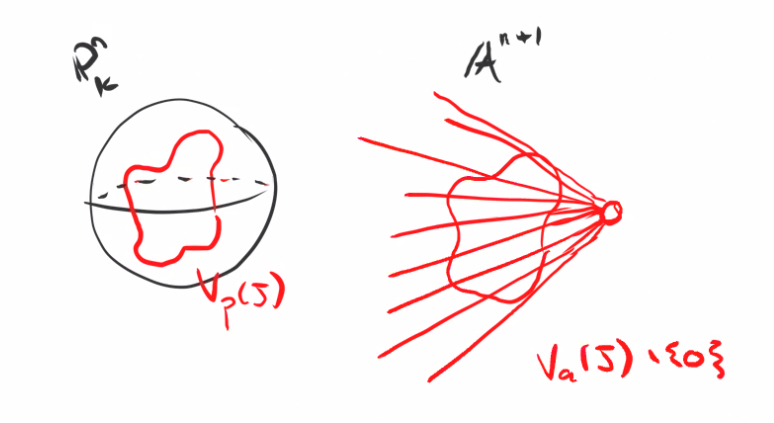

# Projective Spaces (Thursday, November 05)

We defined $\PP^n_{/k} \da \qty{ k^{n+1}\smz} /\sim$ where $x\sim \lambda x$ for all $x\in k\units$, which we identified with lines through the origin in $k^{n+1}$.
We have homogeneous coordinates $p = [x_0: \cdots : x_n]$.
We say an ideal is *homogeneous* iff for all $f\in I$, the homogeneous part $f_d\in I$ for all $d$.
In this case $V_p(I) \subset \PP^{n}_{/k}$ defined as the vanishing locus of all homogeneous elements of $I$ is well-defined, and we think of this as the "projective version" of a vanishing locus.
Similarly we defined $I_p(S)$ defined as the ideal generated by all homogeneous $f\in \kx{n}$ such that $f(x) = 0$ for all $x\in S$.

:::{.remark}
Observe that $V_a(I)$ defined as the cone over $V_p(I)$ is the set of points in $\AA^{n+1}\smz \union \ts{0}$ which map to $V_p(I)$.
:::

We have an alternative definition of a cone in $\AA^{n+1}$, characterized as a closed subset $C$ which is closed under scaling, so $kC\subseteq C$.
The following proposition(s) show that these notions are related.

:::{.proposition}
\envlist

- If $S\subset \kx{n}$ is a set of homogeneous polynomials, then $V_a(S)$ is a cone since it is closed and closed under scaling.
  This follows from the fact that $f(x) = 0 \iff f(\lambda x) = 0$ for $\lambda \in k\units$ when $f$ is homogeneous.

- If $C$ is a cone, then its affine ideal $I_a(C)$ is homogeneous.

:::

:::{.proof title="?"}
Let $f\in I_a(C)$, then $f(x) = 0$ for all $x\in C$.
Since $C$ is closed under scaling, $f(\lambda x) = 0$ for all $x\in C$ and $\lambda \in k\units$.
Decompose $f = \sum_d f_d$ into homogeneous pieces, then 
\[  
x\in C \implies 0 = f(\lambda x) = \sum \lambda^d f_d(x) 
.\]

Fixing $x\in C$, the quantities $f_d(x)$ are constants, so the resulting polynomial in $\lambda$ vanishes for all $\lambda$.
But since $k$ is infinite, this forces $f_d(x) = 0$ for all $d$, which shows that $f_d \in I_a(C)$.
:::

:::{.lemma title="?"}
There is a bijective correspondence
\[  
\correspond{\text{Cones}} 
&\iff
\correspond{\text{Projective Varieties}} \\
\AA^{n+1} \supset X &\mapsto \PP X\subset \PP^n \\
\AA^{n+1} \supset CX &\mapsfrom X\subset \PP^n \\
.\]
:::

:::{.proof title="?"}
$\PP V_a(S) = V_p(S)$ for any set $S$ of homogeneous polynomials, and $C(V_p(S)) = V_a(S)$, where $V_p(S)$ is a cone by part (a) of the previous proposition.
Conversely, every cone is the variety associated to some homogeneous ideal.
:::

## Projective Nullstellensatz

:::{.definition title="Irrelevant Ideal"}
The homogeneous ideal $I_0 \da (x_0, \cdots, x_n) \subset \kx{n}$ is denoted the **irrelevant ideal**.
This corresponds to the origin in $\AA^{n+1}$, which does not correspond to any point in $\PP^n$.
:::

:::{.proposition title="Projective Nullstellensatz"}
\envlist

a. For all $X\subseteq \PP^n$, 
\[
V_p(I_p(X)) = X
\]

b. For all homogeneous ideal $J\subset \kx{n}$ such that (importantly) $\sqrt{J} \neq I_0$, 
\[
I_p(V_p(J)) = \sqrt J
\]

:::

:::{.proof title="of a"}
$\supset$: 
If we let $I$ denote the ideal of all homogeneous polynomials vanishing on $X$, then this certainly contains $X$.

$\subset$: 
This follows from part (b), since $X = V_p(J)$ implies that 
\[
(V_p I_p V_p)(J) = V_p(\sqrt J) = V_p(J) = X
\]
since taking roots of homogeneous polynomials doesn't change the vanishing locus.
:::

:::{.proof title="of b"}
That $I_p(V_p(J)) \supset \sqrt J$ is obvious, since $f\in \sqrt{J}$ vanishes on $V_p(J)$.
\todo[inline]{Check}

It remains to show 
$\sqrt{J} \subset I_p(V_p(J))$
, but we can write 
$I_p(V_p(J))$ as $\gens{f \in \kx{n}}$ the set of homogeneous polynomials vanishing on $V_p(S)$, which is equal to those vanishing on $V_a(J) \smz$.
But since $I_p(\cdots)$ is closed, this is equal to the $f$ that vanish on $\bar{V_a(J)\smz}$, which is only equal to $V_a(J)$ iff $V_a(J) \neq \ts{0}$.

{width=350px}

By the affine Nullstellensatz, 
\[  
V_a(J) = \ts{0} \iff \sqrt{J} = I_0
.\]

Thus 
\[
I_p(V_p(J)) = \gens{f \st \text{homogeneous vanishing on }V_a(J)}
\]
Using the fact that $V_a(J)$ is a cone, its ideal is homogeneous and thus generated by homogeneous polynomials by part (b) of the previous proposition.
Thus 
\[  
I_p(V_p(J)) = I_a(V_a(J)) = \sqrt J
,\]
where the last equality follows from the affine Nullstellensatz.

:::

:::{.corollary title="?"}
There is an order-reversing bijection
\[  
\correspond{\text{Projective varieties} \\ X\subset \PP^n}
&\iff
\correspond{\text{Homog non-irrelevant radical ideals} \\ J \in \kx{n}} \\
X &\mapsto I_p(X) \\
V_p(J) &\mapsfrom J
.\]
:::

:::{.remark}
A better definition of a cone over $X\subset \PP^n_{/k}$ is 
\[  
C(X) &\da \bar{\pi^{-1}(X)} \subset \AA^{n+1}_{/k} \\
\text{where} \\
\pi: \AA^{n+1}\smz &\to \PP^n \\
\tv{x_0, \cdots, x_n} &\mapsto \tv{x_0: \cdots: x_n}
.\]
:::

## Projective Coordinate Ring

:::{.definition title="Homogeneous / Projective Coordinate Ring"}
Given $X\subset \PP^n$ a projective variety, the **projective coordinate ring** of $X$ is given by
\[  
S(X) \da \kx{n} / I_p(X)
.\]
:::

:::{.remark}
This is a graded ring since $I_p(X)$ is homogeneous.
This follows since the quotient of a graded ring by a homogeneous ideal yields a grading on the quotient.
:::

:::{.remark}
We have relative versions of everything.
Projective subvarieties of projective varieties are given by $Y\subset X\subset \PP^n$ where $X$ is a projective variety.
We have a topology on $X$ where the closed subsets are projective subvarieties.
:::

:::{.remark}
Given $J\subset S(X)$, where $S(X)$ is the projective coordinate ring of $X$ and has a grading, we can take $V_p(J) \subset X$.
Conversely, given a set $Y\subset S(X)$, we can take $I_p(Y) \subset S(X)$ those homogeneous elements vanishing on $Y$.
Thus there is an order-reversing bijection
\[  
\correspond{\text{Projective subvarieties } \\ Y\subset X}
\iff
\correspond{\text{Homogeneous radical ideals} \\ I \neq I_0 \normal S(X)}
\]
and $S(X) = \kx{n}/J \subset \bar{I_0}$.
:::

:::{.remark}
Every nontrivial homogeneous ideal $J$ contains the irrelevant ideal $I_0$.
Why?
Suppose $f\in J\sm I_0$ and $f_0\neq 0$.
Then $f_0\in J$ but $f_0\in k\subset \kx{n}$, implying that $1\in J$ and thus $J = \gens{1}$.
:::

\todo[inline]{Check?}

:::{.remark}
It is sometimes useful to know that a projective variety is cut out by homogeneous polynomials all of *equal* degree, so $X = V (f_1, \cdots, f_m)$ with each $f_i$ homogeneous of degree $d_i$.
Then there is some maximum degree $d$.
We can write
\[  
V(f_1) &= V(x_0^k f_1, \cdots, x_n^k f_1 ) \qquad \forall k\geq 0 \\
X &= \Intersect V(f_1) \union V(x_i)
.\]
This follows because $V$ of a product is a union of the vanishing loci, but $\Intersect V(x_i) = \emptyset$.
The equality follows because for all points $\tv{x_0, \cdots, x_n} \in \PP^n$, some $x_i$ is nonzero.
:::

