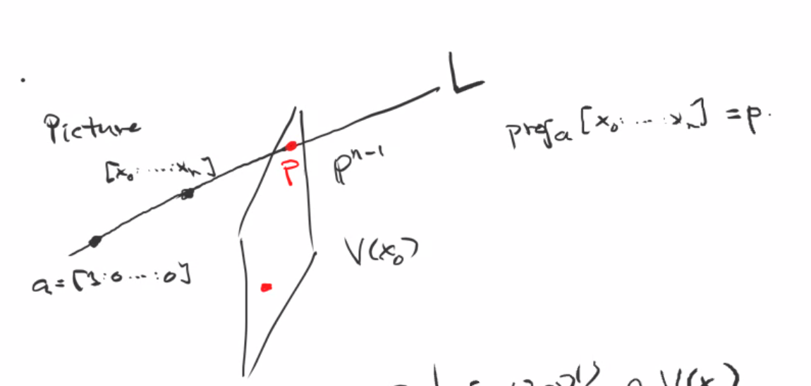
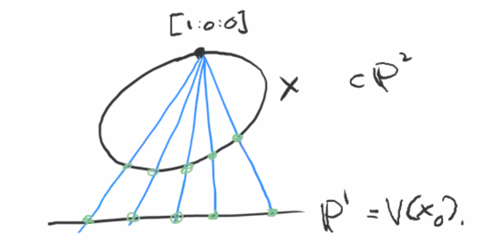

# Projections and Embeddings (Tuesday, November 17)

## Projecting From a Point

We have $\PP^n \da \AA^{n+1}\smz / \sim$ where $x\sim \lambda x$, and projective varieties $V(I) \subset \PP^n$ where $I \normal k[x_0, \cdots, x_n]$ is a homogeneous ideal.
We defined a sheaf of rings $\OO_X$ on $X = V(I)$ by
\[  
\OO_X(U) \da \ts{\phi: U\to k \st \phi \text{ is locally a ratio of two homogeneous polynomials of equal degree}}
.\]
We showed that this was the same as the sheaf $\tilde \OO_X$ defined by gluing ringed spaced $(X \intersect U_i, \OO_{X\intersect U_i})$ where $U_i = D(x_i)$.
We also showed that $S(X) \da k[x_0, \cdots, x_n] / I(X)$ is homogeneous, i.e. the quotient by a homogeneous ideal is again homogeneous.
Moreover, if $\ts{f_i}_{i=0}^m \subseteq S(X)_d$ and $V(\ts{f_i}) = \emptyset$. then the map
\[  
(f_0, \cdots, f_m): X &\to \PP^m \\
x &\mapsto [f_0(x), \cdots, f_m(x)]
.\]

Recall that a variety is separated iff $\Delta \injects X$ is closed.
Let $A\in \GL_{n+1}(k)$ and define a map
\[  
A: \PP^n &\to \PP^n \\
\begin{bmatrix}
x_0  \\
\vdots \\
x_n 
\end{bmatrix}
&\mapsto
A
\begin{bmatrix}
x_0  \\
\vdots \\
x_n 
\end{bmatrix}
.\]

This is a morphism because
\[  
\begin{bmatrix}
- & \vec A_0 & - \\
- & \vdots & - \\
- & \vec A_n & - \\
\end{bmatrix}
\begin{bmatrix}
x_0  \\
\vdots \\
x_n 
\end{bmatrix}
=
\begin{bmatrix}
A_0 \cdot \vector x  \\
\vdots \\
A_n \cdots \vector x 
\end{bmatrix}
,\]
which are linear homogeneous polynomials.

Then $V_p(A_i \cdot \vector x) = \emptyset$, and thus $V_a(A_i \cdot \vector A) = \ts{0}$.
So we should view $A\in \PGL_{n+1}(k)$.
Note that this is a group, since $A^{-1}$ again forms a morphism.
Thus $\PGL_{n+1}(k) \subset \Aut(\PP^n)$, and it turns out that these are in fact equal.

:::{.definition title="Projection from a point"}
Let $a = [1: 0 : \cdots : 0] \in \PP^n$, then there is a morphism 
\[  
\PP^n \sm\ts{a} &\to \PP^{n-1} \\
[x_0: \cdots : x_n] &\mapsto [x_1: \cdots : x_n]
.\]
Note that this morphism does not extend to $\PP^n$.
More generally, given any point $p\in \PP^n$, we can project from it by making a linear change of coordinates to $p = [1: 0 : \cdots : 0]$.
:::

Let $x\in \PP^n\sm\ts{a}$, then there is a unique line through $a$ and $x$.
It can be described parametrically as follows: writing $x = [x_0: \cdots : x_n]$, we take the plane they span and projectivize to obtain $s[x_0 : \cdots : x_n] + t [1: 0 : \cdots : 0]$ where we range over $[s: t] \in \PP^1$.
In fact, this defines a morphism $\PP^1 \to \PP^n$.

Consider now $\PP^{n-1} = V(x_0)$, this copy of $\PP^{n-1}$ intersects any such line at a unique point:

{width=550px}

:::{.example title="?"}
Consider $X = V(x_0 x_2 - x_1^2) \subset \PP^2$, which defines a conic, and the projection $\PP^2 \sm \ts{[1:0:0]} \to \PP^1$:

This morphism can be restricted to $\phi: X\sm\ts{[1:0:0]} \to \PP^2$, and the claim is that this morphism extends to all of $X$.
The secant lines approach a tangent line at $[1:0:0]$, which $V(x_0)$ at a unique point.
So we define
\[  
\bar \phi(x) \da 
\begin{cases}
[x_1: x_2] & x \neq [1:0:0] \\
[x_0: x_1] & x \neq [0:0:1]
\end{cases}
.\]

This locally writes $\phi$ as a morphism, so we only need to check that they agree on the overlap.
Note that on $X$, we have $[x_1: x_2] = [x_0 : x_1]$ wherever both are well-defined.
In fact, $\bar \phi$ is an isomorphism, since an inverse can be explicitly written.
Thus $X\cong \PP^1$, and in fact all nondegenerate[^nondegenerate_conic_meaning]
conics are isomorphic to $\PP^1$ as well.
Note that such a $Q$ is a quadratic form, so $Q(x) = B(x, x)$ for some bilinear form, and $Q$ is nondegenerate iff $\det B \neq 0$ where $B_{ij} = B(e_i, e_j)$.

[^nondegenerate_conic_meaning]: 
Here nondegenerate means that if $Q$ is a quadratic polynomials in $x_0, x_1, x_2$, then $Q$ does not factor as a product of linear factors.

:::

## The Segre Embedding

:::{.definition title="Segre Embedding"}
Letting $N = (n+1)(m+1) - 1$, the **Segre embedding** is the morphism
\[  
f: \PP^n \cross \PP^m &\to \PP^N \\
([x_0: \cdots : x_n], [y_0: \cdots : y_m]) &\mapsto
[x_0 y_0 : \cdots : z_{ij} \da x_i y_j : x_n y_m]
.\]
:::

Note that $\PP^n, \PP^m$ are prevarieties and we thus know how to construct their product as a prevariety.
Check that this is well-defined!

:::{.proposition title="Properties of the Segre embedding"}
\envlist

a. The image $X$ is a projective variety.

b. $f: \PP^n \cross \PP^m \to X$ is a morphism.

:::

:::{.proof title="of (a)"}
It suffices to write polynomials in the coordinate $z_{ij}$ that cut out $f(\PP^n \cross \PP^m)$.
Given $z_{ij} = x_i y_j$, we have $z_{ij} z_{kl} = z_{il} z_{kj}$ and $(x_i y_j)(x_k y_l) = (x_i y_l)(x_k y_j)$.
The former quadric equations in $z_{ij}$ variables vanish on $f(\PP^n \cross \PP^m)$.

:::{.claim}
$V(z_{ij} z_{kl} - z_{il} z_{kj})$ works.
:::

Without loss of generality, we can assume $z_{00} = 1$, in which case $z_{ij} z_{00} = z_{ij} = z_{i0} z_{0j}$ on $X$.
Setting $x_i = z_{i0}$ and $y_j = z_{0j}$, we've now constructed a point in the preimage, so $f$ surjects onto $X$.
:::

:::{.proof title="of (b)"}
That $f$ is a morphism to $\PP^n$ is easy, and since $\im f \subset X$, $f: \PP^n \cross \PP^m \to X$ is a morphism.
On $D(z_{00}) \subset X$, the inverse described above is a morphism.
Since this works for any $z_{ij}$, $f^{-1}$ is well-defined and a morphism, making $f$ an isomorphism.
:::

:::{.example title="of the Segre embedding being isomorphic to a variety"}
Take 

\[  
f: \PP^1 \cross \PP^1 &\to \PP^3 \\
\qty{ \tv{x_0: x_1}, \tv{y_0: y_1}} &\mapsto \tv{z_{00} : z_{01} : z_{10} : z_{11} } \da \tv{x_0 y_0: x_0 y_1 : x_1 y_0 : x_1 y_1}
.\]
Restricting to $\im(f)$ yields an isomorphism to $X \subseteq \PP^3$ given by the quadric[^def:quadric]
$X = V(z_{00} z_{11} - z_{10} z_{01} )$.

[^def:quadric]: 
A **quadric** is the vanishing locus of a degree 4 polynomial.

:::
