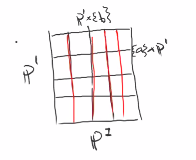
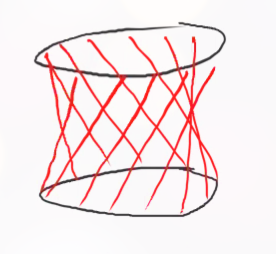

# Projective Varieties (Thursday, November 19)

## Why use projective varieties? 

For e.g. a manifold, there is a well-defined intersection pairing, and the same way that $[\mu] \in H^1(T, \ZZ) = 1$ in the torus, we have $[L]^2 = 1$ in $\PP^2_{/\CC}$, so every two lines intersect in a unique point.
Also, Bezout's theorem: any two curves of degrees $d, e$ in projective space intersect in $d\cdot e$ points.
Also note that we have a notion of compactness that works in the projective setting but not for affine varieties.

## Projective Varieties are Varieties

Last time: we saw the Segre embedding $(\vector x, \vector y)\mapsto [x_i y_j]$, which was an isomorphism onto its image $X = V(z_{ij}z_{kl} - z_{ik} z_{kj} )$, which exhibits $\PP^n \cross \PP^m$ as a projective variety.

:::{.example title="?"}
For $\PP^1 \cross \PP^1 \to \PP^3$, its image is $X = V_p(xy - zw)$, which is a quadric (vanishing locus of a degree 4 polynomial).

{width=350px}

The projection map has fibers, which induce a **ruling**[^def:ruling]
which we can see from the real points:

[^def:ruling]: 
A family of copies of $\PP^1$.

{width=350px}

:::

:::{.corollary title="?"}
Every projective variety is a separated prevariety, and thus a variety.
:::

:::{.proof title="?"}
It suffices to show that $\Delta_X \subset X\cross X$ is closed.
We can write
\[  
\Delta_{\PP^n} = 
\ts{
[x_0: \cdots: x_n], [y_0: \cdots : y_n] \st
x_i y_j - x_j y_i = 0 \, \forall i, j
}
.\]
This says that $\vector x, \vector y$ differ by scaling.
We know that $\Delta_{\PP^n} \injects \PP^n \cross \PP^n$, which is isomorphic to the Segre variety $S_V$ in $\PP^{(n+1)^2 -1}$, and we can write $z_{ij} = x_i y_j$ and thus
\[  
\Delta_{\PP^n} = S_V \intersect V(z_{ij} - z_{ji})
.\]
Note that the Segre variety is closed.
The conclusion is that $\PP^n$ is a variety, and any closed subprevariety of a variety is also a variety by taking $\Delta_{\PP^n} \intersect (X\cross X) = \Delta_X$, which is closed as the intersection of two closed subsets.
:::

:::{.definition title="Closed Maps"}
Recall that a map $f:X\to Y$ is topological spaces is **closed** if whenever $U \subset X$ is closed, then $f(U)$ is closed in $Y$.
:::

:::{.definition title="Complete Varieties"}
A variety $X$ is **complete** if the projection $\pi_Y: X\cross Y \surjects Y$ is a closed map for any $Y$.
:::

:::{.slogan}
Completeness is the analog of compactness for varieties.
:::

:::{.proposition title="Projection maps from products of projective spaces are closed."}
The projection $\PP^n \cross \PP^m \to \PP^m$ is closed.
:::

:::{.proof title="?"}
Let $Z \subset \PP^n \cross \PP^m$, and write $Z = V(f_i)$ with $f_i \in S(S_V)$.
Note that if the $f_i$ are homogeneous of degree $d$ in $z_{ij}$, the pulling back only the isomorphism $\PP^n\cross \PP^m \to S_V$ yields $z_{ij} = x_i y_j$ and polynomials $h_i$ which are homogeneous polynomials in $x_i, y_j$ which have degree $d$ in both the $x$ and $y$ variables individually.
Consider $a\in \PP^m$, we want to determine if $a\in \pi(Z)$ and show that this is a closed condition.
Note that $a\not\in \pi(Z)$ 

- $\iff$ there does not exists an $x\in \PP^n$ such that $(x, a) \in Z$ 

- $\iff$ $V_p(f_i(x, a))_{i=1}^r = \emptyset$ 

- $\iff$ $\sqrt{\gens{f_i(x, a)}_{i=1}^r } = \gens{1}$ or the irrelevant ideal $I_0$ 

- $\iff$ there exist $k_i \in \NN$ such that $x_i^{k_i} \in \gens{f_i(x, a)}_{i=1}^r$ 

- $\iff$ $\kx{n}_k \subset \gens{f_i(x, a)}_{i=1}^r$ (where this is the degree $k$ part)

- $\iff$ the map
\[  
\Phi_a: \kx{n}_{d - \deg f_2} \oplus \cdots \oplus \kx{n}_{d - \deg f_r} &\to \kx{n}_d \\
(g_1, \cdots, g_r) &\mapsto \sum f_i(x, a) g_i (x, a)
\]
  is surjective.

Recap: we have a closed subset of $\PP^n \cross  \PP^m$, want to know its projection is closed. 
We looked at points not in the closed set, this happens iff the degree $d$ part of the polynomial is not contained in the part where we evaluate by $a$.
This reduces to a linear algebra condition: taking arbitrary linear combinations yields a surjective map.
Thus $a\in \pi(Z)$ iff $\Phi_a$ is *not* surjective.
\

Expanding in a basis, we can write $\Phi_a$ as a matrix whose entries are homogeneous polynomials in the coordinates of $a$.
Moreover, $\Phi_a$ is not surjective iff all $d\times d$ determinants of $\Phi_a$ are nonzero (since this may not be square).
This is a polynomial condition, so $a\in \pi(Z)$ iff a bunch of homogeneous polynomials vanish, making $\pi(Z)$ is closed.
:::

:::{.corollary title="$\PP^n$ is complete."}
The projection $\pi: \PP^n\cross Y\to Y$ is closed for any variety $Y$ and thus $\PP^n$ is complete.
:::

:::{.proof title="?"}
How to prove anything for varieties: use the fact that they're glued from affine varieties, so prove in that special case.
So first suppose $Y$ is affine.
Let $Z \subset \PP^n \cross Y$ be closed, and consider $\bar Y ss \PP^m$ and 
\[
\bar Z \subset\PP^n \cross \bar Y \subset\PP^n \cross \PP^m
\]
as a closed subset.
Then we know that the projection $\pi: \PP^n \cross \PP^m \to \PP^m$ is closed, so $\pi(\bar Z) \subset\PP^m$ is closed.
But we can write 
\[
\pi(Z) = \pi(\bar Z \intersect \PP^n \cross Y) = \pi(\bar Z) \intersect Y
\]
which is closed. 
So $\pi(Z)$ is closed in $Y$, which proves this for affine varieties.
\

Supposing now that $Y$ is instead glued from affines, it suffices to check that the set is closed in an open cover.
So $Z \subset X$ is closed if when we let $X = \union U_i$, we can show $Z \intersect U_i$ is closed.
But this essentially follows from above.
:::

:::{.corollary title="Projective varieties are complete."}
Any projective variety is complete.
:::

:::{.proof title="?"}
If $X \subset \PP^n$ is closed and if $\PP^n \cross Y\to Y$ is a closed map for all $Y$, then restricting to $X\cross Y\to Y$ again yields a closed map.
:::

:::{.corollary title="Images of varieties under morphisms are closed."}
Let $f:X\to Y$ be a morphism of (importantly) *varieties* and suppose $X$ is complete. 
Then $f(X)$ is closed in $Y$.
:::

:::{.proof title="?"}
Consider the graph of $f$, 
\[
\Gamma_f = \ts{(x, f(x))} \subset X\cross Y
\]
From a previous proof, we know $\Gamma_f$ is closed when $Y$ is a variety (by pulling back a diagonal).
So $\Gamma_f$ is closed in $X\cross Y$, and thus $\pi_Y(\Gamma_f) = f(X)$ is closed because $X$ is complete.
:::

The next result is an analog of the maximum modulus principle: if $X$ is a compact complex manifold, then any function that is holomorphic on all of $X$ is constant.

:::{.corollary title="Maximum modulus principle for varieties"}
Let $X$ be complete, then $\OO_X(X) = k$, i.e. every global regular function is constant.
:::

:::{.proof title="?"}
Suppose $\phi X\to \AA^1$ is a regular function.
Since $\AA^1 \subset \PP^1$, extend $\phi$ to a morphism $\hat \phi: X\to PP^1$.
By a previous corollary, $\phi(X)$ is closed, but $\infty \not\in \phi(X)$ implies $\phi(X) \neq \PP^2$, so $\phi(X)$ is finite. 
Since $X$ is connected, $\phi(X)$ is a point, making $\phi$ a constant map.
:::
