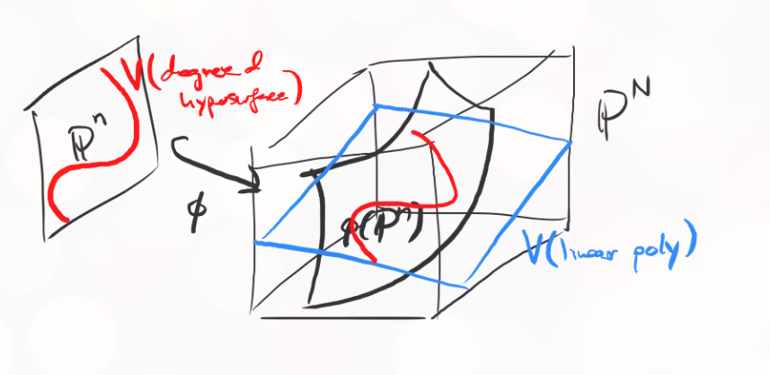
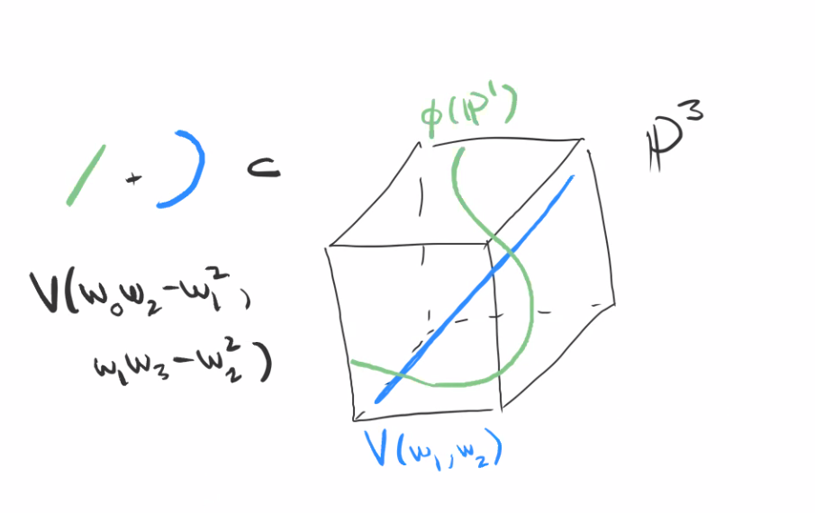
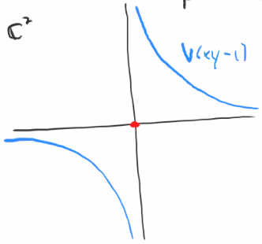
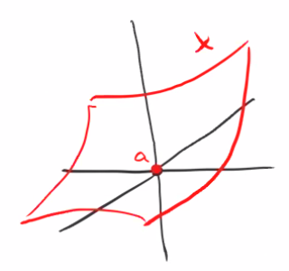
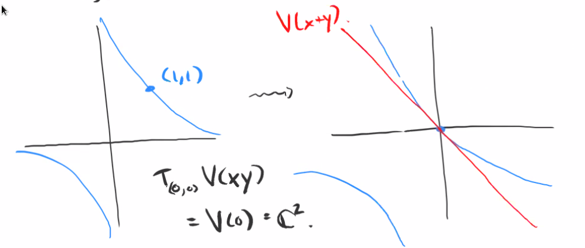

# Embeddings and Smoothness (Tuesday, November 24)

## The Veronese Embedding

:::{.definition title="Veronese Embedding"}
Let $n, d > 0$ and let $f_0, \cdots, f_n$ be the monomials of degree $d$ in $\kx{n}$.
There is a morphism
\[  
\PP^n \sm V(f_0,\cdots , f_n) &\to \PP^N \\
\vector x &\mapsto [f_0(\vector x), \cdots, f_N(\vector x)]
,\]
where $N+1$ is the number of monomials, and is equal to ${n+d \choose d}$.
:::

:::{.remark}
It is true that $V(f_0, \cdots, f_N) \neq \emptyset$, since $V(x_0^d, x_1^d, \cdots, x_n^d) = V(x_0, \cdots, x_n)$.
This will be the Veronese embedding, although we need to prove it is an embedding.
On an open set $D(x_0) \subset \PP^2$ one can define an inverse.
Suppose we have a coordinate $z_j = x_i^{d-1} x_j$ and $z_i = x_i^d$ on $\PP^N$.
Then we can take the point
\[  
\tv{ {z_1 \over z_i}, \cdots, {z_i \over z_i}, \cdots, {z_n \over z_i} }
.\]
This defines an inverse on $D(z_i)$.
Since the open sets $D(x_i)$ cover $\PP^N$, we have an inverse on the entire image.
:::

### Exchanging Hypersurface Sections for Hyperplane Sections

:::{.remark}
This embedding converts hypersurfaces of degree $d$ into hyperplanes.
The Veronese is an isomorphism onto its image.
Consider some arbitrary degree $d$ element of $S(\PP^n)$.
Consider $X \da V(\sum_{j=1}^N a_j f_j) \subset\PP^n$, where $a_j\in k$, which is equal to $\phi^{-1}(V(\sum_{j=1}^N a_j w_j ))$.

\todo[inline]{Probably not right.}

We have a picture: embedding $\PP^n\injects \PP^N$ in some curved way sends a hypersurface to the intersection of a hyperplane with the embedded image:

{width=550px}

:::

:::{.definition title="Hyperplane Sections"}
Let $X \subset\PP^n$ be a projective variety.
A **hyperplane section** is the intersection of $X$ with some hyperplane $H \da V(f)$ for $f$ some linear homogeneous polynomial.
:::

:::{.example title="of the Veronese embedding"}
Let $n=1$, then we get the embedding
\[  
\PP^1 &\injects \PP^d \\
[x_0: x_1] &\mapsto [x_0^d: x_0^{d-1}x_1 : \cdots : x_0 x_1^{d-1} : x_1^d]
.\]
Note that there are $d+1$ such monomials, and not all can simultaneously vanish.
The image of this $\PP^1$ is called the *twisted normal curve*.
:::

:::{.example title="?"}
Take
\[  
\PP^1 &\injects \PP^2 \\
[x_0 : x_1] &\mapsto [x_0^2 : x_0 x_1: x_1^2]
.\]
What homogeneous polynomials cut out $\phi(\PP^1)$? 
I.e., what is $I(\phi(\PP^1)) \subset S(\PP^2)$?
Note that $w_0 w_2 - w_1^2 \ro{}{\phi(\PP^1)}$, so this is an element.
Is it a generator? 
I.e., given any $p\in V(w_0 w_2 - w_1^2)$ is of the form $p = [x_0^2 : x_0 x_1: x_1^2]$ for some $x_), x_1 \in k$?
The answer is yes, by choosing signs of $\sqrt{w_0}, \sqrt{w_2}$.
:::

:::{.example title="?"}
Take
\[  
\phi: \PP^1 &\injects \PP^3 \\
[x_0: x_1] &\mapsto [x_0^3: x_0^2 x_1 : x_0 x_1^2: x_1^3]
.\]
What are some elements of this ideal?

- $w_0 w_3 - w_1 w_2$
- $w_0 w_2 - w_1^2$
- $w_1 w_3 - w_2^2$

Note that the first is not a $k\dash$linear combination of the other two.
There is also a pattern: $w_0/w_1 = w_1 / w_2 = w_2/w_3 = \cdots$.
However, there will be issues when the denominators are zero.

In this case, $\phi(\PP^1)$ is the *twisted cubic*.
What is $V(w_0 w_2 - w_1^2, w_1 w_3 - w_2^2) \sm \phi(\PP^1)$?
Note that being in $\phi(\PP^1)$ means $w_1, w_2, w_3 \neq 0$, and similarly if $w_0, w_1, w_2 \neq 0$.
We can conclude that $V(w_1, w_2) \subset V(w_0 w_2 - w_1^2, w_1 w_3 - w_2^2)$:

{width=350px}

This variety has two components: the twisted cubic, and a line.
This variety has degree 4, since any generic hyperplane intersects it at 4 points.
Why?
Pulling back a hyperplane yields a cubic, which generally vanishes at three points in affine space.
:::

:::{.remark}
$\phi(\PP^1)$ is a nice example of a curve in $\PP^3$ that can not be cut out by two homogeneous polynomials.
:::

:::{.remark}
This is usually used to embed intersections like $X\intersect V(f)$ to $X\intersect H$, exchanging a hypersurface section for a hyperplane section.
This is useful for induction:

1. Prove for $\PP^n$.
2. Induction: If it's true for $X \subset\PP^n$, then it's true for $X \intersect H$ for some hyperplane $H \subset\PP^N$.

This will prove it for any projective variety by taking $X = V(f_1, \cdots, f_n)$ and embedding.
:::

## The Tangent Space (Chapter 10)

Motivation: we want to distinguish between things like $V(xy)$ and $V(xy-1)$.
Over $\CC$, we can distinguish these: one is a complex manifold, and the other is not.

{width=350px}

This means we want each point to have a neighborhood biholomorphic to a disc.

:::{.definition title="Tangent Space"}
Let $a\in X$ be a point on a variety $X$.
Choose an affine open set containing $a$ and a chart such that $a$ is the origin, then define
\[  
T_a X \da V(f_1 \st f\in I(X))
,\]
where $f_1$ denotes the linear part of $f$.

{width=350px}

:::

:::{.remark}
Since $0=a$, any $f\in I(X)$ has no constant term -- otherwise $f$ would not vanish at the origin.
:::

:::{.example title="?"}
Consider $T_{(1, 1)} V(xy-1)$.
First translate $(1, 1)$ to the origin, so 
\[
T_{(1, 1)} V(xy-1) = T_{(0, 0)} = V((x-1)(y-1) - 1) = T_{(0, 0)} V(xy-x-y) = V(-x-y)
\]
On the other hand, $T_{(0, 0)} V(xy) = V(0) = \CC^2$.

{width=550px}

:::
