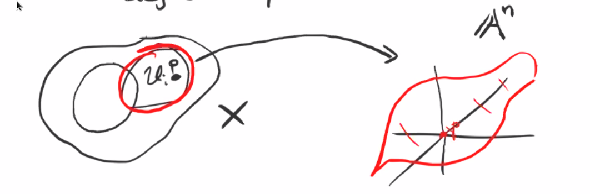
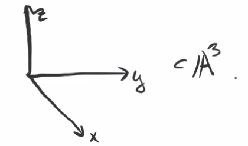
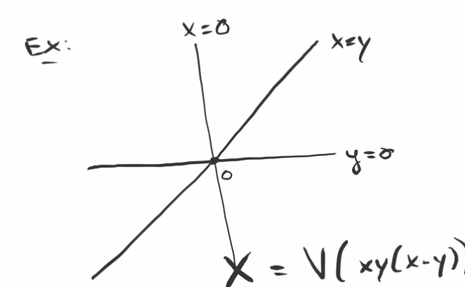
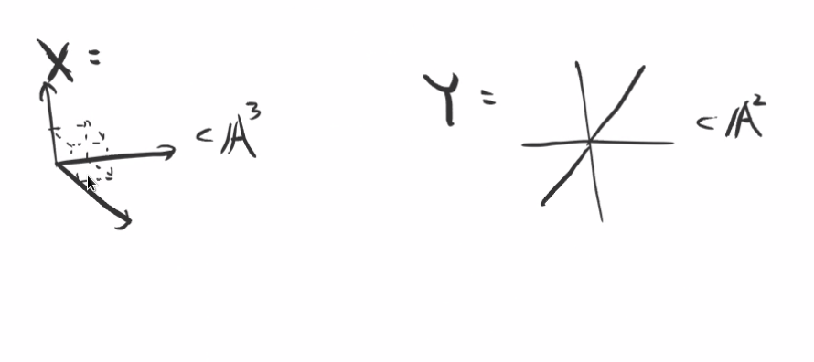

# The Tangent Space and Smoothness (Tuesday, December 01)

:::{.definition title="Tangent Space"}
The **tangent space** $T_p X$ of a variety $X$ at a point $p\in X$ is defined as 
\[
V\qty{\ts{f_1 \st f\in I(U_i),\, U_i \ni p = 0 \text{ affine } }}
\]
where $f_1$ denotes the degree 1 part.

{width=550px}

:::

:::{.remark}
We've really only defined it for affine varieties and $p=0$, but this is a local definition.
Note that this is also not a canonical definition, since it depends on the affine chart $U_i$.
:::

## Computing Tangent Spaces

:::{.example title="?"}
Consider 
\[
T_0 V(xy) = V(f_1 \st f\in \gens{xy}) = V(0) = \AA^2
,\]
since every polynomial in this ideal has degree at least 2.
Letting $X = V(xy)$, note that we could embed $X\injects \AA^3$ as $X\cong V(xy, z)$.
In this case we have 
\[
T_0 X = V(f_1 \st f\in \gens{xy, z}) = V(z) \cong \AA^2
\]
So we get a vector space of a different dimension from this different affine embedding, but $\dim T_0 X$ is the same.

:::

:::{.example title="?"}
Let $X = V_p(xy-z^2) \subset \PP^2$, which is a projective curve.
What is $T_p X$ for $p = [0:1:0]$?
Take an affine chart $\ts{y\neq 0} \intersect X$, noting that $\ts{y\neq 0} \cong \AA^2$.
We could dehomogenize the ideal $\ro{\gens{xy-z^2}}{y=1} = \gens{x-z^2}$.
Thus $X \intersect D(y) = V(x-z^2) \subset \AA^2$ and the point $[0:1:0] \in X$ gives $(0, 0)$ in this affine chart.
Then 
\[
T_p X = V(f_1 \st f\in \gens{x-z^2}) = V(x)
\]
Then $f = (x-z^2)g$ implies that $f_1 = (xg)_1 = g_0 x$, the constant term of $g$ multiplied by $x$, since $z^2$ kills any degree 1 part of $g$.
So $T_p X$ is a line.
:::

:::{.example title="?"}
Take $X$ to be the union of the coordinate axes in $\AA^3$:

{width=350px}

Then $I(X) = \gens{xy, yz, xz}$ and 
\[
T_0 X = V(f_1 \st f\in I(X)) = V(0) = \AA^3
\]
since the minimal degree of any such polynomial is 2.
Note that $\dim X = 1$ but $\dim T_0 X = 3$
:::

:::{.example title="?"}
Take $Y = V(xy(x-y)) \subset \AA^2$:

{width=350px}

Then $T_0 X = V(0) = \AA^2$.
:::

:::{.remark}
Note that $X$ and $Y$ both consists of 3 copies of $\AA^1$ intersecting at a single point.

{width=550px}

Note that $\dim T_0 X = 3$ but $\dim T_0 Y = 2$, and interestingly $X\not\cong Y$ as affine varieties.
There is a bijective morphism that is not invertible.
:::

:::{.remark}
We will prove that $\dim T_p X$ is invariant under choice of affine embedding.
:::

:::{.example title="How to compute $T_{(1,0,0)} V(xy, yz, xz)$"}
First move $(1,0,0)$ to the origin, yielding $T_{(0,0,0)} V((x+1)y, yz, (x+1) z)$.
This is a different choice of affine embedding into $\AA^3$ which sends $(1,0,0) \mapsto (0,0,0)$.
Taking the vanishing locus of linear parts, it suffices to take the linear parts of the generators, which yields the $x\dash$axis $V(y, z)$, making the dimension of the tangent space 1.
:::

## Identifying the Cotangent Space as $\mathfrak{m}/\mathfrak{m}^2$

:::{.lemma title="The tangent space is given by $I/I^2$"}
Let $X \subset\AA^n$ be an affine variety and let $0 = p\in X$.
Then
\[
T_0(X)\dual \da \hom_k(T_0X, k) \cong I_X(p) / I_X(p)^2
\]
:::

:::{.remark}
Note that the hom involves an affine embedding, but the quotient of ideals does not.
We know that the category of affine varieties is equivalent to the category of reduced $k\dash$algebras, since the points of $X$ biject with the maximal ideals of the coordinate ring $A(X)$. 
$I_X(p)$ is the maximal ideal in $A(X)$ of regular functions vanishing at $p$.
:::

:::{.proof title="?"}
Consider the map
\[  
\phi: I_X(p) &\to T_0(X)\dual \\
\bar f &\mapsto \ro{f_1}{T_0(X)}
.\]
E.g. given $\bar x_1 - \bar x_2^2 \in A(X)$, we first lift to $x_1 - x_2^2 \in A(\AA^n)$, restrict to the linear part $x_1$, then restrict to $T_0(X)$.
Note that $I_X(p) = \gens{\bar x_1, \cdots, \bar x_n} \in k[x_1, \cdots, x_n]/I(X)$, and we need to check that this well-defined since there is ambiguity in choosing the above lift.

:::{.claim}
$\phi$ is well-defined.
:::

Consider two lifts $f, f'$ of $\bar f\in A(X) = k[x_1, \cdots, x_n]/I(X)$.
Then $f - f'\in I(X)$, so $(f - f')_1 = f_1 - f_1'$ is the linear part of some element in $I(X)$.
The definition of $T_0(X)$ was the vanishing locus of linear parts of elements in $I(X)$, which contains $f_1 - f_1'$, and thus $\ro{\qty{f_1 - f_1'} }{T_0(X)} = 0$.
So $f_1 = f_1'$ on $T_0(X)$.

:::{.claim}
$I_X(p)^2 \to 0$.
:::

We know $I_X(p) = \gens{\bar x_1, \cdots, \bar x_n}$, and so $I_X(p)^2 = \gens{\bar x_i \bar x_j}$.
Giving any $\bar f\in I_X(p)^2$, we can lift this to some $f\in \gens{x_i x_j}$, in which case $f_1 = 0$.

So $\phi$ descends to 
\[
\bar \phi: I_X(p) / I_X(p^2) &\to T_0(X)\dual \\
\]

:::{.claim}
$\phi$ is injective and surjective.
:::

That $\bar \phi$ is surjective follows from
the fact that if $\bar x_1, \cdots, \bar x_n \in I_X(p)$, then the restrictions $\ro{x_1}{T_0X}, \cdots, \ro{x_n}{T_0X}$ are in $\im \bar \phi$
These elements generate $T_0(X)\dual$, since $T_0(X) \subset\AA^n$.
For injectivity, suppose $\bar \phi(\bar f) = 0$, then $\ro{f_1}{T_0(X)} = 0$, so $f_1$ is the linear part of some $f' \in I(X)$.
Then $f' \in I(X)$ and $f, f'$ have the same linear part $f_1$, and $f-f'$ has no linear part.
Thus $f-f'\in \gens{x_i x_j}$, which implies that $\bar f - \bar f' \in I_P(X)^2$ and $\bar f \equiv \bar f' \in I_p(X) / I_p(X)^2$.
But $f' \equiv 0$ since $f'\in I(X)$.

:::

:::{.remark}
So for $X$ an affine variety, the cotangent space has a more intrinsic description, and we can recover the tangent space by dualizing:
\[  
T_p(X) \da \qty{\mathfrak{m}_p/\mathfrak{m}_p^2 }\dual
\]
where $\mathfrak{m}_p = I_X(p)$ is the maximal ideal of regular functions vanishing at $p$.
So how can we get rid of the word affine?
Given $X$ any variety, we can define $T_p(X) \da \qty{\mathfrak{m}/\mathfrak{m}^2}\dual$ where $\mathfrak{m}$ is the maximal ideal of the local ring $\OO_{X, p}$.
This allows us to work on affine patches and localize.
Moreover, this will be left invariant under the localization.
:::
