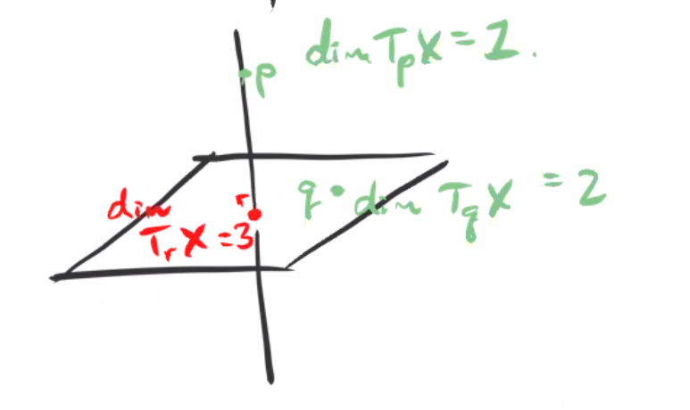
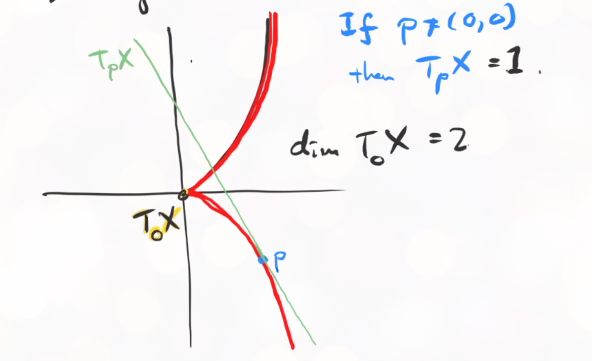
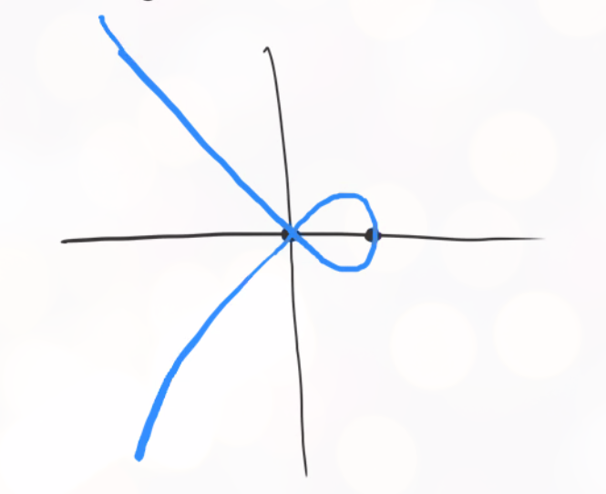
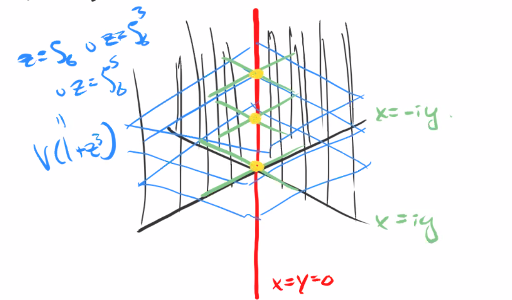

# Smoothness (Thursday, December 03)

We showed last time that if $X$ is an affine variety, then $T_p X = V\qty{f_1 \st f\in I(X)}$ for $p = \vector 0 \in \AA^n$, and we showed this is naturally isomorphic to $\qty{\mathfrak{m}_p /\mathfrak{m}_p^2}$.
Then there was a claim that generalizing this definition to an arbitrary variety $X$ involved taking $\mathfrak{n}_p \leq \OO_{X, p}$, a maximal ideal in this local ring of germs of regular functions, given by $\ts{(U, \phi) \st p\in U, \, \phi\in \OO_{X}(U)}$.
In this case, $T_p = \qty{\mathfrak{n}_p/\mathfrak{n}_p^2}$.
To prove this, it suffices to show that $\mathfrak{m}_p/\mathfrak{m}_p^2 \cong \mathfrak{n}_p/\mathfrak{n}_p^2$.
Note that for any affine open $U_i \ni p$, we have $\OO_{X, p} = \OO_{U_i, p}$.

When $X$ is affine, we have $\OO_{X, p} = A(X)_{\mathfrak{m}_p} \da \ts{f/g \st f\in A(X), g\not\in \mathfrak{m}_p}/\sim$.
Note that this localization makes sense, since the complement of a maximal ideal is multiplicatively closed since it is prime.
The equivalence relation was $f/g = f'/g'$ if there exists an $s\not\in \mathfrak{m}_p$ such that $s(fg' - f'g) = 0$.
We want to show that $\mathfrak{m}_p / \mathfrak{m}_p^2 = \mathfrak{m}_p A(X)_{\mathfrak{m_p}} / \mathfrak{m}_p A(X)_{\mathfrak{m_p}}^2$, i.e. this doesn't change when we localize.
In other words, we want to show that $\mfm_p / \mfm_p^2 \cong S^{-1} \mfm_[ / (S^{-1} \mfm_p)^2$.

Let $f\in S$ so $f(p) \neq 0$.
Then $\bar f\in A(X) / \mathfrak{m}_p \cong K$ is a nonzero element in a field and thus invertible. 
Thus $c\da 1/\bar f$ is an element of $K\units$, and for all $g\in \mathfrak{m}_p$ we have $g/f \cong cg$ in $\mathfrak{m}_p / \mathfrak{m}_p^2$.
So multiplying by elements of $S$ is invertible in $\mathfrak{m}_p / \mathfrak{m}_p^2$.
Thus $S^{-1} \qty{\mathfrak{m}_p / \mathfrak{m}_p^2} \cong \mathfrak{m}_p / \mathfrak{m}_p^2$, where the LHS is isomorphic to $S^{-1} \mathfrak{m}_p / \qty{S\inv \mathfrak{m}_p^2}$.

## Defining Smoothness

:::{.definition title="Smooth/Regular Varieties"}
A connected variety $X$ is **smooth** (or **regular**) if $\dim T_p X = \dim X$ for all $p\in X$.
More generally, an arbitrary (potentially disconnected) variety is smooth if every connected component is smooth.
:::

:::{.example title="?"}
$\AA^n$ is smooth since $T_p  \AA^n = k^n$ for all points $p$, which has dimension $n$.
:::

:::{.example title="?"}
$\AA^n \disjoint \AA^{n-1}$ is also smooth since each connected component is smooth.
:::

:::{.definition title="Singular Varieties"}
A variety that is not smooth is **singular** at $p$ if $\dim T_p X \neq \dim X$.
:::

:::{.fact}
$\dim T_p X\geq \dim X$ for $X$ equidimensional, i.e. every component has the same dimension.
This rules out counterexamples like the following in $\AA^3$:

{width=350px}

:::

:::{.example title="?"}
Consider $X\da V(y^2 - x^3) \subset \AA^2$:

{width=350px}

Note that $\dim T_0 X = 2$ is easy to see since it's equal to $V\qty{f_1 \st f\in \gens{y^2 - x^3}} = V(0) = k^2$.
Thus $p\neq 0$ are smooth points and $p=0$ is the unique singular point.
So $X$ is not smooth, but $X\smz$ is.
:::

:::{.definition title="Regular Ring"}
A local ring $R$ over a field $k$ is **regular** iff $\dim_k \mathfrak{m}/\mathfrak{m}^2 = \dim R$, the length of the longest chain of prime ideals.
Note that we'll add the additional assumption that $R/\mathfrak{m} \cong k$.
:::

:::{.remark}
A variety $X$ is thus smooth iff $\dim_k \mathfrak{m}_p / \mathfrak{m}_p^2 = \dim_p X = \dim \OO_{X, p}$.
:::

:::{.theorem title="A hard theorem from commutative algebra (Auslander–Buchsbaum, 1940s)"}
A regular local ring is a UFD.
:::

:::{.corollary title="?"}
Each connected component of a smooth variety is irreducible.
::: 

:::{.proof title="?"}
If a connected component$X$ is not irreducible, then there exists a point $p\in X$ such that $\OO_{X, p}$ is not a domain, and thus a nonzero pair $f, g \in \OO_{X, p}$ such that $fg=0$.
These exist by simply taking an indicator function on each component.
So $0$ doesn't have a unique factorization.
So $\OO_{X, p}$ is not regular, and thus $\dim T_p X > \dim_p X$, which is a contradiction.
:::

:::{.remark}
How can we check if a variety $X$ is smooth then?
Just checking dimensions from the definitions is difficult in general.
:::

## Checking Smoothness

:::{.proposition title="Jacobi Criterion"}
Let $p\in X$ an affine variety embedded in $\AA^n$, and suppose $I(X) = \gens{f_1, \cdots, f_r}$.
Then $X$ is smooth at $p$ $\iff$ the matrix $\qty{\dd{f}{x_j}}\evalfrom_{p}$ has rank $n - \dim X$.
:::

:::{.example title="?"}
Is $V(x^2 - y^2 - 1) \subset \AA^2$ smooth?
We have $I(X) = \gens{f_1} \da \gens{x^2 - y^2 - 1}$, so let $p\in X$.
Then consider the matrix
\[  
\begin{bmatrix}
J \da 
\dd{f}{x} & \dd{f}{y} \\
\end{bmatrix} = 
\begin{bmatrix}
2x & -2y \\
\end{bmatrix}
.\]
We want to show that at any $p\in X$, we have $\rank(J) = 1$.
This is true for $p\neq (0, 0)$, but this is not a point in $X$.
:::

:::{.example title="?"}
Consider $X \da V(y^2 - x^3 + x^2) \subset \AA^2$:

{width=350px}

Then $I(X) = \gens{y^2 - x^3  + x^2} = \gens{f}$, and
\[  
J = 
\begin{bmatrix}
2y & -3x^2 + 2x \\
\end{bmatrix}
.\]
Then $\rank(J) = 0$ at $p = (0, 0)$, which is a point in $X$, so $X$ is not smooth.

:::

:::{.example title="?"}
Consider $X\da V(x^2 + y^2, 1+z^3) \subset\AA^3$, then $I(X) = \gens{x^2 + y^2, 1 + z^3} \gens{f, g}$ which is clearly a radical ideal.

We then have
\[  
J = 
\begin{bmatrix}
f_x & f_y & f_z \\
g_x & g_y & g_z \\
\end{bmatrix}
=
\begin{bmatrix}
2x & 2y & 0 \\
0 & 0 & 3z^2
\end{bmatrix}
,\]
and thus
\[  
\rank(J) = 
\begin{cases}
0 & x=y=z=0 \\
1 & x=y=0 \text{ xor } z=0 \\
2 & \text{else}.
\end{cases}
\]

We can check that $\dim X = 1$ and $\codim_{\AA^3} X = 3-1 = 2$, so a point $(x,y,z) \in X$ is smooth iff $\rank(J) = 2$.
The singular locus is where $x=y=0$ and $z= \zeta_6$ is any generator of the 6th roots of unity, i.e. $\zeta_6, \zeta_6^3, \zeta_6^5$, along with the point $0$.
Note that $z=0$ is not a point on $X$, since $1+z^3\neq 0$ in this case.

Thus the singular locus is $V(x^2 + y^2) = V((x+iy)(x-iy)) \intersect V(1+z^3)$, which results in 3 singular points after intersecting:

{width=350px}

Note that it doesn't matter that $V(1+z^3)$ was intersected here, as long as it's anything that intersects the $z\dash$axis nontrivially we will still get something singular.

:::

