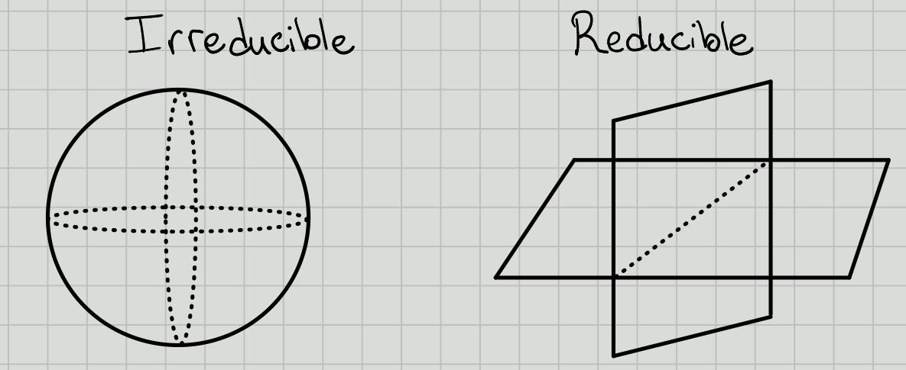

# Friday, August 21

## Intro and Definitions
:::{.definition title="Affine Variety"}
Let $k=\bar{k}$ be algebraically closed (e.g. $k = \CC, \bar{\FF_p}$).
A variety $V\subseteq k^n$ is an *affine $k\dash$variety* iff $V$ is the zero set of a collection of polynomials in $k[x_1, \cdots, x_n]$.
:::

Here $\AA^n\definedas k^n$ with the Zariski topology, so the closed sets are varieties.

:::{.definition title="Affine Algebraic Group"}
An *affine algebraic $k\dash$group* is an affine variety with the structure of a group, where the multiplication and inversion maps 
\[  
\mu: G\cross G &\to G \\
\iota: G&\to G
\]
are continuous.
:::

:::{.example}
$G = \GG_a \subseteq k$ the *additive group* of $k$ is defined as $\GG_a \definedas (k, +)$.
We then have a *coordinate ring* $k[\GG_a] = k[x] / I = k[x]$.
:::

:::{.example}
$G = \GL(n, k)$, which has coordinate ring $k[x_{ij}, T] / \gens{\det(x_{ij})\cdot T = 1}$.
:::

:::{.example}
Setting $n=1$ above, we have $\GG_m \definedas \GL(1, k) = (k\units, \cdot)$.
Here the coordinate ring is $k[x, T] / \gens{xT = 1}$.
:::

:::{.example}
$G = \SL(n, k) \leq \GL(n, k)$, which has coordinate ring $k[G] = k[x_{ij}] / \gens{\det(x_{ij}) = 1}$.
:::

:::{.definition title="Irreducible"}
A variety $V$ is *irreducible* iff $V$ can not be written as $V = \union_{i=1}^n V_i$ with each $V_i \subseteq V$ a proper subvariety.

:::

:::{.proposition title="?"}
There exists a unique irreducible component of $G$ containing the identity $e$. Notation: $G^0$.
:::

:::{.proposition title="?"}
$G$ is the union of translates of $G^0$, i.e. there is a decomposition
\[  
G = \disjoint_{g\in \Gamma} \, g\cdot G^0
,\]
where we let $G$ act on itself by left-translation and define $\Gamma$ to be a set of representatives of distinct orbits.
:::

:::{.proposition title="?"}
One can define solvable and nilpotent algebraic groups in the same way as they are defined for finite groups, i.e. as having a terminating derived or lower central series respectively.
:::

## Jordan-Chevalley Decomposition

:::{.proposition title="Existence and Uniqueness of Radical"}
There is a maximal connected normal solvable subgroup $R(G)$, denoted the *radical of $G$*.

- $\theset{e} \subseteq R(G)$, so the radical exists.
- If $A, B \leq G$ are solvable then $AB$ is again a solvable subgroup.

:::

:::{.definition title="Unipotent"}
An element $u$ is *unipotent* $\iff$ $u = 1+n$ where $n$ is nilpotent $\iff$ its the only eigenvalue is $\lambda = 1$.
:::

:::{.proposition title="JC Decomposition"}
For any $G$, there exists a closed embedding $G\injects \GL(V) = \GL(n , k)$ and for each $x\in G$ a unique decomposition $x=su$ where $s$ is semisimple (diagonalizable) and $u$ is unipotent.
:::

Define $R_u(G)$ to be the subgroup of unipotent elements in $R(G)$. 

:::{.definition title="Semisimple and Reductive"}
\hfill
Suppose $G$ is connected, so $G = G^0$, and nontrivial, so $G\neq \theset{e}$. Then 

- $G$ is semisimple iff $R(G) = \theset{e}$.
- $G$ is reductive iff $R_u(G) = \theset{e}$.
:::

:::{.example}
$G = \GL(n, k)$, then $R(G) = Z(G) = kI$ the scalar matrices, and $R_u(G) = \theset{e}$.
So $G$ is reductive and semisimple.
:::

:::{.example}
$G = \SL(n , k)$, then $R(G) = \theset{I}$.

:::{.exercise}
Is this semisimple? 
Reductive?
What is $R_u(G)$?
:::

:::

:::{.definition title="Torus"}
A *torus* $T\subseteq G$ in $G$ an algebraic group is a commutative algebraic subgroup consisting of semisimple elements.
:::

:::{.example}
Let
\[  
T \definedas 
\gens{
\begin{bmatrix}
a_1 &  & \mathbf 0\\
 & \ddots &  \\
\mathbf 0 &  & a_n
\end{bmatrix} \subseteq \GL(n ,k)
}
.\]
:::

:::{.remark}
Why are torii useful?
For $g = \mathrm{Lie}(G)$, we obtain a root space decomposition
\[  
g = 
\qty{\bigoplus_{\alpha \in \Phi_- }g_\alpha} \oplus 
t \oplus
\qty{\bigoplus_{\alpha \in \Phi_+ }g_\alpha} 
.\]

When $G$ is a simple algebraic group, there is a classification/correspondence:
\[  
(G, T) \iff (\Phi, W)
.\]
where $\Phi$ is an irreducible root system and $W$ is a Weyl group.

:::

