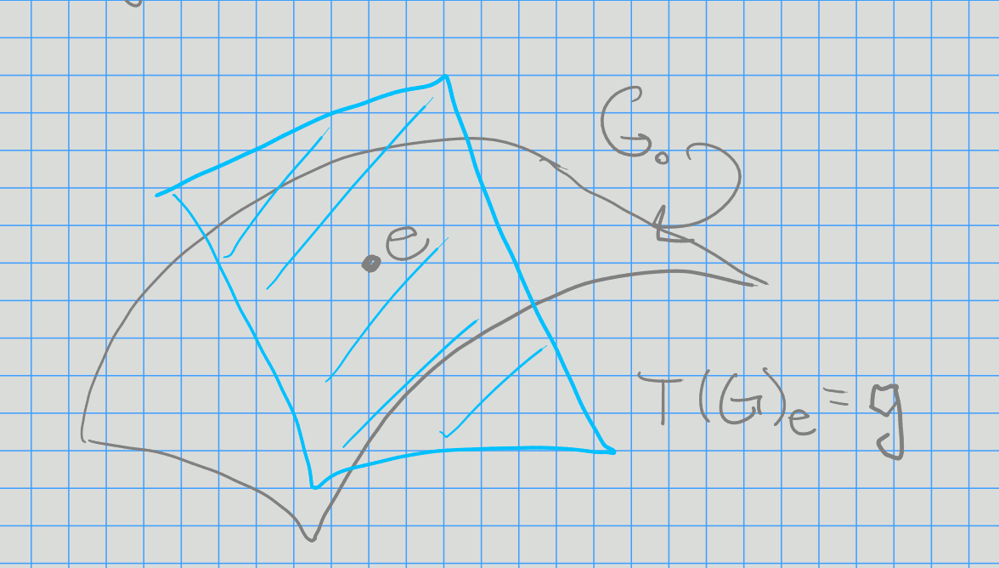
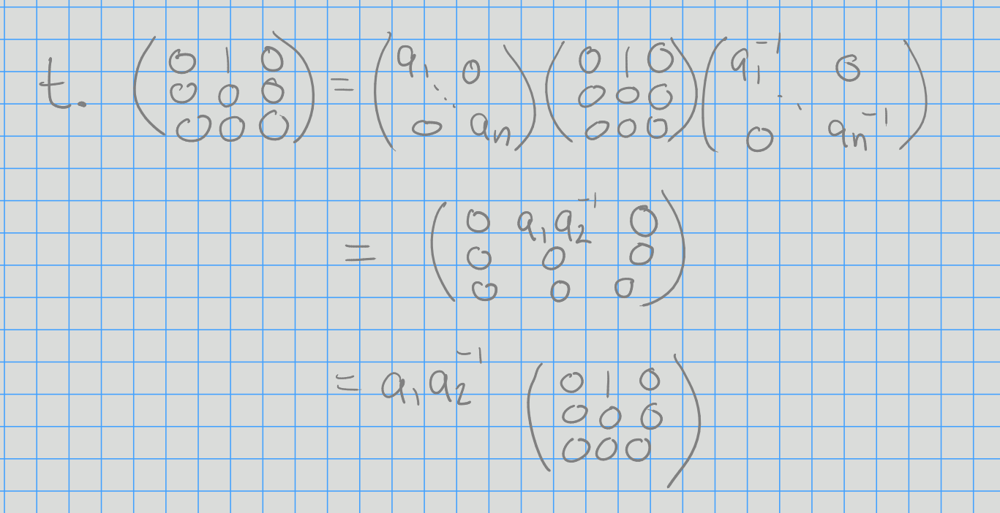
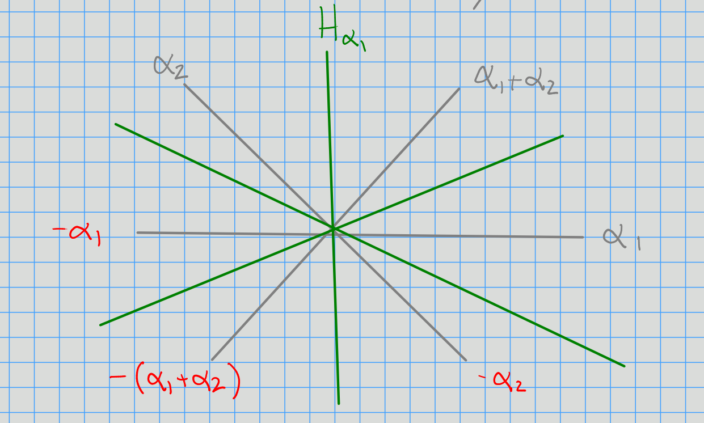

# Monday, August 24

## Review and General Setup

- $k = \bar k$ is algebraically closed
- $G$ is a reductive algebraic group
- $T\subseteq G$ is a *maximal split torus*

> Split: $T\cong \bigoplus \GG_m$.

We'll associate to this a root system, not necessarily irreducible, yielding a correspondence
\[  
(G, T) \iff (\Phi, W)
\]
with $W$ a Weyl group.

This will be accomplished by looking at $\lieg = \mathrm{Lie}(G)$.
If $G$ is simple, then $\lieg$ is "simple", and $\Phi$ irreducible will correspond to a Dynkin diagram.

There is this a 1-to-1 correspondence
\[  
G \text{ simple}/\sim \iff A_n, B_n, C_n, D_n, E_6, E_7, E_8, F_4, G_2
\]
where $\sim$ denotes *isogeny*.

Taking the Zariski tangent space at the identity "linearizes" an algebraic group, yielding a Lie algebra.

We have the coordinate ring $k[G] = k[x_1, \cdots, x_n] / \mathcal{I}(G)$ where $\mathcal{I}(G)$ is the zero set.
This is equal to $\ts{f:G\to k}$,

## The Associated Lie Algebra

:::{.definition title="The Lie Algebra of an Algebraic Group"}
Define *left translation* is
\[  
\lambda_x: k[G] &\to k[G] \\
y &\mapsto f(x^{-1} y)
.\]

Define *derivations* as
\[  
\mathrm{Der} ~k[G] = \ts{D: k[G] \to k[G] \suchthat D(fg) = D(f) g + f D(g) }
.\]

We can then realize the Lie algebra as
\[  
\lieg = \mathrm{Lie}(G) = \theset{D\in \mathrm{Der} k[G] \suchthat \lambda_x \circ D = D\circ \lambda_x}
,\]
the left-invariant derivations.
:::

:::{.example}
\hfill
- $G = \GL(n, k) \implies\lieg = \liegl(n, k)$
- $G = \SL(n, k) \implies\lieg = \liesl(n, k)$
:::

Let $G$ be reductive and $T$ be a split torus.
Then $T$ acts on $\lieg$ via an *adjoint action*.
(For $\GL_n, \SL_n$, this is conjugation.)

There is a decomposition into eigenspaces for the action of $T$, 
\[  
\lieg = \qty{\bigoplus_{\alpha\in \Phi} g_\alpha} \oplus t
\]
where $t = \mathrm{Lie}(T)$ and $g_\alpha \da \ts{x\in \lieg\st t.x = \alpha(t) x\,\, \forall t\in T}$ with $\alpha: T\to K\units$ a rational function (a *root*).

In general, take $\alpha\in\hom_{\text{AlgGrp}}(T, \GG_m)$.

:::{.example}
Let $G = \GL(n, k)$ and 
\[  
T = \ts{
\begin{bmatrix}
a_1 & 0 & 0 \\
0 & \ddots & 0 \\
0 & 0 & a_n
\end{bmatrix}
\st a_j\in k\units
}
.\]

Then check the following action:

which indeed acts by a rational function.

Then 
\[  
g_\alpha = \spanof \ts{
\begin{bmatrix}
0 & 1 & 0 \\
0 & 0 & 0\\
0 & 0 & 0
\end{bmatrix}
} = g_{(1, -1, 0)}
.\]

For $\lieg = \liegl(3, k)$, we have
\[  
\lieg = t 
&\oplus g_{(1, -1, 0)}
\oplus g_{(-1, 1, 0)}  \\
&\oplus g_{(0, 1, -1)} 
\oplus g_{(0, -1, 1)}  \\
&\oplus g_{(1, 0, -1)} 
\oplus g_{(-1, 0, 1)} 
.\]
:::

## Representations

Let $\rho: G\to \GL(V)$ be a group homomorphisms, then equivalently $V$ is a (rational) $G\dash$module.

For $T\subseteq G$, $T\actson G$ semisimply, so we can simultaneously diagonalize these operators to obtain a *weight space decomposition* $V = \bigoplus_{\lambda \in X(T)} V_\lambda$, where
\[  
V_\lambda &\da\ts{v\in V\st t.v = \lambda(t)v\,\, \forall t\in T} \\\
X(T) &\da \hom(T, \GG_m)
.\]

:::{.example}
Let $G = \GL(n, k)$ and $V$ the $n\dash$dimensional natural representation as column vectors,
\[  
V = \ts{\thevector{v_1, \cdots, v_n} \suchthat v_j \in k}
.\]

Then
\[  
T = \ts{
\begin{bmatrix}
a_1 & 0 & 0 \\
0 & \ddots & 0\\
0 & 0 & a_n
\end{bmatrix} \suchthat a_j \in k\units
}
.\]

Consider the basis vectors $\vector{e}_j$, then 
\[  
\begin{bmatrix}
a_1 & 0 & 0 \\
0 & \ddots & 0\\
0 & 0 & a_n
\end{bmatrix} 
\begin{bmatrix}
0  \\
1  \\
0
\end{bmatrix}
=
a_j
\begin{bmatrix}
0  \\
1 \\
0
\end{bmatrix}
= a_1^0 a_2^0 \cdots a_j^0 \cdots a_n^0
\begin{bmatrix}
0  \\
1 \\
0
\end{bmatrix}
.\]

Here the weights are of the form $\eps_j\da \thevector{0, 0, \cdots, 1, \cdots, 0}$ with a $1$ in the $j$th spot, so we have
\[  
V = V_{\eps_1} \oplus V_{\eps_2} \oplus \cdots \oplus V_{{\eps_n}}
.\]
:::

:::{.example}
For $V = \CC$, we have $t.v = (a_1^0 \cdots a_n^0)v$ and $V = V_{(0, 0, \cdots, 0)}$.
:::

## Classification

Let $G$ be a simple algebraic group (ano closed, connected, normal subgroups other than $\ts{e}, G$) that is nonabelian that is nonabelian.

:::{.example}
Let $G = \SL(3, k)$.
Then
\[  
T = \ts{
t = 
\begin{bmatrix}
a_1 & 0 & 0 \\
0 & a_1 a_2^{-1}  & 0\\
0 & 0 & a_2^{-1} 
\end{bmatrix}
\st
a_1, a_2\in k\units
}
\]
and
\[  
t.
\begin{bmatrix}
0 & 1 & 0 \\
0 & 0 & 0 \\
0 & 0 & 0 \\
\end{bmatrix}
= 
a_1^2 a_2^{-1} 
\begin{bmatrix}
0 & 1 & 0 \\
0 & 0 & 0 \\
0 & 0 & 0 \\
\end{bmatrix}
.\]
and $\alpha_1 = (2, -1)$.

\todo[inline]{What is $\alpha_1$? Note that you can recover the Cartan something here?}

Then
\[  
\lieg = 
\lieg_{(2, -1)} \oplus \lieg_{(-2, 1)} \oplus
\lieg_{(-1, 2)} \oplus \lieg_{(1, -2)} \oplus
\lieg_{(1, 1)} \oplus \lieg_{(-1, -1)}
.\]

Then $\alpha_2 = (-1, 2)$ and $\alpha_1 + \alpha_2 = ( 1, 1)$.

This gives the root space decomposition for $\liesl_3$:

Then the Weyl group will be generated by reflections through these hyperplanes.

:::

