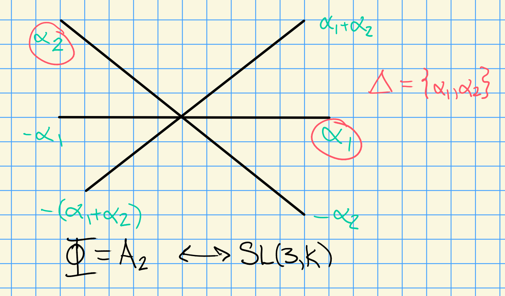
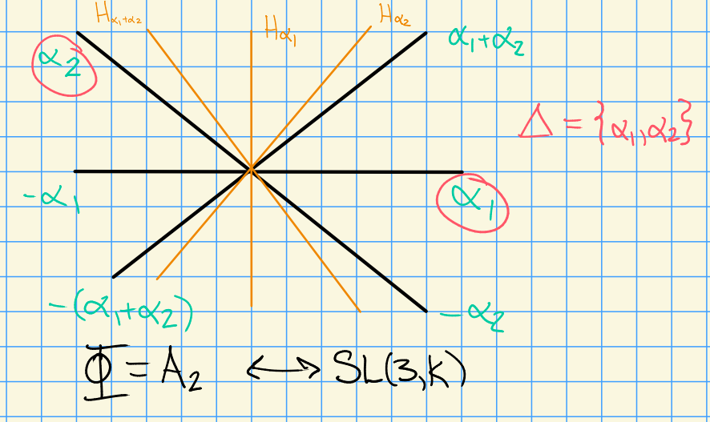
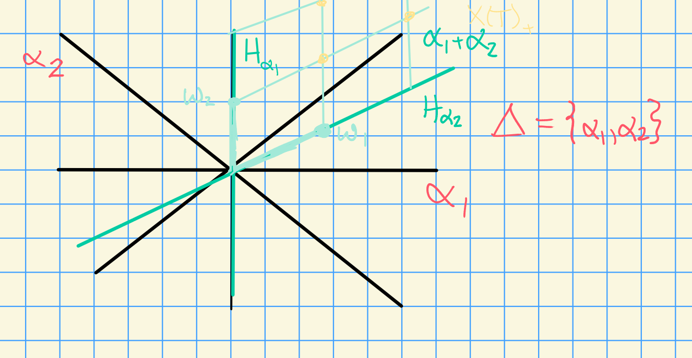

# Wednesday, August 26

## Review

- $G$ a reductive algebraic group over $k$
- $T = \prod_{i=1}^n \GG_m$ a maximal split torus
- $\lieg = \mathrm{Lie}(G)$
- There's an induced root space decomposition $\lieg = t\oplus \bigoplus_{\alpha\in \Phi}\lieg_\alpha$
- When $G$ is simple, $\Phi$ is an *irreducible* root system
  - There is a classification of these by Dynkin diagrams

:::{.example}
$A_n$ corresponds to $\liesl(n+1, k)$ (mnemonic: $A_1$ corresponds to $\liesl(2)$)
:::

- We have representations $\rho: G\to \GL(V)$, i.e. $V$ is a $G\dash$module
- For $T\subseteq G$, we have a weight space decomposition: 
  $V = \bigoplus_{\lambda \in X(T)} V_\lambda$ where $X(T) = \hom(T, \GG_m)$.

  > Note that $X(T) \cong \ZZ^n$, the number of copies of $\GG_m$ in $T$.

## Root Systems and Weights

:::{.example}
Let $\Phi = A_2$, then we have the following root system:

:::

In general, we'll have $\Delta = \ts{\alpha_1, \cdots, \alpha_n}$ a basis of *simple roots*.

:::{.remark}
Every root $\alpha\in I$ can be expressed as either positive integer linear combination (or negative) of simple roots.
:::

For any $\alpha\in \Phi$, let $s_\alpha$ be the reflection across $H_\alpha$, the hyperplane orthogonal to $\alpha$.
Then define the *Weyl group* $W = \ts{s_\alpha \st \alpha\in \Phi}$.

:::{.example}
Here the Weyl group is $S_3$:

:::

:::{.remark}
$W$ acts transitively on bases.
:::

:::{.remark}
$X(T) \subseteq \ZZ\Phi$, recalling that $X(T) = \hom(T, \GG_m) = \ZZ^n$ for some $n$.
Denote $\ZZ\Phi$ the *root lattice* and $X(T)$ the *weight lattice*.
:::

:::{.example}
Let $G = \liesl(2, \CC)$ then $X(T) = \ZZ\omega$ where $\omega = 1$, $\ZZ \Phi = \ZZ\ts{\alpha}$
Then there is one weight $\alpha$, and the root lattice $\ZZ\Phi$ is just $2\ZZ$.
However, the weight lattice is $\ZZ\omega = \ZZ$, and these are not equal in general.
:::

:::{.remark}
There is partial ordering on $X(T)$ given by $\lambda \geq \mu \iff \lambda - \mu = \sum_{\alpha\in \Delta} n_\alpha \alpha$ where $n_\alpha \geq 0$.
(We say $\lambda$ *dominates* $\mu$.)
:::

:::{.definition title="Fundamental Dominant Weights"}
We extend scalars for the weight lattice to obtain $E \da X(T) \tensor_\ZZ \RR \cong \RR^n$, a Euclidean space with an inner product $\inner{\wait}{\wait}$.

For $\alpha\in \Phi$, define its *coroot* $\alpha\dual \da {2\alpha \over \inner{\alpha}{\alpha}}$.
Define the *simple coroots* as $\Delta\dual \da \ts{\alpha_i\dual}_{i=1}^n$, which has a dual basis $\Omega \da \ts{\omega_i}_{i=1}^n$ the *fundamental weights*.
These satisfy $\inner{\omega_i}{\alpha_j\dual} = \delta_{ij}$.

\todo[inline]{What is the notation for fundamental weights? Definitely not $\Omega$ usually!}

> Important because we can index irreducible representations by fundamental weights.

A weight $\lambda\in X(T)$ is *dominant* iff $\lambda \in \ZZ^{\geq 0} \Omega$, i.e. $\lambda = \sum n_i \omega_i$ with $n_i \in \ZZ^{\geq 0}$.
:::

If $G$ is simply connected, then $X(T) = \bigoplus \ZZ \omega_i$.

> See Jantzen for definition of simply-connected, $\SL(n+1)$ is simply connected but its adjoint $PGL(n+1)$ is not simply connected.

## Complex Semisimple Lie Algebras

When doing representation theory, we look at the Verma modules $Z(\lambda) = U(\lieg) \tensor_{U(\lieb^+)} \lambda \surjects L(\lambda)$.

:::{.theorem title="?"}
$L(\lambda)$ as a finite-dimensional $U(\lieg)\dash$module $\iff$ $\lambda$ is dominant, i.e. $\lambda \in X(T)_+$.
:::

Thus the representations are indexed by lattice points in a particular region:

**Question 1**:

Suppose $G$ is a simple (simply connected) algebraic group.
How do you parameterize *irreducible* representations?

For $\rho: G\to \GL(V)$, $V$ is a *simple module* (an *irreducible representation*) iff the only proper $G\dash$submodules of $V$ are trivial.

**Answer 1**:
They are also parameterized by $X(T)_+$.
We'll show this using the induction functor $\ind_B^G \lambda =H^0(G/B, \mathcal{L}(\lambda))$ (sheaf cohomology of the flag variety with coefficients in some line bundle).

> We'll define what $B$ is later, essentially upper-triangular matrices.

**Question 2**:
What are the dimensions of the irreducible representations for $G$?

**Answer 2**:
Over $k=\CC$ using Weyl's dimension formula.

For $k = \bar{\FF}_p$: conjectured to be known for $p\geq h$ (the *Coxeter number*), but by Williamson (2013) there are counterexamples.
Current work being done!

