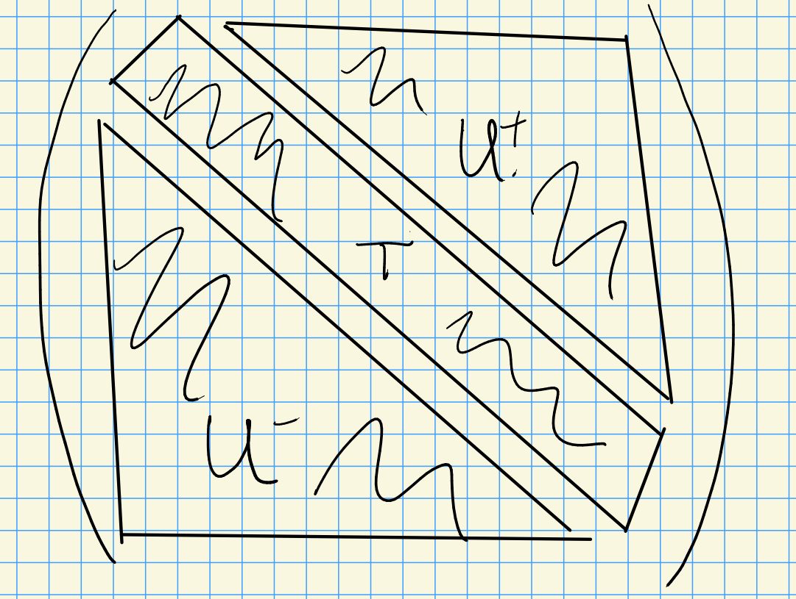

# Monday, August 31

## Review of Representation Theory of Modules

Take $R$ a ring, then consider $M$ an $R\dash$module to be a "vector space" over $M$.
Note that $M$ is an $R\dash$module $\iff$ there exists a ring morphism $\rho: R\to \hom_{\text{AbGrp}}(M, M)$.

Now let $G$ be a group and consider $G\dash$modules $M$.
Then a $G\dash$module will be defined by taking $M/k$ a vector space and a $G\dash$action on $M$.
This is equivalent to having a group morphism $\rho: G\to \GL(M)$.

For $M$ a $G\dash$module, given a group action, define
\[  
\rho: G&\to \GL(M) \\
\rho(g)(m) &= g.m
\]
where $\rho(h): M\to M$.

Similarly, for $\rho: G\to \GL(M)$ a group morphism, define the group action $g.m \da \rho(g)m$.
Thus representations of $G$ and $G\dash$modules are equivalent.

:::{.definition title="?"}
Let $M$ be a $G\dash$module.

1. $M$ is a *simple* $G\dash$module (equivalently an *irreducible representation*) $\iff$ the only $G\dash$submodules (equiv. $G\dash$invariant subspaces) are $0, M$.

2. $M$ is *indecomposable* $\iff$ $M$ can not be written as $M = M_1 \oplus M_2$ with $M_i < M$ proper submodules.
:::

:::{.example}
For $G = \SL(n, \CC)$, there is a natural $n\dash$dimensional representation $M = V$, and this is irreducible.
:::
\todo[inline]{What is $V$?}

:::{.example}
Let $R = \ZZ$, so we're considering $\ZZ\dash$modules.
For $M=\ZZ$, $M$ is not simple since $2\ZZ < \ZZ$ is a proper submodule.
However $M$ is indecomposable.
:::

Recall from last time: we defined a functor $\ind_H^G(\wait): H\dash\text{mod} \to G\dash\text{mod}$, where $\ind_H^G = \qty{k[G] \tensor M}^H$, the $H\dash$invariants.
This functor is left-exact but not right-exact, so we have cohomology $R^j \ind_H^G$ by taking right-derived functors.

Goal: classify simple $G\dash$modules for $G$ a reductive connected algebraic group.

:::{.example}
For $G = \GL(n , k)$, we have a decomposition

:::

We have

- $B = T\semidirect U$ the negative Borel,
- $B = T\semidirect U^+$ the Borel

For $U\dash$modules: 
$k$ is the only simple $U\dash$module.
Importantly, if $V$ is a $U\dash$module, then the fixed points are never zero, i.e. $V^U = \hom_{U\dash\text{Mod}}(k, V) \neq 0$.

For $B\dash$modules: 
let $X(T) \da \hom(T, \GG_m) = \hom(T, \GL(1, k))$.
These are the simple representations for the torus $T$.
Thus $\lambda \in X(T)$ represents a simple $T\dash$module.

We have a map $B \to B/U = T$, so we can pullback $T\dash$representations to $B\dash$representations ("inflation"), since we have a map $T\to \GL(1, k)$ and we can just compose.
So $\lambda$ is a 1-dimensional (simple) $B\dash$module where $U$ acts trivially.

Lee's theorem: all irreducible representations for $B$ are one-dimensional.
Thus these are the simple $B\dash$modules.

For $G\dash$modules:
define $\nabla(\lambda) \da \ind_B^G(\lambda) = H^0(\lambda)$.

Questions:

1. When does $H^0(\lambda) = 0$?
2. What is $\dim_{k\dash\text{Vect}} H^0(\lambda)$?
3. What are the composition factors of $H^0(\lambda)$? 

  > Known in characteristic zero, wildly open in positive characteristic.

:::{.remark}
Another interpretation: look at the flag variety $G/B$ and take global sections, then $H^0(\lambda) = H^0(G/B, \mathcal{L}(\lambda))$ where $\mathcal{L}$ is given by projecting the fiber product $G \cross_B \lambda \surjects G/B$ onto the first factor.
:::

:::{.remark}
\hfill

1. $H^0(k) = H^0(\thevector{0, \cdots, 0}) = k[G/B] = k$.
2. $H^0(M) = M$ if $M$ is a $G\dash$module.
3. A $G\dash$module $M$ is *semisimple* iff $M = \bigoplus_{i\in I} M_i$ with each $M_i$ are simple.
4. Can consider the largest semisimple submodule, the *socle* $\soc_G(M)$.
:::

\begin{center}
\begin{tikzcd}
L_4 \ar[dr] & & L_5 \oplus L_7\ar[dl] \\
& \qty{L_1 \oplus L_2 \oplus L_3} = \soc_G(M)) & \\
\end{tikzcd}
\end{center}

Goal: classify simple $G\dash$modules.
Strategy: used dominant highest weights.

> As opposed to Verma modules, the irreducibles will be a dual situation where they sit at the bottom of the module.
> Indicated by the notation $\nabla$ pointing down!

:::{.proposition title="?"}
Let $\lambda \in X(T)$ with $H^0(\lambda) \neq 0$.

1. $\dim H^0(\lambda)^{U^+} = 1$ and $H^0(\lambda)^{U^+} = H^0(\lambda)_\lambda$.
2. Every weight of $H^0(\lambda)$ satisfies $w_u \lambda \leq \mu \leq \lambda$, where $w_0$ is the longest Weyl group element and $\alpha\leq \beta \iff \alpha-\beta \in \ZZ^{+}\Phi$.

> Note that in fact $\ell(w_0) = \abs{\Phi^+}$.
:::

:::{.example}
Take $A_2$ with simple reflections $s_{\alpha_1}, s_{\alpha_2}$ and $\Delta = \ts{\alpha_1, \alpha_2}$.
\begin{center}
\begin{tikzcd}
& 1\ar[ld] \ar[rd] & \\
s_{\alpha_1} \ar[d] & & s_{\alpha_2}\ar[d] \\
s_{\alpha_1}s_{\alpha_2}\ar[rd] & & s_{\alpha_2} s_{\alpha_1}\ar[ld] \\
& s_{\alpha_2} s_{\alpha_1}s_{\alpha_1} = s_{\alpha_1} s_{\alpha_2} s_{\alpha_1} = w_0 & 
\end{tikzcd}
\end{center}
:::

:::{.proof title="(Sketch)"}
We can write
\[  
H^0(\lambda) = \ts{f\in k[G] \st f(gb) = \lambda(b)^{-1} f(g) \, b\in B, g\in G}
.\]

Suppose $f\in H^0(\lambda)^{U^+}$ and $u_+ \in U^+, t\in T, u\in U$.
Then 
\[  
\qty{ u_+^{-1} f} (tu) 
&= f(tu) \\
&= \lambda(t)^{-1} f(1)
.\]
On the other hand,
\[  
\qty{ u_+^{-1} f} (tu) 
&= f(u_+ t u)
.\]

So by density, $f(1)$ is determined by $f(u_+ t u)$ and $\dim H^0(\lambda)^{U^+} \leq 1$.
But since this can't be zero, the dimension must be equal to 1.
:::

:::{.proposition title="?"}
Let 
\[  
\eps: H^0(\lambda) \to \lambda
\]
be the evaluation morphism.

This is a morphism of $B\dash$modules, and in particular is a morphism of $T\dash$modules.
Thus the image of a weight $\mu \neq \lambda$ is zero, so $\eps$ is injective.
:::

:::{.proof}
We have 
\[  
f(u_+ t u) = \lambda(t)^{-1} f(1) = \lambda(t)^{-1} \eps(f)
.\]

Suppose $f\in H^0(\lambda)^{U^+}$ and $\eps(f) = 0$.
Then $f(u_+ t u) = 0$, and by density $f\equiv 0$, showing injectivity.

Therefore $H^0(\lambda)^{U^+}\subset H^0(\lambda)_\lambda$.
Suppose $\mu$ is maximal among weights in $H^0(\lambda)$.
Then
\[  
H^0(\lambda)_{\mu} \subseteq H^0(\lambda)^{U^+}
\]
because $U^+$ raises weights.

But $H^0(\lambda)^{U^+} \subseteq H^0(\lambda)_\lambda$ implies $\mu = \lambda$.
Thus the maximal weight in $H^0(\lambda)$ is $\lambda$.

> Recall the situation in lie algebras: $g_\alpha v \in V_{\lambda + \alpha}$ when $v\\in V_{\lambda}$.

Since $\lambda$ is maximal, any other weight $\mu$ satisfies $\mu \leq \lambda$.
Thus 
\[  
H^0(\lambda)_\lambda \subseteq H^0(\lambda)^{U^+} \subseteq H^0(\lambda)_\lambda
,\]
forcing these to be equal and finishing part 1.
:::

