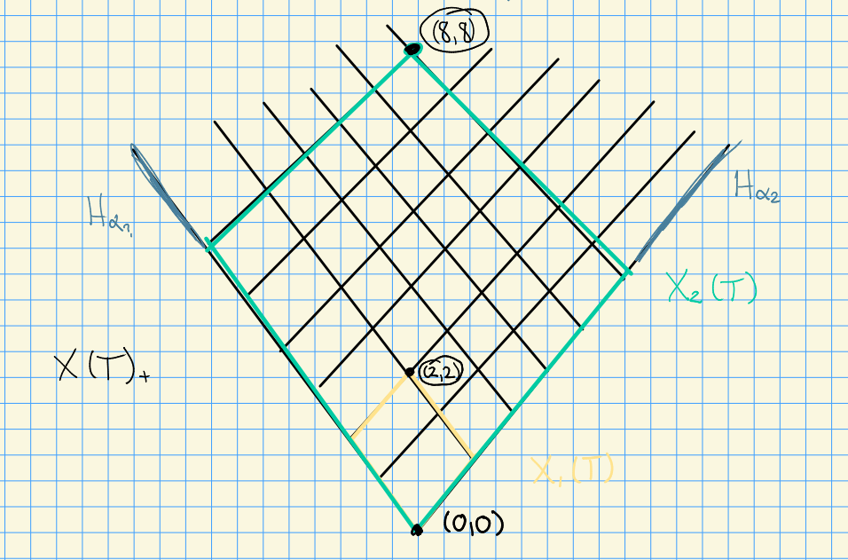

# Monday, September 21

Let $G$ be a reductive algebraic group scheme, $k=\bar \FF_p$ with $p>0$, equipped with the Frobenius map  $F:G\to G$ with $F^r$ its $r\dash$fold composition.
We defined *Frobenius kernels* $G_r \da \ker F^r$, which are in correspondence with the cocommutative Hopf algebras $\Dist(G_r)$.

Goal:
We want to classify simple $G_r\dash$modules, and to do this we'll use socles.

We have a maximal torus $T\subseteq G$ and thus $T_r \subseteq G_r$ after acting by Frobenius.
This yields a SES
\[  
0 \to p_r X(T) \to X(T) \to X(T)/p^r X(T) = X(T_r) \to 0
.\]

How to think about this: take $\lambda \in X(T_r)$, then we can write $\lambda = \lambda + p^r \sigma$ in $X(T_r)$ for some other weight $\sigma \in X(T)$.
We'll define the "baby Verma modules"
\[  
Z_r(\lambda) \da \coind_{B_r^+}^{G_r} \lambda \\
Z_r'(\lambda) \da \ind_{B_r^+}^{G_r} \lambda
,\]

and we have $\dim Z_r(\lambda) = \dim Z_r'(\lambda) = p^{r \abs{\Phi^+}}$.

:::{.proposition title="?"}
Let $\lambda\in X(T)$ be a weight.

1. $Z_r(\lambda)\downarrow_{B_r}$ is the *projective cover* of $\lambda$ and the *injective hull* of $\lambda - 2 (p^r-1) \rho$.

2. $Z_r'(\lambda)\downarrow_{B_r^+}$ is the *injective hull* of $\lambda$ and the *projective cover* of $\lambda - 2 (p^r-1) \rho$.
:::

> Note the latter are $T_r\dash$modules, so we let $U^+$ act trivially.

:::{.proof title="of 1"}
What we need to do:

1. Show $Z_r(\lambda)\downarrow_{B_r}$ is projective.
2. Show $Z_r(\lambda)$ is the smallest projective module such that $Z_r(\lambda) \surjects \lambda$.

For (1), we can write 
\[
\Dist(G_r) = \Dist(U_r^+) \Dist(B_r) = \Dist(B_r^+) \Dist(U_r),
,\]
and so
\[  
Z_r(\lambda) 
&= \coind_{B_r^+}^{G_r} \lambda \\
&= \qty{\dist(G_r) \tensor_{\Dist(B_r)} \lambda} \downarrow_{B_r^+} \\
&= \Dist(U_r^+)\tensor \lambda \\
&= \Dist(B_r^+) \tensor_{\Dist(T_r)} \lambda \\
&= \coind_{T_r}^{B_r^+} \lambda
.\]

Why is this projective? 
Look at cohomology, suffices to show that higher Exts vanish.
So consider
\[  
\ext_{B_r^+}^n(\coind_{T_r}^{B_r^+}, M) 
&= \ext_{T_r}^n (\lambda, M) \qquad\text{by Frobenius reciprocity} \\
&= 0 \qquad \text{for } n \geq 0
,\]
since representations for $T_r$ are completely reducible, and we've used the fact that $\coind_{T_r}^{B_r^+}(\wait)$ is exact.

> Note: general algebra fact that higher exts vanish for projective modules.

For (2), we can write
\[  
\hom_{B_r^+}(Z_r(\lambda), \mu)
&= \hom_{B_r^+}(\coind_{T_r}^{B_r^+} \lambda, \mu) \\
&= \hom_{T_r} (\lambda, \mu) \qquad\text{by Frobenius reciprocity} \\
&=
\begin{cases}
k \& \lambda = \mu \\
0 \& \text{else}.
\end{cases}
\]

Thus $Z_r(\lambda) / \Rad Z_r(\lambda) \downarrow{B_r^+} = \lambda$.

If we now write $A= \Dist(B_r^+)$ and $\lieg = \lien^+ \oplus t \oplus \lien$ with $\lieb^+ \da \lien^+ \oplus t$,
\[
\sum_S \qty{\dim P(S)} \qty{\dim(S)} \\
&= \sum_{\lambda \in X(T_r)} \qty{\dim Z_r(\lambda)} \qty{\dim \lambda} \\
&= \sum_{\lambda \in X(T_r)} p^{r\abs{\Phi^+}} \cdot 1 \\
&= \abs{X(T_r)} p^{r\abs{\Phi^+}} \\
&= p^{rn} p^{r\abs{\Phi^+}} \qquad n = \dim t\\
&= p^{r \dim \lieb^+} \\
&= \dim A
\]

:::

## Simple $G\dash$modules

We know that after taking fixed points, $Z_r(\lambda)^{U_r}$ and $Z_r'(\lambda)^{U_r^+}$ are one-dimensional, and thus
\[  
Z_r(\lambda) / \Rad Z_r(\lambda) \cong L_r(\lambda) \qquad \soc_{G_r} Z_r'(\lambda) = L_r(\lambda)
\]
following the same argument considering $H_0(\lambda)$.

For any $\lambda \in X(T_r)$ we have $0\neq L_r = \soc_{G_r} Z_r'(\lambda)$.
By the one-dimensionality above, we know 
\[  
L_r(\mu) = L_r(\lambda) \iff \lambda = \mu \in X(T_r)
.\]

Letting $N$ be a simple $G_r\dash$module, we can consider it as a $B_r\dash$module, and the simple $B_r\dash$modules are one dimensional and obtained from simple $T_r\dash$modules.
We then know that for some $\lambda \in X(T_r)$,
\[  
0 \neq \hom_{B_r}(N, \lambda) \\
&= \hom_{G_r}(N, \ind_{B_r}^{G_r} \lambda)
,\]
which implies that $N\injects \ind_{B_r}^{G_r} \lambda = Z_r'(\lambda)$ as a submodule, and thus $N = L_r(\lambda)$.

:::{.theorem title="Main Theorem"}
Let $\Lambda$ be a set of representatives of $XX(T) / p^r X(T) \cong X(T_r)$.
Then there exists a one-to-one correspondence
\[  
\Lambda \iff \ts{L_r(\lambda) \lambda \in \Lambda}
,\]
where the RHS are simple $G_r\dash$modules.

:::

How to think about this: **restricted regions**.
Choose dominant weights as representatives
\[  
X_r(T) 
&= \ts{\lambda \in X(T)_+ \st 0\leq \inner{\lambda}{\alpha\dual} < p^r\, \forall \alpha\in \Delta } \\
&= \ts{\lambda \in X(T)_+ \st \lambda = \sum_{i=1}^\ell n_i w_i,\, 0\leq n_j \leq p^r-1\, \forall j} \\
.\]

Pictures:

Some facts:

If $\lambda \in X(T)_+$, then $L(\lambda)$ is a simple $G\dash$module.

**Question 1**:
What happens when we restrict $L(\lambda)\downarrow_{G_r}$?

**Answer**:
This remains irreducible over $G_r$ iff $\lambda \in X_r(T)$, i.e. if $L(\lambda)\downarrow_{G} \cong L_r(\lambda)$ when $\lambda \in X_r(T)$.

**Question 2**:
Given $L(\lambda)$ for $\lambda \in X(T)_+$, can we express $L(\lambda)$ in terms of simple $G_r\dash$modules?

**Answer**:
Yes, can be formulated in terms of *Steinberg's twisted tensor product*.

