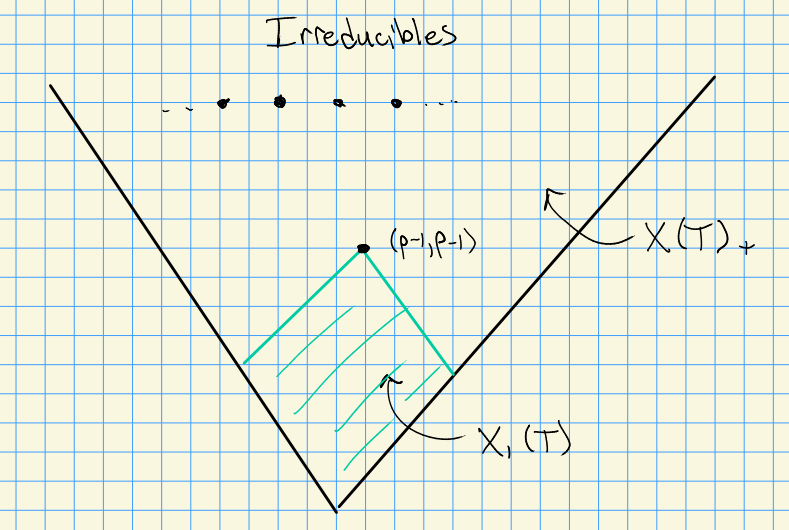
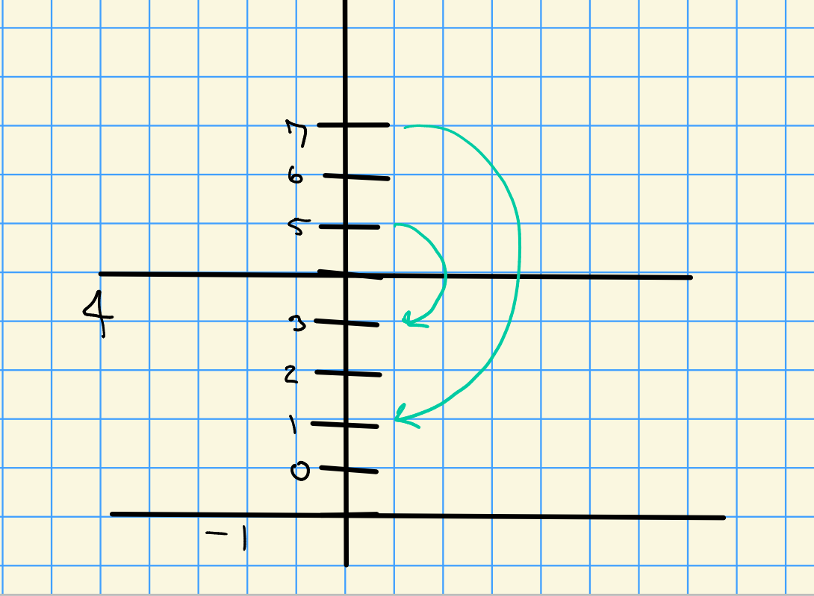
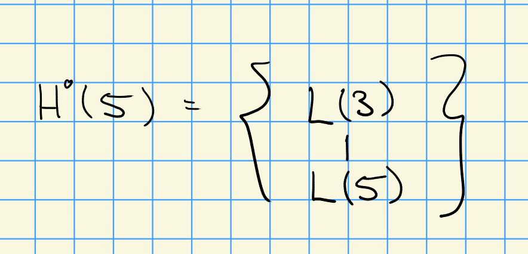
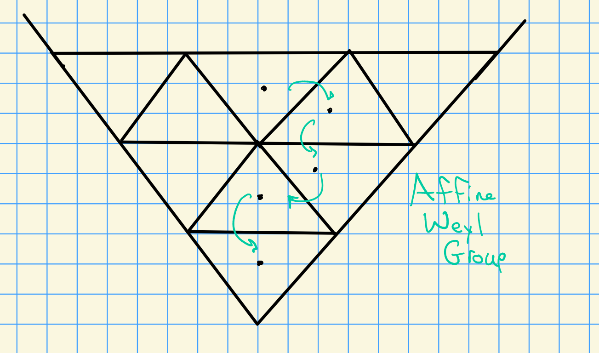

# Friday, September 25

## Review and Proposition

From last time: Steinberg's tensor product.

Let $G$ be a reductive algebraic group scheme over $k$ with $\ch(k) > 0$.
We have a Frobenius $F:G\to G$, we iterate to obtain $F^r$ and examine the Frobenius kernels $G_r\da \ker F^r$.

If we have a representation $\rho: G\to \GL(M)$, we can "twist" by $F^r$ to obtain $\rho^{(r)}: G \to \GL(M^{(r)})$.
We have

<!--\begin{center}-->
<!--\begin{tikzcd}-->
<!--G \ar[r, "{F^r}"] \ar[rr, "{\rho^{(r)}}" & G\ar[r, "\rho"] & \GL(M)-->
<!--\end{tikzcd}-->
<!--\end{center}-->

Here $M^{(r)}$ has the same underlying vector space as $M$, but a new module structure coming from $\rho^{(r)}$.
Note that $G_r$ acts trivially on $M^{(r)}$.

- $\ts{L(\lambda) \st \lambda \in X(T)_+}$ are the simple $G\dash$modules,
- $\ts{L_r(\lambda) \st \lambda \in X_r(T)_+}$ are the simple $G_r\dash$modules,

Note that $L(\lambda)\downarrow_{G_r}$ is semisimple, equal to $L_r(\lambda)$ for $\lambda \in X_r(T)$.

> 1960's, Curtis and Steinberg.

:::{.proposition title="?"}
Let $\lambda \in X_r(T)$ and $\mu \in X(T)_+$.
Then
\[  
L(\lambda + p^r \mu) \cong L(\lambda) \tensor L(\mu)^{(r)}
.\]

:::

Recall that socle formula: letting $M$ be a $G\dash$module, we have an isomorphism of $G\dash$modules:
\[ 
\soc_{G_r} \cong \bigoplus_{\lambda \in X_r(T)} L(\lambda) \tensor \hom_{G_r}(L(\lambda), M)
.\]

## Proof

:::{.proof}
Let $M = L(\lambda + p^r \mu)$.
Then from the socle formula, only one summand is nonzero, and thus $\hom_{G_r}(L(\lambda), M)$ must be simple.
Then there exists a $\tilde \lambda \in X_r(T)$ and a $\tilde \mu \in X(T)_+$ such that
\[  
M = L(\tilde \lambda) \tensor L(\tilde\mu)^{(r)}
.\]

We now compare highest weights: 
\[  
\lambda + p^r \mu = \tilde \lambda + p^r \tilde \mu \implies \lambda = \tilde \lambda \qtext{and} \mu = \tilde \mu
.\]

:::

:::{.theorem title="Steinberg"}
Let $\lambda \in X(T)_+$, with a $p\dash$adic expansion
\[  
\lambda = \lambda_0 + \lambda_1 p + \cdots + \lambda_m p^m
.\]
where $\lambda_j \in X_1(T)$ for all $j$.
Then
\[  
L(\lambda) = L(\lambda_0) \tensor \bigotimes_{j=1}^m L(\lambda_j)^{(j)}
.\]
:::

:::{.corollary title="?"}
In order to know $\dim L(\lambda)$ for $\lambda \in X(T)_+$, it is enough to know $\dim L_1(\mu)$ for $\mu \in X_1(T)$.
Schematic:

:::

## Some History

Recall that simplie $G_1\dash$modules correspond to simple $\Dist(G_1)\dash$modules, and $\Dist(G_1) \cong U(\lieg)$.

- 1980: Lusztig proved conjecture: $\ch L(\lambda)$ for $\lambda \in X_1(T)$ is given by KL polynomials, shown for $p \geq 2(h-1)$.

- Kato showed for $p> h$, where $h$ is the *Coxeter number* satisfying $h = \inner{\rho}{\alpha_i \dual} + 1$ where $\alpha_i\dual$ is the highest short root.

- 1990's: A relation to representations of quantum groups $U_q$ and affine lie algebras $\hat \lieg$:
\begin{center}
\begin{tikzcd}
\mod u(\lieg) & \ar[l] \mod U_q(\lieg) \ar[r, "\cong"] & \mod\hat\lieg
\end{tikzcd}
\end{center}
The first map is due to Andersen-Jantzen-Soergel for $p\gg 0$ with no effective lower bounds, and the equivalence is due to Kazhdan-Lusztig, where the L conjecture holds for $\hat \lieg$.

- 2000's: Fiebig showed the L conjecture holds for $p>N$ where $N$ is an effective (but large) lower bound.

- 2013: Geordie Williamson shows L conjecture is false, with infinitely many counterexamples, and no lower bounds that are linear in $h$.

> See Donkin's Tilting Module conjecture: expected that characters may come from $p\dash$KL polynomials instead.

:::{.example}
Let $G= \SL(2)$, so $\dim T =1$.
Here the restricted region of weights is given by $X_!(T) = \ts{0,1,\cdots, p-1}$.
Then $H^0(\lambda) = S^\lambda(V)$ for $\lambda \in X(T)_+ = \ZZ_{\geq 0}$ and $L(\lambda) \subseteq H^0(\lambda)$.

:::{.theorem title="?"}
\[  
L(\lambda) =  H^0(\lambda) \qtext{for} \lambda \in X_1(T)
.\]
:::

::: {.theorem title="?"}
\[  
\dim L(\lambda) = \lambda + 1 \qtext{for} \lambda \in X_1(T)
.\]
:::

Take $p=3$.
Then $\dim L(0) = 1$, $\dim L(1) = 2$ (the natural representation), and $\dim L(2) = 3$ (the adjoint representation).
Then for $p=4$, we have to use the twisted tensor product formula.
Taking the 3-adic expansion $4 = 1\cdot 3^0 + 1\cdot 3^1$, we have
\[  
L(4) = L(1) \tensor L(1)^{(1)}
.\]

Since $\dim L(1) = 2$, we get $\dim L(4) = 4$.

Similarly, considering $7 = 1\cdot 3^0 + 2\cdot 3^1$, we get
\[  
L(7) \cong L(1) \tensor L(2)^{(1)}
\]
and so $\dim L(7) = 6$.

Take $p=5$, then

- $\dim L(0) = 1$
- $\dim L(1) = 2$
- $\dim L(2) = 3$
- $\dim L(3) = 4$
- $\dim L(4) = 5$

What is $H^0(5)$? 
We know $L(5)$ is a submodule, and we can write the character
\[  
\ch H^0(5) = e^5 + e^3 + e^1 + e^{-1} + e^{-3} + e^{-5}
.\]

We know $\ch(L(1)) = e^1 + e^{-1}$ and $L(5) = L(1)^{(1)}$, so we can write $\ch L() = e^{5} + e^{-5}$.
By quotienting, we have $\ch H^0(5) - \ch L(5) = e^3 + e^1 + e^{-1} +e^{-3} = \ch L(3)$.
Thus the composition factors of $H^0(5)$ are $L(5)$ and $L(3)$.

These correspond to an action of the affine Weyl group:

There is a **strong linkage principle** which describes the possible composition factors of $H^0(\lambda)$.

We can thus find the socle/head structure:

Thus $\ext_G^1(L(5), L(3)) \cong k$.
:::

> Note that in other types, we don't know the characters of the irreducibles in the restricted region, so we don't necessarily know the composition factors.

