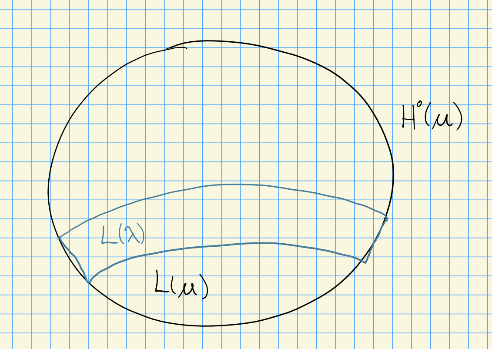

# Wednesday, September 30

Recall that we had a dominant weight $\lambda \in X(T)_+$ with

\begin{center}
\begin{tikzcd}
& V(\lambda)\ar[dl, "\surjects"]\ar[dr, "\injects"] & \\
L(\lambda)\ar[dr, "\injects"] & &T(\lambda)\ar[dl, "\surjects"] \\
& H^0(\lambda) &
\end{tikzcd}
\end{center}

where we have a module with both a *good* and a *Weyl* filtration.

If $B\subseteq P \subseteq G$ with $P$ parabolic and $M\in \Mod(G)$, we have a "transfer theorem": maps
\[  
H^n(G; M) \mapsvia{\res} H^n(P; M) \mapsvia{\res} H^n(B; M)
\]
induced by restrictions which are isomorphisms.

:::{.proposition title="?"}
Let $M\in \Mod(P)$ with $P\supseteq B$.

a. If $\dim M < \infty$ then $\dim H^n(P; M) < \infty$.

b. If $H^j(P; M) \neq 0$ then there exists a weight $\lambda$ of $M$ such that $-\lambda \in \NN \Phi^+$ and $\height(-\lambda) \geq j$. 

:::

> Part (a) is proved in the book, we won't show it here.

:::{.proof title="of part b"}
Suppose $H^j(P; M) \neq 0$, then we have an injective resolution $I_*$ for $k$.
Tensoring with $M$ yields an injective resolution for $M$,
\[  
0 \to M \to I_0\tensor M \to I_1 \tensor M \to \cdots
.\]
Since $H^j(B; M) \neq 0$, we know that the cocycles 
$\hom_B(k, I_j\tensor M) \neq 0$
and thus
$\hom_T(k, I_j\tensor M) \neq 0$.

So there exists a weight $-\lambda$ of $I_j$ with $\height(-\lambda) \geq j$, and we know $\lambda$ is a weight of $M$ applying the previous lemma:
namely we know that $\lambda$ is invariant under the torus action, so there is a weight $-\lambda$ such that $-\lambda + \lambda = 0$.
:::
\todo[inline]{? Why the last part?}

:::{.theorem title="?"}
Let $\lambda, \mu \in X(T)_+$, then

1. The cohomology in the tensor product is zero, except in one special case:
\[  
H^i(G, H^0(\lambda) \tensor H^0(\mu))
=
\begin{cases}
0 & i>0 \\
k & i=0, \lambda = -w_0\mu
\end{cases}
.\]

2. There are only extensions in one specific situation:
\[  
\Ext_G^i(V(\mu), H^0(\lambda)) = 
\begin{cases}
0 & i> 0 \\
k & i=0, \lambda = \mu
\end{cases}
.\]

:::

The following is an important calculation!

:::{.proof}
Step 1: 
We'll use Frobenius reciprocity twice.
We can write the term of interest in two ways:
\[  
H^i(G, H^0(\lambda) \tensor H^0(\mu)) =
H^i(B, H^0(\lambda) \tensor \mu)
\\ \\
H^i(G, H^0(\lambda) \tensor H^0(\mu)) =
H^i(G, \lambda \tensor H^0(\mu))
.\]

Thus there exists a weight $\nu$ of $H^0(\lambda)$ and $\nu'$ of $H^0(\mu)$ such that
\[  
\mu + \nu, \lambda + \nu' \in - \NN \Phi^+ \quad \height(\mu+\nu), \height(\lambda + \nu') \leq -i
.\]

Since $w_0\lambda$ (resp. $w_0\mu$) is the lowest of weight of $H_0(\lambda)$ (resp. $H_0(\mu)$), it follows that 
\[  
\mu + w_0 \lambda, \lambda + w_0\mu \in -\NN \Phi^+
.\]

Since $w_0^2 = \id$, we can write $\lambda + w_0\mu = w_0(\mu + w_0 \lambda)$.
We know that the LHS is in $-\NN \Phi^+$, and the term in parentheses on the RHS is also in $-\NN \Phi^+$.
Applying $w_0$ interchanges $\Phi^\pm$, so the RHS is in $\NN \Phi^+$.
But $\NN \Phi^+ \intersect -\NN\Phi^+ = \ts 0$, forcing $\lambda + w_0 \mu = 0$ and thus $\lambda = -w_0 \mu$.

Since the height of zero is zero, we have
\[  
0 = \height(\lambda + w_0 \mu)
\leq \height(\lambda + \nu') \leq -i \implies i=0
.\]
This shows cohomological vanishing for $i>0$, the first case in the theorem statement.

For the remaining case, we can check that $H^0(\lambda)^{U} = H^0(\lambda)_{w_0 \lambda}$,
and so
\[  
\qty{H^0(\lambda) \tensor -w_0 \lambda}^{U^+} = k
.\]
This shows that $H^0(B; H^0(\lambda) \tensor -w_0\lambda ) \cong k$, since 
\[  
\qty{H^0(\lambda) \tensor -w_0 \lambda}^B = \qty{ \qty{H^0(\lambda) \tensor -w_0 \lambda }^U }^T
.\]
:::

:::{.proposition title="?"}
Let $\lambda, \mu \in X(T)_+$ with $\lambda \not> \mu$.
Then we can calculate the $i$th ext by computing the $i-1$st: for $i>0$,
\[  
\Ext^i_G(L(\lambda), L(\mu))
\cong
\Ext^{i-1}_G(L(\lambda), H^0(\mu) / \soc_G(H^0(\mu)))
.\]
:::

:::{.remark}
We showed this in a special case.
Let $i=1$ with $\lambda \not> \mu$, then
\[  
\Ext_G^1(L(\lambda), L(\mu)) \cong
\Hom_G(L(\lambda), H^0(\mu) / \soc_G(H^0(\mu)))
.\]
Thus it suffices to understand only the previous layer:

:::

:::{.proof}
Consider the SES
\[  
0 \to L(\mu) \to H^0(\mu) \to H^0(\mu) / \soc_G(H^0(\mu)) \to 0
\]
which yields a LES in homology by applying $\hom_G(L(\lambda), \wait)$.
To obtain the statement, it suffices to show $\Ext_G^1(L(\lambda), H^0(\mu)) = 0$ for $i>0$, since this is the middle column in the LES.

We can write
\[  
\Ext_G^i(L(\lambda), H^0(\mu))
=
H^i(G, L(\lambda)\dual \tensor H^0(\mu)) \quad\text{taking duals} \\
=
H^i(B, L(\lambda)\dual \tensor \mu) \quad\text{by Frobenius reciprocity}
,\]
so we can obtain a weight $\sigma$ of $L(\lambda)\dual \tensor \mu$ such that $\sigma \in - \NN \Phi^+$ and $\height(-\sigma) \geq i > 0$ by applying the previous lemma.
So $\sigma = \nu + \mu$ for $\nu$ some weight of $L(\lambda)\dual$.

By rearranging, we find that $\sigma \in \NN \Phi^-$.
Letting $\lambda$ be the lowest weight of $L(\lambda)\dual$, we find $\sigma \geq -\lambda + \mu$ (since this can only lower the weight).

But then $-\lambda + \mu \in \NN\Phi^-$, implying $-\mu + \lambda \in \NN \Phi^-$, and the LHS here is equal to $\lambda - \mu$.
This precisely says $\lambda > \mu$, which contradicts the assumption that $\lambda$ did not dominate $\mu$.
It may also be the case that $\lambda = \mu$, which is handled separately.
:::

We now want criteria for when we can find the following types of lifts:
\begin{center}
\begin{tikzcd}
 & V \\
L(\lambda) \ar[ur, "\injects"] \ar[r, "\injects"] & H^0(\lambda) \ar[u, dotted, "\injects"]
\end{tikzcd}
\end{center}

:::{.lemma title="Important!"}
Let $V$ be a $G\dash$module with $0\neq \hom_G(L(\lambda), V)$.
If

- $\hom(L(\mu), V) = 0$,

- $\Ext_G^1(V(\mu), V) = 0$ for all $\mu \in X(T)_+$ with $\mu < \lambda$,

then $V$ contains a submodule isomorphic to $H^0(\lambda)$ and such a lift/extension exists.
:::

:::{.remark}
The ext criterion will be the most important.
The idea is to quotient and continue applying it.
:::

:::{.proof}
Consider the SES
\[  
0 \to L(\lambda) \injects V \to V/L(\lambda) \to 0
\]
as well as
\[  
0 \to L(\lambda) \to H^0(\lambda) \to H^0(\lambda)/L(\lambda) \to 0
.\]

Now want to applying the LES in cohomology by applying $\hom_G(\wait, V)$, we get a LES of homs over $G$:
\[  
0 &\to \Hom(H^0(\lambda)/L(\lambda), V) \to
\Hom(H^0(\lambda) , V) \to
\Hom(L(\lambda), V)  \\
&\to \Ext^1(H^0(\lambda)/L(\lambda), V) \to \cdots
.\]
Thus it suffices to show this $\Ext^1$ is zero.

Strategy: show all of the composition factors of $H^0(\lambda)/L(\lambda)$ are zero
These are all of the form $L(\mu)$ for $\mu < \lambda$, so it now suffices to just show that $\Ext_G^1(L(\mu), V) = 0$ when $\mu < \lambda$.

Observe that we have
\[  
0 \to N \to V(\mu) \to L(\mu) \to 0
\]
where $N$ are $L(\sigma)$ composition factors for $\sigma < \mu$.
So apply $\hom(\wait, V)$:
\[  
0 
&\to
\Hom(L(\mu), V) \to
\Hom(V(\mu), V) \to
\Hom(N, V) \\
&\to
\Ext^1(L(\mu), V) \to
\Ext^1(V(\mu), V) \to \cdots
.\]

But we have $\Hom(N, V) =0$ and $\Ext^1(V(\mu), V) = 0$, which *squeezes* and forces $\Ext^1(L(\mu), V) = 0$.
:::

Next time: state and prove a cohomological criterion (Donkin, Scott, proved independently) for a $G\dash$module to admit a good filtration.
More about when tensor products of induced modules have good filtrations.

