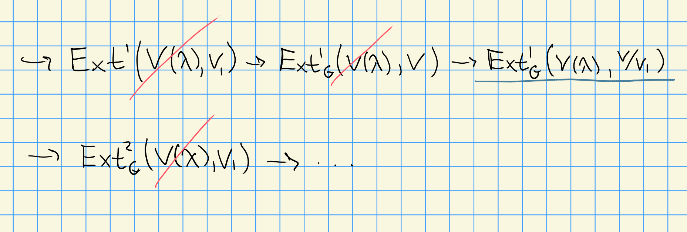
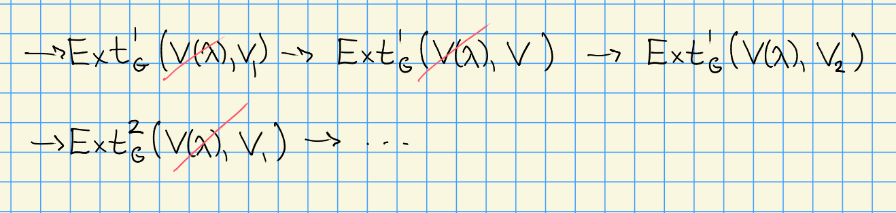

# Friday, October 02

Recall that *good filtration* is a chain $\ts{0} \subseteq V_1 \subseteq \cdots \subseteq V$ satisfying $V = \union V_i$ and $V_i/V_{i-1} \cong H^0(\lambda_i)$ for $\lambda_i$ some weight of $V$.

:::{.lemma title="?"}
Let $V$ be a $G\dash$module and $\lambda \in X(T)_+$ with $\hom_G(L(\lambda), V)$.
If $\hom_G(L(\mu), V) = 0$ for any $\mu < \lambda$ and $\Ext_G^1(V(\mu), V) = 0$ for *all* $\mu \in X(T)_+$,
then $V$ contains a submodule isomorphic to $H^0(\lambda)$.
:::

That is, we have a lift of the following form:
\begin{center}
\begin{tikzcd}
L(\lambda) \ar[d, hook] \ar[r, hook] & V \\
H^0(\lambda) \ar[ru, hook, dotted, "\exists"]
\end{tikzcd}
\end{center}

:::{.theorem title="Cohomological Condition for Good Filtrations"}
Let $V$ be a $G\dash$module.

1. If $V$ admits a good filtration, then the number of factors isomorphic to $H^0(\lambda)$, denoted $[V: H^0(\lambda)]$, is equal to $\dim \hom_G(V(\lambda), V)$.

> Analog of Jordan-Holder.
> Note that $H^0(\lambda)$ may not by irreducible, but changing the filtration can not change the number of composition factors.

2. Suppose $\hom_G(V(\lambda), V)<\infty$, then TFAE:

  - $V$ admits a good filtration.
  - $\Ext^i_G(V(\lambda), V) = 0$ for all $\lambda \in X(T)_+$ and all $i>0$.
  - $\Ext^1_G(V(\lambda), V) = 0$ for all $\lambda \in X(T)_+$.

> Much like measuring projectivity: can check all exts, or just the first.
:::

:::{.proof title="Part a"}
Suppose $V$ has a good filtration.
Idea: induct on the filtration.

Suppose $V = H^0(\lambda_1)$, then
\[  
[V: H^0(\mu) ] = 
\begin{cases}
0 & \mu \neq \lambda_1 \\
1 & \mu = \lambda_1
\end{cases}
= \dim \hom_G(V(\lambda_1), V)
,\]
since we know the dimensions of these hom spaces from a previous result.

Suppose now that we have
\[  
0 \to H^0(\mu_1) \to V H^0(\mu_2) \to 0
.\]
Applying $F \da \hom_G(V(\lambda), \wait)$, we find that $\ext^1_G$ vanishes.
So this leads a SES, and the dimensions are thus additive.
The result follows since $F$ is additive.
:::

:::{.proof title="Part b"}
$1\implies 2$:
Use the fact that $\Ext^i_G(V(\lambda), H^0(\mu)) = 0$ for all $i>0$ and all $\mu$.

$2\implies 3$:
Clear!

$3\implies 1$:
Choose a total ordering of weights $\lambda_0, \lambda_1, \cdots \in X(T)$ such that if $\lambda_i < \lambda_j$ then $i<j$.
Since $V\neq 0$, there exists a dominant weight $\lambda \in X(T)_+$ such that $\hom_G(V(\lambda), V) \neq 0$, so choose $i$ minimally in this order to produce such a $\lambda_i$.
Idea: use this to start a filtration.

Then $\hom(L(\lambda_i), V) \neq 0$, and we have
\[  
V(\lambda_i) \surjects L(\lambda_i) \injects V
.\]

We know that 
\[  
\hom_G(V(\mu), V) = 0 \quad \forall \mu < \lambda_i \\
\hom_G(L(\mu), V) = 0 \quad \forall \mu < \lambda_i \\
\Ext_G^1(L(\mu), V) = 0 \quad \forall \mu \in X(T)_+ \text{ by assumption}
.\]

So the following map must be an injection, since there is no socle:
\begin{center}
\begin{tikzcd}
          & L(\lambda_i) \ar[r, hook] \ar[d, hook] & V \\
0 \ar[r]  & H^0(\lambda_i) \ar[ur, hook] &
\end{tikzcd}
\end{center}

Set $V_1 = H^0(\lambda_i)$, so $V_1 \subseteq V$.
We then have a SES
\[  
0 \to V_1 \to V \to V/V_1 \to 0 
.\]

Applying $\hom(V(\lambda), \wait)$ we obtain

Now iterate this process to obtain a chain $V_1 \subseteq V_2 \subseteq \cdots \subseteq V$, and set $V' \da \union_{i>0} V_i$.
Then $\dim \hom_G(V(\lambda), V') = \dim \hom_G( V(\lambda), V )$ since $\dim \hom_G(V(\lambda), V) < \infty$.
But then taking the SES
\[  
0\to V' \to V \to V/V' \to 0
\]
and applying $\Hom(V(\lambda), \wait)$, we have $\Hom(V(\lambda), V/V') = 0$ and we get an isomorphism of homs.
But then $\hom(V(\lambda), V/V') = 0$ for all $\lambda \in X(T)_+$, forcing $V/V'=0$ and $V=V'$.
:::

:::{.corollary title="?"}
Let $0\to V_1 \to V \to V_2 \to 0$ be a SES of $G\dash$modules with $\dim \hom_G(V(\lambda), V_2) < \infty$ for all $\lambda \in  X(T)_+$.
If $V_1, V$ have good filtrations, then $V_2$ also has a good filtration.
:::

Note: this is likely difficult to prove without cohomology!
But here we can apply the ext criterion.

:::{.proof}
Let $\lambda \in X(T)_+$, then

:::

For $\lambda \in X(T)_+$, let $I(\lambda)$ be the injective hull of $L(\lambda)$, so we have
\[  
0 \to L(\lambda) \injects I(\lambda)
.\]

:::{.theorem title="?"}
Let $\lambda \in X(T)_+$ and $I(\lambda)$ be the injective hull of $L(\lambda)$.

a. $I(\lambda)$ has a good filtration.

b. The multiplicity $[I(\lambda): H^0(\mu)]$ is equal to $[H^0(\mu): L(\lambda)]$, the composition factor multiplicity.

  > Brauer-Humphreys Reciprocity. Same idea as in category $\OO$: multiplicity of Vermas equals multiplicity of irreducibles.

:::

:::{.proof title="of a"}
How to check that it has a good filtration? The cohomological criterion!
So consider $\Ext^1_G( V(\sigma), I(\lambda) )$ for all $\sigma \in X(T)_+$.
We want to show it's zero, but this follows because $I(\lambda)$ is injective.
:::

:::{.proof title="of b"}
By the previous result, we have
\[  
[I(\lambda): H^0(\mu) ] 
&= \dim \hom_G(V(\mu), I(\lambda)) \\
&= [V(\mu): L(\lambda) ]
.\]
Why does this second equality hold?
The functor $\hom_G(\wait, I(\lambda))$ is exact, and $\hom_G(L(\mu), I(\lambda)) = \delta_{\lambda, \mu}$.
If $\lambda = \mu$ there's only one morphism, since $L(\lambda) \injects I(\lambda)$ and $\soc_G I(\lambda) = L(\lambda)$.
This means that they have the same character, $\ch H^0(\lambda) = \ch V(\lambda)$, and this implies that they have the same composition factors.
:::

:::{.theorem title="Cohomological Criterion for Weyl Filtrations"}

Let $V$ be a $G\dash$module.

a. If $V$ admits a Weyl filtration, then 
\[
[V: V(\lambda)] = \dim \hom_G (V, H^0(\lambda))
\]

b. Suppose that $\dim \hom_G(V(\lambda), H^0(\lambda)) < \infty$ for all $\lambda \in X(T)_+$.
  Then TFAE

  - $V$ has a Weyl filtration.
  - $\Ext^i_G(V, H^0(\lambda)) = 0$ for all $\lambda \in X(T)_+$ and $i>0$. 
  - $\Ext^1_G(V, H^0(\lambda)) = 0$ for all $\lambda \in X(T)_+$.

:::
