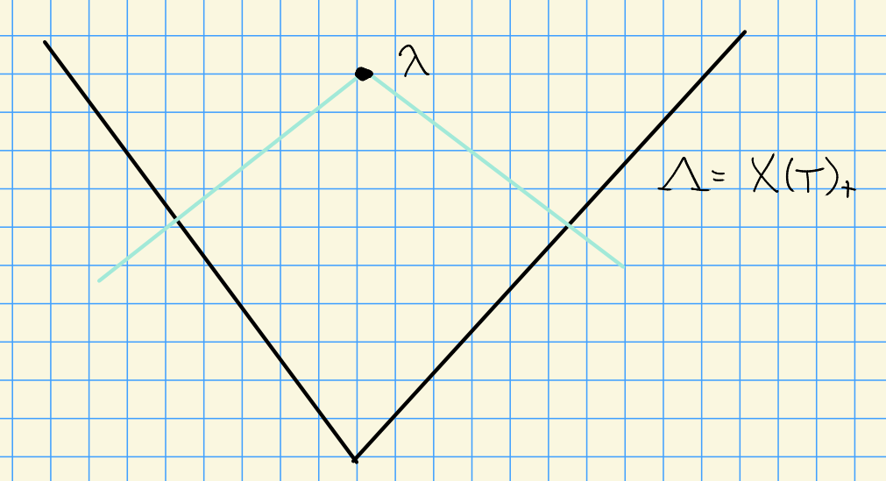

# Monday, October 05

Crelle 1988 (CPS: Cline Parshall Scott)

Let HWC denote a highest weight category.

:::{.example}

1. BGG Category $\OO$

2. $\Rat(G)$ for $G$ a reductive algebraic group

3. $\Perv_W(G/B) \cong \OO_0$
:::

See

1. Donkin: On generalized Schur algebras

2. Irving: BGG algebras

There is a equivalence between HWC and QHA (quasi-hereditary algebras).

:::{.remark}
Key Points

1. $L(\lambda) = \soc_G \nabla(\lambda)$ and $\nabla(\lambda) = A(\lambda)$.

2. All composition factors of $\nabla(\lambda)$ satisfy $\mu \leq \lambda$

3. We have cohomological vanishing:
\[
\Ext_G^i(\Delta(\lambda), \nabla(\mu)) = 
\begin{cases}
0 & i >0 \\
0 & i=0, \lambda \neq \mu \\
k & i=0. \lambda = 0
\end{cases}
\]
:::

Interval finite poset: we'll have a cone $\Lambda$ of positive weights:

> See handout!

:::{.theorem title="?"}
Let $G ,G'$ be rational $G\dash$modules admitting good filtrations.
Then the tensor product $V\tensor V'$ also admits a good filtration.
:::

- First proofs: 
  - JP Wong, Type A
  - Donkin, all but characteristic 2 and $E_7, E_8$.
  - O. Mathieu, general proof using algebraic geometry

:::{.example}
Let $G = \SL(n, k)$ and take the natural representation $V = H^0(w_1)$.
Then $V^{\tensor d}$ has a good filtration.
:::

:::{.theorem title="?"}
Let $J\subset \Delta$ be a subset of simple roots.
If $V \in \Mod(G)$ has a good filtration and $L_J$ is a Levi factor, then $V{\downarrow_{L_J}}$ has a good filtration.
:::

:::{.theorem title="?"}
Let $\lieg = \Lie(G)$ and $p$ be a *good prime* (doesn't divide any of the coefficients of the highest weight).
Then the symmetric algebra $S(\lieg)$ has a good filtration.
:::

:::{.remark}
For $p\geq 3(h-1)$, the exterior algebra $\Lambda(\lieg)$ also admits a good filtration.
Question:
Is this true for all primes $p$? Or potentially for all *good* primes $p$?
:::

## Polynomial Representation Theory

Let $G = \GL(n, k)$, then a module for $G$ is **polynomial** iff the weights $\lambda = (\lambda_1, \cdots, \lambda_n)$ satisfy $\lambda_j \geq 0$ for all $j$.

:::{.example}
For $V$ the natural representation, the weights are the unit vectors $\eps_1, \cdots, \eps_n$, so $V$ is a polynomial representation.
Then $V^{\tensor d}$ is again polynomial by a previous remark.
:::

:::{.remark}
Note that the adjoint representation $\lieg \cong V\tensor V\dual$ is not a polynomial representation. 
:::

:::{.theorem title="?"}
There is an equivalence
\[  
\mathrm{Poly}(G) \cong \bigoplus_{j\geq 0} \Mod(S(n, d))
,\]
where this Schur algebra $S(n, d)$ is given by $\Endo_{\Sigma_d}(V^{\tensor d})$ where $\Sigma_d$ is the symmetric group of $d$ letters.

The theorem is that $\Mod(S(n, d))$ is a QHA, and thus a highest weight category.
:::

:::{.remark}
This is a finite-dimensional algebra, so we should be able to calculate the dimensions, index by highest weights, write the standard/costandard modules, etc.
There is a correspondence
\[ 
\correspond{\text{Simple modules for }S(n, d)}
\iff
\correspond{\Lambda^+(n, d) \text{ partitions of $d$ with at most $n$ parts}}
.\]

We can compute
\[  
\dim S(n, d) = {n^2 + d - 1 \choose n^2 - 1}
,\]
and simple modules correspond to $L(\lambda)$ for $\GL_n$ where $\lambda$ is a polynomial representation.
:::

:::{.theorem title="?"}
$S(n, d)$ is semisimple if and only if

1. $k = \CC$ or characteristic zero, or 

2. $d < p$.

> For latter condition, see Maschke's theorem

:::

:::{.example}
Consider $S(2, 3)$ for $p=2$, so $G = \GL(2)$.
Then 
\[  
\dim S(2, 3) = {4+3-1 \choose 3} = {6\choose 3} = 20
.\]

The only admissible partitions are thus

- $(3)$, and 
- $(2, 1)$.

Then $L(2, 1) = L("w")$ as an $\SL(2)\dash$module, so 
\[
\dim L(2, 1) = 2
\]
Then $L(3, 0) = L("3w")$ as an $\SL(2)\dash$module.
We can compute
\[  
L(3) = L(1, 0)^{(1)} \tensor L(1, 0)
,\]
and since each is 2-dimensional, we get $\dim L(3) = 4^2 + 2^2 = 20$.

Note that the sum of the squares of the dimensions of the irreducibles are equal to the total dimension, which shows this module is semisimple.
But this contradicts the theorem!
So it turns out there is a third condition, namely this exact case.
:::

Next time: look at structure of injective modules, then the theory of Bott-Borel-Weil for higher sheaf cohomology.

