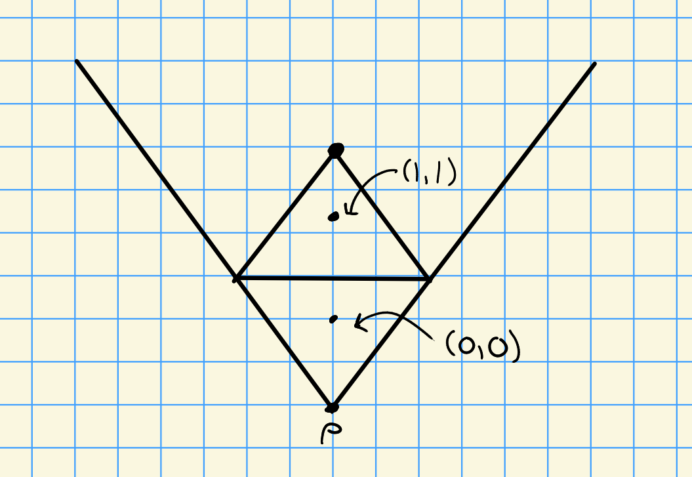
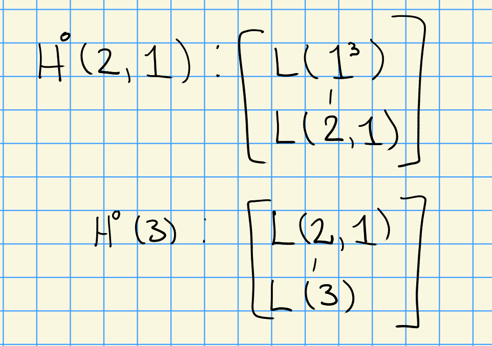
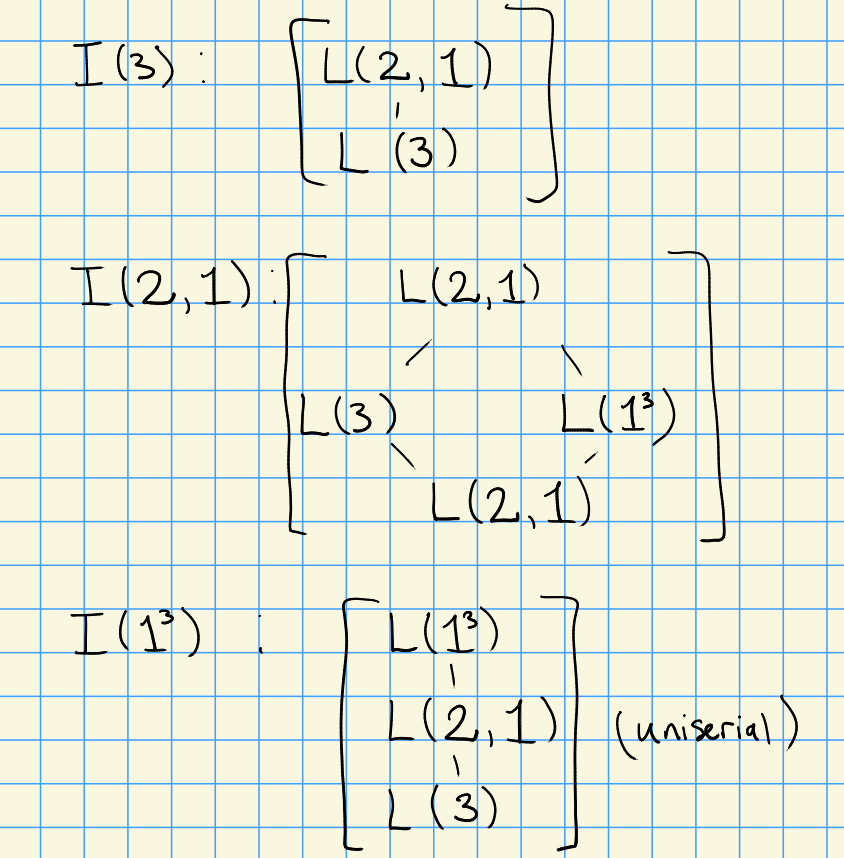
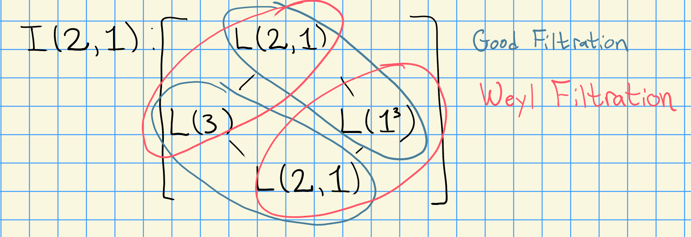
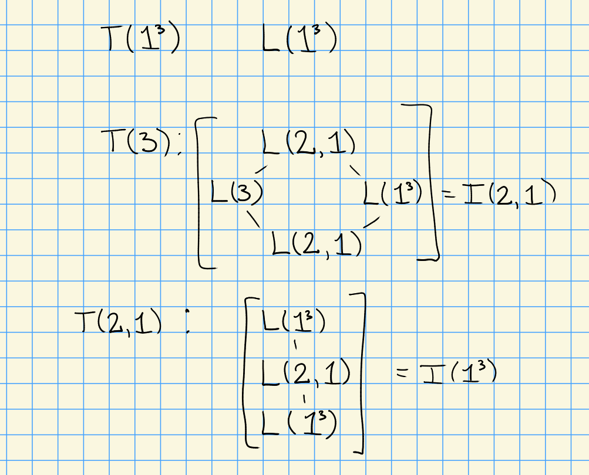
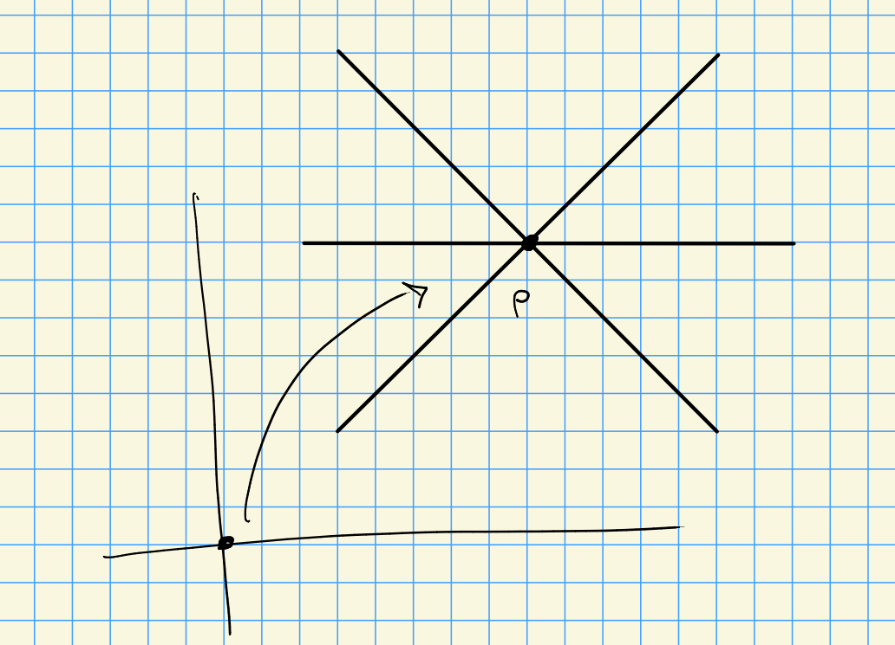
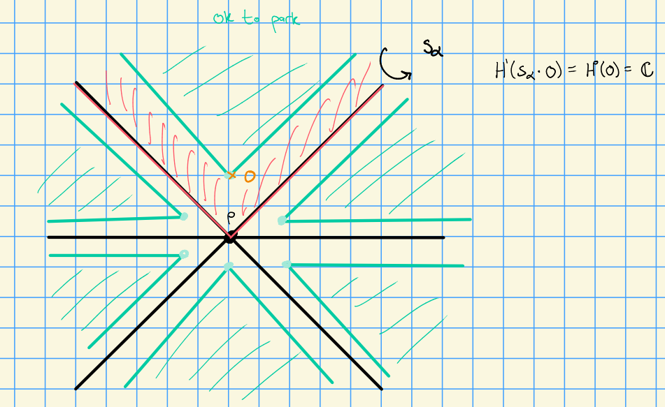
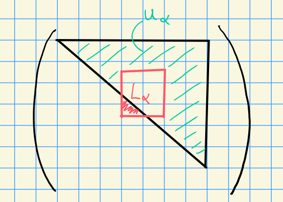

# Wednesday, October 07

## Schur Algebras

Let $G = \GL(n, k)$, then polynomial representations of $G$ are equivalent to $S(n, d)$ modules for all $d\geq 0$, where we can note that $S(n, d) = \Endo_{\Sigma_d}(V^{\tensor d})$.
We'll have a correspondence
\[  
\correspond{L(\lambda) \text{ simple modules for } S(n,d)}
\iff
\Lambda^+(n, d) \text{, partitions of $d$ with at most $n$ parts}
,\]

:::{.example}

> Good example, can see all filtrations at work, tilting modules, etc.

Consider $S(3, 3)$ for $p=3$, we then have the partitions $\Lambda^+(3, 3) = \ts{(3), (2, 1), (1,1,1)}$.
We can think of these in the $\eps$ basis as $(3) = (3,0,0), (2,1) = (2,1,0)$.
Since $\SL(3, k) \subset \GL(3, k)$, we can find the $SL(3, k)$ weights by taking successive differences to yield $(3, 0), (1, 1), (0, 0)$ with the corresponding picture

We can compute

- $L(1,1,1) = H^0(1,1,1)$
- $L(2, 1) = H^0(2, 1)$
- $L(3) = H^0(3)$

We have a form of Brauer reciprocity:
\[  
[I(\lambda): H^0(\mu)] = [H^0(\mu) : L(\lambda) ] 
.\]

We can now compute the injective hulls:

What are the tilting modules?
We can use the fact that $L(1^3) = V(1^3)$.
It has a good filtration and a Weyl filtration and thus must be the tilting module for $L(1^3)$.

Using the following fact:

We can compute the following:

:::

## Simplicity of $H^0(\lambda)$

1. $k = \CC$ implies $L(\lambda) = H^0(\lambda)$ for all $\lambda \in X(T)_+$

2. $k= \bar{\FF}_p$ implies $L(\lambda) = H^0(\lambda)$ if $\inner{\lambda}{\alpha_0\dual} \leq 1$ where $\alpha_0$ is the highest short root.

Such $\lambda$ are referred to as *minuscule weights*.

:::{.example}
For type $A_n$, we have $\alpha_0 = \sum_{i=1}^n \alpha_i$.
For type $G_2$, we have $\alpha_0\dual  = 2\alpha_1\dual + 3\alpha_2\dual$.
:::

:::{.example}
In type $A_n$, set $\lambda = \sum_{j=1}^n c_j w_j$ where $c_j \geq 0$.
Then $\inner{\lambda}{\alpha_0\dual} = \sum c_j \leq 1$, so $\lambda$ is minuscule iff $\lambda = 0$ or $\lambda = w_j$ for some $j$.
:::

:::{.remark}
Quick timeline:

- 2015, Cantrell lectures by Dick Gross at UGA
- Fall 2015: email to Dan Nakano from Skip Garibaldi, conjecture from Gross without a proof

:::{.proposition title="Gross"}
The simple module is equal to the induced module, so $L(\lambda) = H^0(\lambda)$, for all $p$ iff $\lambda$ is minuscule, or if $L(\lambda) = \lieg$ for $\Phi = E_8$.
:::

- Proved by Garibaldi-Nakano-Guralnick, appeared in Journal of Algebra

:::

## Bott-Borel-Weil Theorem

We can consider the higher right-derived functors of $\lambda$, given by $H^i(\lambda) = R^i \ind_B^G \lambda$ for $\lambda \in X(T)$.
You can think of this as the higher sheaf cohomology of the flag variety, $\mathcal{H}^i(G/B, \mathcal{L}(\lambda))$.

We have **Kempf Vanishing**: $H^i(\lambda) = 0$ for all $i>0$ when $\lambda \in X(T)_+$ is dominant (although other things may happen for non-dominant weights).
There is a correspondence $(G, T) \iff (W, \Phi)$, and since $W$ is generated by simple reflections, we can write any $w\in W$ as $w=\prod s_{\alpha_i}$.
A *reduced expression* is one in which the length can not be shortened, and any two reduced expressions necessarily have the same length (number of simple reflections).

:::{.example}
For $\Phi = A_2$, we have $w_0 = s_{\alpha_1} s_{\alpha_2} s_{\alpha_1} = s_{\alpha_2} s_{\alpha_1} s_{\alpha_2}$.
:::

### Dot Action on Weights

We can let $W$ act on $X(T)$ by reflections by the formula $s_\alpha \lambda = \lambda - \inner{\lambda}{\alpha\dual}\alpha$.
We then shift the action by setting $s_\alpha \cdot \lambda = w(\lambda+\rho)-\rho$ where $\rho = {1\over 2} \sum_{\alpha\in \Phi^+} \alpha = \sum_{j=1}^n w_j$.

:::{.theorem title="Bott-Borel-Weil"}
Let $G$ be a reductive algebraic group and $k=\CC$.
For $\lambda \in X(T)_+$, we can describe the sheaf cohomology:
\[  
\mathcal{H}^i(w\cdot \lambda)
=
\begin{cases}
H^0(\lambda) & i=\ell(w) \\
0 & \text{otherwise}
\end{cases}
.\]

Moreover, if $\lambda \not\in X(T)_+$ and $\inner{\lambda+\rho}{\alpha\dual} \geq 0$ for all $\alpha \in \Delta$, then $\mathcal{H}^i(w\cdot \lambda) = 0$ for all $w\in W$.

:::

Wide open in characteristic $p$, can say some things.
We'll prove this in characteristic zero.

Recall that $k=\CC$ and $H^0(\lambda) = L(\lambda)$.
We'll want to reduce to $\SL(2, \CC)$ parabolics.
For $\alpha\in\Delta$, let $P_\alpha$ be the associated parabolic $P_\alpha = L_\alpha \semidirect U_\alpha$, which is parabolic of type $A_1$.

Idea: $\alpha$ generates an $\SL_2$ subgroup (the Levi factor), like the Borel but sticks out in one dimension:

Then 
\[ 
s_\alpha \cdot \lambda = s_\alpha(\lambda + \rho) - \rho \\
= \lambda + \rho - \inner{\lambda + \rho}{\alpha\dual}\alpha - \rho \\
= \lambda - \inner{\lambda + \rho}{\alpha\dual}\alpha
.\]

Next time: proof of Bott-Borel-Weil and its generalization to $k = \bar{\FF}_p$.
For $B\subset P_\alpha \subset G$, we'll have a spectral sequence
\[  
E_2^{i, j} = R^i \ind_{P_\alpha}^G R^j \ind_B^{P_\alpha}  \abuts R^{i+j} \ind_B^G  \lambda = H^{i+j}(\lambda)
.\]

