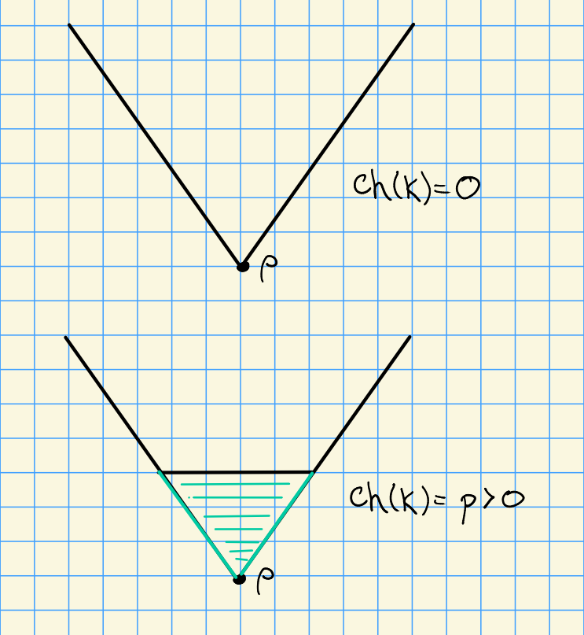
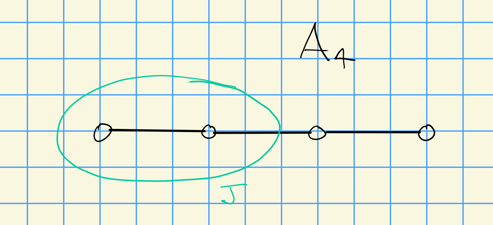

# Monday, October 12

## Proof of Bott-Borel-Weil

Recall the Bott-Borel-Weil theorem: in characteristic zero, we're looking at the closure of the region containing the fundamental region $C_\ZZ$:

:::{.theorem title="due to Aandersen"}
a. If $\lambda \in \bar{C}_\ZZ$ and $\lambda \not\in X(T)_+$ then $H^0(w\circ \lambda) = 0$.

b. If $\lambda\in \bar{C}_\ZZ \intersect X(T)_+$ then for all $w\in W$, we have
\[  
H^i(w\cdot \lambda) = 
\begin{cases}
H^0(\lambda)& i = \ell(w) \\
0 & \text{otherwise}
\end{cases}
.\]
:::

:::{.proof title="of a"}
For (a): we use induction on $\ell(w)$.
For $\ell(w) = 0$, we have $w = \id$.
Let $\lambda \in \bar{C}_\ZZ$ and $\lambda\not\in X(T)_+$.
Then 
\[  
0 
&\leq \inner{\lambda + \rho}{\alpha\dual} \\
&= \inner{\lambda}{\alpha\dual} + 1 \\
\implies \inner{\lambda}{\alpha\dual} &= -1
.\]
Applying the previous proposition, we get $H^0(\lambda) = 0$.
:::

:::{.proof title="of b"}
For the base case $w=\id$, this follows from Kempf vanishing.
Assuming the result holds for any word of length $l<\ell(w)$, if $\ell(w) > 0$, there exists some simple reflection $s_\alpha$ for $\alpha\in\Delta$ such that $\ell(s_\alpha w) = \ell(w) - 1$.
Moreover, $w^{-1}(\alpha) \in -\Phi^+$, so set $\beta = -w^{-1}(\alpha) \in \Phi^+$.
We can the make the following computation:
\[  
\inner{(s_\alpha w) \cdot \lambda}{\alpha\dual}
&= \inner{(s_\alpha w)(\lambda+\rho) - \rho}{\alpha\dual}  \\
&= \inner{(s_\alpha w)(\lambda+\rho)}{\alpha\dual} - 1 \\
&= \inner{w(\lambda+\rho)}{s_\alpha \alpha\dual} - 1 \\
&= - \inner{w(\lambda+\rho)}{\alpha\dual} - 1  \\
&= \inner{\lambda + \rho}{-w^{-1}\alpha\dual} - 1 \\
&= \inner{\lambda + \rho}{\beta\dual} - 1 \\
&\geq -1
\]
and $\inner{(s_\alpha w)\cdot \lambda}{ \alpha\dual} < \rho$ since $\lambda\in \bar{C}_\ZZ$.
Note that we've used the fact that the inner product is $W\dash$invariant.
\

Now if $\inner{(s_\alpha w)\cdot \lambda}{ \alpha\dual} \geq 0$, we can apply the prior proposition part (d).
Here we use the fact that $\ind_B^{P_\alpha}(s_\alpha w)\lambda$ is simple.
Applying the inductive hypothesis yields
\[  
H^i(s_\alpha - \lambda) = H^{i+1}(w\cdot \lambda)
.\]

Now if $\inner{s_\alpha w \cdot \lambda}{\alpha\dual} = -1$, then
\[  
-1 &= \inner{\lambda + \rho}{\beta\dual} - 1 \\
\implies \inner{\lambda + \rho}{\beta\dual} &= 0 \\
\implies \inner{\lambda}{\beta\dual} &= 0 \\
& \cdots
.\]

\todo[inline]{Missing computation}

Then applying (a) yields $H^1(w\cdot \lambda)  = 0$.
:::

## Serre Duality and Grothendieck Vanishing

Let $P$ be a parabolic subgroup, i.e. $P_J = P \da L_J \semidirect U_J$ for some $J\subseteq \Delta$.
Set $n(P) = \abs{\Phi^+} - \abs{\Phi^+_J}$.

:::{.example}
Let $\Phi = A_4$, which has ten simple roots:

- $\alpha_i, 1\leq i \leq 4$
- $\alpha_i + \alpha_{i+1}$, $i=1,2,3$.
- $\alpha_1 + \alpha_2 +\alpha_3$, $\alpha_2 + \alpha_3 + \alpha_4$
- $\sum_{i=1}^4 \alpha_i$.

Then $n(P) = 10 - 3 = 7$.
:::

:::{.theorem title="Grothendieck Vanishing"}
\[  
R^i \ind_P^G M = 0 \qquad \text{for } i > n(P)
.\]
:::

:::{.theorem title="Serre Duality"}
\[  
\qty{ R^i \ind_B^G M }\dual \cong R^{n(P) -i} \ind_P^G M\dual \tensor (-2\rho_P)
.\]
where 
\[
\rho_p \da {1\over 2}\sum_{\beta \in \Phi^+ \sm \Phi_J} \beta
\]
:::

:::{.example}
Take $B = P$ and $M = \lambda$.
Then $\lambda \dual = -\lambda$, so 
\[  
\qty{ R^i \ind_B^G \lambda }\dual \cong R^{\abs{\Phi^+} -i} \ind_P^G (- \lambda) \dual \tensor (-2\rho)
.\]
From this we can conclude
\[  
H^i(\lambda) = H^{n-i} (-\lambda - 2\rho)\dual
,\]
where $n = \abs{\Phi^+}$.
:::

:::{.corollary title="?"}
Let $\lambda \in X(T)_+ \intersect \bar{C}_\ZZ$ be a dominant weight.
Then

a. The irreducible representations are given by $L(\lambda) = H^0(\lambda)$.

b. $\ext_G^1(L(\lambda), L(\mu)) = 0$ for all $\lambda, \mu$ in $\bar{C}_\ZZ$.

c. If $\ch(k) = 0$, so $X(T)_+ \subset \bar{C}_\ZZ$, then all $G\dash$modules are completely reducible.
:::

:::{.proof title="of a"}
Note that the longest element takes positive roots to negative roots, so $w_0 \rho = - \rho$, and moreover $-w_0(\bar{C}_\ZZ) = \bar{C}_\ZZ$.
We also have 
\[
w_0 \cdot ( w_0 \lambda) 
&= w_0 (-w_0 \lambda + \rho) - \rho \\
&= -\lambda + w_0 \rho - \rho \\
&= -\lambda - 2\rho
.\]
By Serre duality, if we take the Weyl module we obtain 
\[
V(-w_0 \lambda) 
&\da H^0(\lambda)\dual  \\
&= H^n(-\lambda - 2\rho) \\
&= H^n(w_0 \cdot (-w_0 \lambda)) \\
&= H^n(-w_0 \lambda) \qquad\text{by Bott-Borel-Weil}
,\]
where we've used that $\ell(w_0) = \abs{\Phi^+}$.
We know that $L(-w_0 \lambda) \subseteq \soc H^0(-w_0 \lambda) = V(-w_0 \lambda) \surjects L(-w_0 \lambda)$, where the last term is contained in the head.
But this means that this splits, so by indecomposability we must have $L(-w_0 \lambda) = H^0(-w_0 \lambda) = V(-w_0 \lambda)$.
So we can conclude
\[  
L(\mu) = H^0(\mu) = V(\mu) \qquad \forall \mu \in X(T)_+ \intersect \bar{C}_\ZZ
.\]
:::

:::{.proof title="of b and c"}
Suppose $\ext_G^1(L(\lambda), L(\mu)) \neq 0$, then 
$L(\lambda)$ is in $H^0(\mu) / \soc_G H^0(\mu) = 0$ and
$L(\mu)$ is in $H^0(\lambda) / \soc_G H^0(\lambda) = 0$, 
but this forces
$\ext_G^1(L(\lambda), L(\mu)) = 0$.
\

Part (c) follows from part (b).
:::

## Weyl's Character Formula

Problem: 
Determine $\ch H^0 \lambda$ for $\lambda \in X(T)_+$.

Solution:
Let $A(\lambda) = \sum_{w\in W} \sgn(w) e^{w\lambda} \in \ZZ[X(T)]$, where we sum over the usual Weyl group and not the affine Weyl groups, taken as a formal sum in the group algebra on the weight lattice.
We can then state Weyl's character formula:
\[  
\ch H^0(\lambda) = {A(\lambda + \rho) \over A(\rho)} \qquad \text{for }\lambda \in X(T)_+
.\]
This is a formal sum, so it's surprising that the bottom term even divides the top.
But there is a great deal of cancellation, we'll see this in examples such as $\GL_3$.

### Formal Characters

Let $M$ be a $T\dash$module, then define the *character*
\[  
\ch M\da \sum_{\mu\in X(T)} \qty{\dim M_\mu} e^\mu \quad \in \ZZ[X(T)]
.\]

We then define the *Euler characteristic*
\[  
\chi(M) \da \sum_{i\geq 0} (-1)^i \ch H^i(M)
.\]
Note that by Grothendieck vanishing, $H^i(M) = 0$ for $i > \abs{\Phi^+} = \dim(G/B)$, so this is a finite sum.
In fact, if $M$ is a $G\dash$module, then this is $W\dash$invariant and thus in fact $\chi(M) \in \ZZ[X(T)]^W$.

