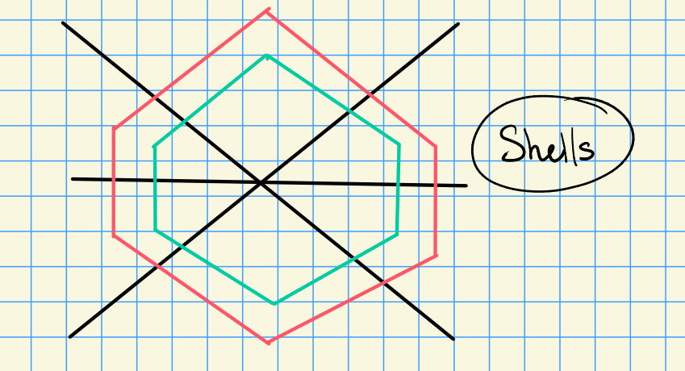

# Wednesday, October 14

Today: 

- Weyl's character formula

- Strong linkage

- Translation functors

Recall that we defined
\[  
\ch(M) &\da \sum_{\mu \in X(T)} \qty{\dim M_\mu} e^{\mu} \in \ZZ[X(T)]\\
\chi(M) &\da \sum_{i\geq 0} (-1)^i \ch H^i(M) \in \ZZ[X(T)]^W
.\]

where $H^i(M) = R^i \ind_B^G M$, and $H^i(M) =0$ for $i> G/B = \abs{\Phi^+}$.

Note that the Euler characteristic is additive on SESs: if $0\to A\to B\to C\to 0$ then $\chi(B) = \chi(A) + \chi(B)$.
It is also multiplicative wrt the tensor product: $\chi(A\tensor B) \chi(A) \chi(B)$.

\todo[inline]{Because ?}

:::{.remark}
If $\lambda \in X(T)_+$, then $\chi(\lambda) = \ch H^0(\lambda) = \ch(V(0))$.
:::

:::{.proposition title="?"}
\hfill

1. The set $\ts{\ch L(\lambda) \st \lambda\in X(T)_+}$ is a basis for $\ZZ[X(T)]^W$.

2. If $\lambda \in X(T)$ and $\sum a_\mu e^\mu \in \ZZ[X(T)]^W$, then there is a formula:
\[  
\chi(\lambda) \qty{ \sum_\mu a_\mu e^\mu } = \sum_\mu a_\mu \chi(\lambda + \mu)
.\]
:::

:::{.proof title="of 1"}
Let 
\[
\sym(\mu) \da \sum_{\nu \in W\mu} e^\nu
\] 
be the sum over the $W$ orbit of $\mu$.
This is clearly $W\dash$invariant, so $\sym(\mu) \in \ZZ[X(T)]^W$.
Since every $\nu \in X(T)$ is $W\dash$conjugate to $\mu$ (which is dominant), the set $\ts{\sym(\mu) \st \mu \in X(T)_+}$ is a basis for $\ZZ[X(T)]^W$, since this set is linearly independent. 

> Why: conjugate to a unique weight.

Let $\lambda \in X(T)_+$, then 

\[
\ch L(\lambda) = \sym(\lambda) + \sum_{\substack{\mu < \lambda \\ \mu \in X(T)_+} } a_\mu \sym(\mu)
.\]
Thus the transition matrix is unipotent and upper-triangular, thus $\ts{\ch L(\lambda) \st \lambda \in X(T)_+}$ is a basis for $\ZZ[X(T)]^W$.
:::

:::{.proof title="of 2"}
Since $\ts{L(\lambda) \st \lambda\in X(T)_+}$ forms a basis for $\ZZ[X(T)]^W$, there is some $G\dash$module $V$ such that $\sum a_\mu e^\mu = \pm \ch V$.
We can consider a composition series of $V\tensor \lambda$, where the factor $\ts{\mu \tensor \lambda}$ appears $a_\mu = \dim V_\mu$ times.
We now compute in two different ways:
\[  
\chi(V\tensor \lambda) 
&= \ch(V) \chi(\lambda)  && \text{using the formula from earlier} \\
&= \chi(\lambda) \qty{ \sum_\mu a_\mu e^\mu }
.\]

On the other hand,
\[  
\chi(V\tensor \lambda) &=
\sum a_\mu \chi(\lambda + \mu)
.\]
:::

:::{.remark}
The formula used above was
\[  
R^i \ind_B^G (V\tensor \lambda) = V\tensor R^i \ind_B^G(\lambda)
.\]
:::

## Weyl's Character Formula

For any $\alpha\in\Delta$ and $\lambda \in X(T)$ with $\inner{\lambda + \rho}{\alpha\dual} \geq 0$.
We have an analog of Serre duality:
\[  
\ch \ind_B^{P_\alpha} \lambda = \ch R^i \ind_B^{P_\alpha} s_\alpha \cdot \lambda
,\]
i.e. the induced module coincides with the Weyl module.

By definition of the dot action, we have
\[  
s_\alpha \cdot \lambda = s_\alpha(\lambda + \rho) - \rho
.\]

As in previous calculations, we have

\[  
\inner{s_\alpha\cdot\lambda}{\alpha\dual} = -\inner{\lambda+\rho}{\alpha\dual} - 1 \leq - 1
.\]

As in the analysis of Bott-Borel-Weil, we have
\[  
H^i(s_\alpha \cdot\lambda) &= H^i( R^1 \ind_B^{P_\alpha} s_\alpha\cdot\lambda ) \\
H^i(\lambda) &= H^i( \ind_B^{P_\alpha}\lambda )
,\]
since the spectral sequence collapses.
Note that the two things appearing on the RHS have the same Euler characteristics. 

We can thus define define a modified Euler characteristic
\[  
\phi(N) = \sum_{i\geq 0} (-1)^i \ch R^i \ind_{P_\alpha}^G(N)
.\]

and obtain $\chi(\lambda) = -\chi(s_\alpha \cdot \lambda)$.
The same argument works for $\inner{\lambda + \rho}{\alpha\dual} < 0$.

:::{.remark title="Very Important Fact"}
\[  
\lambda \in X(T) \implies \chi(\lambda) = -\chi(s_\alpha \cdot \lambda)
.\]
:::

:::{.proposition title="General Formula"}
\[  
\chi(w\cdot \lambda) = \sgn(w) \chi(\lambda) && \sgn(w) \da (-1)^{\ell(w)}
,\]
with the convention that $\chi(0) = e^0 = 1$.
:::

:::{.lemma title="?"}
Let $\lambda \in X(T)$ where $\sum a_\mu e^|mu \in \ZZ[X(T)]^W$, so (as we proved) 
\[  
\chi(\lambda) \qty{ \sum_\mu a_\mu e^\mu } = \sum_\mu a_\mu \chi(\lambda + \mu)
.\]
In the special case $\lambda = 0$, we have $\chi(\lambda) = \chi(0) = e^0$, we obtain
\[  
\sum_\mu a_\mu e^\mu = \sum_\mu a_\mu \chi(\mu)
.\]

Extend this to a field by letting $\lambda \in X(T) \tensor_\ZZ \QQ$, then define
\[  
A(\lambda) \da \sum_{w\in W} \sgn(w) e^{w \lambda} \in \ZZ[ (X(T) \tensor \QQ]
.\]

Then

1. $w' A(\lambda) = \sgn(w') A(\lambda)$.

2. $A(\mu) A(\lambda) \in \ZZ[X(T) \tensor \QQ]^W$.
:::

Proof of 1: exercise.

:::{.proof title="of 2"}
We can compute
\[  
w(A(\mu) A(\lambda) ) 
&= w A(\mu)  w A(\lambda) \\
&= \sgn(w) A(\mu)  \sgn(w) A(\lambda) \\
&= \sgn(w)^2 A(\mu) A(\lambda) \\
&= A(\mu) A(\lambda)
.\]
:::

:::{.theorem title="Weyl's Character Formula"}
Let $\lambda \in X(T)$ be any weight, then
\[  
\chi(\lambda) = { A(\lambda + \rho) \over A(\rho) }
,\]
where $\rho = {1\over 2} \sum_{\alpha \in \Phi^+} \alpha$.
:::

> Note: this says that one formal sum divides another.

A corollary is an analog of Weyl's dimension formula:
:::{.corollary title="?"}
Let $\lambda \in X(T)_+$ be a dominant weight.
Then
\[  
\ch H^0(\lambda) = { A(\lambda + \rho) \over A(\rho) }
.\]
:::

Big question: suppose $k = \bar{\FF}_p$.
What are $\ch L(\lambda)$ and $\lambda \in X(T)_+$?
We know this for $p\gg 0$, but in general it's wide open.
There are expressions in terms of "$p\dash$bases", but these are hard to compute.
There are only recursive formulas, none that are closed (and these may not exist).

Next time: 

- Proof of Weyl's character formula
- Compute an example.

Idea of the proof:
we'll have some $\chi(\lambda) = \sum_\mu a_\mu e^\mu$.
Well also have $A(\rho) \qty{ \sum_\mu a_\mu e^\mu } = A(\lambda + \rho)$.
This will reduce to equating coefficients of two formal sums, which will result in a system of linear equations.

