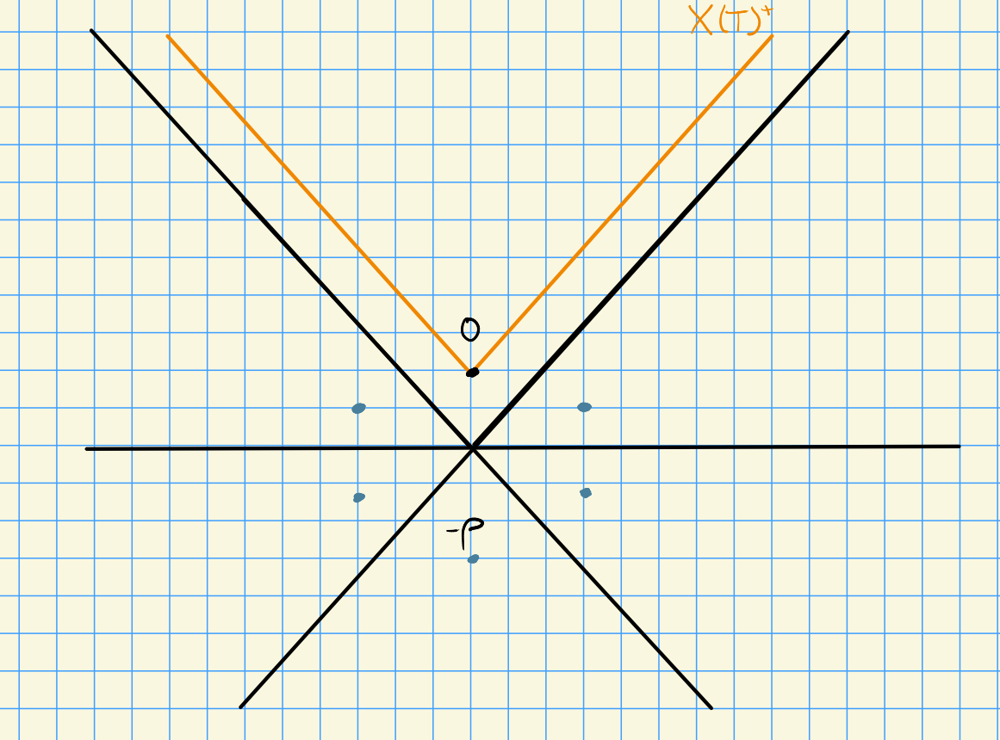
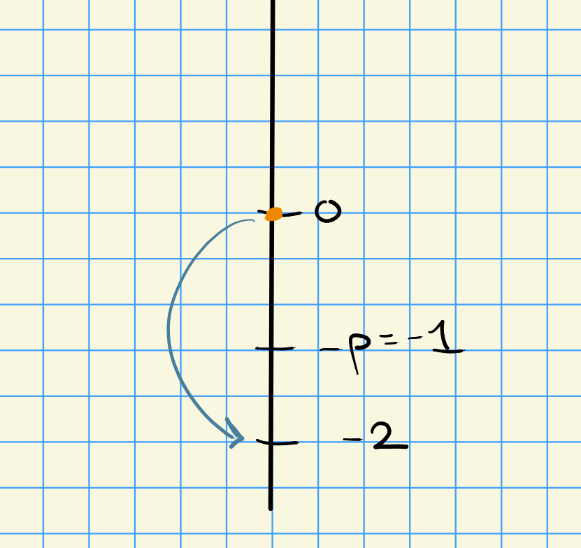
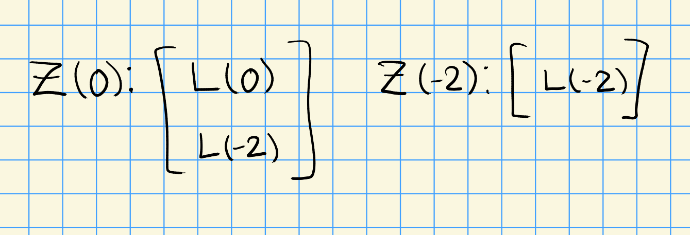
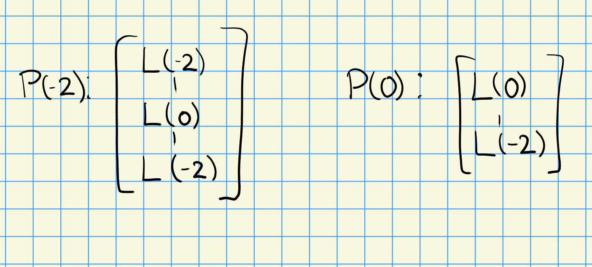

# Friday, October 16

## Example: Weyl's Character Formula

Review: suppose the following is invariant under the Weyl group, so $\sum a_\mu e^\mu \in \ZZ[X(T)]^W$.
In this case, we have an equality
\[  
\sum a_\mu e^\mu = \sum a_\mu \chi(\mu)
,\]
where
$\chi(\mu) = \sum_{i\geq 0} (-1)^i \ch H^i(\mu)$.
We also had a relation
\[  
\chi(w\cdot \mu) = (-1)^{\ell(w)} \chi(\mu) = \sgn(w) \chi(\mu)
.\]

Now let $\lambda \in X(T) \tensor \QQ$, then we defined
\[  
A(\lambda) = \sum_{w\in W} \sgn(w) e^{w\lambda} \in \ZZ[X(T) \tensor \QQ]
.\]

We obtain

1. $w' A(\lambda) = \sgn(w') A(\lambda)$

2. $A(\mu) A(\lambda) = \ZZ[X(T) \tensor \QQ]^W$.

:::{.theorem title="Weyl's Character Formula"}
\[  
\lambda\in X(T) \implies \chi(\lambda) = {A(\lambda + \rho) \over A(\lambda)}
.\]

As a special case when $\lambda \in X(T)_+$, all higher sheaf cohomology vanishes and thus
\[  
\ch H^0(\lambda) = {A(\lambda + \rho) \over A(\lambda)}
.\]
:::

:::{.proof}
We first perform a *reindexing* step:
\[  
\sum_{w, w'} \sgn(w\cdot w') e^{w(\lambda+\rho) + w'\rho}
&= \sum_{w, w'} \sgn(w^{-1} w') e^{w(\lambda+\rho) + w'\rho} \\
&= \sum_{w, y} \sgn(y) e^{w(\lambda+\rho) + wy\rho} && y = w\inv w' \implies w' = wy \\
&= \sum_{w, y} \sgn(y) e^{w(\lambda + \rho + y\rho)}
.\]

Now let $\lambda\in X(T)$, we then compute
\[  
A(\lambda + \rho) A(\rho)
&=
\sum_{w} \sgn(w) e^{w(\lambda + \rho)}
+ \sum_{w'} \sgn(w') e^{w'(\lambda + \rho)}  \\
&=
\sum_{w, w'} \sgn(ww') e^{w(\lambda + \rho) + w'\rho} \\
&= 
\sum_{w, w'} \sgn(w') e^{w(\lambda + \rho + w'\rho)} && \text{from reindexing above, setting } y\da w' \\
&= \sum_{w, w'} \sgn(w') \chi\qty{w(\lambda + \rho + w'\rho)} \\
&= \sum_{w, w'} \sgn(w') \chi\qty{w\cdot (\lambda + w'\rho + w^{-1} \rho)} && \text{definition of dot action}\\
&= \sum_{w, w'} \sgn(ww') \chi\qty{\lambda + w'\rho + w\rho }  && \text{swapping } w\leadsto w^{-1}  
.\]

Note that $\chi$ can be introduced since $A(\lambda + \rho)A(\rho) \in \ZZ[X(T) \tensor \QQ]^{W\cdot}$.

\todo[inline]{Not sure, double check.}

We can now conclude that
\[  
A(\rho)^2 = \sum_{w, w'} \sgn(ww') e^{w\rho + w' \rho}
.\]
Since this quantity is $W\dash$invariant, since it's a square, we can move the $\chi$ inside:
\[  
\chi(\lambda) \qty{ \sum a_\mu e^\mu } = \sum a_\mu \chi(\lambda + \mu) \\
\implies \chi(\lambda) A(\rho)^2 = \sum_{w, w'} \sgn(ww') \chi(\lambda + w\rho + w'\rho)
,\]
which is exactly what the first calculation resulted in.
So we can conclude
\[  
A(\lambda + \rho) A(\rho) = \chi(\lambda) A(\rho)^2
.\]
Note that $A(\rho) \neq 0$ since $w\rho \neq \rho$ unless $w=\id$.
Thus we are actually working in $\ZZ[X(T) + \ZZ\rho]$, which is an integral domain, and thus we can apply cancellation laws to obtains
\[  
A(\lambda + \rho) = \chi(\lambda) A(\rho)
.\]
:::

:::{.example}
Let $G = \GL_3(k)$, which has a natural 3-dimensional representation $V$.
Let $\lambda = (1,0,0)$, so $L(1,0,0) = V$.
This is a polynomial representation, so by permuting we can obtain
\[  
\ch V = e^{(1,0,0)} + e^{(0,1,0)} + e^{(0,0,1)} = \chi(1,0,0)
,\]
where the last equality holds since $\lambda$ is dominant.

We can write $\rho = (2,1,0)$, since the fundamental weights are given by $w_1 = (1,0,0)$ and $w_2 = (1,1,0)$ (since we're in an $\SL_2$ and/or $A_2$ situation).
We then obtain $\lambda + \rho = (3,1,0)$, and since $W= S_3$,
\[  
A(\lambda + \rho) = \sum_{w\in W} \sgn(w) e^{w(\lambda + \rho)}
=
e^{(3,1,0)} -
e^{(1,3,0)} + 
e^{(1,0,3)} - 
e^{(0,1,3)} + 
e^{(0,3,1)} - 
e^{(3,0,1)}
.\]

Thus 
\[  
A(\rho) =
e^{(2,1,0)} -
e^{(1,2,0)} + 
e^{(1,0,2)} - 
e^{(0,1,2)} + 
e^{(0,2,1)} - 
e^{(2,0,1)}
.\]

We can then compute
\[  
\chi(1,0,0) A(\rho) = &e^{(3,1,0)}
- e^{(2,2,0)} + 
e^{(2,0,2)} 
-e^{(1,1,2)} + 
e^{(1,2,1)}
- e^{(3,0,1)} + 
\\
&e^{(2,2,0)} -
e^{(1,3,0)} + 
e^{(1,1,2)} - 
e^{(0,2,2)} + 
e^{(0,3,1)} - 
e^{(2,1,1)} + 
\\
&e^{(2,1,1)} -
e^{(1,2,1)} + 
e^{(1,0,3)} - 
e^{(0,1,3)} + 
e^{(0,2,2)} - 
e^{(2,0,2)}
.\]

After cancellation, you'll find that this expression is equal to $A(\lambda + \rho)$.
:::

## Strong Linkage Principle

We'll consider representations in characteristic zero, so we can take $k=\CC$.
Let $G$ bet a complex simple group, $\lieg = \Lie(G)$, $t$ a maximal torus, $X$ the weights, and $X_+$ the dominant weights.
We have a correspondence
\Large
\[  
\correspond{(g, t)} \iff
\correspond{(\Phi, W)}
\]
\normalsize

where $\Phi$ is an irreducible root system and $W$ is the Weyl group.
We'll have a set of simple roots $\Delta\subseteq \Phi^+$.
For $\lambda\in X$, we have
\[  
Z(\lambda) = U(\lieg) \tensor_{U(\lieb^+)} \lambda \surjects L(\lambda)
.\]

Then $\lambda \in X_+ \iff L(\lambda)$ is finite dimensional.
We have $W$ acting on $X$ via reflections, which we can extend to a dot action
\[  
w\cdot \lambda = w(\lambda + \rho) - \rho, \hspace{4em} \rho = {1\over 2}\sum_{\alpha\in\Phi^+} \alpha
.\]

We define Category $\OO$ which has objects $\lieg\dash$modules with a weight space decomposition which is locally finite wrt $\lien^+$.

### Linkage in Category $\OO$

Set $Z(\lambda) = \Delta(\lambda)$, then
\[  
[Z(\lambda) : L(\mu)] \neq 0 \implies \lambda \in W\cdot \mu
.\]
The LHS is computed by evaluating certain Kazhdan-Lusztig polynomials at $x=1$.

:::{.example}
Let $\Phi= A_2$, then

$\OO_0$ is the principal block, and the irreducibles correspond to $\ts{L(w\cdot 0) \st w\in W}$, and the number of irreducibles in given by $\abs{W}$.
In this case, there is only 1 finite-dimensional module in any given block of category $\OO$.
:::

:::{.example}
For $\Phi = A_1$, we have the following situation:

In $\OO_0$, there are two irreducible representations given by the Verma modules $L(0), L(-2)$, and we find that

In this case, the projectives are given by 

:::

