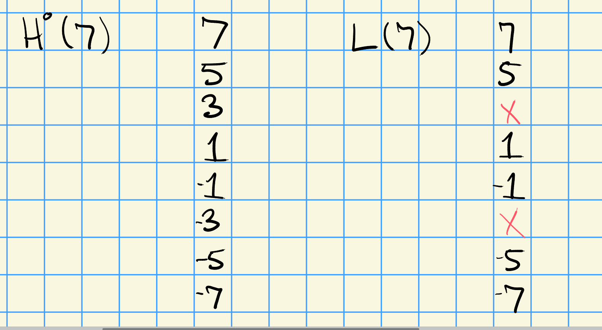
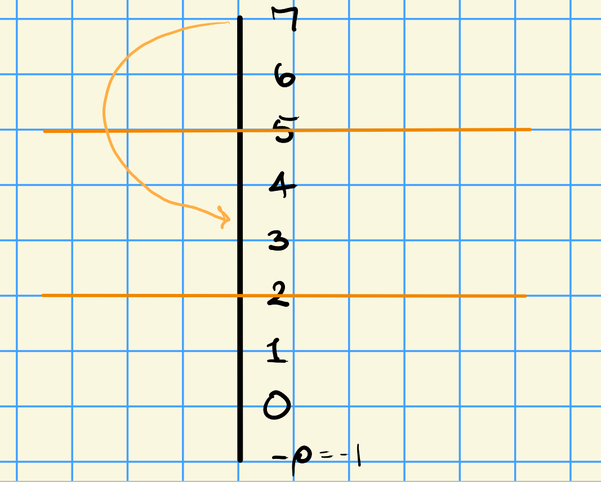
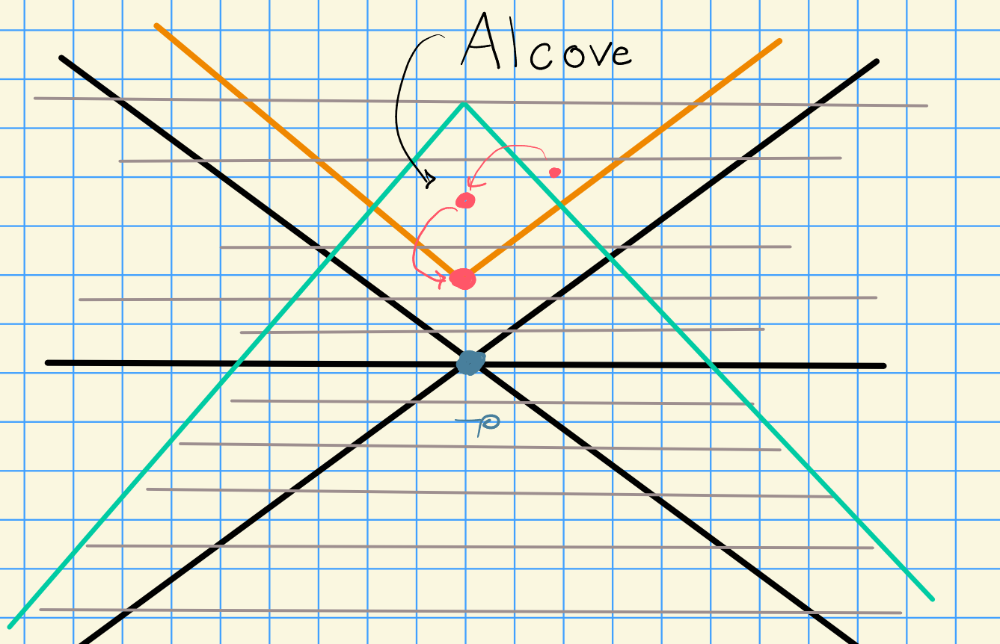

# Monday, October 19

\todo[inline]{Missing notes from first 10m! See phone screenshot.}

## Representations in Positive Characteristic

We have the following setup:
\[  
G && \text{a semisimple, simply connected algebraic group} \\
k && \text{an algebraically closed field of characteristic $p>0$} \\
T && \text{a maximal torus} \\
B && \text{a Borel (negative roots)} \\
X(T) = X && \text{weights} \\
X(T)_+ = X_+ && \text{dominant weights} \\
\Phi && \text{roots}
.\]

For $\lambda \in X_+$, we consider the induced module $H^0(\lambda) = \ind_B^G \lambda$.
Not that this is not a simple module in general, so we instead ask about its composition factors.

Question:
For all $\lambda, \mu \in X_+$, what are the multiplicities $[H^0(\lambda): L(\mu)]$.

:::{.example}
Let $G = \SL_2(k)$, so $\Phi = A_1$.
Then $\lambda \in X_+ = \ts{0,1,2,\cdots}$ as we know from standard facts in lie algebras.
Define $X_1 = \ts{0, 1, \cdots, p-1}$, then $\dim H^0(\lambda) = \lambda + 1$.
We can write the weight $p\dash$adically as $\lambda = \sum_{i=0}^t \lambda_i p^i$ for some $\lambda_j\in X_1$.
Thus $L(\lambda) = L(\lambda_0) \bigotimes_{i=1}^t L(\lambda_i)^{(i)}$.

Consider $p=3, \lambda = 7$, then $\dim H^0(7) = 8$.
We can write $7$ 3-adically as $7 = (1)3^0 + (2)3^1$, and so 
\[  
L(7) \cong L(1) \tensor L(2)^{(1)}
.\]
The first summand is 2-dimensional, and the second is 3-dimensional, so $L(7)$ is 6-dimensional.
Note that $L(7) \injects H^0(7)$.

We can calculate the weights in the tensor product: the first has weights $\ts{\pm 1}$, we take the adjoint weights in the second factor and multiply by the twist 3 to get $\ts{2\cdot 3, 0\cdot 3, -2\cdot 3}$.
Taking all combinations of sums from these yields $\ts{7,5,1,-1,-5,-7}$.

Since $\pm 3$ are left over, we know $[H^0(7): L(3)] \neq 0$.
We can continue with $3 = (1)3^1$ and write $L(3) = L(1)^{(1)}$. 
We get weights of the form $1\cdot 3, 1\cdot -3$, so nothing is left over and we're done.
We thus get a decomposition
\begin{center}
\begin{tikzcd}
 & & L(3) \ar[dd] \\
H^0(7): & & \\
 & & L(7)
\end{tikzcd}
\end{center}

Note the difference to Verma modules in category $\OO$: we have to consider the action of the *affine* Weyl group, where $W_a \da W \semidirect p\ZZ\Phi$.
Here we have hyperplanes at $p-1, 2p-1, 3p-1$, and 7 is *linked* to 3 (in the same orbit) for this action:

:::

> Once characters are known, can find composition factors.

## Affine Weyl Group

Letting $a\in \NN$, we have $W_a = W\semidirect a(\ZZ\Phi)$ where $\ZZ\Phi$ is the root lattice.
Note that there are other variants:

- $W_a = W\semidirect a(\ZZ\Phi\dual)$, 
- $W_{\text{ext}} = W \semidirect X(T)$.

So we set $W_p = W\semidirect p(\ZZ\Phi)$ where $p$ is a prime.
What's in this group?
We know it contains "products" of reflections with translations.
We find that $W_p$ is generated by 
\[  
s_{\beta, np}(\lambda) = \lambda - \inner{\lambda}{\beta\dual}\beta + np \beta
.\]

It is also the case that $W_p$ acts on $X(T)$ and there exists a dot action
\[  
w\cdot \lambda = w(\lambda + \rho) - \rho
.\]

:::{.example}
Consider $A_1$, so $\alpha = 2$.
We consider what the stabilizer is:
\[  
s_{\alpha, np}\cdot \lambda &= \lambda \\
s_{\alpha, np}(\lambda + \rho) - \rho &= \lambda \\
(\lambda + \rho) - \inner{\lambda _ \rho}{\alpha\dual}\alpha + np\alpha - \rho &= \lambda
.\]

After cancellation in the last line above, we obtain
\[  
\lambda = np-1
,\]
which exactly yields the $p-1, 2p-1, \cdots$ we saw before.
:::

:::{.example}
Consider $A_2$.
We obtain "alcoves":

:::

We can get a stronger version of weak linkage, which we'll just call linkage:

:::{.theorem title="Linkage"}
\[  
[H^0(\lambda): L(\mu)] \neq 0 \implies \lambda \in W_p \cdot \mu
.\]
:::

:::{.warnings}
These are difficult to compute in general, or to even detect when they're zero.
For $p\gg 0$, these multiplicities are computed via Kazhdan-Lusztig polynomials.
:::

### Ordering of Weights

There is a partial ordering on the weight lattice given by
\[  
\mu \leq \lambda \iff \lambda - \mu = \sum_{\alpha\in \Phi^+} n_\alpha \alpha, \quad n_\alpha \geq 0
.\]

:::{.definition title="Strong Linkage"}
For $\mu, \lambda \in X(T)$, we say $\mu$ is **strongly linked** to $\lambda$, denoted $\mu \uparrow \lambda$, if there exists a sequence of weights $\mu_1, \cdots, \mu_r \in X(T)$ and reflections $s_1, \cdots, s_r$ such that
\[  
\mu \leq \mu_1 = s_1 \cdot \mu \leq \mu_2 = s_2\cdot \mu 1 \leq \cdots \leq s_r \mu_{r-1}
.\]
:::

:::{.remark}
Note that

- $\mu \uparrow \lambda \implies \mu \leq \lambda$, so this is stronger than the usual linkage
- $\mu \uparrow \lambda \implies \mu \in W_p \cdot \lambda$.
:::

:::{.theorem title="Strong Linkage Principle"}
\[  
[H^0(\lambda): L(\mu)] \neq 0 \implies \lambda \in \mu \uparrow \lambda
.\]

Moreover, there is a version of strong linkage for $H^i(\lambda)$ for $i> 1$.
:::

> Next time: history of strong linkage, and translation functors.

