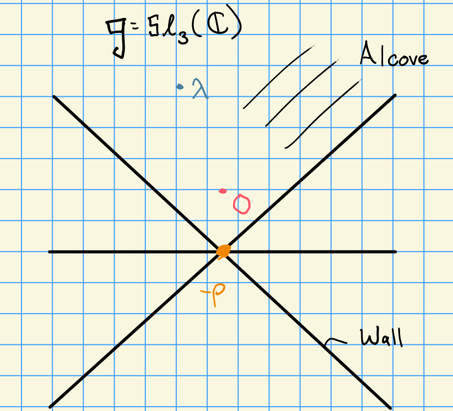
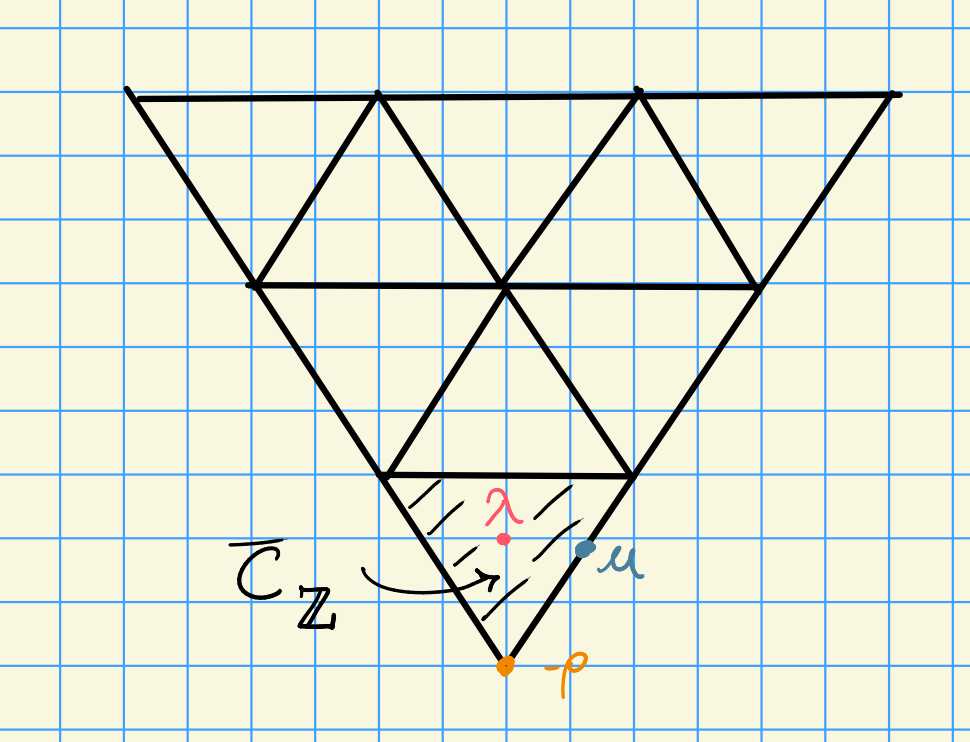

# Wednesday, October 21

## Strong Linkage

Let $G$ be a semisimple algebraic group and $k = \bar{\FF_p}$.
We found that the *affine Weyl group* $W_p$ played an important role here.

:::{.theorem title="Strong Linkage I"}
Suppose we have a nonzero composition factor in the induced/Weyl module. 
Then 
\[
[H^0 \lambda : L(\mu)] \neq 0]\implies \mu \uparrow \lambda
.\]

In other words, there's a series of reflections sending $\mu$ to $\lambda$ which doesn't increase it's value in the ordering.
:::

:::{.theorem title="Strong Linkage II"}
Let $\lambda \in X(T)$ with $\inner{\lambda + \rho}{\alpha\dual} \geq 0$ for all $\alpha\in \Delta$.
Suppose $\mu \in X(T)_+$.
\[
[H^i w\cdot \lambda : L(\mu)] \neq 0 \text{ for some } i\geq 0 \implies \mu \uparrow \lambda
.\]
:::

:::{.remark}
Note that this is tells us slightly more than Bott-Borel-Weil.
:::

:::{.remark}
There is some history here:

1. Verma conjectured the first theorem in 1971.

2. Humphreys (1971) proved it for $Z_r(\lambda) = \ind_{B_r}^{G_r} \lambda$.

3. Strong Linkage II proved by Andersen in 1980.

4. Jantzen proved strong linkage for $Z_r$, which implies strong linkage for $V(\lambda)$.

5. Doty (1987) proved strong linkage for $Z_r(\lambda)$ as a $G_rT\dash$modules, which implies strong linkage for $V(\lambda)$.
:::

:::{.remark}
One application is the following: let $\lambda, \mu \in X(T)_+$, then $\ext_G^n(L(\lambda), L(\mu)) \neq 0$ for some $n \geq 0$.
This implies that $\lambda \in W_p \cdot \mu$.

We can consider some cases

- If $n=0$, we're reduced to previous situations.
- If $n=1$, we can conclude that $L(\lambda)$ is in the second socle layer of $H^0 \mu$, or vice-versa.
  In either case, $\lambda \in W_p \cdot \mu$.

We can compute this ext by considering an minimal injective resolution
\[  
0 \to L(\mu) \to I_0 = I(\mu) \to I_1 \to \cdots
.\]

We can conclude that 
\[
[I(\mu) : H^0(\sigma)] = [H^0(\sigma): L(\mu)] \neq 0
.\] 
by Brauer-Humphreys reciprocity, so $\sigma \in W_p \cdot \mu$.
Similarly $[I(\mu): L(\gamma)] \neq 0$ implies that $\gamma \in W_p \cdot \mu$, and continuing in this way we can write 
\[
I_1 = \bigoplus_{j=1}^t I(\gamma_j) 
\text{ with each } 
\gamma_j \in W_p \cdot \mu
.\]
So all of these weights are strongly linked to $\mu$.

But then we know $\ext_G^n (L(\lambda), L(\mu)) \neq 0$ is a subquotient of $\hom_G(L(\lambda), I_n)$, which thus can not be zero.
So $\lambda \in W_p \cdot \mu$ 
:::

## Translation Functors

Consider the case from category $\OO$, e.g. by taking $\lieg = \liesl_3(\CC)$:

For $\lambda$ a regular weight, the principal block $\mathcal{B}_0$ is Morita-equivalent to $\mathcal{B}_\lambda$.
If $\mu$ is a singular weight, then by Jantzen there are translation functors

\[  
T_\lambda^\mu: \mathcal{B}_\lambda &\to \mathcal{B}_\mu \\
T_\mu^\lambda: \mathcal{B}_\mu &\to \mathcal{B}_\lambda
.\]

In the case where $G$ is a semisimple algebraic group and $k = \bar{\FF}_p$, we have the following picture instead:

### Blocks

Two simple modules $S, T$ are in the same *block* if we have a sequence $T_1, \cdots, T_n$ such that $S=T_1$ and $T_n = T$ where $\ext^1(T_i, T_{i+1}) \neq 0$.

:::{.lemma title="?"}
Let $M, M'$ be $H\dash$modules and $\mathcal{B}(H)$ be the blocks of $H$.
Then

1. $M = \bigoplus_{b\in \mathcal{B}(H)} M_b$ where $M_b = \sum_{M'\leq M} M'$ the sum of all submodules such that $M$ has composition in the block $b$.

2. \[ \ext_H^i(, M') = \prod_{b\in\mathcal{B}(H)} \ext_H^i (M_b, M_b') \]

:::

So the question becomes, what are the blocks of $H$?
Let $\lambda \in X(T)_+$, so we can define $L(\lambda)$, and let $b(\lambda)$ be the $G\dash$block containing $L(\lambda)$.

We have $b(\lambda) \in \mathcal{B}(G)$ and $b(\lambda)$ $\subseteq X(T)_+ \intersect W_p \cdot \lambda$, i.e. we have strong linkage.

> Here we refer to $b(\lambda)$ as both the block and the weights it contains.

:::{.theorem title="Donkin"}
Let $\lambda \in X(T)_+$ be a dominant weight and let $r\in \ZZ$ be the largest integer such that $p^r \divides \inner{ \lambda + \rho}{\alpha\dual}$ for all $\alpha\in \Phi$.
Then 
\[
b(\lambda) = W_p^{(r)} \cdot \lambda \intersect X(T)_+ \text{ where } W_p^{(r)} = W\semidirect p^r \ZZ\Phi
.\]
:::

:::{.proposition title="?"}
Let $B$ be a $G\dash$module and $\lambda \in X(T)$.
Set $\pr_\lambda V$ to be the sum of all submodules of $V$ with composition factors of the form $L(\mu)$ where $\mu \in W_p \cdot \lambda$.
Then

- $V = \bigoplus_{\lambda \in Z} \pr_\lambda V$ where $Z$ are representatives of the $W_p$ orbits, i.e. one representative from each alcove in the weight lattice.

- \[ \ext_G^i(V, V') = \prod_{\lambda \in Z} \ext_G^i (\pr_\lambda V, \pr_\lambda V') \]

- The projection functors $\pr_\lambda(\wait)$ are exact.

> Note that this still works for singular weights, not just regular weights.

:::

:::{.example}
We can compute
\[  
\pr_\lambda L(\mu) = 
\begin{cases}
0 &= \lambda \not\in W_p \cdot \mu \\
L(\mu) &= \lambda \in W_p \cdot \mu
\end{cases}
.\]

Similarly, by strong linkage, 
\[  
\pr_\lambda H^i(\mu) =
\begin{cases}
0 &= \lambda \not\in W_p \cdot \mu \\
H^i(\mu) &= \lambda \in W_p \cdot \mu
\end{cases}
.\]
:::

Recall that 
\[  
\bar{C}_\ZZ \da \ts{
\lambda \in X(T) \st
0 \leq \inner{\lambda + \rho}{\beta\dual} \leq p \,\, \forall \beta\in\Phi^+
}
.\]
For every $\mu, \lambda \in \bar{C}_\ZZ$, consider $\mu - \lambda \in X(T)$.
Then there is a way to conjugate it under the ordinary $W$ action to land in the dominant region, i.e. some unique $\nu$ such that $\nu \in X(T)_+ \intersect W(\mu - \lambda)$.

:::{.definition title="Translation Functors"}
Define
\[  
T_\lambda^\mu V = 
\pr_\mu
\qty{
L(\nu) \tensor
\pr_\lambda V
}
.\]

So project to $\lambda$, tensor with an irreducible representation, then project to $\mu$.
This is an exact functor
\[  
T_{\lambda}^\mu: G\dash\mathrm{mod} &\to G\dash\mathrm{mod}
.\]
:::

Next time: we'll show that $T_\lambda^\mu$ and $T_\mu^\lambda$ form an adjoint pair.
Note that if $\mu, \lambda$ are in the same block, these are the exact functor which product the categorical equivalence.
