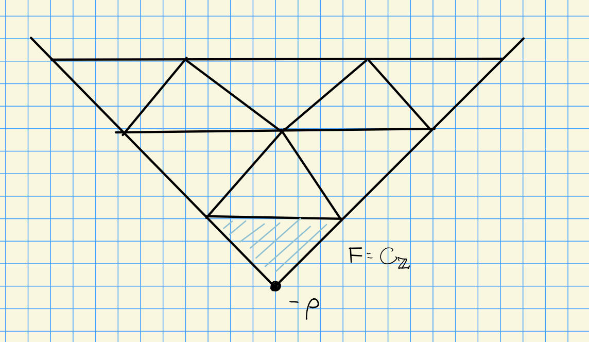

# Friday, October 23

## Facets

$W_p$ has a dot action on $E \da X(T) \tensor_\ZZ \RR$.

:::{.definition title="Facet"}
We can write $\Phi^+ = \Phi_0^+ \union \Phi_1^+$, and define the *facet* as
\[  
F \da \ts{
\lambda \in E \st \inner{\lambda + \rho}{\alpha\dual} = n_\alpha p\,\, \forall\alpha\in \Phi_0^+(F),\,\,
(n_\alpha - 1)p < \inner{\lambda + \rho}{\alpha\dual} < n_\alpha p \,\,\forall \alpha\in \Phi_1^+(F)
}
.\]
The first condition corresponds to being on a vertex in the following diagram, while the second corresponds to being in the interior of a triangle:

:::

:::{.definition title="Closure of a Facet"}
The *closure* of a facet is defined by replacing the second condition with an inequality.
\[  
\bar F \da \ts{
\lambda \in E \st \inner{\lambda + \rho}{\alpha\dual} = n_\alpha p\,\, 
\forall\alpha\in \Phi_0^+(F),\,\,
n_\alpha - 1 \leq  \inner{\lambda + \rho}{\alpha\dual} \leq n_\alpha p 
\,\,\forall \alpha\in \Phi_1^+(F)
}
.\]
This includes all of the walls of the triangle.
:::

:::{.definition title="Upper Closure of a Facet"}
Finally, we define the *upper closure* by replacing one inequality with a strict inequality:
\[  
\hat F \da \ts{
\lambda \in E \st \inner{\lambda + \rho}{\alpha\dual} = n_\alpha p\,\, \forall\alpha\in \Phi_0^+(F),\,\,
n_\alpha - 1 < \inner{\lambda + \rho}{\alpha\dual} \leq n_\alpha p \,\,\forall \alpha\in \Phi_1^+(F)
}
.\]

:::

:::{.definition title="Alcove"}
A facet is called an **alcove** for $W_p$ iff $\Phi_0^+(F) = \emptyset$.
:::

:::{.remark}
Note that if $F$ is an alcove for $W_p$, then $\hat F$ is a fundamental domain for $W_p\actson E$ with the dot action.
:::

## Translation Functors

Let $\lambda, \mu\in \bar{C}_\ZZ$, and define
\[  
T_\lambda^\mu(\wait) \da 
\pr_\mu \qty{ L(\nu_1) \tensor \pr_\lambda(\wait) }\\
\text{where } 
\nu_1 \in X(T)_+ \intersect W(\mu-\lambda)
.\]

This is exact as a composition of exact functors, since we're tensoring over a field and taking projections (which are themselves exact).

:::{.lemma title="?"}
Let $\lambda,\mu\in X(T)$ and $M$ be a finite-dimensional $G\dash$module.
Then the functors 
\[  
F(\wait) &\da \pr_\mu \circ \qty{M\tensor_k \wait} \circ \pr_\lambda \\
G(\wait) &\da \pr_\lambda \circ \qty{M\dual \tensor_k \wait} \circ \pr_\mu \\
\]
define an adjoint pair, i.e.
\[  
\hom_\mathcal{C}(G(\wait), A) &= \hom_\mathcal{D}(\wait, F(A)) \\
\hom_\mathcal{C}(\wait, G(A)) &= \hom_\mathcal{D}( F(\wait), \wait) \\
.\]
:::

:::{.proof}
Let $V, V'$ be $G\dash$modules.
Then
\[  
\hom_G(FV, V') 
&= \hom_G( \pr_\mu\qty{ M\tensor \pr_\lambda V  }, V') \\
&= \hom_G(  M\tensor \pr_\lambda V  , \pr_\mu V') \\
&= \hom_G(  \pr_\mu \qty{ M\tensor \pr_\lambda V }  , \pr_\mu V') \\
&= \hom_G(  \pr_\lambda V  , M\dual \tensor_k \pr_\mu V') \\
&= \hom_G(  \pr_\lambda V  , \pr_\lambda\qty{ M\dual \tensor_k \pr_\mu V'} ) \\
&= \hom_G(  V  , \pr_\lambda\qty{ M\dual \tensor_k \pr_\mu V'} ) \\
&= \hom_G(V, GV')
.\]

Here we've used the fact that there no nontrivial homs between distinct blocks.
:::

:::{.theorem title="?"}
Let $\lambda, \mu \in \bar{C}_\ZZ$ are in the closure of the bottom alcove.
Then $T_\lambda^\mu \adjoint T_\mu \lambda$ form an adjoint pair.
:::

:::{.proof}
Applying the previous corollary, we just need to show the last equality in the following:
\[  
T_\lambda^\mu(\wait) 
&= \pr_\mu \qty{ L(\nu_1) \tensor \pr_\lambda(\wait) } \\
&= \pr_\lambda \qty{ L(\nu_1)\dual \tensor \pr_\mu(\wait) } \\
&=_? T_\mu^\lambda
.\]

This requires checking the highest weight condition on $L(\nu_1)\dual = L(-w_0 \nu_1)$.
We know $\nu_1 \in X(T)_+ \intersect W(\mu-\lambda)$, so if $\nu_1 = w(\mu-\lambda)$, we have $-w_0 \nu_1 = w_0 w (\lambda - \mu) \in W(\lambda - \mu)$.
Since $-w_0 \nu_1 \in X(T)_+$, this verifies the condition.
:::

:::{.remark}
The adjointness can be extended from homs to exts:
\[  
\ext_G^i(T_\mu^\lambda V, V' ) \cong \ext_G^i(V, T_\lambda^\mu V')
.\]
:::

## Technical Preliminaries

1. If $\lambda \in X(T)$ and
  \[  
  \sum_\mu a(\mu) e^\mu \in \ZZ[X(T)]^W
  \]
  is $W\dash$invariant, then we proved that
  \[  
  \chi(\lambda)
  \qty{
  \sum_\mu a(\mu) e^{\mu}
  }
  = \sum_\mu a(\mu) \chi(\lambda + \mu)
  .\]

2. If $\pr_\lambda V = V$, then we have
\[  
\ch(M\tensor V) 
&= \ch(M) \ch(V) \\
&= \ch(M) \qty{\sum_{w\in W_p} a_w \chi(w\cdot\lambda) } \\
&= \qty{ \sum_{\nu \in X(T)} \dim M_\nu e^\nu } \qty{\sum_{w\in W_p} a_w \chi(w\cdot\lambda) }
.\]

:::{.proposition title="?"}
Let $V$ be a finite dimensional $G\dash$module with $\pr_\lambda V = V$.
Write
\[  
\ch(V) = \sum_{w\in W_p} a_w \chi(w\cdot \lambda) \quad
a_w\in \ZZ,\, \text{cofinitely zero}
.\]
Then
\[  
\ch\qty{\pr_\lambda \qty{ M\tensor V } } = 
\sum_{w\in W} a_w  \qty{ \sum_{\substack{ \nu \in X(T) \\ \lambda + \nu \in W_p\cdot \mu} } \dim M_\nu } \chi(w\cdot (\lambda + \nu) )
.\]
:::

:::{.proof}
Using (1) and (2), we can write
\[  
\ch(M\tensor V) = 
\sum_{w\in W_p} a_w \sum_\nu \dim M_\nu \chi(w\cdot \lambda + \nu)
.\]
Note that $w\cdot \lambda + \nu = w\cdot (\lambda + w_1 \nu)$ where $w_1 \da w^{-1}$, using the fact that the dot action acts linearly on the second term.
This comes from the following computation:
\[  
w\cdot(\mu_1 + \mu_2)
&= w(\mu_1 + \mu_2 - \rho) + \rho \\
&= w(\mu_1 + \rho) - \rho + w\mu_2 \\
&= w\cdot \mu_1 + w\mu_2
.\]

We can thus write
\[  
\ch(M\tensor V) = 
\sum_{w\in W_p} a_w \qty{ \sum_\nu \dim M_\nu \chi(w\cdot \qty{\lambda + \nu})}
,\]
since summing over $\nu$ is the same as summing over $w\nu$ for any $w$.

To get $\ch(\pr_\mu(M\tensor V))$, take $\chi(w(\lambda + \nu))$ and note that $\lambda + \nu \in W_p \cdot \mu$.
:::

:::{.remark}
Given $\ch V$, one can write $\ch T_\lambda^\mu V$.
What will be important here are stabilizers.
If $\lambda$ is on a wall, the stabilizer fixes the corresponding hyperplane.

:::

