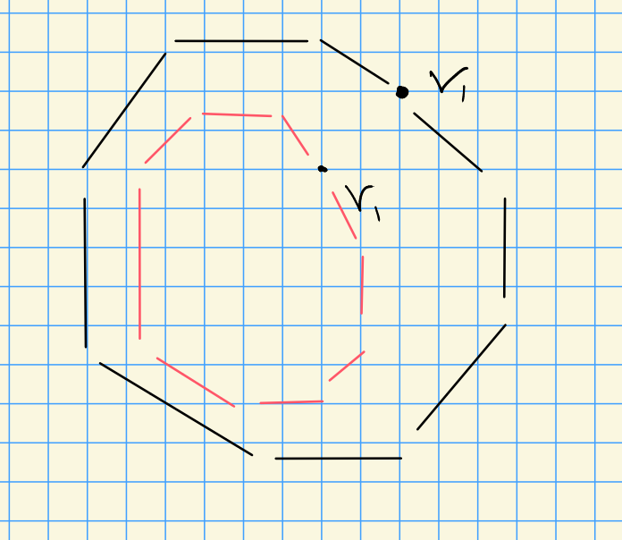
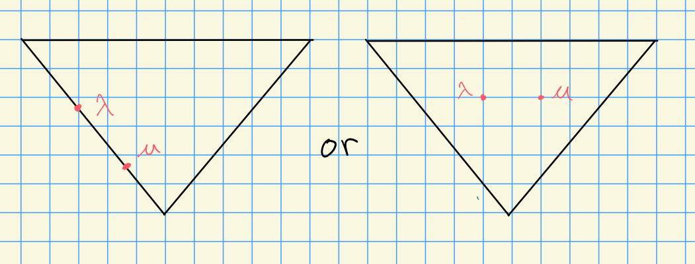

# Monday, October 26

## Review

Let $V$ be a finite dimensional $G\dash$module with $\pr_\lambda V = V$, and write 
$\ch(V) = \sum_{w\in W_p} a_w \chi(w\cdot \lambda)$ 
where $a_w\in \ZZ$ and only finitely many are nonzero.
We can then write
\[  
\ch\qty{\pr_\mu(M\tensor V)} = \sum_{w\in W_p} a_w \qty{\sum_{\substack{\nu \in X(T) \\ \lambda+\nu \in W_p\cdot \mu} } \dim M_\nu \, \chi(w\cdot(\lambda + \nu))   }
,\]
where we sum over all weights linked to $\mu$

:::{.lemma title="Technical"}
Let $\lambda,\mu \in \bar{C}_\ZZ$ and $\nu_1 \in X(T)_+ \cap W(\mu-\lambda)$.
Then

a. $\lambda + w\nu \not\in W_p\cdot \mu$ for any $w\in W$ and $\nu < \nu_1$.
  
b. If $w\in W$ and $\lambda + w\nu_1 \in W_p \cdot \mu$ (which can happen), then there exists some $w_1\in W_p$ such that

- $w_1\cdot \lambda = \lambda$, so it stabilizes $\lambda$,
- $w_1\cdot \mu = \lambda + w\nu_1$
:::

## Characters of Translated Modules

Goal: find $\ch T_\lambda^\mu V$.

:::{.theorem title="?"}
Let $\lambda, \mu \in \bar{C}_\ZZ$ and $V$ be a finite-dimensional module with $\pr_\lambda V = V$.
Write 
\[
\ch(V) = \sum_{w\in W_p} a_w \chi(w\cdot \lambda)
,\]
where $a_w\in \ZZ$ and this is a finite sum.
Then
\[  
\ch(T_\lambda^\mu V) = 
\sum_{w\in W_p} a_w \qty{ 
  \sum_{w_1\in S} \chi(ww_1\cdot \mu)
},
\]
where $S$ is a set of coset representatives for the group 
\[
\stab_{W_p}(\lambda) \over \stab_{W_p}(\mu) \cap \stab_{W_p}(\lambda)
\]
:::

:::{.proof}
We can write
\[  
\ch(T_\lambda^\mu V)
&= \ch\qty{\pr_\mu\qty{L(\nu_1) \tensor \pr_\lambda V } } \\
&= \ch\qty{\pr_\mu\qty{L(\nu_1) \tensor V } } \\
&= \sum_{w\in W_p} a_w \qty{\sum_\nu \dim L(\nu_1)_\nu \chi(w\cdot(\lambda + \nu)) }\\
&= \sum_{w\in W_p} a_w  \qty{ \sum_\nu \dim L(\nu_1)_\nu \chi(w\cdot\lambda + \nu)  }
.\]

We need $\lambda + \nu\in W_p\cdot \mu$ and $\nu \leq \nu_1$ to apply the technical lemma.

{width=250px}

The last step can be written because the only contributions are $\nu \in W\nu_1$ and $\dim L(\nu_1)_\nu = 1$, i.e. we're on the outer shell in the figure above.

We can apply (a) and (b) from the technical lemma to write
\[  
\cdots 
&= \sum_{w\in W_p} a_w \sum_{w_1} \chi(w(w_1\cdot \mu))
.\]

By (b), $w_1 \in \stab_{W_p}(\lambda)$.
We don't want duplication, so we can check that $w_1\cdot\mu = w_2 \cdot\mu  = \lambda+ w\nu_1$ implies that $w_1 \in w_2 \stab_{W_p}(\mu)$.
Thus we need to take the coset representatives stated in the theorem.

> Thus we don't need to consider any weights in the inner shell.

:::

## Equivalence of Categories

Goal: show that a pair of functors each admit a natural transformation to the identity.

:::{.definition title="Natural transformations, isomorphisms, and equivalence of categories"}
Let $\mathcal{C}, \mathcal{D}$ be categories and $S, T:\mathcal{C} \to \mathcal{D}$ be two functors.
A **natural transformation** $\alpha:S\to T$ is a function that assigns to each object $c\in \mathcal{C}$ a morphism $\alpha_c:S(c) \to T(c)$ in such a way that for every $f:c\to c'$, we have a commuting square
\begin{tikzcd}
S(c) \ar[r, "{\alpha_c}"] \ar[d, "S(f)"] & T(c)\ar[d, "T(f)"] \\
S(c') \ar[r, "{\alpha_c}"] & T(c')
\end{tikzcd}

If $\alpha_c$ is an equivalence for all $c\in \mathcal{C}$, then $\alpha$ is said to be a **natural isomorphism**.
Two categories are said to be **equivalent** iff $S\circ T$ and $T\circ S$ are naturally isomorphic to the identity functor.
:::

:::{.theorem title="?"}
Suppose $\lambda, \mu \in \bar{C}_\ZZ$ belong to the same facet.
Then $T_\lambda^\mu$ induces an equivalence of categories from
\[  
\mathcal{B}_\lambda \da \mathcal{C} \da \ts{V\in \mods{G} \st \pr_\lambda V = V} \leadsto
\mathcal{B}_\mu \da \mathcal{D} \da \ts{V\in \mods{G} \st \pr_\mu V = V}
.\]
where $T_\mu^\lambda \circ T_\lambda^\mu \cong \pr_\lambda$.
:::

:::{.proof}
Using the adjointness of $T_\lambda^\mu$ and $T_\mu^\lambda$< we can write
\[  
\hom_G(V, T_\mu^\lambda T_\lambda^\mu V) \equiv
\hom_G(T_\lambda^\mu V,  T_\lambda^\mu V)
.\]

So consider the identity map on the latter $\id: T_\lambda^\mu V\selfmap$, and let $f_V: V\to T_\mu^\lambda T_\lambda^\mu V$ be the corresponding map in the former.
We can a natural transformation in the following way

\begin{tikzcd}
V \ar[r, "{f_V}"]\ar[d, "\id"] & T_\mu^\lambda T_\lambda^\mu V \ar[d, "\id'"] \\
V' \ar[r, "{f_{V'}}"] & T_\mu^\lambda T_\lambda^\mu V'
\end{tikzcd}

It suffices to show that the $f_V$ are isomorphism as maps of $G\dash$modules, so one proceeds by

- Showing it works for simple $G\dash$modules, and

- Applying induction to composition length, using the five lemma.

Suppose $V$ is simple, then by the prior theorem we can write
\[  
\ch T_\mu^\lambda T_\lambda^\mu V = 
\sum_{w\in W_p} a_w \qty{\sum_{w_1, w_2} \chi\qty{w(w_2 w_1)\cdot \lambda } }
.\]
We know that 

- $w_1\in \stab_{W_p}(\mu) / \sim$
- $w_2\in \stab_{W_p}(\lambda) / \sim$

Note that if $\mu, \lambda$ are in the same facet, then the stabilizers are the same.

So $\lambda, \mu$ are in the same facet, so $w_1 = \id, w_2 = \id$ and $f_V$ is an isomorphism.
We thus obtain 
$T_\mu^\lambda T_\lambda^\mu =\cong \pr_\lambda$ 
and
$T_\lambda^\mu T_\mu^\lambda =\cong \pr_\mu$.
Thus $B_\lambda \cong B_\mu$.
:::

*Question*:
What happens when translating from an alcove onto a wall?
A similar formula will hold in this case: we will get either induced modules or zero, depending on the dominance of the weights.
This will lead into the Lusztig conjectures.

