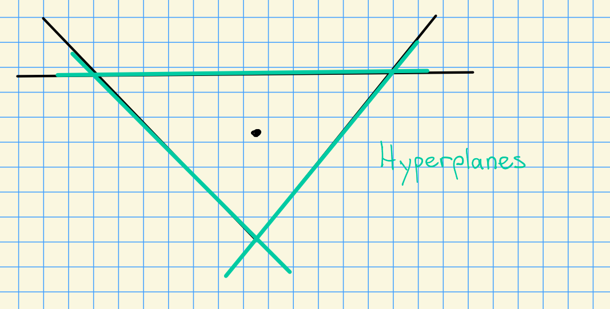
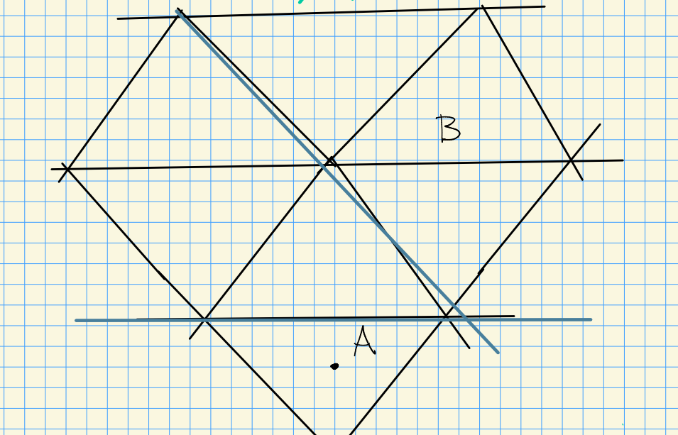
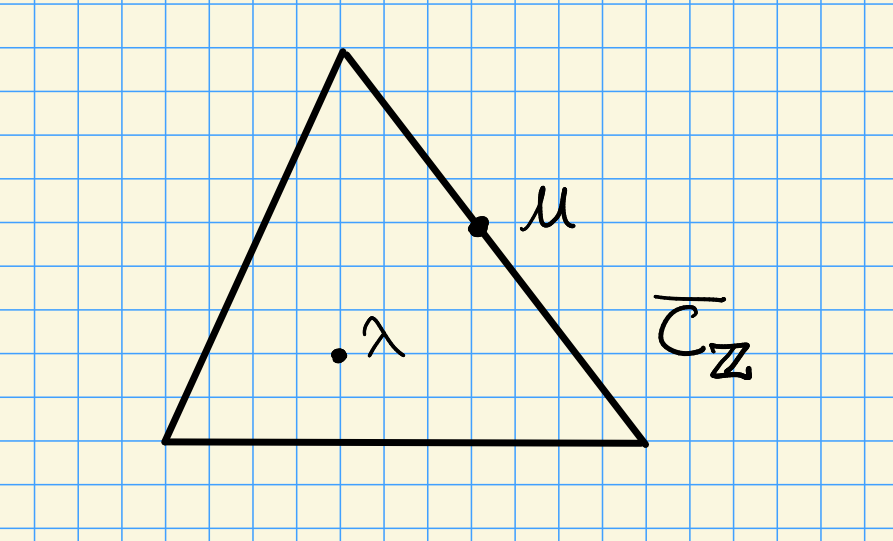
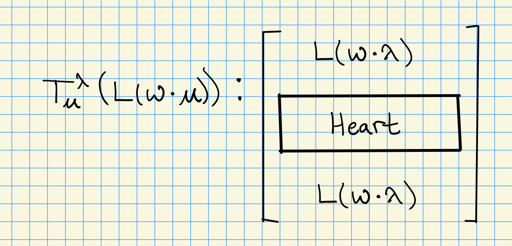
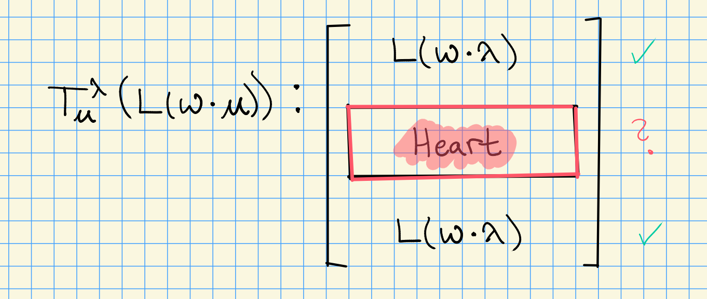

# Monday, November 02

Today: Lusztig conjectures, but first some alcove geometry.

## Alcove Geometry

### Length Function for Alcoves

Let $A, B$ be alcoves, and recall that a hyperplane is give by
\[  
H_{\alpha, m} \da \ts{ \lambda \in X(T) \st \inner{\lambda + \rho}{\alpha\dual} = mp }
.\]

These are codimension 1 objects:

We can also divide these into positive and negative sides:

\[  
H_{\alpha, m}^+ &\da \ts{   \lambda \in X(T) \st \inner{\lambda + \rho}{\alpha\dual} > mp } \\
H_{\alpha, m}^- &\da \ts{   \lambda \in X(T) \st \inner{\lambda + \rho}{\alpha\dual} < mp } 
.\]

Let $S(A, B)$ be the set of hyperplanes separating $A$ and $B$.

If $H\in S(A, B)$, then define a function
\[  
\eps(H) \da
\begin{cases}
1 & A\in H_{\alpha, m}^- \\
-1 & A\in H_{\alpha, m}^+
\end{cases}
,\]
and from it construct a **distance function**
\[  
d(A, B) \da \sum_{H\in S(A, B)} \eps(H)
.\]

Recall that we can define 
\[  
C_\ZZ = \ts{\lambda \in X(T) \st 0 < \inner{\lambda+\rho}{\alpha\dual}<p \,\, \forall \alpha\in\Phi^+ }
,\]
and for $\lambda \in C_\ZZ$

\[  
d(w\cdot \lambda) = d(C_\ZZ, wC_\ZZ)
.\]

for $w\in W_p$.

Now consider the following situation:

Recall that computing $\ch L(\lambda)$ is equivalent to finding $[H^0(w\cdot \lambda): L(w_2\cdot \lambda)]$.
We know that
\[  
[T_\mu^\lambda (L(w\cdot\mu)) : L(w\cdot \mu)] = 2
,\]
where the $w$s are now the same, and the structure of the module is

where knowing the structure of the heart of the module is an open problem.

The setup is the following:
Let $\lambda\in X(T) \intersect C_\ZZ$ where $\mu \in \bar{C}_\ZZ$.
Since it's on a wall, there is a nontrivial stabilizer $\stab_{W_p}(\mu) = \gens{s}$.
We can write
\[  
\ch L(w\cdot \lambda) = \sum_{w'} a_{w, w'} \chi(w' \cdot \lambda)
.\]

The sum is over $w'\in W_p$ where $w'\cdot \lambda \in X(T)_+$, and we have strong linkage $w'\cdot \lambda \uparrow w\cdot \lambda$.
Now consider translating from $\lambda$ to the wall $\mu$.
We can write
\[  
\ch L(w\cdot \lambda) = \sum_{w'} a_{w, w'} \chi(w' \cdot \mu)
.\]

Since $\gens{s}$ is the stabilizer, we have
\[  
\ch T_\mu^\lambda L(w\cdot \mu)
&= \sum_{w'} a_{w, w'} \chi(w' \cdot \lambda)
+ \sum_{w'} a_{w, w'} \chi(w's \cdot \mu) \\
&= \ch L(w\cdot \lambda)
+ \sum_{w'} a_{w, w'} \chi(w's \cdot \mu)
,\]

We can now check that
\[  
\ch T_\mu^\lambda T_\lambda^\mu L(w\cdot \lambda) = 
\ch L(w\cdot \lambda) + \chi(ws\cdot \lambda ) + \sum_{w'} b_{w'} \chi(w'\cdot\lambda)
.\]

Note that in the last sum, the $b_{w'}$ with $w'\in W_p$ satisfy $w'\cdot \lambda \in X(T)_+$ and $d(w'\cdot\lambda) < d(w\cdot \lambda)$.
We would like to compute
\[  
[H^0(w_1\cdot \lambda) : L(w_2\cdot \lambda)
.\]
using induction on $d(w_1\cdot \lambda)$.

Suppose that for all $w_1$ with $d(w_1\cdot\lambda) < d(w\cdot \lambda)$, we know all of the $b_{w'}$.
In this case, we know $\chi(ws\cdot \lambda)$ by Weyl's character formula.
We'd then only need to know the translated character
\[  
T_\mu^\lambda T_\lambda^\mu L(w\cdot \lambda)
.\]
Note that it's sufficient to know all of its composition factors
\[  
[T_\mu^\lambda T_\lambda^\mu L(w\cdot \lambda): L(w_2\cdot \lambda)
,\]

and since we know the head and the socle, it suffices to understand the composition factors in its heart:

:::{.remark title="Question (Vogan, Beilinson-Bernstein)"}
Is the heart semisimple for 
\[  
\inner{w(\lambda + \rho)}{\alpha\dual} \leq p(p-h-2) && \forall \alpha\in \Phi^+
.\]
where $w\cdot\lambda = w(\lambda + \rho) - \rho$?
:::
:::{.definition title="Coxeter Number"}
Define $h$ to be the **Coxeter number**, defined by 
\[  
h \da \inner{\rho}{\alpha_0\dual} + 1
\]
where $\alpha_0$ is the highest short root.
:::

:::{.example title="?"}
Let $\Phi = A_n$, then $\alpha_0 = \alpha_1 + \alpha_2 + \cdots + \alpha_n$.
Then $h=n+1$.
:::

:::{.example title="?"}
Let $\Phi = G_2$, then $\alpha_n = 3\alpha_1 + 2\alpha_2$, and $h = 5+1 = 6$.
:::

:::{.remark}
Andersen showed that this question is equivalent to the Lusztig conjecture.
To state this conjecture, we'll need a few more definitions.
:::

:::{.definition title="Jantzen Region"}
Define the **Jantzen region** by
\[  
\operatorname{Jan} \da \ts{\lambda \in X(T) \st 
0 \leq \inner{\lambda + \rho}{\alpha\dual} \leq p(p-h-2) \,\, \forall \alpha\in \Phi^+
}
.\]
:::

:::{.proposition title="Lusztig Conjecture"}
Let $\lambda \in X(T) \intersect C$ and $w\cdot\lambda \in \jan$ with $w\in W_p$.
Then
\[  
\ch L(w\cdot \lambda) = \sum_{w'} (-1)^{d(w\cdot \lambda) - d(w'\cdot \lambda)} P_{w'w_0, ww_0} (1) \chi(w'\cdot \lambda)
.\]
where $w'\in W_p$ with $w'\cdot\lambda \in X(T)_+$.
The polynomials $P$ appearing here are the KL-polynomials for $W_p$ and $w_0$ is the longest element in $W$.
:::

:::{.remark}
Note that the Lusztig conjecture is similar to the Kazhdan-Lusztig conjectures: in that setting, we're in category $\OO$, we have the Weyl group instead of the affine Weyl group, and we're concerned with the characters of Verma modules.
Note that this conjecture is true for category $\OO$ and in the case of quantum groups.
In the quantum group setting, you can only iterate Frobenius once, but for algebraic groups it can be iterated.
The presence of the affine Weyl group also makes these settings very different.
:::

:::{.remark}
Some remarks on the conjecture:

- This is true for $p\gg 0$, by Andersen-Jantzen-Soergel (1994) and Kazhdan-Lustzig, Koshiwana-Tanisaki.

- It was unknown if there was an effective lower bound until it was found by Fiebig (possibly in 2000s)

- Williamson demonstrated a counterexample by looking at Steinberg weights.
:::

If we know $\ch L(\lambda)$ for $\lambda \in X_1(T)$ in the restricted region, by Steinberg's twisted tensor product formula we can compute $L(\mu)$ for $\mu \in X(T)_+$.
So when is the restricted region contained in the Jantzen region, so $X_1(T) \subseteq \jan$?
Assume that $\lambda \in X_1(T)$, then compute
\[  
\inner{\lambda+\rho}{\alpha_0\dual} = \inner{\lambda}{\alpha_0\dual} + (h-1)
.\]
Note that by extending scalars to $\QQ$, we get an inequality in the ordering of the form $\lambda \leq_\QQ (p-1_\rho)$.
We can then write

\[  
\inner{\lambda+\rho}{\alpha_0\dual} 
&= \inner{\lambda}{\alpha_0\dual} + (h-1) \\
\leq \inner{(p-1) \rho}{\alpha_0\dual} + (h-1)  \\
&= (p-1)(h-1) + (h-1) \\
&= p(h-1) 
.\]
When is this less than or equal to $p(p-h-2)$?
We can check that this happens iff 
\[  
p(h-1) &\leq p(p-h-2) \\
\iff h-1 &\leq p-h-2 \\
\iff 2h+1 &\leq p
,\]
so the conjecture (as stated in its original form) reads
\[  
p\geq 2h+1 \implies X_1(T) \subseteq \jan
.\]

:::{.remark}
Kato conjectured that this bound could be lowered to $p\geq h$, but Williamson produced counterexamples around 2013.
Essentially, the calculation of $\ch L(\lambda)$ is still open.
:::

Next time: we'll define $G_rT\dash$modules.
We'll define a graded category to prevent the weights from collapsing mod $p$.
These turn out to be easier to work with than $G_r\dash$modules, and results can be pushed down.

