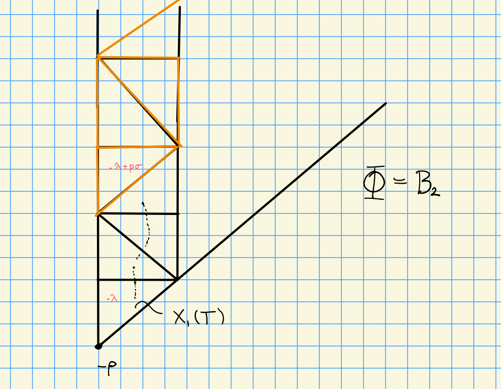

# Wednesday, November 04

Today: $G_r\dash T$ modules.

Note that $G_r\normal G_r T$, with $G_r T/G_r \cong T^{(r)}$.
We consider $G_r T\dash$modules, which are $G_r\dash$modules with a $T$ action given by
\[  
G_r \cross M &\to M \\
(g, m) &\mapsto g\cdot m
\]
which are $T\dash$equivariant, i.e. $t(g\cdot m) = (t\cdot g)(t\cdot m)$ for $t\in T, g\in G_r$, and $m\in M$ is a $G_r T\dash$module.
This essentially induces a grading on $G_r$.

## Representations for $G_r T$ and $G_r B$

Recall that we have a Frobenius map, for which we take the scheme-theoretic kernel:
\[  
F&: G \to G \\ 
F^r &\da F\circ F \circ \cdots \circ F \\
G_r &\da \ker F^r
,\]
and we then define
\[  
G_r T \da (F^r)^{-1} (T) \\
G_r B \da (F^r)^{-1} (B) 
\]
taken as scheme-theoretic objects.

Noting that $B\subset G_r B$, for $\lambda \in X(T)$ we define
\[  
\hat{Z}_r' (\lambda) &\da \ind_B^{G_r B} \lambda \\
\hat{Z}_r (\lambda) &\da \coind_B^{G_r B} \lambda
.\]

These are enhancements of the baby Verma modules, in the sense that if we take restrictions we get
\[  
\hat{Z}_r' (\lambda) \downarrow_{G_r} = \ind_{B_r}^{G_r} \lambda
.\]

We similarly have 
\[  
{Z}_r' (\lambda) \downarrow_{G_r T} &= \ind_{B_r T}^{G_r T} \lambda \\
\hat{Z}_r' (\lambda) \downarrow_{G_r T} &= \coind_{B_r T}^{G_r T} \lambda
.\]

:::{.proposition title="?"}
\envlist

1. $\hat{Z}_r(\lambda + p^r \mu) \cong \hat{Z}_r(\lambda) \tensor p^r \mu$
2. $\hat{Z}_r' (\lambda + p^r \mu) \cong \hat{Z}_r' (\lambda) \tensor p^r \mu$
3. $\ch \hat{Z}_r(\lambda) = \ch \hat{Z}_r' (\lambda) = e^\lambda \prod_{\alpha\in\Phi^+} {1 - e^{-p^r\mu} \over 1 - e^{-\alpha}}$.

:::

:::{.proof title="of 1 and 2"}
From the definition, we have
\[  
\hat{Z}_r'(\lambda + p^r \mu)
&= \ind_{B}^{G_r B} (\lambda + p^r \mu) \\
&= \ind_{B}^{G_r B} (\lambda \tensor  p^r \mu) \\
\cong \qty{\ind_B^{G_r B} \lambda} \tensor p^r\mu
.\]
Where in the last equality we've applied the tensor identity, noting that $p^r\mu$ is a 1-dimensional $G_r B\dash$module, since
\[  
G_r B \to G_r B/G_r = B^{(r)} = B/B_r
,\]
making it a representation by pullback.
:::

:::{.proof title="of 3"}
We can write
\[  
\hat{Z}_r(\lambda) = \dist(U_r) \tensor \lambda
,\]
and thus
\[  
\ch \hat{Z}_r(\lambda) 
&= e^{\lambda} \ch \dist(U_r)  \\
&= e^{\lambda} \prod_{\alpha\in \Phi^+}\qty{ 1 + e^{-\alpha} + \cdots + e^{-(p^r-1)\alpha} } \\
&= e^\lambda {1 - e^{-p^r \alpha} \over 1 - e^{-\alpha}} && \text{as a geometric series}
.\]
:::

The next theorem is related to the fact that when comparing these categories of modules, one is essentially a graded version of the other.

:::{.theorem title="?"}
Let $M\in\mods{G_rT}$, then TFAE:

1. $M$ is an injective $G_r T\dash$module.
2. $M$ is an injective $G_r\dash$module.

:::

Note that $G_r \normal G_r T$, where the quotient is $T^{(r)}$ which is twisted by Frobenius $r$ times.

:::{.proof title="?"}
We'll apply the Lydon-Hoschild-Serre spectral sequence: for $N$ a $G_r T\dash$module, 
\[  
E_2^{i, j} = \ext_{T^{(r)}}^{i}\qty{K, \ext_{G_r}^j\qty{N, M} } \abuts \ext_{G_r T}^{i+j}(N, M)
.\]

$2\implies 1$:

We first note that 2 implies $\ext_{G_r}^{>0}(N, M) = 0$, so the spectral sequence collapses and we have
\[  
\ext_{T^{(r)}}^i (k, \hom_{G_r}(M, N) ) \cong \ext_{G_r T}^i(N, M)
.\]
Since modules over $T^{(r)}$ are completely reducible, we have 
\[  
\ext_{T^{(r)}}^{>0} ( k, \hom_{G_r}(N, M) ) = 0
,\]

and thus $\ext_{G_r T}^{>0}(N, M) = 0$, making $M$ an injective $G_r T\dash$module.
$\qed$
\

$1\implies 2$:

The simple $G_r T\dash$modules are of the form $N\da L_r(\lambda) \tensor p^r\sigma$ where $\lambda\in X_r(T)$ and $\sigma\in X(T)$.
Note that $L_r(\lambda)$ is simple $G_r\dash$module.
Applying the spectral sequence, there is a 5 term exact sequence.
Letting $E_t \da \ext_{G_rT}^t (N, M)$.

\begin{tikzcd}
0 \ar[r] &
E_2^{1, 0} \ar[r] &
E_1         \ar[r] &
E_2^{0, 1} \ar[r] &
E_2^{2, 0} \ar[r] &
E_2
\end{tikzcd}

Everything is zero here except for the middle term:
$E_1, E_2 = 0$ by assumption?
$E_2^{1, 0}, E_2^{2, 0} = 0$ by ?.

We can thus conclude that
\[  
0 = E_2^{0, 1}
&= \hom_{T^{(r)}}(k, \ext_{G_r}^1 (L_r(\lambda) \tensor p^r\sigma, M)  ) \\ 
&= \hom_{T^{(r)}}(p^r\sigma, \ext_{G_r}^1 (L_r(\lambda), M)  ) 
,\]
which holds for all $p^r \sigma$, and thus $\ext_{G_r}^1 (L_r(\lambda), M) = 0$ for all $\lambda\in X_1(T)$.
So $M$ is injective as a $G_r\dash$module.
:::

:::{.proposition title="?"}
Let $\lambda \in X(T)$, then

1. $\hat{Z}_r (\lambda) \downarrow_{B_r T}$ is the projective cover of $\lambda$ and the injective hull of $\lambda - 2(p^r-1)\rho$.

2. $\hat{Z}_r' (\lambda) \downarrow_{B_r^+}$ is the projective cover of $\lambda - 2(p^r-1)\rho$ and the injective hull of $\lambda$.

:::

## Summary: Classification of Simple $G_r T\dash$Modules

- $\soc_{B_r^+} \hat{Z}_r '(\lambda) = \lambda$
- $\hat{Z}_r ' (\lambda) ^{U^+} = \lambda$, where the RHS denotes the $U^+$ invariants.
- Let $\hat{L}_r(\lambda) \da \soc_{G_r T} \hat{Z}_r' (\lambda)$.
- Each simple $G_r T\dash$module is isomorphic to $\hat{L}_r (\lambda)$ for some $\lambda\in X(T)$.
- $\hat{L}_r(\lambda) \downarrow_{G_r} \cong L_r (\lambda)$ for all $\lambda \in X_1(T)$.
- Translation invariance: $\hat{L}_r(\lambda + p^r\sigma) = \hat{L}_r (\lambda) \tensor p^r\sigma$
- $\hat{L}_r (\lambda + p^r \sigma) \downarrow_{G_r} = L_r(\lambda)$ for all $\lambda \in X_r(T)$.

> This essentially allows you to replace working mod $p$ in characteristic $p$ with working with integers instead, allowing the usual weight theory to be used.

:::{.proposition title="?"}
Let $\lambda \in X(T)$, then there exists an isomorphism of $G\dash$modules
\[  
H^i(\lambda) = R^i \ind_{G_r B}^G \hat{Z}_r ' (\lambda)
,\]
where $\hat{Z}_r'(\lambda) = \ind_B^{G_r B}(\lambda)$.
:::
