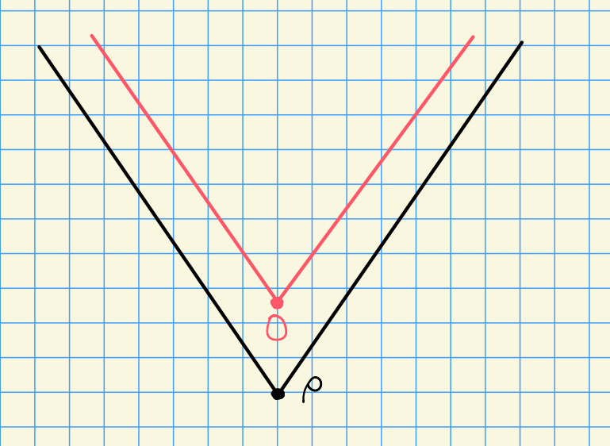
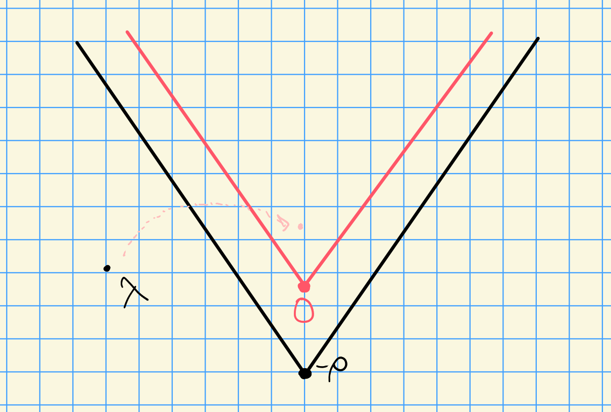

# Friday, November 06

## Good $(p, r)\dash$ Filtrations

Last time: $G_r T$ and $G_r B$ modules.
We roughly know the category of $G_r$ modules, and we think of $G_r T$ as graded $G_r\dash$modules.
We defined 
\[  
\hat{Z}_r' (\lambda) &\da \ind_{B}^{G_r B}(\lambda) \\
\hat{Z}_r' (\lambda) &\da \coind_{B^+}^{G_r B^+}(\lambda)
.\]

We can use these for classification since we have a correspondence
\[  
\correspond{\text{Simple }G_rT\dash\text{modules}}
&\iff
\correspond{X(T)} \\
\hat{L}_r(\lambda) = \hat{L}_r(\lambda_0) \tensor p^r \lambda &\mapsfrom \lambda = \lambda_0 + p^r \lambda_1
,\]
where $\hat{L}_r(\lambda_0)$ is a simple $G_r\dash$module and $\lambda_0 \in X_r(T)$.

:::{.proposition title="?"}
For each $\lambda\in X(T)$ and $i\in \NN$, there exists an isomorphism of $G\dash$modules
\[  \correspond{X(T)} \ \hat{L}_
H^i(\lambda) = R^i \ind_{G_r B}^G \hat{Z}_r'( \lambda  )
.\]
:::

:::{.proof title="?"}
We can compose the two functors to get a Grothendieck-type spectral sequence
\[  
E_2^{m, n} = R^m \ind_{G_r B}^{G} \qty{ R^n \ind_{B}^{G_r B}(\lambda) }
\abuts
R^{m+n} \ind_B^G(\lambda)
,\]
which follows from induction being transitive.
Note that $\ind_{B}^{G_r B}(\wait)$ is exact, since coinduction is given by $\dist(G_rB)\tensor_{\Dist(B)}\lambda \cong \Dist(U_r^+)\tensor_k \lambda$ is tensoring over a field, and this is dual to induction.
Thus $R^{>0} \ind_B^{G_r B}(\lambda) = 0$ and the spectral sequence collapses to yield
\[  
R^m \ind_{G_r B}^G R^0 \ind_{B}^{G_r B} 
= R^m \ind_{G_r B}^G \ind_{B}^{G_r B} 
= R^m \ind_B^G(\lambda)
,\]
where we can just note that $\ind_B^{G_r B}(\lambda) = \hat{Z}_r'(\lambda)$.
:::

Recall *Kempf's vanishing theorem*: if $\lambda \in X(T)_+$ is a dominant weight, then $H^{>0}(\lambda) = 0$.

:::{.definition title="$p\dash$filtration, due to Steve Donkin"}
Let $M\in \mods{G}$, then $M$ has a (good) **$(p, r)\dash$filtration** iff there exists a sequence of $G\dash$modules
\[  
0 = M_0 \subseteq M_1 \subseteq M_2 \subseteq \cdots \subseteq M_s = M
\]
such that $M_i / M_{i+1} \cong L(\lambda_0) \tensor H^0(\lambda_1)^{(r)}$ where $\lambda_0 \in X_r(T)$ (so the first time is irreducible) and $\lambda_1 \in X(T)_+$, so the second term is twisted.
:::

:::{.remark}
Question due to Jantzen: let $\lambda \in X(T)_+$. 
Does $H^0(\lambda)$ have a good $(p, r)\dash$filtration?
:::

This question was open for a while, until the following was found:

:::{.proposition title="Parshall-Scott, 2013"}
If $p\geq 2(h-1)$ and Lusztig's character formula holds for $G$, then $H^0(\lambda)$ has a good $(p, r)$ filtration.
:::

:::{.proposition title="Bendell-Nakano-Pillen-Sobaje, 2019"}
There are counterexamples to Jantzen's question.
Example: $\Phi = G_2$ and $p=2$.
:::

> Later: we'll see how to construct these filtrations by factoring induction into intermediate inductions.

:::{.theorem title="?"}
Let $\lambda \in X(T)_+$ and assume every composition factor of the baby Verma $\hat{Z}_r'(\lambda)$ has the form $\hat{L}_r(\mu_0 + p^r \mu_1) = \hat{L}_r(\mu_0) \tensor p^r \mu_1$ where $\mu_0\in X_r(T)$ and $\mu_1\in X(T)$ is any weight.
Suppose further that $\inner{\mu_1 + \rho}{\beta\dual}\geq 0$ for all $\beta\in \Delta$ (so it's "pretty dominant").
Then $H^0(\lambda)$ has a good $(p, r)$ filtration, and moreover
\[  
[ \hat{Z}_r'(\lambda) : \hat{L}_r(\mu_0) \tensor p^r \mu_1 ]
= [ H^0(\lambda) : L(\mu_0) \tensor H^0(\mu_1)^{(r)} ]
.\]
:::

:::{.proof title="?"}
Suppose $\hat{L}_r(\mu_0 + p^r\mu_1)$ is a composition factor of $\hat{Z}_r'$.
Then since we have $G\dash$modules, we can use the tensor identity to write 
\[  
R^i \ind_{G_r B}^{G} L_r(\mu_0) \tensor p^r \mu_1
&= L_r(\mu_0) \tensor R^i \ind_{G_r B}^{G} p^r \mu_1 \\
&= L_r(\mu_0) \tensor H^i(\mu_1)^{(r)}
,\]
where the last equality follows from a theorem we won't prove here.
We can set $i=0$ to yield
\[  
\ind_{G_r B}^{G} L_r(\mu_0) \tensor p^r \mu_1
\cong L_r(\mu_0) \tensor H^0(\mu_1)^{(r)}
.\]
Recall that $H^0(\lambda) = \ind_{G_r B}^{G} \hat{Z}_r'(\lambda)$, so we'll take a composition series for $\hat{Z}_r'(\lambda)$ and apply the induction functor to it.
So let such a composition series be given by
\[  
0\subseteq N_0 \subseteq N_1 \subseteq \cdots \subseteq N_s = \hat{Z}_r'(\lambda)
,\]
where $N_i / N_{i-1} \cong L(\mu_0) \tensor p^r \mu_1$ for some $\mu_0\in X_r(T)$ and $\mu_1\in X(T)$.
Now apply the functor $\ind_{G_r B}^{G}(\wait)$ which yields
\[  
0\subseteq \cdots \subset \ind_{G_r B}^{G} N_i \subseteq \cdots \subseteq H^0(\lambda)
.\]

Question: is this a good $(p, r)$ filtration?

:::{.warnings}
Note that if we have
\[  
0 \to N_1 \to N_2 \to N_2/N_1 \to 0
\]
this yields
\[  
0 \to \ind N_1 \to \ind N_2 \to \ind (N_2/N_1) \to R^1 \ind N_1 \to \cdots
.\]

Here we need $\ind(N_2/N_1) \cong \ind N_2 / \ind N_1$, so we need to show $R^1 \ind N_1 = 0$.
:::

Using the tensor identity we can write
\[  
R^1 \ind N_1
&= R^1 \ind_{G_r B}^G L_r(\sigma_0) \tensor p^r \sigma_0 \\
&= L_r(\sigma_0) \tensor \qty{R^1 \ind_{G_r B}^G \sigma_1 }^{(r)}
\]
and $\inner{\sigma_1 + \rho}{\beta\dual} \geq 0$, so $R^1 \ind_{G_r B}^G \sigma_1 = 0$.
Thus we can extend the region from Kempf's vanishing slightly:

:::

Finding composition factors for the $\hat{Z}_r'$ is in general a hard problem: if we had this, we'd have the characters of the irreducibles. 
Some combinatorics can be used here.

## Strong Linkage

Note that strong linkage for $H^0(\lambda)$ implies strong linkage for $\hat{Z}_r'(\lambda)$.

:::{.theorem title="?"}
Let $\lambda, \mu \in X(T)$, then
if $[\hat{Z}_r'(\lambda): \hat{L}(\mu)] \neq 0$, then $\mu\uparrow\lambda$ and $\mu\in W_p\cdot\lambda + p^r X(T)$.
:::

:::{.proof title="?"}
Note that $\hat{Z}_r'(\lambda)$ is finite dimensional.
Idea: tensor by a 1d rep to make all composition factors dominant.
Then for any weight $\lambda$, we can find a large enough weight that moves $\lambda$ into the dominant chamber:

I.e., we can tensor by $p^r v$ for $v$ large so that $\hat{Z}_r'(\lambda) \tensor p^r v$ has composition factors if the form $L(\mu_0) \tensor p^r \mu_1$ with $\inner{\mu_1 + \rho}{\beta\dual} \geq 0$ for all $\beta\in\Delta$.

Then $\mu + p^r v \uparrow \lambda p^r v$, which implies $\mu\uparrow \lambda$, and so using strong linkage we have a $p\dash$filtration on $H^0(\lambda + p^r v)$.
:::

Next time: extensions in $\mods{G_r T}$ and the Steinberg module (very important in representation theory, has some nice properties).
