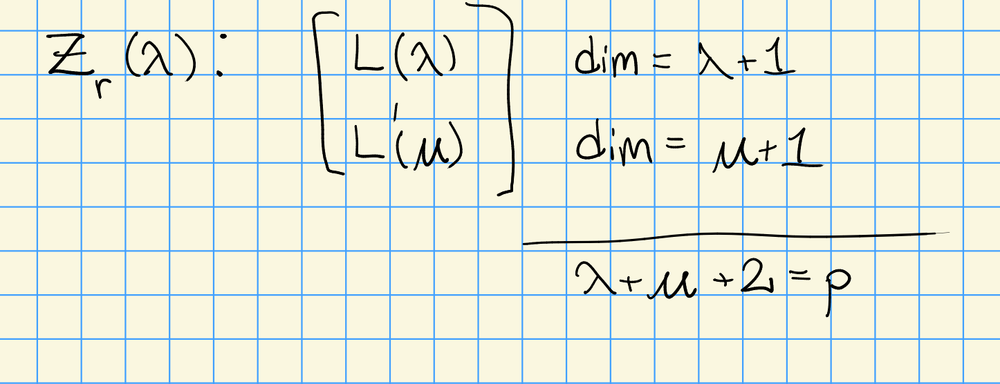
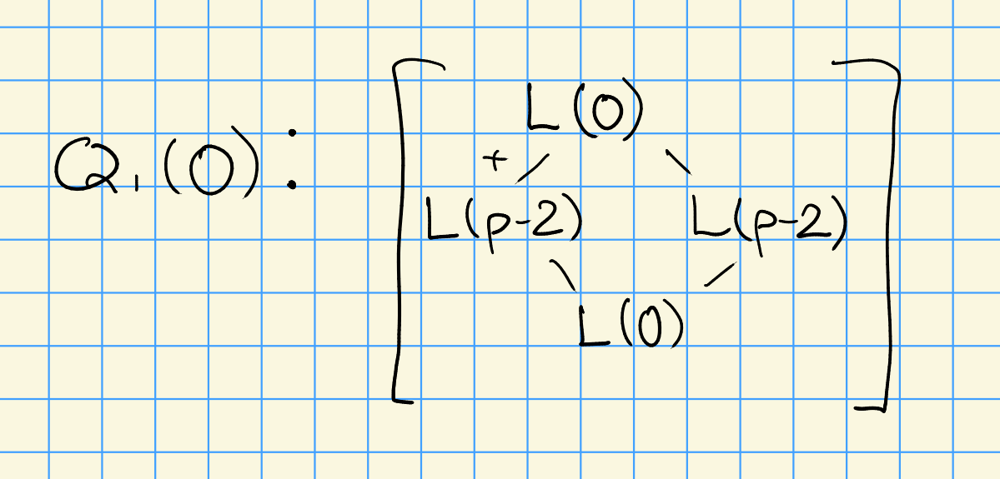
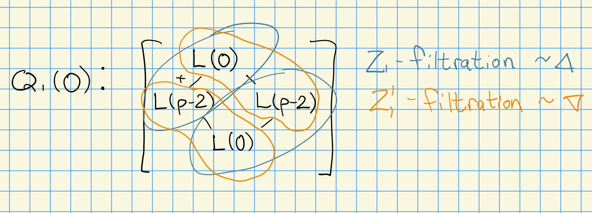
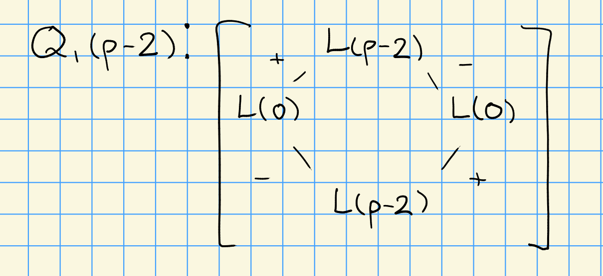

# Friday, November 13

## Review

Review: we're considering $G_r T\dash$modules, with several associated modules of interest:

- Simple modules $\hat{L}_r(\lambda)$ for $\lambda \in X(T)$
- Intermediate modules $\nabla(\lambda) = \hat{Z}_r'(\lambda)$ and $\Delta(\lambda) = \hat{Z}_r(\lambda)$.
- Injective and projective modules $\hat{Q}_r(\lambda)$

:::{.theorem title="?"}
Let $M$ be a $G_r T\dash$module of finite dimension. 
Then $M$ has a $\hat{Z}_r$ filtration $\iff$ $M\downarrow_{B_r}$ is projective.
:::

:::{.remark}
From this, the multiplicity $[M: \hat{Z}_r(\mu)]$ (the number of times $\hat{Z}_r(\mu)$ appears in a $\hat{Z}_r$ filtration ) is well-defined.
Moreover, we have a decomposition
\[  
M\downarrow_{B_r} = \bigoplus_{\mu} Z_r(\mu)\downarrow_{B_r}
,\]
where the sum contains as many terms as the number of factors that appear.
We have $Z_r(\mu)\downarrow_{B_r} \surjects \mu$, making is the projective cover of $\mu$ and thus indecomposable.
We can then apply the Krull-Schmidt theorem.
:::

## Reciprocity

Consider $\hat{Q}_r(\lambda)$, a projective $G_r T\dash$module.
Note that it also happens to be injective.
We saw before that the functor $\coind_{B_r T}^{G_r T}(\wait)$ is exact, and thus $\hat{Q}_r(\lambda)\downarrow_{B_r T}$ being projective implies that
$\hat{Q}_r(\lambda)\downarrow{B_r}$ is also projective.
This implies that $\hat{Q}_r(\lambda)$ has a $\hat{Z}_r\dash$filtration.

Thus the multiplicity can be computed as 
\[
[\hat{Q}_r(\lambda) : \hat{Z}_r(\mu)] 
&= [\hat{Q}_r \downarrow{B_r T} : \hat{Z}_r(\mu)] \\
&= \dim \Hom_{B_r T}\qty{\hat{Q}_r(\lambda), \mu } \\
&= \dim \Hom_{B_r T}\qty{ \hat{Q}_r(\lambda), \ind_{B_r T}^{G_r T} \mu } && \text{by Frobenius reciprocity} \\
\]

:::{.exercise title="?"}
Show that 
\[  
[M: S] = \dim \Hom_A( P(S), \mu) = [\ind_{B_r T}^{B_r T} \mu : \hat{L}_r(\lambda)]
.\]
:::

We can thus continue this computation as 
\[  
\cdots 
&= [\hat{Z}_r'(\mu) : \hat{L}_r(\mu)] \\
&= [\hat{Z}_r(\mu) : \hat{L}_r(\mu)]
,\]
since $\ch \hat{Z}_r (\mu) = \ch \hat{Z}_r'(\mu)$.

Thus we have the following reciprocity theorem

:::{.theorem title="Humphreys"}
\[  
[\hat{Q}_r(\lambda): \hat{Z}_r(\mu)] = [\hat{Z}_r(\mu) : \hat{L}_r (\lambda) ]
.\]
:::

:::{.remark}
This is hard to prove in the $G_r$ category, need to work in the $G_r T$ category and descend.
However, this reciprocity does also work for $G_r$.
:::

:::{.example title="?"}
For $G = \SL_2$, consider $G_1 T$ or $G_1$ where $\lambda = 0,1,2,\cdots, (p-1)$.
We have a notion of *linkage*: $\lambda, \mu$ are in the same $G_1$ block iff $\lambda + \mu = p-2$. 
Note that $\lambda = p-1$ is in its own block.

We have
\[  
Z_r(\lambda) = \coind_{B_1^+}^{G_1} \lambda \surjects L(\lambda)
.\]
If $\lambda + \mu = p-2$, then we have the following situation:

{width=350px}

Taking $\lambda = p-1$, we have $Z_r((p-1)\rho) = L(p-1) = \St_1$.

Applying reciprocity, we gave
\[  
[Q_1(0) : Q_1(\mu)] = [Q_1(\mu): L(0)]
.\]
Since $Q_1(0)$ has factors $Z_1(0)$ and $Z_1(p-2)$, we have 

{width=350px}

We can identify the two filtrations here:

{width=350px}

Similarly, for $Q_1(p-2)$ we have

{width=350px}

We have

- $\dim \hat{Q}_1(\lambda) = 2p$ for $\lambda \neq p-1$

- $\dim \hat{Q}_1(p-1) = p$ for $\lambda = p-1$.

:::

:::{.remark title="Some historical background on reciprocity laws"}
Some work predated the BGG Category $\OO$.
For finite groups, a notion of CDE triangles was worked out.

1. Pollack (1967) computed the structure of projectives for $G_1$ in $G = \SL_2$.

2. Humphreys (1971) proved reciprocity for $G_1$.
  (They were students together.)

3. Bernstein-Gelfand-Gelfand (1976): developed machinery for Category $\OO$, crediting Humphreys.

4. Roche-Caridi (1980): Proved reciprocity for generalized Verma modules.

5. BGG Algebra, Irving: A more axiomatic approach.

6. CPS (1988): Generalized to highest weight categories, also attributed to Humphreys.

7. Holmes-Nakano (1987): Proved when there is a triangular decomposition $A = A^- A_0 A^+$, looked at filtrations and reciprocity, applies to Lie algebras of Cartan type.[^cartan_type]

[^cartan_type]: Simple Lie algebras in characteristic $p$ with a triangular decomposition which is highly non-symmetric (negative part is typically smaller).

:::

## Toward Lifting Conjectures

Recall that $G_r T \subseteq G$.

**Question**: 
Given $\hat{Q}_r(\lambda)$ for a restricted weight $\lambda \in X_r(T)$, does $\hat{Q}_r(\lambda)$ *lift* to $G$?
I.e., does there exist a $G\dash$module $M(\lambda)$ such that $M(\lambda)\downarrow_{G_r T} = \hat{Q}_r(\lambda)$?

:::{.remark}
Note that $L_r(\lambda)$ for $\lambda\in X_r(T)$ lifts to $G$, since $L(\lambda)\downarrow_{G_r T} = \hat{L}_r(\lambda)$.
:::

:::{.theorem title="?"}
Let $p > 2h-2$ and $\lambda \in X_r(T)$, then $\hat{Q}_r(\lambda)$ has a lift to a $G$ structure.
:::

:::{.remark title="Some history"}
\envlist

- One can prove that the $G$ structure is unique, since this turns out to be a projective module in an appropriate category (which we won't get into).

- Ballard (1970s) proved the theorem for $p>3h-3$.

- Jantzen (late 1970s) lowered the bound to $p>2h-2$

- Amazingly, no one has been able to lower this bound!
  This is currently an open question.

- For $G = \SL_2, \SL_3$, it is known that $\hat{Q}_r(\lambda)$ has a $G$ structure for all $p$.

:::

### Donkin's Tilting Module Conjecture

From MSRI, 1990.
Some notation first: for $\lambda \in X_r(T)$, define
\[  
\hat{\lambda} \da 2(p-1) \rho + w_0 \lambda
.\]

:::{.conjecture title="?"}
Let $G$ be a semisimple simply connected algebraic group over $k = \bar{F}_p$ for some $p$.
Then 
\[  
T(\hat \lambda) \downarrow_{G_r T} \cong \hat{Q}_r(\lambda)
.\]
:::

\todo[inline]{Something about DTilt conjecture being true for $p>2h-2$.}

Next time:

- Proof of theorem

- $\hat{Q}_r(\lambda) \divides \St_r \tensor L(\sigma)$ as $G\dash$modules, and is also projective as a $G_r T\dash$module.

- Find a $G\dash$summand $M(\lambda)$ such that $M(\lambda)\downarrow_{G_r T} = \hat{Q}_r (\lambda)$.

- More with injective modules.

- Possibly something about cohomology of Frobenius kernels.

