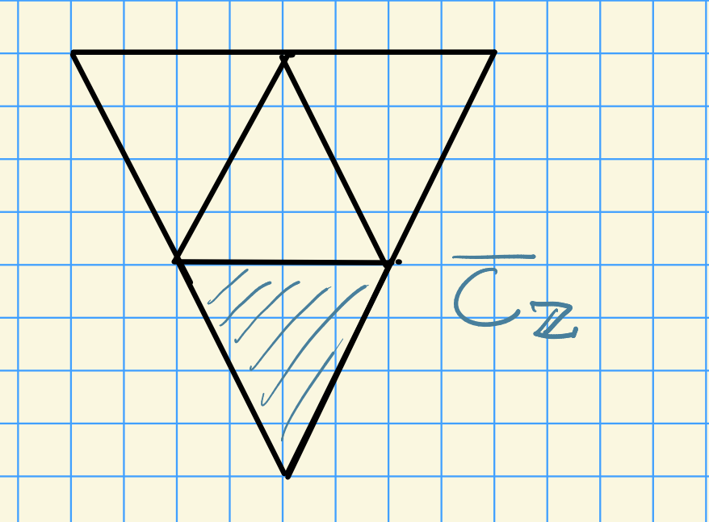

# Monday, November 16

We'll focus on the following theorem:

:::{.theorem title="Special case of Humphreys-Verma conjecture, 1973"}
Let $p> 2h-2$ and $\lambda\in X_r(T)$, then $\hat{Q}_r(\lambda)$ has a $G\dash$structure.
:::

Recall Donkin's tilting conjecture:

:::{.conjecture title="DTilt"}
Let $\lambda\in X_r(T)$, then
\[  
T(\hat{\lambda})\downarrow_{G_r T} = \hat{Q}_r(\lambda)
.\]
where $\lambda = 2(p-1)\rho + w_0\lambda$.
:::

:::{.remark}
There is a counterexample to DTilt conjecture due to Bendel-Pillen-Nakano-Subaje (2019) to DTilt for $\Phi = G_2$ and $p=2$.
Note that this doesn't apply to the previous conjecture, which could still be true.
:::

## Existence of $G\dash$Structures: Some Preliminaries

We want to consider $G\dash$structures on injective modules.
Let $V, W$ be $G\dash$modules, then
\[  
\Hom_{G_r}(V, W) = [V\dual \tensor W]^{G_r}
,\]
which is a module on which $G_r$ acts trivially where we pull back the action using the map $G \to G/G_r$.
Moreover, there exists a $G\dash$modules $M$ such that $\Hom_{G_r}(V, W) = M^{(r)}$ twisted $r$ times.

We can consider blocks, e.g. by considering $\pr_\nu M$.
This is the sum of all submodules with composition factors in the same block as $L(\nu)$.
We can write $M = \bigoplus_{\nu\in \bar{C}_\ZZ} \pr_\nu M$.

{width=350px}

Thus we can write
\[  
\Hom_{G_r}(V, M) = \bigoplus_{\nu\in \bar{C}_\ZZ} \Hom_{G_r}^\nu(V, W) = \qty{ \pr_\nu M }^{(r)}
.\]

Note that for $p>h$ the Coxeter number, $0\in \bar{C}_\ZZ$, since
\[  
0 \leq \ip{0+\rho}{\alpha\dual} = \ip{\rho}{\alpha_0\dual} = h-1 < p
,\]
where $h = \ip{\rho}{\alpha_0\dual}$.

We can then write
\[  
\Hom_G(V, W) = \Hom_{G_r}(V, W)^{G_r} \subseteq \Hom_{G_r}^0(V, W)
,\]
where the middle term involves trivial modules.

### Sketch of Proof

:::{.claim}
Let $\lambda \in X_r(T)$ and consider $M \da \St_r \tensor L( (p^r-1)\rho + w_0 \lambda )$.
Then $\hat{Q}_r(\lambda)$ is a direct summand of $M$ as a $G_r T\dash$module.
:::

In other words, if we restrict this down to $G_r T\dash$modules, we get a $G_r T\dash$summand.
Note that if DFilt holds, $M$ is a Tilting module.

Recall that $M$ is a projective and injective $G_r T\dash$ module.
It suffices to show that $\hat{L}_r(\lambda)\in \soc_{G_r T} M$, for which we look at the hom space
\[  
\Hom_{G_r T} (\hat{L}_r(\lambda), \St_r \tensor L( (p^r-1)\rho + w_0 \lambda ) )
&= \Hom_{G_r T} (\hat{L}_r(\lambda) \tensor \St_r, L( (p^r-1)\rho + w_0 \lambda ) ) \\
&= \Hom_{G_r T} (\St_r, \hat{L}_r(-w_0 \lambda) \tensor L( (p^r-1)\rho + w_0 \lambda ) ) 
,\]

\todo[inline]{Something about $(p^r-1)\rho$ being a highest weight? And the last $L$ term being nonzero?}

Let $Q_\lambda$ be the injective hull of $L_\lambda$ as a $G\dash$module.
This yields an injection $L(\lambda)\injects M$.
Since we also have a map into the injective hull, we can extend:

\begin{tikzcd}
& Q_\lambda \\
L(\lambda) \ar[r, hook]\ar[ur, hook] & M\ar[u, dotted, "\exists \phi"] \supseteq \hat{Q}_r(\lambda)
\end{tikzcd}

Moreover, $\phi:\hat{Q}_r(\lambda)\to Q_\lambda$ is an injective map since $L(\lambda) \subseteq \soc_{G_r}(\lambda)$.
Thus the image $\phi\qty{\hat{Q}_r(\lambda) } \cong \hat{Q}_r(\lambda)$ and is a $G_r T$ summand of $\phi(M)$ since $\hat{Q}_r(\lambda)$ is an injective $G_r T\dash$module.
We have a split exact sequence
\[  
0 \to \phi(\hat{Q}_r(\lambda)) \injects \phi(M) \to ? \to 0
.\]

The idea is now that $\phi(M)$ is a $G\dash$module, so we'll show $\phi(M)$ is indecomposable as both a $G$ and a $G_r T$ module.
In this case, we'll have
\[  
\phi(M) = \phi(\hat{Q}_r(\lambda)) \cong \hat{Q}_r(\lambda)
.\]

It suffices to prove that $\soc_{G_r} \phi(M) = L_r(\lambda)$.
Note that that it suffices to show there's only one summand, since the socle can't be decomposed further, which will yield irreducibility.
We have
\[  
\soc_G \phi(M) = L(\lambda)
.\]

We also know that $\soc_G \phi(M) \subseteq \soc_{G_r} \phi(M)$.
But if $L(\mu) \subseteq \soc_{G_r} \phi(M)$, then it is also contained in $\soc_G \phi(M)$.
Hence if $\soc_{G_r}\phi(M)$ is isotypic of type $L(\lambda)$, we have a decomposition 
\[  
\soc_{G_r}\phi(M) 
&= \bigoplus_{\sigma\in X_r(T)} L(\sigma) \tensor \Hom_{G_r}(L(\sigma), \phi(M)) \\
&= L(\lambda) \tensor \Hom_{G_r}(L(\lambda), \phi(M)) \\
&= \bigoplus_{\nu\in \bar{C}_\ZZ} L(\lambda) \tensor \Hom_{G_r}^\nu (L(\lambda), \phi(M))
,\]
where we've broken this up into blocks.
Note that $\phi(M)$ is an indecomposable $G\dash$module, thus using linkage we can conclude that there is only one summand.
By the previous statement, we have
\[  
k = \Hom_{G}(L(\lambda), \phi(M))
 \subseteq \Hom_{G_r}^0 (L(\lambda), \phi(M))
,\]
and hence

\begin{equation}
\soc_{G_r} \phi(M) = L(\lambda) \tensor \Hom_{G_r}^0 (L(\lambda), \phi(M))
.\end{equation}

:::{.remark}
Up until now, we've only used that $p>h$.
If we show that the hom space in the last equality is just the trivial module $k$, then we're done.
This would imply that $\soc_{G_r} \phi(M) = L(\lambda)$, in which case $\phi(M)$ is an indecomposable $G_r T\dash$module and $\phi(M) = \hat{Q}_r(\lambda)$.
:::

The critical equation to show:

\begin{equation}
\Hom_{G_r}^0 (L(\lambda), \phi(M)) = k
.\end{equation}

Suppose that $\Hom_{G_r}^0 (L(\lambda), \phi(M)) \neq k$.
Then there exists a $\nu\in X(T)_+ \intersect W_p \cdot 0$ with $\nu\neq 0$ such that $L(\nu)^{(r)} = L(p^r \nu)$ is a composition factor of $\Hom_{G_r}^0 (L(\lambda), \phi(M))$.
This would imply that $L(\lambda) \tensor L(\nu)^{(r)} = L(\lambda+ p^r\nu)$ is a composition factor of $\St_r \tensor H^0( (p^r-1)\rho + w_0 \lambda)$.

The idea now is to check the weights in this module either by Weyl's character formula or weight estimates.
The upshot: for $p>2h-2$, $\lambda+ p^r \nu$ is a weight if $\nu = 0$.
$\qed$

How might this bound be lowered?
Maybe the condition of the hom space being trivial is too strong, since being indecomposable isn't equivalent to having a simple socle.

## Steinberg Tensor Product Theorem for Injective $G_r T\dash$Modules

:::{.proposition title="?"}
Let $\lambda_0 \in X_r(T)$ and $\lambda_1 \in X(T)$.
Then there exists an isomorphism of $G_r T\dash$modules
\[  
\hat{Q}_{r+1}(\lambda_0 + p^r \lambda_1)\downarrow_{G_r T} 
\,\, \cong \hat{Q}_r(\lambda_0) \tensor \hat{Q}_1(\lambda_1)^{(r)}
,\]
where the last term is a $G_1 T\dash$module with $G_r$ acting trivially, which thus becomes a $G_r T\dash$module.
:::

:::{.remark}
Comparing this with the situation where $\lambda_1 \in X(T)_+$, we get
\[  
L(\lambda_0 + p^r \lambda_1) 
\cong L(\lambda_0) \tensor L(\lambda_1)^{(r)}
,\]
which is an isomorphism of $G\dash$modules.
:::

Next time: we'll complete injective modules, and if we have time, we'll talk about cohomology.
