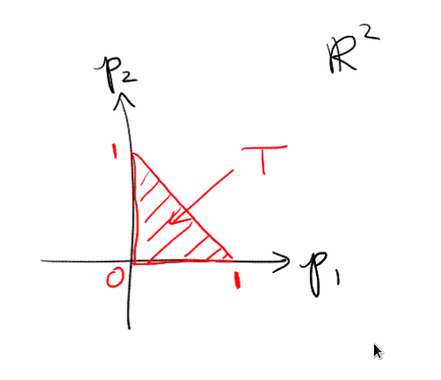

# Tuesday, September 29

Questions to look at for next Tuesday:

:::{.exercise title="?"}
Show that the 3 natural coordinate charts on $\CP^2$ given by e.g. $\phi_{U_0}\qty{\thevector{z_0: z_1: z_2}} = \thevector{{z_1 \over z_0}, {z_2\over z_0}}$ yield a smooth atlas.
:::

:::{.exercise title="?"}
Consider the map
\[  
\pi: \CP^2 &\to \RR^2 \\
\thevector{z_0: z_1 : z_2} &\mapsto \thevector{
{\abs z_1^2 \over \abs z_0^2 + \abs z_1^2 + \abs z_2^2},
{\abs z_2^2 \over \abs z_0^2 + \abs z_1^2 + \abs z_2^2}
}.\]

- Show that $\im \pi = \ts{p_1, p_2 \geq 0, p_1 + p_2 \leq 1}$.

- Show that $\pi$ is smooth 

- If $\thevector{p_1, p_2} \in T^\circ$ is in the interior of the above triangle, then $\pi^{-1}(p_1, p_2) \cong S^1 \cross S^1$ is diffeomorphic to a torus.
- If the point is on an edge, the fiber is diffeomorphic to $S^1$,
- If the point is on a vertex, the fiber is a single point.
:::

:::{.exercise title="?"}
Find a vector field $V$ on some maximal subset of $\CP^2$ such that $D\pi(V) = p_1 \del_{p_1} + p_2 \del_{p_2}$ (the radial vector field).

I.e., for all $q\in \CP^2$, we have a map 
\[  
D_1 \pi : T_1 \CP^2 &\to T_{\pi(q)} \RR^2
\]
and $V(q) \in T_q \CP^2$, so we want $D_q \pi(V(q)) = p_1 \del_{p_1} + p_2 \del_{p_2}$.

> Note that there will be a problem defining $V$ on the fiber over the hypotenuse of $T$.
:::

:::{.theorem title="Collar Neighborhood"}
For all manifolds with boundary $X$, there exists an open neighborhood $N$ of $\bd X$ which is diffeomorphic to $(-\eps, 0] \cross \bd X$.
:::

Proof strategy: construct a vector field pointing outward and flow it backward.
Construct by forming local vector fields on open sets, then patch together using a partition of unity.

:::{.definition title="Partition of Unity"}
A collection $\ts{\phi_i: M\to \RR\st i\in I}$ such that

1. $\ts{\supp \phi_i}$ is locally finite, i.e. for all $p$, we have $\abs{\ts{i \st p\in \supp(\phi_i)}} < \infty$.
2. $\phi(p) \geq 0$ for all $p\in X$
3. For all $p\in X$, the sum $\sum_{i\in I}\phi_i(p) = 1$.
:::
