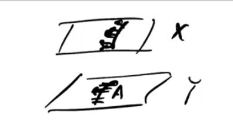
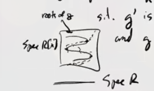
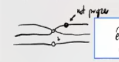
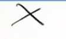
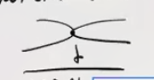

# Lecture 2

## Review

From last time: we want to prove the following theorem of Serre, a complex analog of the Weil conjectures.
After this, we'll talk about étale morphisms, the étale topology, and possibly the definition of étale cohomology.

:::{.theorem title="Serre"}
Let $X_{/\CC}$ be a smooth projective variety and $[H]\in H^2(X; \ZZ)$ be a hyperplane class[^hyerplane_note]
and an endomorphism $F:X\to X$ a map satisfying $F^*[H] = q[H]$ for some $q\in \ZZ_{\geq 1}$.
Then the eigenvalues of $F^*$ on $H^i(X;\CC)$ all have absolute value $q^{i\over 2}$.

[^hyerplane_note]: Intersection with a hyperplane in projective space.

:::

Note that the same $q$ is appearing in both parts of the theorem.
Why prove this theorem?
Later on, to prove the Riemann hypothesis for varieties over finite fields, we'll prove that the Frobenius acts in this way on the étale cohomology.
There is in fact a *reason* this is true, coming from some special properties of the behaviors of the cohomology of varieties which aren't manifested in random topological spaces.

:::{.warnings}
The proof here will not look at all like Deligne's proof of the Riemann hypothesis for varieties over finite fields.
We'll see shadows of it, but use a lot of things that are true for complex varieties that are still not known for varieties over finite fields.
:::

:::{.fact}
There is a cup product map
\[  
L: H^i(X; \CC) &\to H^{i+2}(X; \CC) \\
\alpha &\mapsto \alpha \smile [H]
.\]
Thus taking the direct sum $\bigoplus_i H^i(X; \CC)$ yields an algebra.
:::

:::{.theorem title="Hard Lefschetz"}
Each $H^i(X; \CC) \cong \im(L) \oplus H^i_{\text{prim}}$, which is an isomorphism that depends on a choice of hyperplane class $[H]$ but is then canonically defined.
Moreover, there is a Hodge decomposition $H^i_{\text{prim}} = \bigoplus_{p+q=i}H^{p, q}_{\text{prim}}$.
:::

:::{.theorem title="Hodge Index Theorem"}
If $\alpha, \beta \in H^k(X)_{\text{prim}}$, then there is a natural pairing
\[  
\inner{a}{b} = i^* \int_X a\wedge \bar{\beta} \wedge [H]^{n-k}
,\]
where we've used the fact that the integrand is a top form and can thus be integrated.
Moreover, this is a *definite* bilinear form on $H^{p, q}_{\text{prim}}$, i.e. a nonzero element paired with itself is again nonzero.
:::

The moral of the story here is that cohomology breaks up into pieces, where $\im L$ comes from lower degrees and can perhaps be controlled inductively, and the higher dimensional pieces carry a canonical definite bilinear form.

## Sketch proof of Serre's analog of the Riemann hypothesis

As a reminder, we want to show that the eigenvalues of $F^*$ acting on $H^k(X; \CC)$ have absolute value $q^{k\over 2}$ where $q$ is the scalar associated to $F$ acting on $[H]$.

:::{.claim}
It suffices to do this for $H^k_{\text{prim}}$.
:::

Why is this true?
If we have an eigenvector $\alpha\in H^{k-2}(X; \CC)$, then by induction on $k$ we can assume the eigenvalue has absolute value $q^{k-2 \over 2}$.
Then $F^*(\alpha \smile [H]) = F^* \alpha \smile F^*[H] = \lambda \alpha \smile q[H] = q\lambda (\alpha \smile [H])$, so this is an eigenvector of absolute values $q q^{k-2\over 2} = q^{k\over 2}$.

Now for the primitive part, let $\alpha\in H^k_{\prim}$ be an $F^*$ eigenvector.
Since $F^*$ preserves $H^{p, q}$, we can assume $\alpha \in H^{p, q}_{\prim}$ for some $p+q=k$.
Consider
\[  
\inner{F^* \alpha}{F^*\alpha}
.\]
On one hand, this is equal to $\abs{\lambda}^2 \inner{\alpha}{\alpha}$ by sesquilinearity, pulling out a $\lambda$ and a $\bar \lambda$.
On the other hand, it is equal to
\[  
\cdots 
&= i^* \int F^* \alpha \wedge F^* \bar \alpha \wedge [H]^{n-k} \\
&= {i^k \over q^{n-k}} \int F^*\qty{\alpha \wedge \bar\alpha \wedge [H]^{n-k} } \\
&= {q^n i^k \over q^{n-k}} \int \alpha \wedge \bar \alpha \wedge H^{n-k} \\
&= q^k \inner{\alpha}{\alpha}
.\]

:::{.exercise title="?"}
Using the Lefschetz hyperplane theorem or Poincaré duality, $F^*$ acts on $H^{2n}(X; \CC)$ via $q^n$.
:::

So we're done if $\inner{\alpha}{\alpha} \neq 0$, since this implies $\abs{\lambda}^2 = q^k$ and thus $\abs \lambda = q^{k\over 2}$.
Why is this true?
This is the statement of the Hodge index theorem.

:::{.remark title="Slogan"}
The structures on cohomology imply this complex analog of the Riemann hypothesis, and we'll want to use something similar for varieties over a finite field.
This will be hard!
Deligne doesn't quite accomplish this: there's no analog of the Hodge decomposition and we don't know the Hodge index theorem.
:::

This is the proof that will motivate much of the rest of what we'll do in the course.

## Étale Morphisms

This is a property of morphism of schemes, see Hartshorne.

:::{.definition title="Étale Morphism"}
Suppose $f:X\to Y$ is a morphism of schemes.
Then $f$ is **étale** is it is locally of finite presentation, flat, and unramified.
:::

:::{.definition title="Unramified"}
$f$ is **unramified** if $\Omega_{X/Y}^1 = 0$ (the relative Kahler differentials).
Equivalently, all residue field extensions are separable, i.e. given a point in $Y$ with a point in $X$ above it, the residue fields of these points gives a field extension, and we require it to be separable.
:::

:::{.definition title="Formally Etale"}
Suppose we have a nilpotent ideal $I$, so $I^n = 0$ for some $n$, then $f:X\to Y$ is **formally étale** if there is a unique lift in the following diagram:

\begin{tikzcd}
\spec(A/I)\ar[r]\ar[d] & X\ar[d, "f"] \\
\spec(A) \ar[r] \ar[ur, dotted, "\exists !"] & Y
\end{tikzcd}

:::

:::{.remark}
This is supposed to resemble a covering space map:
We have $\spec(A) \in Y$ with a nilpotent thickening and a map from $A/I$, which you may think of as a reduced subscheme.
This thus says that tangent vectors downstairs can be lifted in a unique way to tangent vectors upstairs:

{width=350px}

:::

:::{.remark}
There are some equivalent definitions of a morphism being étale:

- Smooth of relative dimension zero

- Locally finite presentation and *formally étale*

- Locally *standard étale*, i.e. for each $x\in X$ with $y\da f(x)$, there exists a $U\ni x, V\ni y$ such that $f(U) \subseteq V$ and $V=\spec(R), U = \spec\qty{R[x]_h / g}$ (where we localize at $h$) such that the derivative $g'$ is a unit in $R[x]_h$ and $g$ is monic.

For this last definition, thinking of $\spec(R[x])$ as $R\times \AA^n$, what happens when modding out by a polynomial $g$?
This yields a curve cutting out the roots of $g$.
Inverting $h$ deletes the locus where $h$ vanishes, and $g'$ being a unit means that the $g$ has no double roots in the fibers.
In other word, the deleted locus passes through all double roots:

{width=350px}

:::

:::{.exercise title="?"}
Check that standard étale morphisms are étale, and try to understand the proof that all étale morphisms are locally standard étale.
:::

:::{.example title="Example of an étale morphism"}
\envlist

- Multiplication by $[n]$ on an elliptic curve if $n \in \ZZ$ is invertiable in the base field.

- Take $\GG_m = \spec  k[t, t^{-1}]$, and the map
\[  
\GG_m &\to \GG_m \\
 t^m &\mapsfrom t
,\]
  where $n$ is prime to $\ch(k)$.[^prime_zer]

[^prime_zer]: Here we use the convention that everything is prime to zero.
Also note that this map is in fact finite étale.
  
:::

:::{.exercise title="?"}
Show that the last map above is étale.

*(Hint: use the fact that $\dd{}{t} (t^n) = nt^{n-1}$, which is a unit.)*
:::

:::{.example title="?"}
Consider the map
\[  
\GG_m &\injects \AA^1 \\
k[t, t^{-1}] &\mapsfrom k[t]
.\]
We need to check 3 things:

- Locally finite presentation,
  - This is a finitely presented ring map, since you just need to adjoin an inverse of $t$, one element and one relation.

- Flat,
  - Since open embeddings are flat,

- $\Omega^1_{\GG_m / \AA^1} = 0$,
  - True for a Zariski open embedding.

Note that this is finite onto its image.
:::

:::{.proposition title="?"}
Any open immersion is étale.
:::

Note that we actually already checked this! 

:::{.example title="An étale morphism that is not finite onto its image"}
Use the fact that $\GG_m$ is $\AA^1\sm\ts{\vector 0}$, so take $\GG_m \sm\ts{1}$ and the map
\[  
\GG_m\sm\ts{1} &\to \GG_m \\
t^2 &\mapsfrom t
.\]

What's the picture?
For the squaring map, there are two square roots:

This is an étale surjection but not finite étale, since it is not proper.
This also gives a counterexample to étale morphisms always looking like covering spaces, since here that may be true locally but doesn't hold globally.

:::

:::{.warnings}
This is an important example to keep in mind, because you'll often see arguments that treat étale maps as though they were finite onto their image.
:::

:::{.example title="?"}
Take a finite separable field extension, taking $\spec$ of it yields an étale map.
:::

Now for some non-examples:

:::{.example title="A finite map which is not etale"}
Take $X = \spec k[x, y] / xy$, which looks like the following:

{width=350px}

Then the normalization $\tilde X\to X$ is not étale, since it is not flat.
:::

:::{.example title="A finite flat map which is not etale"}
Take the map
\[  
\AA^1 &\to \AA^1 \\
t^2 &\mapsfrom t
.\]

The picture is the following:

This is note étale since it is ramified at zero.
We can compute
\[  
\Omega_f^1 = k[t]\, dt / d(t^2) = k[t] dt/ 2t\, dt
,\]
where $2t\,dt$ does not generate this module.
This is supported at $t=0$ if $\ch \neq 2$.
:::

:::{.example title="?"}
A finite flat morphism such that \( \Omega_{X/Y}^1 \) is not torsion: a hint is that the previous example almost works, with a slight modification.
Let $\ch k = p$, and take
\[  
\AA^1 &\mapsvia{F} \AA^1 \\
t^p &\mapsfrom t
.\]
Then $\Omega_f^1 = k[t]\, dt / d(t^p) = k[t]\,dt$ since $d(t^p) = 0$ in characteristic $p$.
This yields line bundles (?), so it is not torsion.
:::

:::{.remark}
This map has a name: **the relative Frobenius**.
In general, looking at Frobenii, the Kahler differentials will be very big.
You might not be used to this: in characteristic zero, a map of relative dimension zero is generically étale.
In this case, the Kahler differentials will always be torsion.
:::

:::{.example title="?"}
Consider a map 
\[  
\AA^m &\mapsvia{f_1, \cdots, f_m} \AA^m
,\]
since such a map is given by a system of $m$ polynomials in $m$ variables.
Then $f$ is étale is a neighborhood of $\vector a$ if $\det \qty{\dd{f_i}{x_j} \evalfrom_{\vector a} }$ is a unit.
:::

### Properties of Étale Morphisms

:::{.proposition title="Some properties of étale morphisms"}
\envlist

1. Open immersions are étale
2. Compositions of étale morphisms are étale[^composition_etale_note]
3. Base change of étale morphisms are étale, i.e. 

\begin{tikzcd}
X \cross_Y T\ar[d, "\therefore \text{étale}"']\ar[r] & X\ar[d, "\text{étale}"]  \\
T\ar[r] &  Y\\
\end{tikzcd}

4. There is a 2 out of 3 property: If $\phi \circ \psi$ and $\phi$ are étale, then $\psi$ is étale.

[^composition_etale_note]: What do you have to check? Locally finite presentation, flat, and unramified are all preserved. The one that may be tricky is remaining unramified, a hint is to use the cotangent exact sequence for $\Omega^1_{X/Y}$.

:::

:::{.exercise title="?"}
Show property 4 above.
:::

:::{.proposition title="?"}
Étale morphisms on varieties over an algebraically closed field induce isomorphisms on complete local rings at closed points.
:::

:::{.exercise title="?"}
Prove this! 
Hint: use the criterion for formal étaleness.
There's an evident map one way on local rings coming from your étale morphism, and you need to produce the inverse map.
:::

:::{.exercise title="?"}
$\danger$ If $\psi$ is étale and $\phi\circ\psi$ is étale, it is not necessarily the case that $\phi$ is étale.
Come up with an example!
:::

:::{.corollary title="An informal statement"}
Any property that can be checked at the level of complete local rings is true for the source of an étale morphism if it is true for the target.
:::

Why?
If you want to check a property for complete local rings on the source, note that the map induces an isomorphism of complete local rings.

## Generalizing Topologies 

### Sites

The notion of a *site* will be a generalization of topological spaces and sheaves.
The idea is we'll generalize sheaf cohomology to this setting.
On a nice space like a manifold, singular cohomology is isomorphic to the sheaf cohomology of the constant sheaf $\underline{\ZZ}$.
Here we'll find some version of a sheaf where étale cohomology with $\ZZ/\ell^n\ZZ$ coefficients will be the sheaf cohomology with the constant sheaf $\underline{\ZZ/\ell^n\ZZ}$.

:::{.question}
What parts of the definition of a topological space are needed to define the notion of a sheaf?
:::

:::{.remark}
Recall that the *sheaf condition* is given in two parts:

1. A section is determined by its value on a cover, and

2. Sections can be glued when they agree on intersections.
:::

:::{.answer}
\envlist

1. As in presheaves, a notion of open sets and inclusions.
  (I.e., a category of open sets.)[^presheaf_defn][^what_sheaves_know]

We'd also like to make sense of the sheaf condition: 

2. Collections of morphisms which are "covers", remembering which collections of opens cover a space, and

3. The existence of certain fiber products (intersections).

[^what_sheaves_know]: The notion of a presheaf on $X$ doesn't know much about the actual topology of $X$. If two spaces have the coarsest topology, so the only opens are $X, \emptyset$, then the categories of open sets are equivalent, and every presheaf on them will be the same.

[^presheaf_defn]: Recall that a presheaf on $X$ is a contravariant functor out of the category of open sets of $X$.

:::

:::{.remark}
The motivation for (3) above is that for $U, V \subseteq X$, we can form $U\cross V = U\intersect V$.
:::

We will make the following preliminary definition:

:::{.definition title="Sites/Grothendieck Topologies" ref="def:site"}
A category $\mathcal{C}$ with a collection of *covering families*[^think_of_covering_families]
\[
\ts{X_\alpha \mapsvia{f_\alpha} X \st \alpha\in A}
\]
such that several axioms are satisfied.

[^think_of_covering_families]: How to think of this: elements in this collection cover $X$.

:::

We'll discuss the axioms next time, they just capture the notion of what a cover of a topological space should look like.

:::{.warnings}
There are at least three different notions of this definition!
The one above is perhaps the least general but the easiest to work with.
:::

:::{.example title="?"}
For $X$ a topological space, $\mathcal{C}$ the category of open sets in $X$, then $\ts{U_\alpha\to U}$ is a covering family if the $U_\alpha$ cover $U$, i.e. $U = \union_\alpha U_\alpha$.
:::

:::{.example title="More exotic"}
Let $M$ be a manifold and $\mathcal{C}$ be the category of manifolds over $M$, so all $M' \mapsvia{f} M$ such that $f$ is locally an isomorphism.
Note that these are smooth local homeomorphisms.
Let 
\[
\ts{M_\alpha \mapsvia{f_\alpha} M} \text{ if } \Union_\alpha \im (f_\alpha) = M
\]
:::

:::{.example title="Another exotic example"}
Let $X$ be a scheme and consider $X_{\text{et}}$ the category of all étale $Y/X$: so the objects are schemes $Y$ admitting an étale morphism $Y\to X$.
Then $\ts{X_\alpha\to X}$ is a covering family if $\union \im (f_\alpha) = X$.
:::

This will be the fundamental object, and we'll define étale cohomology by defining sheaves on this category, taking a constant sheaf $\underline{\ZZ/\ell^n\ZZ}$, and we'll take sheaf cohomology.

