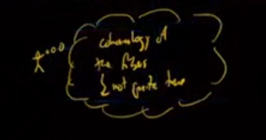

# Lecture 10

:::{.remark}
What we've been calling a *torsor* (a sheaf with a group action plus conditions) is called by some sources a **pseudotorsor** (e.g. the Stacks Project), and what we've been calling a *locally trivial torsor* is referred to as a *torsor* instead.
:::

## Proof of Grothendieck-Hilbert 90

Recall that statement of \cref{thm:hilb90}; we'll now continue with the proof:

:::{.proof title="of Hilbert 90"}

:::{.observation}
Let $\tau = X_{\zar}, X_\et, X_{\fppf}$, then the data of a $\GL_n\dash$torsor split by a $\tau\dash$cover $U\to X$ is the same as descent data for a vector bundle relative to $U_{/X}$.
:::

\vspace{2em}

This descent data comes from the following: 
\begin{tikzcd}
U\cross_X U
 \ar[d, shift right=0.75ex, "\pi_1"'] 
 \ar[d, shift left=0.75ex, "\pi_2"]
\\
U
  \ar[d]
\\
X 
\end{tikzcd}

That $U$ trivializes our torsor means that $\pi^* T = \pi^* G$ as a $G\dash$torsor, where $G$ acts on itself by left-multiplication.
We have two different ways of pulling back, and identifications with $G$ in both, yielding
\begin{tikzcd}
\pi_1^* \pi^* T 
  \ar[d]
  \ar[r, "\sim"]
& 
\pi_2^* \pi^* T 
  \ar[d]
\\
\pi_1^* \pi^* G
  \ar[r, "\sim"]
&  
\pi_2^* \pi^* G
\end{tikzcd}
Both of the bottom objects are isomorphic to $\ro{G}{U\cross U}$.

:::{.claim}
The top horizontal map is descent data for $T$, and the bottom horizontal map is an automorphism of a $G\dash$torsor and thus is a section to $G$.
I.e. a section to $\GL_n$ is an invertible matrix on double intersections (satisfying the cocycle condition) and a cover, which is precisely descent data for a vector bundle.
:::

Using fppf descent, proved previously, we know that descent data for vector bundles is effective.
So if we have a locally trivial $\GL_n\dash$torsor on the fppf site, it's also trivial on the other two sites, yieldings the desired maps back and forth.
Thus $H^1(X_\et, \GL_n)$ is in bijection with $n\dash$dimensional vector bundles on $X$.
:::

:::{.exercise title="?"}
See if Hilbert 90 is true for groups other than $\GL_n$.
:::

## Representability and Local Triviality

:::{.question}
Suppose $G$ is an affine flat $X\dash$group scheme.
Are all $G\dash$torsors representable by a $X\dash$scheme?
:::

:::{.answer}
Yes, by the same proof as last time, try working out the details.
Idea: you can trivialize a $G\dash$torsor flat locally and use fppf descent.
:::

:::{.question}
Given a $G\dash$torsor $T$ that is fppf locally trivial, is it étale locally trivial?
:::

:::{.answer}
In general no, but yes if $G$ is smooth.
:::

:::{.proof title="Sketch"}
You can take an fppf local trivialization, trivialize by $p$ itself, then slice to get an étale trivialization.
Given a torsor $T\to X$, we can base change it to itself:
\begin{tikzcd}
T\cross_X T 
  \ar[d]
  \ar[r]
& T 
  \ar[d]
\\
T 
  \ar[r, "f"]
  \ar[u, bend right, "\exists"']
& X 
\end{tikzcd}
The torsor $T\cross_X T\to T$ is trivial since there exists the indicated section given by the diagonal map.
Another way to see this is that $T\cross T\cong T\cross G$ by the $G\dash$action map, which is equivalent to triviality here.
Here $f$ is smooth map since $G$ itself was smooth and the fibers of $T$ are isomorphic to the fibers of $G$.
We can thus find some $U$ such that
\begin{tikzcd}
&
T\cross_X T 
  \ar[d]
  \ar[r]
& T 
  \ar[d]
\\
&
T 
  \ar[r, "f"]
  \ar[u, bend right, "\exists"']
& X 
\\
U 
  \ar[ur, hook, "\text{closed}"]
  \ar[urr, bend right, "\exists \et"']
& &
\end{tikzcd}
Here "slicing" means finding such a $U$, and this can be done using the structure theorem for smooth morphisms.
:::

:::{.example title="non-smooth group schemes"}
\envlist

- $\alpha_p$, the kernel of Frobenius on $\AA^1$ or $\GG_a$,
- $\mu_p$ in characteristic $p$, representing $p$th roots of unity, the kernel of Frobenius on $\GG_m$,
- The kernel of Frobenius on any positive dimensional affine group scheme.
- $\mu_p \cross \GL_n$, etc.
:::

### What Hilbert 90 Means

:::{.example title="?"}
Let $X = \spec k, n=1$, so we're looking at $H^\wait(\spec k, \GG_m)$.
\[  
H^1 \qty{ \qty{ \spec k}_\zar, \GG_m} 
&= 0 \\
&= 
H^1 \qty{ \qty{ \spec k}_\et, \GG_m}  \\
&=
H^1(\Gal(k^s / k), \bar k \units)
.\]
The first comes from the fact that we're looking at line bundles of spec of a field, i.e. a point, which are all trivial.
The last line comes from our previous discussion of the isomorphism between étale cohomology of fields and Galois cohomology.
Etymology: the fact that this cohomology is zero is usually what's called **Hilbert 90**.[^why_90]

[^why_90]: 
This is called "90" since Hilbert numbered his theorems in at least one of his books.

:::

Let's generalize this observation.

:::{.example title="?"}
Let $X$ be any scheme and $n=1$, then
$H^1(X_\et, \GG_m) = \Pic(X)$.
:::

:::{.example title="?"}
Let's compute $H^1(X_\et, \mu_\ell)$ where $\ell$ is an invertible function on $X$.
We have a SES of étale sheaves, the **Kummer sequence**,
\[  
1 \to \mu_\ell \to \GG_m \mapsvia{z\mapsto z^p} \GG_m \to 1
.\]
This is exact in the étale topology since adjoining an $\ell$th power of any function gives an étale cover.
We get a LES in cohomology
\begin{tikzcd}
&
&
0 \ar[dll]
\\
H^0(X_\et, \mu_\ell)
  \ar[r]
&
H^0(X_\et, \GG_m)
  \ar[r, "z\mapsto z^\ell"]
&
H^0(X_\et, \GG_m)
  \ar[dll]
\\
{\color{NavyBlue} H^1(X_\et, \mu_\ell)}
  \ar[r]
&
\Pic(X)
  \ar[r, "{[\ell]}"]
&
\Pic(X)
  \ar[dll]
\\
H^2(X_\et, \mu_\ell)
  \ar[r]
&
\cdots
&
\end{tikzcd}
We know that $H^0(X_\et, \GG_m)$ are invertible functions on $X$, and the blue term is what we'd like to compute.
We'll make some additional assumptions now.

Suppose now $H^0(X, \OO_X) = k = \bar k$, then $H^0(X_\et,\mu_\ell) = \mu_\ell(k)$ since it is the kernel of the $\ell$th power map.
We can also compute $H^1(X_\et, \mu_\ell)$, since our diagram reduces to
\begin{tikzcd}
&
&
0 \ar[dll, hook]
\\
\mu_\ell(k)
  \ar[r]
&
k\units
  \ar[r, "z\mapsto z^\ell"]
&
k\units
  \ar[dll, "\delta"', twoheadrightarrow]
\\
{\color{NavyBlue} H^1(X_\et, \mu_\ell)}
  \ar[r]
&
\Pic(X)[\ell]
  \ar[r, "{[\ell]}"]
&
\Pic(X)
  \ar[dll]
\\
H^2(X_\et, \mu_\ell)
  \ar[r]
&
\cdots
&
\end{tikzcd}
where surjectivity of $\delta$ follows from the fact that $k=\bar k$ and thus every element has an $\ell$th root, making $H^1$ the kernel of $[\ell]$.
:::

:::{.example title="?"}
Let $X_{/k}$ with $k=\bar k$ with $\ell$ invertible in $k$, then (claim) $\ul \zlz \cong \mu_\ell$ given by sending a generator to some choice of a primitive $\ell$th root of unity.
To be explicit, we have a representation 
$\ul \zlz = \hom \qty{ \wait, \spec k[t] / t(t-1) \cdots (t-\ell+1) }$
and $\mu_\ell = \spec k[t] / t^\ell-1$.
These are both disjoint unions of points, and hence schemes of dimension zero since $\ell$ is invertible in the base and the Chinese Remainder Theorem, so one can write down the isomorphism explicitly between the schemes and hence the functors they represent.

:::{.corollary title="?"}
If $\mu_\ell \subseteq k$, then 
\[  
H^i(X_\et, \ul\zlz) = 
H^i(X_\et, \mu_\ell)
.\]
:::
Since the isomorphism depends on the choice of a primitive root, this will not be Galois equivariant, which will come up when we talk about Galois actions on étale cohomology.
This already happens for $H^0$, since $G\actson\zlz$ trivially but not on $\mu_\ell$.

:::

### Geometric Interpretations

Let $X$ be an affine scheme, we now know 
\[
H^1(X_\et, \FF_p) = \cok(\OO_X \mapsvia{x^p - x} \OO_x)
,\]
the Artin-Schreier map, and these are $\FF_p\dash$torsors.
We also know $H^1(X_\et, \zlz)$ in terms of the LES if $k = \bar k$ and $\ch(k) = p$, and this is a $\zlz\dash$torsor.
Being torsors here geometrically means they're covering spaces with those groups as Galois groups.

:::{.question}
How does one write down these torsors/covering spaces?
:::

:::{.example title="?"}
Given 
\[
[Y] \in H^1(X_\et, \FF_p) = \cok(\OO_X\mapsvia{x^p-x} \OO_X)
\]
where we write $[Y]$ to denote thinking of the torsor as some geometric object, how to we write down the covering space?
Using Artin-Schreier, we can write $Y = \ts{y^p - y  = a}$ for some $a\in \OO_X$, an **Artin-Schreier covering**.

If $\ell \neq \ch(k)$ and $[Z] \in H^1(X_\et, \mu_\ell)$ and assume $\Pic(X) = 0$.
Then we can write 
\[
H^1(X_\et, \mu_\ell) = \cok(\OX \mapsvia{x\mapsto x^\ell} \OX\units)
\]
In this case, $Z = \ts{z^\ell = f}$ where $f\in \OX\units$ is an element representing the class in cohomology, and $\mu_\ell \actson Z$ by multiplication by $z$.
:::

:::{.remark}
The process of explicitly writing down covers is called **explicit geometric class field theory**, which gives a recipe for writing down abelian covers of covers.
In general, for $\Pic(X) \neq 0$, the Picard group plays a crucial role.
:::

## Computing the Cohomology of Curves

> This is one of Daniel's favorite topics in the entire course!

:::{.theorem title="?"}
Let $X_{/k}$ be a smooth curve over $k=\bar k$, then
\[  
H^i(X_\et, \GG_m) 
=
\begin{cases}
\OO_X(X)\units & i = 0\\
\Pic(X) & i=1 \\
0 & \text{else},
\end{cases}
\]
noting that $\OO_X(X)\units$ are the global sections of $\GG_m$, i.e. invertible functions on $X$.
:::

The first two cases we've done, $i>1$ is the hard case.

:::{.corollary title="?"}
For $X$ a smooth proper connected curve of genus $g$, $k=\bar k$, and $\ell \neq \ch(k)$ is prime, 
\[  
H^i(X_\et, \ul \zlnz)
=
\begin{cases}
\zlnz & i = 0 \\
\Pic(X)[\ell^n] = \qty{\zlnz}^{2g} & i=1 \\
\zlnz & i=2 \\
0 & i>2
\end{cases}
.\]
:::

:::{.proof title="of corollary"}
We'll use some theory of abelian varieties: $\Pic^0(X) = \Jac(X)$, and we have a SES
\[  
0 \to \Jac(X) \to \Pic(X) \mapsvia{\deg} \ZZ \to 0
,\]
where we identify the Néron-Severi group as $\ZZ$.[^ref_hartshorne_1]
We'll use that $\Jac(X)$ is a $g\dash$dimensional abelian variety, and so $\Jac(X)[\ell^n] \cong_{\Grp} \qty{\zlnz}^{2g}$.

The Kummer sequence
\[  
1 \to \mu_{\ell^n}\to \GG_m \to \GG_m \to 1
\]
yields a LES where we identify $\mu_{\ell^n} \cong \zlnz$:

\begin{tikzcd}
& & 
0 
  \ar[dll]
\\
 H^1(X_\et, \ul \zlnz)
  \ar[r]
&
 \Pic(X)
  \ar[r, "{[\ell]}"]
&
 \Pic(X)
  \ar[dll]
\\
 H^2(X_\et, \ul \zlnz)
  \ar[r]
&
 0
  \ar[r]
&
 0
\end{tikzcd}
So we're just computing the kernel and cokernel of $[\ell]$.

**Computing $H^1$**:
We'll need one more fact: $\Jac(X)(\bar k)$ is a divisible group.
We can identify
\[  
H^1(X_\et, \ul \zlnz)
=
\Pic(X)[\ell^n]
= 
\Jac(X)
=
\qty{\zlnz}^{2g}
.\]
where the 2nd equality uses the fact that $\Pic(X)$ is an extension of $\ZZ$ by an abelian variety and $\ZZ$ has no torsion, and the last equality is general theory of abelian varieties.

**Computing $H^2$**:
Since $\Jac(X)$ is divisible, we can identify
\[  
\coker(\Pic(X) \mapsvia{[\ell^n]} \Pic(X) )
\cong 
\coker(\ZZ \mapsvia{[\ell^n]} \ZZ )
= \zlnz
.\]

The vanishing of higher cohomology follows from the vanishing for $\GG_m$.
So assuming the theorem and the theory of abelian varieties proves this corollary.

[^ref_hartshorne_1]: 
See Hartshorne Ch. 4, or anything that discusses cohomology of curves.

:::

:::{.exercise title="?"}
Check this using the snake lemma after applying multiplication by $\ell$ to the SES.
:::

:::{.remark}
$X$ is a scheme over $\bar k$, and if it started over some subfield $L$ then $\Gal(L_{/k}) \actson X$ and thus the corresponding functors.
These isomorphisms will not be Galois equivariant, and the $\zlnz$ showing up in degree 2 cohomology will admit a Galois action via the cyclotomic character.
:::

### Outline of Proof

Goal: we want to show that $H^{>1}(X_\et, \GG_m) = 0$ for $X$ a smooth curve over $k=\bar k$.
Three ingredients:

1. The Leray spectral sequence,

2. The divisor exact sequence,

3. Brauer groups.

## Pushforwards and the Leray Spectral Sequence

Suppose $X\mapsvia{f} Y$ is a morphism of schemes, then we get a functor $f_*:\Sh(X_\et) \to \Sh(Y_\et)$: given $\mathcal{F}\in Sh(X_\et)$, we have $f_* \mathcal{F}(U\to Y) \da \mathcal{F}(U\cross_Y X)$.
This is left-exact and thus has right-derived functors $R^\wait f_*:\Sh^\Ab(X_\et) \to \Sh^\Ab(Y_\et)$.

How to think about this:

{width=350px}

This is not quite true, and the obstruction is called **the base change property**, which we'll see later in the course.
What's true in general is that $R^i f_* \mathcal{F}$ is the sheafification of the presheaf $V\to H^i(f^{-1}(V), \mathcal{F})$, which is not quite the cohomology of the fibers since sheafification is somewhat brutal.

:::{.proposition title="Derived pushforwards for finite morphisms"}
If $f$ is a finite morphism (e.g. a closed immersion) then $R^{>0} f_* = 0$.
:::

:::{.exercise title="Proof, must-do!"}
Prove this.
The claim is that $f_*$ is right-exact, which in this case shows it is exact.
Check on stalks.
Compute that the stalk of $f_* \mathcal{F}$ at $\bar y\in Y$ is given by 
\[
f_* \mathcal{F}_{\bar y} = \bigoplus_{\bar x\in f^{-1}(\bar y)}\mathcal{F}_{\bar x}
\]
for $f$ a finite morphism (not necessarily unramified).
:::

:::{.proposition title="technical"}
$f_*$ preserves injectives.
:::

:::{.exercise title="proof"}
Prove this!
You can do this by showing the following fact from category theory:
this is true for any functor with an exact left adjoint, which here is $f^*$ and is exact since filtered colimits and sheafification are both exact, or alternatively you can check on stalks, since the stalks of $f^{-1}$ are the stalks of the original functor.
:::

:::{.corollary title="The Leray Spectral Sequence"}
Suppose $X \mapsvia{f} Y$ and $Y \mapsvia{g} Z$ are morphisms of schemes, then there is a spectral sequence
\[  
R^i g_* R^j f_* \mathcal{F} \abuts R^{i+j}(g\circ f)_* \mathcal{F}
.\]
As a special case, for $Z = \spec k$ with $k=\bar k$, then $g_*, f_*$ are taking global sections so we get
\[  
H^i(Y, R^j f_* \mathcal{F} ) \abuts H^{i+j}(X, \mathcal{F})
.\]
:::

:::{.proof title="sketch"}
There is a general statement (see Tohoku): given two functors between abelian functors where the first preserves injectives, you get such a spectral sequence.
How to explicitly compute this: we can take an injective resolution $\mathcal{F}\to \mathcal{I}^\wait$ and compute
\[  
R^i f_* \mathcal{F} \mathcal{H}^i(f_* \mathcal{I}^\wait)
.\]
$f_* \mathcal{I}$ is a complex of injectives, and we want $\mathcal{H}^{i+j}(g_* f_* \mathcal{I}^\wait) = R^{i+j}(g\circ f)_* \mathcal{F}$, and the content here is that we don't have to take an additional injective resolution of $f_* \mathcal{I}$.
Now take the spectral sequence of the filtered complex $f_* \mathcal{I}^\wait$ where the filtration is by the truncations $\tau_{\leq p}f_* \mathcal{I}^\wait$ where you replace the $p$th term with the kernel of the differential and zero beyond this point.
An example of a differential is given by the following: there are SESs
\[  
0 \to
\tau_{\leq p} f_* \mathcal{I}^\wait
\to
\tau_{\leq p+1} f_* \mathcal{I}^\wait
\to
\mathcal{H}^{p+1}(f_* \mathcal{I}^\wait)  = R^{p+1} f_* \mathcal{F}
\to 
0
,\]
and applying $RG_*$ yields a map
\[  
R^{p+1} f_* \mathcal{F}
\mapsvia{\delta}
R^{q+1} g_* \tau_{\leq p}f_* \mathcal{I}^\wait
,\]
and after some splicing this $\delta$ will be the differential on $E_2$.
:::

Next time: the Brauer group.

