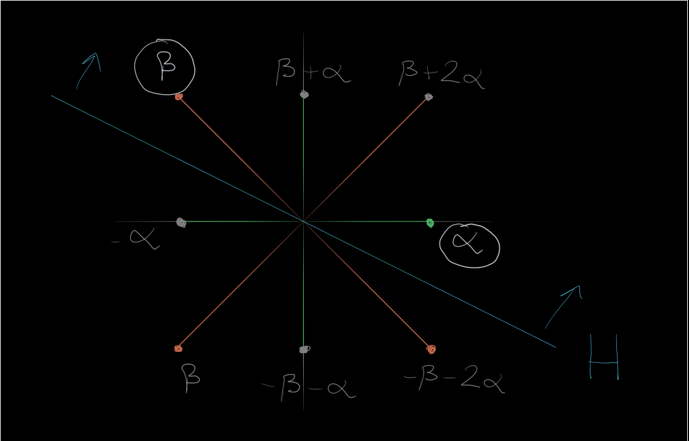

# Humphreys 3.1
Let $\lieg = \liesl(2, \CC)$ and identify $\lambda \in \lieh\dual$ with a scalar.
Let $N$ be a 2-dimensional $U(\lieb)\dash$module defined by letting $x$ act as $0$ and $h$ act as $\left(\begin{array}{ll}{\lambda} & {1} \\ {0} & {\lambda}\end{array}\right)$.

Show that the induced $U(\lieg)\dash$module structure $M \definedas U(\lieg) \tensor_{U(\lieb)} N$ fits into an exact sequence which fails to split:
$$
0 \to M(\lambda) \to M \to M(\lambda) \to 0
$$

## Solution

[Reference 1](https://math.stackexchange.com/questions/2272891/extension-of-dual-verma-module/2273008#2273008)
[Reference 2](https://aip.scitation.org/doi/full/10.1063/1.5121236)

> Hence $M\not\in \OO$.

We first unpack all definitions in terms of tensor products, using the fact that $M(\lambda) = U(\lieg) \tensor_{U(\lieb)} \CC_\lambda$:

\begin{center}
\begin{tikzcd}
0 \ar[r] & M(\lambda) \ar[r] & M \ar[r] & M(\lambda) \ar[r] & 0 \\
0 \ar[r] \ar[u, equal] & U(\lieg) \tensor_{U(\lieb)} \CC_\lambda \ar[u, equal] \ar[r] & U(\lieg) \tensor_{U(\lieb)} N \ar[u, equal] \ar[r] & U(\lieg) \tensor_{U(\lieb)} \CC_\lambda \ar[u, equal]  \ar[r] & 0 \ar[u, equal] \\
  & 1 \tensor 1 \ar[r, mapsto, "\psi"] & 1 \tensor \vector u \ar[r, mapsto, "\phi"] & 1 \tensor 0 & \\
  & & 1 \tensor \vector v \ar[r, mapsto] & 1 \tensor 1 & 
\end{tikzcd}
\end{center}

where $N = \spanof_\CC \theset{\vector u, \vector v}$.

We make the following claims:

1. The $U(\lieb)$ action defined on $N$ lifts to a $U(\lieg)\dash$action on $M$.
2. This is an exact sequence of $U(\lieg)\dash$modules.
3. $M \not\cong M(\lambda) \oplus M(\lambda)$, showing that this sequence can not split.

**Claim 1**: 
We choose the basis
\begin{align*}
x =
\begin{bmatrix}
0 & 1 \\
0 & 0
\end{bmatrix}
,\quad
h =
\begin{bmatrix}
1 & 0 \\
0 & -1
\end{bmatrix}
,\quad
y =
\begin{bmatrix}
0 & 0 \\
1 & 0
\end{bmatrix}
\end{align*}

and note that in the triangular decomposition $\lieg = \lien^- \oplus \lieh \oplus \lien$, we have 
\begin{align*}
\lien^- &= \CC \cdot x \\
\lieh &= \CC \cdot h \\
\lien^+ &= \CC \cdot y \\
.\end{align*}

Since the action is defined over $\lieb = \lieh \oplus \lien$ and $x$ acts by zero, we obtain a $\lieg\dash$action on $N$ which thus extends uniquely to a $U(\lieg)\dash$ action.

**Claim 2**:
We first note that since the submodule $\CC \cdot \vector u < M$ is closed under the action of $h$ (since $h$ acts by $u\mapsto \lambda u$) and is equal to the image of $\psi$, we can identify $\CC\cdot \vector u \cong \CC_\lambda$ as $U(\lieb)\dash$modules and identify $M(\lambda)$ as a submodule of $N$.
Since submodules of $N$ lift to submodules of $\Ind_{\lieb}^\lieg N$, the map $\psi$ is an injection.
Moreover, the map $\phi$ is a surjection, since the generator $1\tensor 1$ of $M(\lambda)$ is precisely the image of one of the generators of $M$.

To see that the sequence is exact in the middle, we note that by choosing a PBW basis of $\liesl(2, \CC)$ and a basis $\theset{\vector u, \vector v}$ for $N$, we can obtain a basis of $M$ of the form $\theset{y^j \tensor \vector u, y^k \tensor \vector v \suchthat j, k\in \ZZ^{\geq 0}}$.
This allows us to identify the lift of the submodule $\CC\cdot \vector u$ to the span of $\theset{y^k \tensor \vector u}$ in $M$.
Then $\im \psi \subseteq \ker \phi$ by construction, since
$$
\phi(y^k \tensor \vector u) = \phi(y^k(1\tensor \vector u)) = y^k \phi(1\tensor \vector u) = y^k \qty{1 \tensor u} = 0.
$$

To see that $\ker \phi \subseteq \im \psi$, we can use the same calculation to explicitly check the map on the remaining basis elements:
$$
\phi(y^k \tensor \vector v) = \phi(y^k(1\tensor \vector v)) = y^k \phi(1\tensor \vector v) = y^k \qty{1 \tensor 1} = y^k \tensor 1 \neq 0
.$$

Thus $\ker \phi = \im \psi$, yielding exactness in the middle.

**Claim 3**:
This follows from the checking the $\lambda\dash$weightspaces of both $M$ and $M(\lambda) \oplus M(\lambda)$.
Noting that the matrix $\begin{bmatrix}
\lambda & 1 \
0 & \lambda
\end{bmatrix}$ is in Jordan Normal Form, we can read off that the $\lambda$ is an eigenvalue with multiplicity 2, and that the corresponding $\lambda$ eigenspace is 1 dimensional since this is a single Jordan block.
However, the $\lambda$ weight space of $M(\lambda) \oplus M(\lambda)$ is of dimension least 2.

$\qed$

# Humphreys 3.2

Show that for $M\in \OO$ and $\dim L < \infty$,
$$
(M\tensor L)\dual \cong M\dual \tensor L\dual
$$

> [Reference for Dual of Sum](https://mathoverflow.net/questions/56255/duals-and-tensor-products)

## Solution

We first note that $M\in \OO \implies M = \bigoplus_{\lambda \in \lieh\dual} M_\lambda$ where each $M_\lambda$ is a finite-dimensional weight space. 

Moreover, $M\dual \definedas \bigoplus_{\lambda \in \lieh\dual} M_\lambda\dual$ is defined to be a direct sum of duals of weight spaces, which are still finite-dimensional.

So let $M, N\in \OO$; we will proceed by showing that both $(M\tensor_\CC L)\dual$ and $M\dual \tensor_\CC \dual$ have identical direct sum decompositions.

We first have
\begin{align*}
(M\tensor_\CC L)\dual 
&\definedas \bigoplus_{\lambda \in \lieh\dual} (M\tensor_\CC L)_\lambda\dual, && \text{the $\lambda$ weight spaces of $M\tensor_\CC L$} \\
&\cong \bigoplus_{\lambda \in \lieh\dual} \qty{\bigoplus_{\alpha+\beta = \lambda} \qty{M_\alpha \tensor_\CC L_\beta } }\dual && \text{by an exercise on the weight spaces of a tensor product} \\
&\cong \bigoplus_{\lambda \in \lieh\dual} \qty{\bigoplus_{\alpha+\beta = \lambda} \qty{M_\alpha \tensor_\CC L_\beta }\dual } && \text{since the inner term is a finite sum}\\
&\cong \bigoplus_{\lambda \in \lieh\dual} \qty{\bigoplus_{\alpha+\beta = \lambda} \qty{M_\alpha\dual \tensor_\CC L_\beta\dual }} &&\text{since the weight spaces are finite-dimensional}
,\end{align*}

where we've repeatedly used the fact that $(V\tensor W)\dual \cong V\dual \tensor W\dual$ for finite-dimensional vector spaces, which inductively holds for any finite direct sum of vector spaces.

On the other hand, using the fact that 
\begin{align*}
\qty{A\oplus B} \tensor (C\oplus D) &= \qty{ \qty{A\oplus B} \tensor C} \oplus \qty{ \qty{A\oplus B} \tensor D } \\
&= \qty{A\tensor C} \oplus \qty{B\tensor C} \oplus \qty{A\tensor D} \oplus \qty{B\tensor D} \\
\implies \qty{ \bigoplus_{j\in J} A_i} \tensor \qty{ \bigoplus_{k\in K} B_k} &= \bigoplus_{j\in J} \bigoplus_{k\in K} \qty{A_j \tensor B_k} \qtext{by induction}
.\end{align*}
we can write
\begin{align*}
M\dual \tensor_\CC L\dual
&\definedas \qty{\bigoplus_{\alpha\in \lieh\dual} M_\alpha\dual} \tensor_\CC \qty{ \bigoplus_{\beta \in \lieh\dual} L_\beta\dual } \\
&\cong \bigoplus_{\lambda \in \lieh\dual}\qty{ \bigoplus_{\alpha + \beta = \lambda} \qty{ M_\alpha\dual \tensor_\CC L_\beta\dual} }
,\end{align*}
which equals what was obtained above.

This exhibits the isomorphism as $\CC\dash$vector spaces, to see that this is in fact as isomorphism of $U(\lieg)\dash$modules we can use the fact that for $M\in \OO$, a twisted $\lieg\dash$action was defined as 
$$
\vector v\in M,~f\in M\dual,~ g\in \lieg \implies (g\cdot f)(\vector v) = f(\tau(g) \cdot \vector v)
$$
for the transpose map $\tau$.
This action can be "linearly extended" over direct products and tensor products by taking the action component-wise, and is thus preserved by all of the isomorphisms appearing above.

Since the final terms $\bigoplus_{\lambda \in \lieh} \bigoplus _{\alpha + \beta = \lambda} M_\alpha\dual \tensor L_\beta\dual$ are identical, they carry the same action, and since they are preserved by the isomorphisms, working backwards shows that the actions on $(M\tensor L)\dual$ and $M\dual \tensor L\dual$ must also agree, yielding the desired isomorphism.

$\qed$

# Humphreys 3.4

Show that $\Phi_{[\lambda]} \intersect \Phi^+$ is a positive system in the root system $\Phi_{[\lambda]}$, but the corresponding simple system $\Delta_{[\lambda]}$ may be unrelated to $\Delta$.

> For a concrete example, take $\Phi$ of type $B_2$ with a short simple root $\alpha$ and a long simple root $\beta$.
> If $\lambda \definedas \alpha/2$, check that $\Phi_{[\lambda]}$ contains just the four short roots in $\Phi$.

## Solution

We would like to show the following two propositions:

1. $\Phi_{[\lambda]}^+ \definedas \Phi_{[\lambda]} \intersect \Phi^+$ is a positive system in $\Phi_{[\lambda]}$,
2. In general, the associated simple system $\Delta_{[\lambda]} \neq \Phi^+_{[\lambda]} \intersect \Delta$.

### Proof of Proposition 1

We'll use the definition that for an abstract root system $\Phi$, a positive system $\Phi^+$ is defined by picking a hyperplane $H$ not containing any roots and taking all roots on one side of this hyperplane.

However, if every element of $\Phi^+$ is on one side of $H$, then any subset satisfies this property as well, thus $\Phi_{[\lambda]} \intersect \Phi^+$ consists only of positive roots and thus forms a positive system.

### Proof of Proposition 2

Concretely, we can realize $\Phi$ and $\Delta$ as subsets of $\RR^2$ in the following way:
\begin{align*}
\Phi &= P_1 \disjoint P_2 \definedas \theset{[1,0], [0, 1], [-1, 0], [0, -1]} \disjoint \theset{[1,1], [-1, 1], [1, -1], [-1, -1]} \\
\Delta &\definedas \theset{\alpha, \beta} \definedas \theset{[1, 0], [-1, 1]}
,\end{align*}
where we note that $P_1$ consists of short roots (of norm 1) and $P_2$ of long roots (of norm $\sqrt{2}$) and we've chosen a simple system consisting of one short root and one long root.

Now by definition,
\begin{align*}
\Phi_{[\lambda]} &\definedas \theset{\gamma \in \Phi \suchthat \inner{\lambda}{\gamma\dual} \in \ZZ}, \quad \quad \gamma\dual \definedas {2 \over \norm{\gamma}^2} ~\gamma, \\
\Delta_{[\lambda]} &\definedas \theset{\gamma \in \Delta \suchthat \inner{\lambda}{\gamma\dual} \in \ZZ} 
.\end{align*}

Now choosing $\lambda \definedas {\alpha \over 2} = \thevector{\frac 1 2, 0}$, we now consider the inner products $\inner{\lambda}{\gamma\dual}$ for $\gamma \in \Phi$: 

Thus
\begin{align*}
\gamma_1 \in P_1 &\implies  \inner{\thevector{\frac 1 2, 0}}{ 2 \gamma_1} = 2\qty{\frac 1 2} \inner{[1, 0]}{\gamma_1} = \qty{\gamma_1}_1 \in \theset{0, \pm 1} \in \ZZ \\
\gamma_2 \in P_2 &\implies \inner{\lambda}{\gamma_2\dual} = \inner{\thevector{\frac 1 2, 0}}{\frac 2 {\qty{\sqrt 2}^2}\thevector{\pm 1, \pm 1}} = \pm \frac 1 2 \not\in \ZZ 
\end{align*}

where $(\gamma_1)_1$ denotes the first component of $\gamma_1$.

We thus find that 
\begin{align*}
\Phi_{[\lambda]} &= P_1 && \text{the short roots} \\
\Delta_{[\lambda]} = \Phi_{[\lambda]} \intersect \Delta &= \theset{\alpha} && \text{the single short simple root}
.\end{align*}

Choosing the following hyperplane $H$ not containing any root, we can choose a positive system:

\\

\begin{align*}
\Phi^+ = \theset{\beta, \beta+ \alpha, \beta + 2\alpha, \alpha}
\end{align*}

where we can note that $\Phi^+ \intersect \Delta = \Delta$, since we've placed both simple roots on the positive side of this hyperplane by construction.

But by taking roots on the positive side of this plane, we have
\begin{align*}
\Phi_{[\lambda]} = \theset{\alpha, -\alpha, \alpha+\beta, -\alpha-\beta}    \implies \Phi^+_{[\lambda]} &= \theset{\alpha, \alpha+\beta}
\end{align*}

where we can now note that a simple system in *this* root system must still have rank 2, so we can take $\Delta_{[\lambda]} = \theset{\alpha, \alpha + \beta}$. 
But now we can note
\begin{align*}
\Delta_{[\lambda]} = \theset{\alpha, \alpha+ \beta} {\color{red}\neq }
\theset{\alpha} = \theset{\alpha, \alpha+\beta} \intersect \theset{\alpha, \beta} 
=\Phi^+_{[\lambda]} \intersect \Delta
,\end{align*}
which is what we wanted to show.

$\qed$

# Humphreys 3.7

a. If a module $M$ has a standard filtration and there exists an epimorphism $\phi: M\to M(\lambda)$, prove that $\ker \phi$ admits a standard filtration.

b. Show by example that when $\lieg = \liesl(2, \CC)$ that the existence of a monomorphism $\phi: M(\lambda) \to M$ where $M$ has a standard filtration fails to imply that $\coker \phi$ has a standard filtration.

## Solution

> Haven't had a chance to work this out yet!
