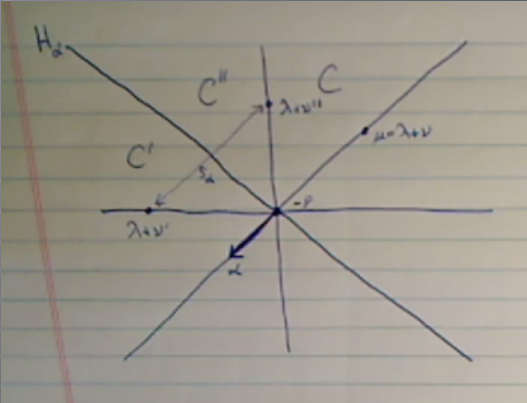

# Monday April 13th

Reviewing the definition of *facets*.
We partitioned $\Phi$ into 3 sets $\Phi_F^{0, \pm}$, some of which could be empty.
We had notion of upper and lower closure given by replacing the strict inequalities with inequalities in condition (3) and (2) respectively.

\

Definition (Chambers)
: If $F$ is a facet with $\Phi_F^0=\emptyset$, then $F$ is called a *chamber*.

A facet with exactly 1 root in $\Phi_F^0$, then this is called a *wall*.

Observations:

1. $\Phi^+ = \Phi_F^+$ always defines a chamber called the *fundamental chamber* and is denoted $C_0$.
2. If $F$ is any chamber, then $F = w\cdot C_0$ for some $w\in W$.

Proposition (Relation Between Facets and Chambers)
:   \hfill
    
    a. Every facet $F$ is the upper closure of some unique chamber $C$.
    b. If $F \subset \hat C$ then $\hat F \subset \hat C$.

Proof
:   \hfill

    a. If $F$ is given by $\Phi_F^0 \union \Phi_F^+ \union \Phi_F^-$ and $C$ pairs with $\Phi_C^+ = \Phi_F^+$ and thus $\Phi_C^- = \Phi_F^- \union \Phi_F^0$.
      To see that $C\neq \emptyset$, use remark (1) on page 132.
    b. Obvious from above description of $C$.

## Key Lemma from 7.5

We're focusing only on integral weights, and we want to calculate the translation functor of a Verma $T_\lambda^\mu M(\lambda)$.
First step: project onto $\lambda$ block, but $M(\lambda)$ is in that block already.
Then tensor with $L(\tilde \nu)$, then the product has a standard filtration with certain Verma section $M(\lambda + w\tilde \nu)$, each occurring with multiplicity one.
The weight $\tilde \nu$ is the unique dominant weight in the orbit of $\mu - \lambda$, one of the Verma sections is in $M(\mu)$.
We plan to show that $T_\lambda^\mu M(\lambda) = M(\mu)$ in "good" situations.

Lemma
:   Let $\lambda, \mu \in \Lambda$ be integral weights and $\nu = \mu - \lambda$ and $\tilde \nu \in \Lambda^+ \intersect W \nu$ (which is unique).
    Assume there is a facet $F$ with $\lambda \in F, \mu \in \bar F$.
    Then for all weights $\nu' \neq \nu$ of $L(\tilde\nu)$, the weight $\lambda + \nu'$ is *not* linked to $\lambda + \nu = \mu$ under $W$.

Proof
:   \hfill
    Toward a contradiction, suppose there exists $\nu \neq \nu$ in $\Pi(L(\tilde \nu))$ with $\lambda + \nu' \in W\cdot (\lambda + \nu)$.
    Define the *distance* between two chambers $C, C'$ as the number of root hyperplanes separating them.
    Under the correspondence between chambers and $W$ given by picking a fundamental chamber, the distance corresponds to the difference in lengths between the corresponding Weyl group elements.

    \

    So choose chambers $C, C'$ with $F \subset \bar C$, $\lambda + \nu' \in \bar C'$, and $d(C, C')$ is minimal.
    We now go through 14 easy steps.

    \

    1. The case $d(C, C') = 0$ is impossible, since this would force $C =C'$/
        But $C$ is a fundamental domain for the dot action, where $C' \ni \lambda + \nu' \neq \lambda + \nu = \mu \in \bar F \subset \bar C$.
        This contradicts $C$ being a fundamental domain, since each ? will be conjugate to a *unique* element.
    2. The case $d(C, C') > 0$ implies there's a hall $H_\alpha \intersect \bar C '$ of $C'$ separating $C'$ from $C$.
        Wlog assume $C'$ is on the positive side of $H_\alpha$ and $\alpha > 0$ and $C$ is on the negative side.
        Since $\bar F \subset \bar C$, we have $(\xi + \phi, \alpha\dual) \leq 0$ for all $\xi \in \bar F$.
    3. Reflect and set $C'' \definedas s_\alpha C'$, then $d(C, C'') < d(C, C')$ and we will be able to apply the induction hypothesis.
    4. By (2), $(\lambda + \nu' + \rho, \alpha\dual) \geq 0$ since $\lambda + \nu'$ was on the positive side.
    5. By (2), $(\lambda + \rho, \alpha\dual) \leq 0$ since $\lambda + \nu'$ was on the negative side.
    6. By (4), $\lambda + \nu' \geq s_\alpha \cdot (\lambda + \nu') = s_\alpha \cdot \lambda + s_\alpha \nu' = \lambda - (\lambda + \rho, \alpha\dual)\alpha + s_\alpha \nu' \definedas \nu''$ by just applying the formula for the dot action.
    7. By (5) and (6), $s_\alpha \nu' \leq s_\alpha \nu' - (\lambda + \rho, \alpha\dual) \alpha \leq \nu'$, where the first and last terms are weights of $L(\tilde \nu)$, so $\nu'' \leq \nu'$.
      In fact, this inequality is obtained by cancelling $\lambda$ and adding/substracting multiples of $\alpha$, so these come from an $\alpha$ root string.
    8. Rewriting (6), we have $s_\alpha (\lambda + \nu') = \lambda + \nu'' \in s_\alpha \bar {C'} = \bar {C''}$.
    9. By 1.6 bullet (2) in Humphreys, $\nu'' \in \Pi (L(\tilde \nu))$.
    10. By the minimality assumed for $\nu'$, along with (3), (8), (9), we have $\nu'' = \nu$.
    11. Rewriting (7) and using the hypothesis $\nu \neq \nu'$, we can write $s_\alpha \nu ' \leq \nu < \nu'$ where the inequality is strict because they are not equal.
        This is still an $\alpha$ root string of weights in the simple module $L(\tilde \nu)$ with $\nu \in W\tilde \nu$.
        The first inequality can *not* be strict, otherwise $v\pm \alpha$ would both be weights of $L(\tilde \nu)$, contradicting Humphreys 1.6 bullet 1.
        So $s_\alpha \nu' = \nu$.
    12. By (10), (11), and (6), $s_\alpha \nu' = \nu = \nu'' = s_\alpha \nu ' - (\lambda + \rho, \alpha\dual) \alpha$, so $(\lambda + \rho, \alpha\dual) = 0$.
    13. Since $\lambda \in F$ by assumption, if $\alpha \in \Phi_F^0$ then $(\xi + \rho, \alpha\dual) = 0$ for all $\xi \in \bar F$.
        In particular, for $\xi = \mu = \lambda + \nu$, and combined with (12), this say $(\nu, \alpha\dual) = 0$ since the pairing is linear in the first slot.
    14. We're now done: combining (11), (13) yields $\nu ' = s_\alpha \nu = \nu - (\nu, \alpha\dual)\alpha = \nu$, which contradicts $\nu \neq \nu'$.

## 7.6: Translation Functors and Verma Modules

Theorem (Translation Functors on Vermas for Antidominant Weights)
:   Let $\lambda, \mu \in \Lambda$ be antidominant.
    Assume there is a facet $F$ relative to the dot action of $W$ with $\lambda \in F$ and $\mu \in \bar F$.
    Then for all $w\in W$, we have
    \begin{align*}
    T_\lambda^\mu M(w\cdot \lambda) &= M(w\cdot \mu) \\
    T_\lambda^\mu M(w\cdot \lambda)\dual &\cong M(w\cdot \mu)\dual
    .\end{align*}

Proof
:   Apply the previous lemma to $w\cdot \lambda, w\cdot \mu$ and the facet $w\cdot F$ using $\nu = w\cdot \mu - w\cdot \lambda$.
    To compute $T_\lambda^\mu$, first consider $L(\tilde \nu) \tensor M(w\cdot \lambda)$.
    By Theorem 3.6, this has a standard filtration with quotients $M(w\cdot \lambda + \nu')$ for $\nu' \in \Pi(L(\tilde \nu))$, potentially with multiplicity.

    \

    In particular, $M(w\cdot \mu) = M(w\cdot \lambda + \nu)$ appears exactly once.
    By the lemma, none of the other highest weights $w\cdot \lambda + \nu'$ are linked to $\mu$.
    Thus decomposing the tensor product into direct summands in infinitesimal blocks, the only summand in $\OO_{\chi_\mu}$ is $M(w\cdot \mu)$.
    Therefore $T_\lambda^\mu M(w\cdot \lambda) = \pr_\mu (L(\tilde \nu) \tensor M(w\cdot \lambda)) = M(w\cdot \mu)$.
    The statement about duals follows from translation functors commuting with taking duals.

