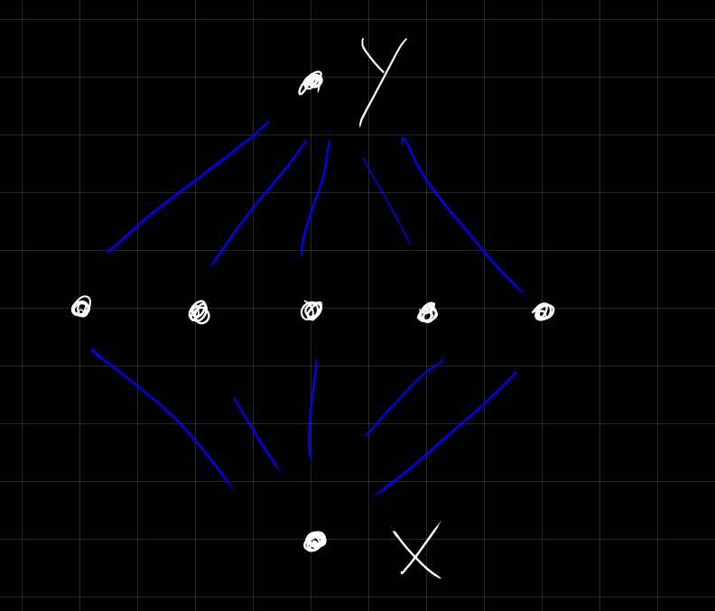
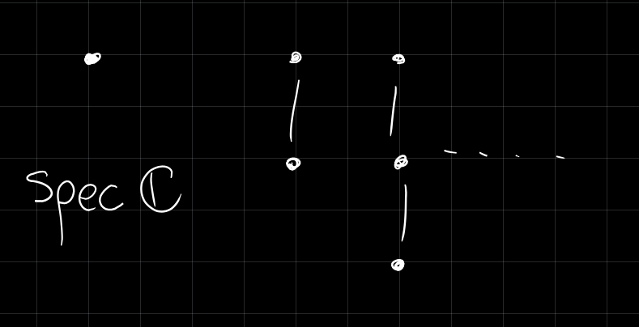

# Wednesday April 8th

Theorem (Krull Intersection, 8.39)
:   For $R$ Noetherian and $I \normal R$ a proper ideal,

    a. If there exists an $x\in \intersect_{i=1}^\infty I^n$, then $x\in xI$.
    b. Suppose either $R$ is a domain or $I \subset \mcj(R)$, then $\intersect I^n = (0)$.

Proof
:   \hfill

    a. Omitted.
    b. If $x\in \intersect I^n$, then (a) implies that there exists an $a\in I$ such that $x = xa$.
      Then $x(1-a) = 0$.
      Since $R$ is a domain and $a\neq 0$, then $1-a$ is not a zero divisor.

Exercise
: Exhibit a proper ideal $I \normal R$ Noetherian such that $\intersect_n I^n \neq (0)$.

  > Note: there is a very small ring that will work.

Exercise (Recommended, Difficult Calculus)
:   Consider $R = \theset{f:\RR\to \RR, f\in C^\infty} \subset \RR^\RR$ and $\mfm \definedas \theset{f\in R \suchthat f(0) = 0}$.

    1. Show $\mfm \normal R$ and $R/\mfm = \RR$ and thus $\mfm$ is maximal.
    2. Show $\mfm = (x)$.
    3. Show that for all $n\in \ZZ$, we have $\mfm^n = (x^n) = \theset{f \suchthat f(0) = f'(0) = \cdots - f^{n+1} = 0}$.
    4. Show that $\intersect \mfm^n = \theset{f\suchthat T_0(f) \equiv 0} \neq (0)$
    5. Show that $f\not\in f\mfm$ (so $f\neq x g$ for some other smooth $g$) therefore $R$ is not Noetherian.

> Start with a smooth function vanishing at zero, divide by $x$, define value at zero to make it continuous.
> Example: $f(x) = e^{-1/x^2}$ for $x\neq 0$ and $f(0) = 0$.

Theorem (Principal Ideal Theorem / Krull's Hauptfdealsatz)
:   For $R$ Noetherian, $x\in R\setminus R\units$, $\mfp \in \spec(R)$ *minimal over $(x)$* (to be explained).
    Then $\height(\mfp) \leq p$, where we recall that that height is given by the number of ideals below it.

Corollary
: Every nonzero ring has a minimal prime.

In particular if $\mfp = (x)$ is a prime ideal in a Noetherian ring, $\height(\mfp) \leq 1$.

Corollary
: Under these conditions, if $x$ is not a zero divisor then $\height(\mfp) = 1$.

Proof
:   We can reduce $R$ to $R_\mfp$ (using how ideals are pushed into localizations).
    Then $R_\mfp$ is a Noetherian local ring of krull dimension 0, hence is Artinian by Akazuki.
    By a previous theorem, $\mfp R_\mfp$ is thus nilpotent.

    \

    So there exists an $n$ such that $x^n = 0$ in $R_\mfp$ which is thus in the kernel of the localization map, and there exists an $a\in R/\mfp$ such that $ax^n = 0$ in $R$.
    Since $x$ is not a zero divisor, so multiplication by $x$ (and all compositions) is injective, $x^n$ is not a zero divisor and thus $a= 0$.
    But since $a\in R /\mfp$, so $a\neq 0$, a contradiction.

Thus the number of generators of a prime ideal in a Noetherian ring is bounded below by its height.

Lemma (Page 44)
: For $\mfp, \theset{\mfq_i} \in \spec(R)$, if $\mfp \subset \union_i \mfq_i$ then $\mfp \subset \mfq_i$ for some $i$.

Proof omitted.

Exercise
:   In $R = \CC[x, y], \mfm \definedas \gens{x, y}$, show that $\height(\mfm) \geq 2$ and $\mfm$ is the union of all of the principal ideals it contains.
    Thus the finiteness in the previous lemma is necessary.

For $(X, \leq)$ a poset and $x\leq y$, we define the interval $(x, y) \definedas \theset{z\in X \suchthat x\leq z \leq y}$:

\

Corollary
: For $\mfp \subset \mfq$ a proper containment in a Noetherian ring, $(\mfp, \mfq)$ is either empty or injective.

Note that this implies that for possible line order of length $n$, there is a ring with $\spec(R)$ having that structure.

