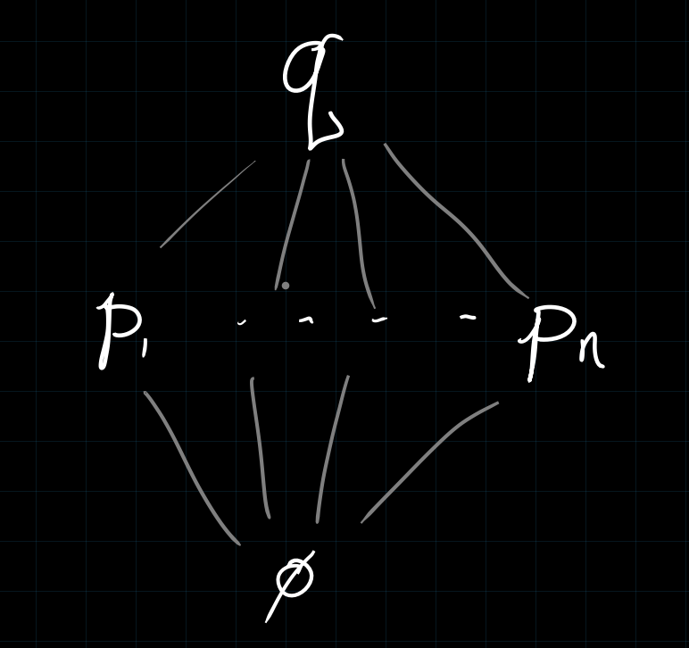

# Friday April 10th

Last time: prime avoidance, for $\mfp, \ts{\mfq_i} \in \spec R$, if $\mfp \subset \union \mfq_i$, then $\mfp \subset \mfq_i$ for some $\mfq_i$.

Theorem (Ideal Intervals in Noetherian Rings are Empty or Infinite)
: For $R$ Noetherian and $\mfp \subsetneq \mfq \in \spec R$, then $(\mfp, \mfq) \definedas \theset{\mfn \in \spec R \st \mfp \subsetneq \mfn \subsetneq \mfq}$ is either empty or infinite.

Proof
:   Wlog by passing from $R$ to $R/\mfp$, assume $\mfp = (0)$, and toward a contradiction assume that the theorem doesn't hold.
    Then $(\emptyset, \mfq) = \theset{\mfp_i}$, and by prime avoidance, there exists an $x\in \mfq \setminus \union \mfp_i$ and thus $\mfq$ is a minimal prime over $x$.
    By Hauptfidealsatz, $\height(\mfq) \leq 1$, but this is a contradiction because $\height(\mfq) \geq 2$.

   \

Proposition (Generalized Hauptfidealsatz)
: For $R$ Noetherian, $I = \gens{x_1, \cdots, x_n} \normalneq R$, if $\mfp \in \spec R$ is minimal over $I$, then $\height(\mfp) \leq n$.

Corollary
: If $\mfp \in \spec(R)$ for $R$ Noetherian, then $R$ needs at least $\height(\mfp)$ generators.

> Complete intersection: minimal number of defining equations.

Last item on Noetherian rings, used to prove Nullstellensatz:

Lemma (Artin-Tate Lemma)
: If $R$ is Noetherian and $R \subset T \subset S$ with $S$ finitely generated as a $T\dash$module and finitely-generated as an $R\dash$algebra, then $T$ is finitely generated as an $R\dash$algebra.

## Boolean Rings

Definition (Boolean)
: A ring $R$ is *Boolean* if every element is idempotent, i.e. $x^2 = x$ for all $x\in R$.

Exercise
:   If $R$ is Boolean, then

    1. $R = R\units$,
    2. Every quotient is Boolean,
    3. Every subring is Boolean,
    4. (More interesting) every ideal is radical.

Exercise
:   Suppose $R$ is Boolean.

    1. If $R$ is a domain then $R \cong \ZZ/2\ZZ$.
    2. $\dim R = 0$

Exercise
: If $R$ is Boolean and local, then $R \cong \ZZ/2\ZZ$.

Proposition (Characterization of Finite Boolean Rings)
:   For $R$ Boolean, TFAE:

    1. $R$ is finite.
    2. $R$ is Noetherian.
    3. $\spec R$ is finite.

    In any of these cases, $\qty{\ZZ/2\ZZ}^n$.

Proof
:   \hfill

    - $1\implies 2$ is clear because any finite ring is Noetherian.
    - $2 \implies 3$: using Akazuki-Kopkins, $R$ is Artinian and thus $\spec R = \maxspec R$ is finite.
    - $3\implies 1$: By a previous exercise, since $\maxspec R$ is finite, $R/\mcj(R)$ is a finite product of fields (by CRT essentially).
      Then $\mcj(R) = \nil (R) = \ts{0}$ therefore $R$ is a finite product of fields, forcing $R \cong \prod  \ZZ/2\ZZ$.

## Stone Duality

This leads to Stone duality, an early example of categorical equivalence.
Let $R$ be a Boolean ring, $\spec R \subset \maxspec R$ equipped with the Zariski topology generated by the basis 
$$
\ts{U(f) \st \mfm\in \spec R,~f\not\in \mfm}_{f\in R}
.$$
Then 
$$
V(f) \definedas \spec R \sm U(f) = \ts{\mfm\in \spec R \st f\in \mfm}
.$$

For any $R$, $V(f)$ is closed and $V(f) \subseteq U(1-f)$.

But $R$ is boolean iff $f(1-f) = 0$, and if $1-f \not\in \mfm$, then $f\in \mfm$ and thus $V(f)$ is open.
So $\spec R$ has a base of clopen sets, which is referred to as a *zero-dimensional* space.
Moreover $\spec R$ is also Hausdorff, and we'll later see that $\spec R$ is Hausdorff iff $\dim R = 0$.

Exercise
:   For any $R$,  $\spec R$ is quasicompact (where compact is quasicompact and Hausdorff).

$\spec R$ is zero-dimensional and compact.
Fact:

- A zero-dimensional Hausdorff space is totally disconnected,
- A totally disconnected locally compact space is ?

$X$ is a Boolean space if it is ? and compact, iff compact and totally disconnected.

There is a notion of *Stone space*, equivalently a profinite space is an inverse limit of finite discrete spaces, which happens iff compact and totally disconnected.

To any Boolean topological space $X$ we attached its *characteristic ring* $C(X)$.
The elements are clopen subsets of $X$ with $U + V \definedas U \Delta V = U\sm V \union V\sm U$ and $U\cdot V \definedas U\intersect V$.
Note that any algebra of sets can be made into a ring in this way, and we note that $U\cdot U = U \intersect U = U$, so $C(X)$ is a Boolean ring.

### Statement of Stone Duality

For notation, set $M(R) \definedas \spec R$, and define functors

\begin{align*}
\correspond{\text{Boolean rings}} \stackrel[C]{M}{\tofrom} \correspond{\text{Boolean spaces}}
.\end{align*}

This gives a mutually inverse pair of functors which are naturally isomorphic to the identity, i.e. there is a canonical isomorphisms $C(M(R)) \cong R$ and $M(C(X)) \cong X$.

Exercise
: There exists a ring $R$ and $x,y \in R$ such that $(x) = (y)$ but there exists a $u\in R\units$ such that $x = uy$
