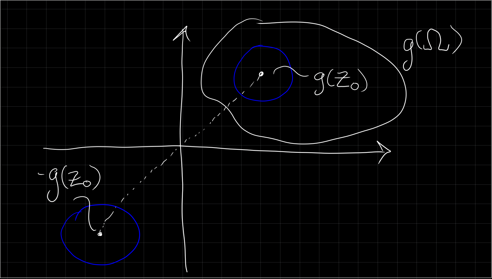

# Wednesday April 8th

What are the necessary conditions on $\Gamma$ to ensure a conformal map $F$ to $\DD$?

1. $\Omega \neq \CC$, because this would force $F$ to be constant.
2. Since $\DD$ is connected, $\Omega$ must be connected.
3. Since $\DD$ is simply-connected, $\Omega$ must be simply connected.

Theorem
: If $\Omega \subsetneq \CC$ is simply connected and $z_0 \in \Omega$, there exists a unique conformal map $F: \Omega \to \DD$ such that $F(z_0) = 0$ and $F'(z_0) > 0$.

Corollary
: Any two proper simply connected open subsets in $\CC$ are conformally equivalent.

Proof
: Produce $F_i: \Omega_i \to \DD$ and define $F = F_2\inv \circ F_1: \Omega_1 \to \Omega_2$.

To show uniqueness in the theorem, suppose $F, G: \Omega \to \DD$ satisfy the hypotheses.
Then $H \definedas F\circ G\inv: \DD \to \DD$ satisfies $H(0) = 0$.
By a previous theorem, we must have $H(z) = e^{i\theta} {\alpha - z \over ?}$, and the previous statement forces $\alpha = 0$.
By the chain rule, $H'(z) > 0$.
This implies $H(z) = e^{i\theta} z$ and $H'(z) = e^{i\theta} > 0$ (?), this $e^{i\theta} = 1$ and $H = \id$.

To show existence, consider all injective maps $f: \Omega \to \DD$ with $f(z_0) = 0$, and search for a surjective such $f$.
This can be achieved by maximizing $f'(z_0) > 0$.
We'll extract $f$ as a limit of a given sequence of functions.

We define a family $\mff(\Omega)$ by the following conditions:

a. $\mff(\Omega) \neq g: \Omega \to \DD$ is holomorphic and injective.
b. $\abs{g(z)} < 1$ for all $z\in \Omega$.
c. $g(z_0) = 0$ and $g'(z_0) > 0$.

We need to show:

1. $\mff(\Omega)$ is not empty.
2. There exists a maximal $f \in \mff$ in the sense that $g\in \mff \implies g'(z_0) \leq f'(z_0)$.
3. The above $f$ is a Riemann mapping, i.e. $f(\Omega) = \DD, f(z_0) = 0, f'(z_0) > 0$.

> The difficult part is proving part 2.

Proof (of (a))
:   Choose $a\not\in \Omega$ and let $g(z) \definedas \sqrt{z-a}$ be a branch of the square root of $z-1\neq 0$ for $z\in \Omega$.
    Then $g$ is holomorphic and injective on $\Omega$.
    Moreover, $g$ is single-valued: if $g(z) = w$, $g$ does not take on the value $-w$ on $\Omega$.
    Since $g(\Omega)$ is open, there exists a radius $r$ such that

    \begin{align*}
    D_{r}\left(g\left(z_{0}\right)\right)=\left\{w:\left|w-g\left(z_{0}\right)\right|<r\right\} \subset g(\Omega)
    .\end{align*}

    Thus
    \begin{align*}
    D_{r}\left(-g\left(z_{0}\right)\right)=\left\{w:\left|w+g\left(z_{0}\right)\right|<r\right\} \cap g(\Omega)=\emptyset
    \end{align*}

   \

    and hence $\abs{g(z) + g(z_0)} \geq r$ for all $z\in \Omega$.
    Then the function $g_1(z) \definedas {\eps \over g(z) + g(z_0)}$ is holomorphic and injective in $\Omega$, for $\abs{\eps} < r$ satisfies $\abs{g_1(z)} < 1$.
    So $g_1$ satisfies properties (a) and (b).

    \

    We now take $g_0 \definedas \psi \circ g_1$ where $\psi \in \Aut \DD$; we want $g_0(z_0) = 0$ with positive derivative.
    Choosing $\alpha = g_1(z_0)$ forces $g_0(z_0) = 0$, and using the chain rule to compute the derivative explicitly shows
    \begin{align*}
    g_{0}^{\prime}\left(z_{0}\right)=\frac{\left|g_{1}^{\prime}\left(z_{0}\right)\right|}{1-\left|g_{1}\left(z_{0}\right)\right|^{2}}>0
    .\end{align*}

